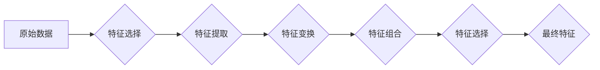

> 特征工程,机器学习,数据预处理,数据挖掘,模型性能,特征选择,特征提取,特征变换

## 1. 背景介绍

在机器学习领域，数据是至关重要的资源。然而，原始数据往往难以直接用于训练模型，需要经过一系列的预处理和转换，以提取出模型能够理解和利用的有效信息。特征工程 (Feature Engineering) 正是这一过程的核心环节，它涉及到对原始数据进行选择、转换、组合等操作，以生成更具代表性和预测力的特征，从而提升机器学习模型的性能。

特征工程是一个既艺术又科学的过程，它需要结合领域知识、数据分析能力和机器学习算法的特性，才能设计出最有效的特征。随着机器学习技术的不断发展，特征工程也日益成为机器学习研究和应用中的关键技术之一。

## 2. 核心概念与联系

特征工程的核心目标是将原始数据转化为更适合机器学习模型学习的特征。

**特征 (Feature)**：是指用于描述数据样本的属性或变量。例如，在预测房价的模型中，特征可能包括房屋面积、房间数量、地理位置等。

**特征工程流程**：



**特征选择 (Feature Selection)**：从原始特征中选择出最相关的特征，去除冗余和噪声特征。

**特征提取 (Feature Extraction)**：从原始特征中提取新的特征，例如使用主成分分析 (PCA) 将多个特征组合成几个主成分。

**特征变换 (Feature Transformation)**：对原始特征进行转换，例如标准化、归一化、对数变换等，以改善模型的学习性能。

**特征组合 (Feature Combination)**：将多个特征组合成新的特征，例如将房屋面积和房间数量组合成一个新的特征，表示房屋的整体大小。

## 3. 核心算法原理 & 具体操作步骤

### 3.1  算法原理概述

特征工程算法主要分为以下几类：

* **过滤式特征选择**: 基于特征本身的统计特性进行选择，例如卡方检验、互信息等。
* **包装式特征选择**: 通过递归地选择特征子集，并评估子集的性能，最终选择最优的特征子集。
* **嵌入式特征选择**: 将特征选择过程融入模型的训练过程，例如L1正则化。

### 3.2  算法步骤详解

**1. 过滤式特征选择**

* **步骤**:
    * 计算每个特征与目标变量之间的相关性。
    * 根据相关性阈值，选择相关性最高的特征。
* **举例**: 使用卡方检验选择与目标变量相关的特征。

**2. 包装式特征选择**

* **步骤**:
    * 从所有特征中随机选择一个特征子集。
    * 使用机器学习模型对特征子集进行训练，并评估模型的性能。
    * 迭代地选择新的特征子集，并评估模型的性能。
    * 选择性能最好的特征子集。
* **举例**: 使用递归特征消除 (RFE) 选择最优的特征子集。

**3. 嵌入式特征选择**

* **步骤**:
    * 在模型的损失函数中添加正则化项，例如L1正则化。
    * 训练模型时，正则化项会惩罚模型对某些特征的依赖，从而导致这些特征的权重变为零。
    * 选择权重为零的特征作为最终特征。
* **举例**: 使用LASSO回归进行特征选择。

### 3.3  算法优缺点

| 算法类型 | 优点 | 缺点 |
|---|---|---|
| 过滤式 | 简单易实现，计算效率高 | 忽略了特征之间的相互作用 |
| 包装式 | 可以考虑特征之间的相互作用 | 计算复杂度高，容易陷入局部最优 |
| 嵌入式 | 可以直接融入模型训练，避免了特征选择和模型训练的割裂 | 需要选择合适的正则化参数 |

### 3.4  算法应用领域

特征工程算法广泛应用于各个领域，例如：

* **图像识别**: 从图像中提取特征，例如边缘、纹理、颜色等。
* **自然语言处理**: 从文本中提取特征，例如词频、词嵌入、语法结构等。
* **金融预测**: 从金融数据中提取特征，例如股票价格、交易量、经济指标等。
* **医疗诊断**: 从医疗数据中提取特征，例如患者症状、检查结果、病历记录等。

## 4. 数学模型和公式 & 详细讲解 & 举例说明

### 4.1  数学模型构建

特征工程中常用的数学模型包括：

* **线性回归**: 用于预测连续变量，模型假设特征与目标变量之间存在线性关系。
* **逻辑回归**: 用于预测分类变量，模型假设特征与目标变量之间存在非线性关系。
* **支持向量机 (SVM)**: 用于分类和回归，模型试图找到一个最佳的分隔超平面，将不同类别的样本分开。

### 4.2  公式推导过程

**线性回归模型**:

$$
y = \beta_0 + \beta_1x_1 + \beta_2x_2 + ... + \beta_nx_n + \epsilon
$$

其中：

* $y$ 是目标变量
* $x_1, x_2, ..., x_n$ 是特征变量
* $\beta_0, \beta_1, ..., \beta_n$ 是模型参数
* $\epsilon$ 是误差项

**目标**: 通过最小化模型误差，求解最佳参数值。

### 4.3  案例分析与讲解

**案例**: 预测房价

**特征**: 房屋面积、房间数量、地理位置

**模型**: 线性回归

**公式**:

$$
房价 = \beta_0 + \beta_1 * 面积 + \beta_2 * 房间数量 + \beta_3 * 地理位置 + \epsilon
$$

**分析**: 通过训练数据，求解最佳参数值，即可得到房价预测模型。

## 5. 项目实践：代码实例和详细解释说明

### 5.1  开发环境搭建

* Python 3.x
* scikit-learn
* pandas
* matplotlib

### 5.2  源代码详细实现

```python
import pandas as pd
from sklearn.model_selection import train_test_split
from sklearn.linear_model import LinearRegression
from sklearn.metrics import mean_squared_error

# 加载数据
data = pd.read_csv('house_price.csv')

# 选择特征和目标变量
features = ['面积', '房间数量', '地理位置']
target = '房价'

# 数据分割
X_train, X_test, y_train, y_test = train_test_split(data[features], data[target], test_size=0.2, random_state=42)

# 创建线性回归模型
model = LinearRegression()

# 模型训练
model.fit(X_train, y_train)

# 模型预测
y_pred = model.predict(X_test)

# 模型评估
mse = mean_squared_error(y_test, y_pred)
print(f'均方误差: {mse}')
```

### 5.3  代码解读与分析

* 数据加载和预处理：使用 pandas 库加载数据，并选择特征和目标变量。
* 数据分割：将数据分为训练集和测试集，用于模型训练和评估。
* 模型创建和训练：使用 scikit-learn 库创建线性回归模型，并使用训练数据进行模型训练。
* 模型预测：使用训练好的模型对测试数据进行预测。
* 模型评估：使用均方误差 (MSE) 评估模型的性能。

### 5.4  运行结果展示

运行代码后，会输出模型的均方误差值，该值越小，模型的预测性能越好。

## 6. 实际应用场景

特征工程在各个领域都有广泛的应用场景，例如：

* **电商推荐**: 根据用户的购买历史、浏览记录等特征，推荐相关的商品。
* **欺诈检测**: 根据用户的交易行为、账户信息等特征，识别潜在的欺诈行为。
* **医疗诊断**: 根据患者的症状、检查结果等特征，辅助医生进行诊断。

### 6.4  未来应用展望

随着机器学习技术的不断发展，特征工程将更加智能化和自动化。例如：

* **自动特征选择**: 使用机器学习算法自动选择最优的特征。
* **自动特征提取**: 使用深度学习算法自动提取更复杂的特征。
* **个性化特征工程**: 根据用户的具体需求，定制个性化的特征。

## 7. 工具和资源推荐

### 7.1  学习资源推荐

* **书籍**:
    * Feature Engineering for Machine Learning by Alice Zheng and Amanda Casari
    * Hands-On Machine Learning with Scikit-Learn, Keras & TensorFlow by Aurélien Géron
* **在线课程**:
    * Coursera: Machine Learning Specialization by Andrew Ng
    * Udacity: Machine Learning Engineer Nanodegree

### 7.2  开发工具推荐

* **Python**: 广泛使用的编程语言，用于机器学习开发。
* **scikit-learn**: Python 的机器学习库，提供各种特征工程算法和模型。
* **pandas**: Python 的数据分析库，用于数据处理和特征提取。
* **matplotlib**: Python 的数据可视化库，用于数据可视化和分析。

### 7.3  相关论文推荐

* Feature Engineering for Machine Learning: A Survey by Alice Zheng and Amanda Casari
* AutoML: A Survey of the State-of-the-Art by Bartosz Krawczyk et al.

## 8. 总结：未来发展趋势与挑战

### 8.1  研究成果总结

特征工程已经取得了显著的成果，为机器学习模型的性能提升做出了重要贡献。

### 8.2  未来发展趋势

* 自动化特征工程
* 个性化特征工程
* 深度学习特征提取
* 多模态特征融合

### 8.3  面临的挑战

* 高维数据处理
* 噪声数据处理
* 缺乏领域知识

### 8.4  研究展望

未来，特征工程的研究将更加注重自动化、智能化和个性化，并与深度学习、多模态数据处理等技术相结合，以更好地服务于机器学习的应用发展。

## 9. 附录：常见问题与解答

**1. 如何选择合适的特征工程算法？**

选择合适的特征工程算法需要根据具体的数据集和任务类型进行选择。例如，对于高维数据，可以使用过滤式特征选择算法；对于需要考虑特征之间的相互作用的任务，可以使用包装式特征选择算法。

**2. 如何处理缺失值？**

缺失值处理是特征工程中常见的问题，常用的方法包括删除缺失值、用均值或中位数填充缺失值、使用机器学习算法预测缺失值等。

**3. 如何避免过拟合？**

过拟合是指模型对训练数据过拟合，导致在测试数据上的性能下降。特征工程可以帮助避免过拟合，例如通过特征选择、特征提取等方法减少模型的复杂度。


作者：禅与计算机程序设计艺术 / Zen and the Art of Computer Programming 
<end_of_turn>