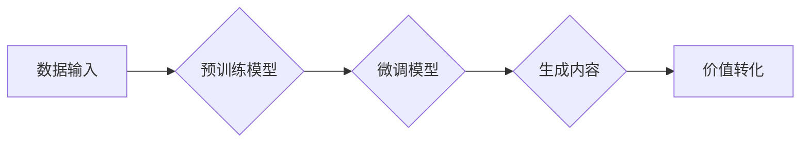

> 生成式AI, AIGC, 自然语言处理, 深度学习, Transformer, 文本生成, 图像生成, 价值转化

## 1. 背景介绍

近年来，人工智能（AI）技术取得了飞速发展，特别是生成式人工智能（Generative AI）领域，掀起了前所未有的技术浪潮。生成式AI是指能够根据输入数据生成新数据的AI模型，其核心是学习数据中的模式和规律，并利用这些知识生成新的、类似于训练数据的内容。

生成式AIGC（AI-Generated Content）是指利用生成式AI技术自动生成各种类型的内容，例如文本、图像、音频、视频等。它打破了传统内容创作的壁垒，为人们提供了全新的创作工具和可能性。

## 2. 核心概念与联系

**2.1 生成式AI的原理**

生成式AI的核心是深度学习算法，特别是基于Transformer架构的模型。Transformer模型能够捕捉文本序列中的长距离依赖关系，并学习到复杂的语义表示。通过训练大量的文本数据，Transformer模型能够生成流畅、自然的文本内容。

**2.2 AIGC的应用场景**

AIGC技术在各个领域都有广泛的应用场景，例如：

* **内容创作:** 自动生成新闻报道、广告文案、小说、诗歌等。
* **教育培训:** 生成个性化学习内容、自动批改作业、提供智能辅导。
* **娱乐休闲:** 生成游戏场景、虚拟角色、互动故事等。
* **商业营销:** 生成个性化推荐、精准广告、虚拟客服等。

**2.3 AIGC的价值转化**

AIGC技术能够帮助企业和个人从数据中创造价值，例如：

* **提高效率:** 自动化内容创作，节省人力成本和时间。
* **增强创新:** 提供新的创作灵感和可能性，促进创意突破。
* **个性化体验:** 生成个性化内容，提升用户体验。
* **数据驱动决策:** 通过分析生成内容的数据，洞察用户需求和市场趋势。

**Mermaid 流程图**



## 3. 核心算法原理 & 具体操作步骤

**3.1 算法原理概述**

生成式AI的核心算法是基于深度学习的生成模型，其中Transformer模型是目前最先进的生成模型之一。Transformer模型通过自注意力机制（Self-Attention）能够捕捉文本序列中的长距离依赖关系，并学习到复杂的语义表示。

**3.2 算法步骤详解**

1. **数据预处理:** 将原始数据进行清洗、格式化和编码，使其能够被模型理解。
2. **模型训练:** 使用预训练模型或从头训练Transformer模型，训练数据通常是大量的文本数据。
3. **微调模型:** 根据特定任务进行模型微调，例如文本生成、图像生成等。
4. **内容生成:** 将输入数据输入到微调后的模型中，模型会根据训练数据生成新的内容。

**3.3 算法优缺点**

**优点:**

* 生成内容质量高，能够生成流畅、自然的文本和图像。
* 能够处理大量数据，学习到复杂的模式和规律。
* 能够进行个性化定制，生成符合特定需求的内容。

**缺点:**

* 训练成本高，需要大量的计算资源和数据。
* 模型容易受到训练数据的影响，可能生成带有偏见或错误的内容。
* 缺乏对生成内容的解释性和可控性。

**3.4 算法应用领域**

* **自然语言处理:** 文本生成、机器翻译、文本摘要、对话系统等。
* **计算机视觉:** 图像生成、图像识别、图像分割等。
* **音频处理:** 语音合成、音乐生成、音频分类等。

## 4. 数学模型和公式 & 详细讲解 & 举例说明

**4.1 数学模型构建**

Transformer模型的核心是自注意力机制，其数学模型可以表示为：

$$
Attention(Q, K, V) = \frac{exp(Q \cdot K^T / \sqrt{d_k})}{exp(Q \cdot K^T / \sqrt{d_k})} \cdot V
$$

其中：

* $Q$：查询矩阵
* $K$：键矩阵
* $V$：值矩阵
* $d_k$：键向量的维度

**4.2 公式推导过程**

自注意力机制通过计算查询向量与键向量的点积，并使用softmax函数进行归一化，得到每个键向量的权重。然后，将权重与值向量相乘，得到最终的注意力输出。

**4.3 案例分析与讲解**

例如，在机器翻译任务中，查询向量可以是源语言的词向量，键向量和值向量可以是目标语言的词向量。通过自注意力机制，模型可以学习到源语言词与目标语言词之间的关系，从而进行准确的翻译。

## 5. 项目实践：代码实例和详细解释说明

**5.1 开发环境搭建**

* Python 3.7+
* TensorFlow/PyTorch
* CUDA/cuDNN

**5.2 源代码详细实现**

```python
import tensorflow as tf

# 定义Transformer模型
class Transformer(tf.keras.Model):
    def __init__(self, vocab_size, embedding_dim, num_heads, num_layers):
        super(Transformer, self).__init__()
        self.embedding = tf.keras.layers.Embedding(vocab_size, embedding_dim)
        self.transformer_layers = [
            tf.keras.layers.MultiHeadAttention(num_heads=num_heads, key_dim=embedding_dim)
            for _ in range(num_layers)
        ]
        self.dense = tf.keras.layers.Dense(vocab_size)

    def call(self, inputs):
        # Embedding
        x = self.embedding(inputs)
        # Transformer layers
        for layer in self.transformer_layers:
            x = layer(x)
        # Output layer
        x = self.dense(x)
        return x

# 实例化模型
model = Transformer(vocab_size=10000, embedding_dim=512, num_heads=8, num_layers=6)

# 训练模型
# ...

# 生成文本
text = model.predict(input_tokens)
```

**5.3 代码解读与分析**

* 代码定义了一个Transformer模型，包含嵌入层、多头注意力层和全连接层。
* 嵌入层将输入的词索引转换为词向量。
* 多头注意力层捕捉文本序列中的长距离依赖关系。
* 全连接层将注意力输出转换为预测概率。

**5.4 运行结果展示**

训练好的模型可以用于生成新的文本内容。例如，输入一个词序列，模型可以预测下一个词，从而生成一段完整的文本。

## 6. 实际应用场景

**6.1 内容创作**

* **新闻报道:** 自动生成新闻报道，节省记者的时间和精力。
* **广告文案:** 生成吸引人的广告文案，提高广告转化率。
* **小说创作:** 辅助作家创作小说，生成情节、人物和对话。

**6.2 教育培训**

* **个性化学习内容:** 根据学生的学习进度和需求，生成个性化的学习内容。
* **自动批改作业:** 自动批改学生的作业，节省教师的时间和精力。
* **智能辅导:** 提供智能辅导，帮助学生解决学习问题。

**6.3 娱乐休闲**

* **游戏场景:** 生成游戏场景，丰富游戏内容。
* **虚拟角色:** 生成虚拟角色，为玩家提供更沉浸式的游戏体验。
* **互动故事:** 生成互动故事，让玩家参与到故事中。

**6.4 未来应用展望**

AIGC技术未来将更加广泛地应用于各个领域，例如：

* **医疗保健:** 自动生成病历、诊断报告、治疗方案。
* **金融服务:** 自动生成财务报表、风险评估报告、投资建议。
* **法律服务:** 自动生成法律文件、合同、诉讼文书。

## 7. 工具和资源推荐

**7.1 学习资源推荐**

* **书籍:**
    * 《深度学习》
    * 《自然语言处理》
    * 《Transformer模型详解》
* **在线课程:**
    * Coursera: 深度学习
    * Udacity: 自然语言处理
    * fast.ai: 深度学习

**7.2 开发工具推荐**

* **TensorFlow:** 开源深度学习框架
* **PyTorch:** 开源深度学习框架
* **Hugging Face:** 提供预训练模型和开发工具

**7.3 相关论文推荐**

* 《Attention Is All You Need》
* 《BERT: Pre-training of Deep Bidirectional Transformers for Language Understanding》
* 《GPT-3: Language Models are Few-Shot Learners》

## 8. 总结：未来发展趋势与挑战

**8.1 研究成果总结**

近年来，生成式AI技术取得了显著进展，能够生成高质量的文本、图像、音频等内容。Transformer模型成为生成式AI的核心架构，并推动了AIGC技术的快速发展。

**8.2 未来发展趋势**

* **模型规模和能力提升:** 未来将出现更大规模、更强大的生成式AI模型，能够生成更加复杂、多样化的内容。
* **多模态生成:** 将文本、图像、音频等多种模态信息融合，实现多模态内容的生成。
* **个性化定制:** 根据用户的需求和偏好，生成更加个性化的内容。
* **伦理和安全问题:** 随着AIGC技术的应用越来越广泛，伦理和安全问题也日益突出，需要加强相关研究和监管。

**8.3 面临的挑战**

* **数据获取和标注:** 生成式AI模型需要大量的训练数据，数据获取和标注成本较高。
* **模型训练和部署:** 训练大型生成式AI模型需要大量的计算资源，部署成本也较高。
* **内容质量和可控性:** 生成式AI模型生成的內容可能存在质量问题和可控性问题。

**8.4 研究展望**

未来研究方向包括：

* 开发更加高效、低成本的生成式AI模型。
* 研究生成式AI模型的伦理和安全问题。
* 探索生成式AI在更多领域的应用。

## 9. 附录：常见问题与解答

**9.1 如何选择合适的生成式AI模型？**

选择合适的生成式AI模型需要根据具体的应用场景和需求进行考虑。例如，对于文本生成任务，可以选择GPT-3、BERT等模型；对于图像生成任务，可以选择DALL-E 2、Stable Diffusion等模型。

**9.2 如何评估生成式AI模型的性能？**

评估生成式AI模型的性能可以使用多种指标，例如困惑度（Perplexity）、BLEU分数、ROUGE分数等。

**9.3 如何避免生成式AI模型生成低质量或有害内容？**

可以通过以下方法避免生成式AI模型生成低质量或有害内容：

* 使用高质量的训练数据。
* 对模型进行细微调优，使其能够生成符合特定需求的内容。
* 开发生成式AI模型的伦理和安全规范。


作者：禅与计算机程序设计艺术 / Zen and the Art of Computer Programming 
<end_of_turn>