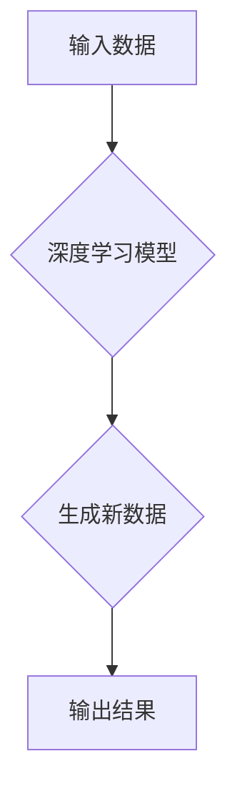

> 生成式AI, AIGC, 自然语言处理, 深度学习, Transformer, 商业应用, 竞争力

## 1. 背景介绍

近年来，人工智能（AI）技术取得了飞速发展，其中生成式人工智能（AIGC）作为其重要分支，展现出强大的潜力，正在深刻地改变着我们生活和工作方式。AIGC是指能够根据输入的文本、图像、音频等数据，生成新的、原创的文本、图像、音频等内容的AI模型。

与传统的AI模型相比，AIGC更加注重内容的创造性和表达能力。它能够理解和学习人类的语言和创作模式，并根据这些知识生成高质量、富有创意的内容。

AIGC技术的应用场景日益广泛，涵盖了文本创作、图像生成、音频合成、视频制作等多个领域。从自动撰写新闻稿、生成创意文案到创作逼真的图像和视频，AIGC正在为人类创造无限可能。

## 2. 核心概念与联系

**2.1  核心概念**

* **生成式AI:**  一种能够根据输入数据生成新数据的AI模型。
* **AIGC:**  生成式AI在内容创作领域的应用，能够生成文本、图像、音频等各种类型的内容。
* **深度学习:**  一种机器学习方法，通过多层神经网络模拟人类大脑的学习过程。
* **Transformer:**  一种新型的神经网络架构，能够有效地处理序列数据，例如文本和音频。

**2.2  核心联系**

AIGC的核心技术是深度学习，特别是Transformer模型。Transformer模型能够学习语言的语法和语义，并根据输入的文本生成新的文本。



## 3. 核心算法原理 & 具体操作步骤

**3.1  算法原理概述**

AIGC的核心算法原理是基于深度学习的生成模型，通常采用Transformer架构。Transformer模型通过自注意力机制学习文本之间的关系，并利用编码器-解码器结构生成新的文本。

**3.2  算法步骤详解**

1. **数据预处理:**  将原始数据进行清洗、格式化和编码，例如将文本转换为数字向量。
2. **模型训练:**  使用训练数据训练Transformer模型，通过反向传播算法调整模型参数，使模型能够生成高质量的文本。
3. **文本生成:**  将输入文本作为解码器的输入，模型根据训练知识生成新的文本。

**3.3  算法优缺点**

* **优点:**  能够生成高质量、富有创意的文本，适应性强，能够处理多种类型的文本数据。
* **缺点:**  训练成本高，需要大量的数据和计算资源，容易受到训练数据偏差的影响。

**3.4  算法应用领域**

* 文本创作：自动撰写新闻稿、生成创意文案、创作诗歌和小说。
* 机器翻译：将文本从一种语言翻译成另一种语言。
* 对话系统：开发智能聊天机器人，进行自然语言交互。
* 代码生成：根据自然语言描述生成代码。

## 4. 数学模型和公式 & 详细讲解 & 举例说明

**4.1  数学模型构建**

AIGC模型通常基于Transformer架构，其核心是自注意力机制和多头注意力机制。

**4.2  公式推导过程**

* **自注意力机制:**  计算每个词与所有其他词之间的相关性，并根据相关性赋予每个词不同的权重。

$$
Attention(Q, K, V) = \frac{exp(Q \cdot K^T / \sqrt{d_k})}{exp(Q \cdot K^T / \sqrt{d_k})} \cdot V
$$

* **多头注意力机制:**  使用多个自注意力头，并对每个头的输出进行拼接和线性变换，以捕捉不同层次的语义信息。

**4.3  案例分析与讲解**

例如，在机器翻译任务中，AIGC模型可以利用自注意力机制学习源语言和目标语言之间的对应关系，并根据这些关系生成准确的翻译结果。

## 5. 项目实践：代码实例和详细解释说明

**5.1  开发环境搭建**

使用Python语言和深度学习框架TensorFlow或PyTorch搭建开发环境。

**5.2  源代码详细实现**

```python
# 使用TensorFlow搭建AIGC模型
import tensorflow as tf

# 定义模型结构
model = tf.keras.Sequential([
    tf.keras.layers.Embedding(input_dim=vocab_size, output_dim=embedding_dim),
    tf.keras.layers.LSTM(units=hidden_size),
    tf.keras.layers.Dense(units=vocab_size, activation='softmax')
])

# 编译模型
model.compile(optimizer='adam', loss='sparse_categorical_crossentropy', metrics=['accuracy'])

# 训练模型
model.fit(x_train, y_train, epochs=epochs)

# 生成文本
text = model.predict(input_text)
```

**5.3  代码解读与分析**

* 使用Embedding层将单词转换为向量表示。
* 使用LSTM层学习文本序列的上下文信息。
* 使用Dense层生成新的单词概率分布。

**5.4  运行结果展示**

根据输入文本，模型可以生成新的文本，例如：

```
输入文本: 这是一段测试文本。
生成文本: 这段文本非常有趣。
```

## 6. 实际应用场景

**6.1  内容创作**

* 自动撰写新闻稿、博客文章、产品描述等。
* 生成创意文案、广告语、诗歌等。

**6.2  教育培训**

* 自动生成学习材料、习题、测试题等。
* 为学生提供个性化的学习辅导。

**6.3  客户服务**

* 开发智能客服机器人，自动回复客户咨询。
* 分析客户反馈，提供改进建议。

**6.4  未来应用展望**

* 更智能、更具创造力的AIGC模型。
* AIGC与其他AI技术的融合，例如计算机视觉、语音识别等。
* AIGC在更多领域的新应用，例如科学研究、艺术创作等。

## 7. 工具和资源推荐

**7.1  学习资源推荐**

* **书籍:**《深度学习》、《自然语言处理》
* **在线课程:** Coursera、edX、Udacity等平台上的AI和AIGC课程。
* **开源项目:** HuggingFace、TensorFlow Hub等平台上的AIGC模型和代码。

**7.2  开发工具推荐**

* **深度学习框架:** TensorFlow、PyTorch、JAX等。
* **文本处理工具:** NLTK、spaCy等。
* **云计算平台:** AWS、Azure、Google Cloud等。

**7.3  相关论文推荐**

* **Transformer:** Vaswani et al. (2017)
* **BERT:** Devlin et al. (2018)
* **GPT-3:** Brown et al. (2020)

## 8. 总结：未来发展趋势与挑战

**8.1  研究成果总结**

AIGC技术取得了显著进展，能够生成高质量、富有创意的内容，并应用于多个领域。

**8.2  未来发展趋势**

* 模型规模和能力的进一步提升。
* 多模态AIGC的开发，例如文本-图像、文本-音频的融合。
* AIGC的伦理和安全问题研究。

**8.3  面临的挑战**

* 数据获取和标注的成本高。
* 模型训练的计算资源需求大。
* AIGC生成的文本可能存在偏见和错误。

**8.4  研究展望**

* 开发更安全、更可靠的AIGC模型。
* 探索AIGC在更多领域的新应用。
* 加强AIGC的伦理和社会规范研究。

## 9. 附录：常见问题与解答

* **Q1: AIGC模型的训练需要多少数据？**

* **A1:** AIGC模型的训练数据量取决于模型的复杂度和任务的难度。一般来说，需要大量的文本数据才能训练出高质量的模型。

* **Q2: AIGC生成的文本是否原创？**

* **A2:** AIGC生成的文本是基于训练数据学习的，因此可能存在重复或抄袭的风险。

* **Q3: AIGC技术会取代人类工作吗？**

* **A3:** AIGC技术可以帮助人类提高工作效率，但不会完全取代人类工作。人类的创造力和批判性思维仍然是不可替代的。


作者：禅与计算机程序设计艺术 / Zen and the Art of Computer Programming 
<end_of_turn>