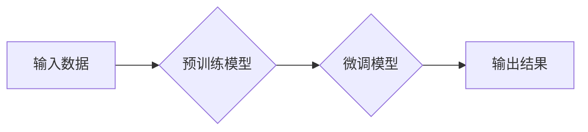

> 生成式AI, 用户体验, 自然语言处理, 图像生成, 算法优化, 伦理问题

## 1. 背景介绍

生成式AI正处于爆发式发展阶段，从ChatGPT的横空出世到DALL-E 2的惊艳表现，它以其创造性的文本和图像生成能力，引发了广泛的关注和讨论。然而，在技术飞速进步的同时，我们也必须认真思考生成式AI带来的挑战和机遇，特别是如何为用户提供“让人尖叫”的用户体验。

传统的AI应用往往侧重于数据分析和预测，而生成式AI则更注重内容的创造和表达。它能够根据输入的文本或图像，生成全新的、具有创意的内容，这为用户提供了前所未有的体验。例如，用户可以利用ChatGPT撰写诗歌、剧本或代码，也可以使用DALL-E 2生成逼真的艺术作品或产品设计草图。

## 2. 核心概念与联系

生成式AI的核心概念是利用深度学习算法，训练模型能够从大量数据中学习模式和规律，并根据这些学习到的知识，生成新的数据。

**Mermaid 流程图:**



**核心概念与联系解释:**

1. **输入数据:** 生成式AI模型需要大量的文本、图像或其他类型的数据作为训练素材。这些数据可以来自公开的数据库、网络爬虫或用户上传。
2. **预训练模型:** 预训练模型是指在大量数据上进行训练，学习到通用语言或图像表示的模型。常见的预训练模型包括BERT、GPT-3和DALL-E。
3. **微调模型:** 微调模型是指在特定任务上对预训练模型进行进一步训练，使其能够更好地完成目标任务。例如，将预训练的文本生成模型微调为撰写诗歌或代码的模型。
4. **输出结果:** 微调后的模型能够根据用户的输入，生成新的文本、图像或其他类型的数据。

## 3. 核心算法原理 & 具体操作步骤

### 3.1  算法原理概述

生成式AI的核心算法主要包括：

* **变分自编码器 (Variational Autoencoder, VAE):** VAE是一种无监督学习算法，它通过学习数据的潜在表示，能够生成新的数据样本。
* **生成对抗网络 (Generative Adversarial Network, GAN):** GAN由两个网络组成：生成器和鉴别器。生成器试图生成逼真的数据样本，而鉴别器试图区分真实数据和生成数据。两者在对抗博弈中相互学习，最终生成器能够生成逼真的数据样本。
* **Transformer:** Transformer是一种基于注意力机制的深度学习模型，它能够捕捉文本中的长距离依赖关系，在文本生成任务中表现出色。

### 3.2  算法步骤详解

以GAN为例，其具体操作步骤如下：

1. **初始化生成器和鉴别器:** 生成器和鉴别器都是神经网络模型，需要进行初始化。
2. **训练鉴别器:** 使用真实数据和生成器生成的假数据训练鉴别器，使其能够区分真实数据和假数据。
3. **训练生成器:** 使用鉴别器对生成器生成的假数据进行评估，并根据评估结果调整生成器的参数，使其能够生成更逼真的数据。
4. **重复步骤2和3:** 持续训练鉴别器和生成器，直到生成器能够生成与真实数据几乎 indistinguishable 的数据。

### 3.3  算法优缺点

**优点:**

* 生成逼真的数据样本。
* 能够处理各种类型的数据，包括文本、图像、音频等。
* 具有很强的泛化能力。

**缺点:**

* 训练过程复杂，需要大量的计算资源。
* 生成的数据可能存在偏差或错误。
* 难以控制生成的样本的质量和多样性。

### 3.4  算法应用领域

生成式AI在各个领域都有广泛的应用，例如：

* **文本生成:** 写作小说、诗歌、剧本、代码等。
* **图像生成:** 生成艺术作品、产品设计草图、照片等。
* **音频生成:** 生成音乐、语音合成等。
* **视频生成:** 生成动画、特效等。

## 4. 数学模型和公式 & 详细讲解 & 举例说明

### 4.1  数学模型构建

生成式AI模型通常基于概率模型，例如：

* **条件概率分布:**  P(x|y)，表示给定输入y，输出x的概率分布。
* **联合概率分布:** P(x,y)，表示输入x和输出y的联合概率分布。

### 4.2  公式推导过程

例如，在GAN中，生成器G的目标是最大化以下目标函数:

$$
\max_G V(D,G) = E_{x \sim p_{data}(x)}[log D(x)] + E_{z \sim p_z(z)}[log(1-D(G(z)))]
$$

其中：

* D(x) 是鉴别器对真实数据x的预测概率。
* G(z) 是生成器根据噪声输入z生成的假数据。
* $p_{data}(x)$ 是真实数据的分布。
* $p_z(z)$ 是噪声输入z的分布。

### 4.3  案例分析与讲解

例如，在DALL-E 2中，它使用一个基于Transformer的模型来生成图像。该模型接受文本描述作为输入，并根据文本描述生成相应的图像。

## 5. 项目实践：代码实例和详细解释说明

### 5.1  开发环境搭建

* Python 3.7+
* TensorFlow 或 PyTorch
* CUDA 和 cuDNN (如果使用GPU)

### 5.2  源代码详细实现

```python
# 使用TensorFlow实现一个简单的文本生成模型

import tensorflow as tf

# 定义模型结构
model = tf.keras.Sequential([
    tf.keras.layers.Embedding(input_dim=vocab_size, output_dim=embedding_dim),
    tf.keras.layers.LSTM(units=lstm_units),
    tf.keras.layers.Dense(units=vocab_size, activation='softmax')
])

# 编译模型
model.compile(optimizer='adam', loss='sparse_categorical_crossentropy', metrics=['accuracy'])

# 训练模型
model.fit(x_train, y_train, epochs=epochs)

# 生成文本
seed_text = "The quick brown fox"
for _ in range(generate_length):
    predictions = model.predict(tf.expand_dims(seed_text, 0))
    predicted_index = tf.argmax(predictions[0]).numpy()
    predicted_char = vocabulary[predicted_index]
    seed_text += predicted_char
```

### 5.3  代码解读与分析

* **Embedding层:** 将单词转换为稠密的向量表示。
* **LSTM层:** 学习文本序列中的长距离依赖关系。
* **Dense层:** 将LSTM输出映射到每个单词的概率分布。
* **训练过程:** 使用训练数据训练模型，优化模型参数。
* **文本生成:** 根据训练好的模型，输入一个种子文本，并根据模型预测，生成新的文本。

### 5.4  运行结果展示

运行代码后，可以生成一段基于训练数据的文本。

## 6. 实际应用场景

### 6.1  内容创作

* **自动写作:** 生成新闻报道、博客文章、产品描述等。
* **创意写作:** 创作诗歌、剧本、小说等。
* **代码生成:** 根据自然语言描述生成代码。

### 6.2  图像生成

* **艺术创作:** 生成绘画、雕塑、音乐等艺术作品。
* **产品设计:** 生成产品原型、设计草图等。
* **图像编辑:** 生成图像特效、修复图像缺陷等。

### 6.3  其他应用场景

* **聊天机器人:** 生成更自然、更人性化的对话。
* **语音合成:** 生成逼真的语音合成。
* **数据分析:** 生成数据可视化图表和报告。

### 6.4  未来应用展望

随着生成式AI技术的不断发展，其应用场景将更加广泛，例如：

* **个性化教育:** 根据学生的学习情况生成个性化的学习内容。
* **虚拟现实和增强现实:** 生成逼真的虚拟环境和增强现实体验。
* **医疗保健:** 生成医学图像、辅助诊断等。

## 7. 工具和资源推荐

### 7.1  学习资源推荐

* **书籍:**
    * 《Deep Learning》 by Ian Goodfellow, Yoshua Bengio, and Aaron Courville
    * 《Generative Deep Learning》 by David Foster
* **在线课程:**
    * Coursera: Deep Learning Specialization
    * Udacity: Deep Learning Nanodegree
* **博客和论坛:**
    * Towards Data Science
    * Reddit: r/MachineLearning

### 7.2  开发工具推荐

* **TensorFlow:** 开源深度学习框架。
* **PyTorch:** 开源深度学习框架。
* **Hugging Face:** 提供预训练模型和工具。

### 7.3  相关论文推荐

* **Generative Adversarial Networks** by Ian Goodfellow et al. (2014)
* **Attention Is All You Need** by Ashish Vaswani et al. (2017)
* **DALL-E 2: Hierarchical Text-Conditional Image Generation with CLIP Latents** by OpenAI (2022)

## 8. 总结：未来发展趋势与挑战

### 8.1  研究成果总结

生成式AI技术取得了显著的进展，能够生成逼真的文本、图像和音频等数据。

### 8.2  未来发展趋势

* **模型规模和能力的提升:** 未来将出现规模更大的模型，能够生成更复杂、更逼真的数据。
* **多模态生成:** 将文本、图像、音频等多种模态数据融合在一起，生成更丰富的体验。
* **可解释性和控制性:** 研究如何提高生成式AI模型的可解释性和控制性，使其能够更好地服务于人类。

### 8.3  面临的挑战

* **数据偏见和公平性:** 生成式AI模型可能继承训练数据中的偏见，导致生成的数据不公平或不准确。
* **虚假信息和滥用:** 生成式AI技术可能被用于生成虚假信息、进行网络攻击等恶意活动。
* **伦理问题:** 生成式AI技术可能引发一系列伦理问题，例如版权问题、隐私问题等。

### 8.4  研究展望

未来研究将重点关注以下几个方面:

* **解决数据偏见和公平性问题:** 开发新的算法和方法，减少生成式AI模型的偏见。
* **提高模型的可解释性和控制性:** 研究如何更好地理解生成式AI模型的工作机制，并使其能够更好地服务于人类。
* **制定相关伦理规范:** 探索生成式AI技术的伦理问题，并制定相应的规范和政策。

## 9. 附录：常见问题与解答

**Q1: 生成式AI模型的训练需要多少数据？**

**A1:** 生成式AI模型的训练数据量取决于模型的复杂度和任务的难度。一般来说，需要大量的训练数据才能获得良好的性能。

**Q2: 生成式AI模型的输出结果是否总是准确的？**

**A2:** 生成式AI模型的输出结果并非总是准确的，它可能会受到训练数据的影响，也可能出现随机性。

**Q3: 如何防止生成式AI模型被用于恶意活动？**

**A3:** 

* 开发检测虚假信息的算法和工具。
* 加强对生成式AI技术的监管和控制。
* 提高公众对生成式AI技术的认识和警惕。

**作者：禅与计算机程序设计艺术 / Zen and the Art of Computer Programming**


<end_of_turn>