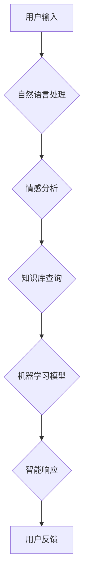

> 人工智能，自然语言处理，情感计算，机器学习，深度学习，伦理问题，人机交互

## 1. 背景介绍

2013年上映的电影《她》讲述了一个孤独的程序员Theodore与一个拥有先进人工智能的虚拟助手Samantha相爱的故事。这部电影不仅是一部浪漫爱情片，更是一部探讨人工智能发展趋势和伦理问题的思考之作。随着人工智能技术的飞速发展，我们越来越接近电影中描绘的场景，也更加需要认真思考人工智能对人类社会的影响。

## 2. 核心概念与联系

### 2.1 自然语言处理 (NLP)

电影中，Samantha能够理解和生成人类语言，这离不开自然语言处理技术的支持。NLP是人工智能领域的一个重要分支，旨在让计算机能够理解、处理和生成人类语言。

### 2.2 情感计算 (Affective Computing)

Samantha不仅能够理解语言的含义，还能识别人类的情感，并做出相应的回应。情感计算是人工智能领域的一个新兴方向，旨在让计算机能够识别、理解和模拟人类的情感。

### 2.3 机器学习 (Machine Learning)

Samantha的学习和成长是通过机器学习实现的。机器学习是人工智能领域的一个重要分支，旨在让计算机能够从数据中学习，并根据学习到的知识做出预测或决策。

**Mermaid 流程图**



## 3. 核心算法原理 & 具体操作步骤

### 3.1 算法原理概述

电影中，Samantha的智能行为是基于深度学习算法实现的。深度学习是一种机器学习算法，它利用多层神经网络来模拟人类大脑的学习过程。

### 3.2 算法步骤详解

1. **数据收集和预处理:** 收集大量文本数据，并进行预处理，例如去除停用词、分词等。
2. **神经网络构建:** 设计多层神经网络结构，包括输入层、隐藏层和输出层。
3. **模型训练:** 使用训练数据训练神经网络模型，调整网络参数，使模型能够准确地理解和生成语言。
4. **模型评估:** 使用测试数据评估模型的性能，例如准确率、召回率等。
5. **模型部署:** 将训练好的模型部署到实际应用场景中，例如聊天机器人、语音助手等。

### 3.3 算法优缺点

**优点:**

* 能够处理复杂的任务，例如文本分类、机器翻译等。
* 学习能力强，能够从海量数据中提取特征。
* 性能优越，能够达到接近人类水平的准确率。

**缺点:**

* 训练数据量大，需要大量的计算资源。
* 模型解释性差，难以理解模型的决策过程。
* 容易受到数据偏差的影响。

### 3.4 算法应用领域

深度学习算法在人工智能领域有着广泛的应用，例如：

* 自然语言处理：机器翻译、文本摘要、情感分析等。
*计算机视觉：图像识别、目标检测、图像分割等。
*语音识别：语音转文本、语音合成等。
*推荐系统：商品推荐、内容推荐等。

## 4. 数学模型和公式 & 详细讲解 & 举例说明

### 4.1 数学模型构建

深度学习模型通常采用多层感知机 (MLP) 或卷积神经网络 (CNN) 等结构。

**多层感知机 (MLP)**

MLP由多个全连接层组成，每一层的神经元都与上一层的每个神经元连接。

**卷积神经网络 (CNN)**

CNN利用卷积层和池化层来提取图像特征。卷积层通过卷积核对图像进行卷积运算，提取图像局部特征。池化层对卷积层的输出进行降维，减少计算量。

### 4.2 公式推导过程

深度学习模型的训练过程是通过反向传播算法来实现的。反向传播算法利用梯度下降法来更新模型参数，使模型的损失函数最小化。

**损失函数:**

$$L = \frac{1}{N} \sum_{i=1}^{N} (y_i - \hat{y}_i)^2$$

其中：

* $L$ 是损失函数
* $N$ 是样本数量
* $y_i$ 是真实标签
* $\hat{y}_i$ 是模型预测值

**梯度下降法:**

$$\theta = \theta - \alpha \nabla L(\theta)$$

其中：

* $\theta$ 是模型参数
* $\alpha$ 是学习率
* $\nabla L(\theta)$ 是损失函数对参数的梯度

### 4.3 案例分析与讲解

例如，在图像分类任务中，我们可以使用CNN模型来识别图像中的物体。训练过程中，我们会使用大量的图像数据，并通过反向传播算法来更新模型参数。最终，训练好的模型能够准确地识别图像中的物体。

## 5. 项目实践：代码实例和详细解释说明

### 5.1 开发环境搭建

可以使用Python语言和相关的深度学习框架，例如TensorFlow或PyTorch，来开发人工智能项目。

### 5.2 源代码详细实现

```python
# 使用TensorFlow构建一个简单的多层感知机模型
import tensorflow as tf

# 定义模型结构
model = tf.keras.models.Sequential([
    tf.keras.layers.Dense(128, activation='relu', input_shape=(784,)),
    tf.keras.layers.Dense(10, activation='softmax')
])

# 编译模型
model.compile(optimizer='adam',
              loss='sparse_categorical_crossentropy',
              metrics=['accuracy'])

# 训练模型
model.fit(x_train, y_train, epochs=10)

# 评估模型
loss, accuracy = model.evaluate(x_test, y_test)
print('Loss:', loss)
print('Accuracy:', accuracy)
```

### 5.3 代码解读与分析

这段代码定义了一个简单的多层感知机模型，并使用TensorFlow框架进行训练和评估。

* `tf.keras.models.Sequential` 创建了一个顺序模型，即层级结构。
* `tf.keras.layers.Dense` 定义了一个全连接层，其中 `128` 是神经元数量， `relu` 是激活函数。
* `tf.keras.layers.Dense` 定义了输出层，神经元数量为 `10`，激活函数为 `softmax`。
* `model.compile` 编译模型，指定优化器、损失函数和评估指标。
* `model.fit` 训练模型，使用训练数据 `x_train` 和标签 `y_train`，训练 `10` 个 epochs。
* `model.evaluate` 评估模型，使用测试数据 `x_test` 和标签 `y_test`。

### 5.4 运行结果展示

训练完成后，我们可以查看模型的损失值和准确率。

## 6. 实际应用场景

### 6.1 聊天机器人

深度学习算法可以用于构建智能聊天机器人，能够与人类进行自然流畅的对话。

### 6.2 语音助手

深度学习算法可以用于构建语音助手，例如Siri、Alexa等，能够理解用户的语音指令并执行相应的操作。

### 6.3 机器翻译

深度学习算法可以用于构建机器翻译系统，能够将一种语言翻译成另一种语言。

### 6.4 未来应用展望

随着人工智能技术的不断发展，深度学习算法将在更多领域得到应用，例如医疗诊断、金融风险评估、自动驾驶等。

## 7. 工具和资源推荐

### 7.1 学习资源推荐

* **书籍:**
    * 深度学习 (Deep Learning) - Ian Goodfellow, Yoshua Bengio, Aaron Courville
    * 人工智能：一种现代方法 (Artificial Intelligence: A Modern Approach) - Stuart Russell, Peter Norvig
* **在线课程:**
    * TensorFlow 官方教程: https://www.tensorflow.org/tutorials
    * PyTorch 官方教程: https://pytorch.org/tutorials/

### 7.2 开发工具推荐

* **TensorFlow:** https://www.tensorflow.org/
* **PyTorch:** https://pytorch.org/
* **Keras:** https://keras.io/

### 7.3 相关论文推荐

* **ImageNet Classification with Deep Convolutional Neural Networks** - Alex Krizhevsky, Ilya Sutskever, Geoffrey E. Hinton
* **Attention Is All You Need** - Ashish Vaswani, Noam Shazeer, Niki Parmar, Jakob Uszkoreit, Llion Jones, Aidan N. Gomez, Łukasz Kaiser, Illia Polosukhin

## 8. 总结：未来发展趋势与挑战

### 8.1 研究成果总结

深度学习算法取得了显著的成果，在图像识别、语音识别、自然语言处理等领域取得了突破性进展。

### 8.2 未来发展趋势

* **模型规模和复杂度提升:** 未来深度学习模型将更加庞大，更加复杂，能够处理更加复杂的任务。
* **算法效率提升:** 研究人员将继续探索更加高效的深度学习算法，降低训练和推理的成本。
* **解释性增强:** 研究人员将致力于提高深度学习模型的解释性，使模型的决策过程更加透明。

### 8.3 面临的挑战

* **数据获取和标注:** 深度学习算法需要大量的训练数据，数据获取和标注成本高昂。
* **模型可解释性:** 深度学习模型的决策过程难以理解，缺乏可解释性。
* **伦理问题:** 人工智能技术的快速发展引发了伦理问题，例如算法偏见、隐私保护等。

### 8.4 研究展望

未来，人工智能研究将更加注重模型的安全性、可靠性和可解释性，并更加关注人工智能与人类社会和谐共处的关系。

## 9. 附录：常见问题与解答

### 9.1 什么是深度学习？

深度学习是一种机器学习算法，它利用多层神经网络来模拟人类大脑的学习过程。

### 9.2 深度学习有哪些应用场景？

深度学习在图像识别、语音识别、自然语言处理、推荐系统等领域都有广泛的应用。

### 9.3 如何学习深度学习？

可以通过阅读书籍、参加在线课程、参与开源项目等方式学习深度学习。


作者：禅与计算机程序设计艺术 / Zen and the Art of Computer Programming 
<end_of_turn>