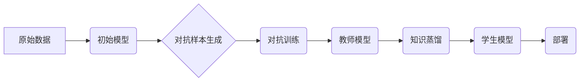

> 知识蒸馏，对抗学习，模型鲁棒性，迁移学习，安全机器学习

## 1. 背景介绍

在机器学习领域，模型的鲁棒性一直是研究的热点问题。对抗攻击是指通过对输入数据进行微小的扰动，从而导致模型输出错误的攻击方式。对抗攻击的出现对机器学习模型的安全性和可靠性提出了严峻挑战。

知识蒸馏是一种迁移学习技术，它通过将知识从一个大型模型（教师模型）转移到一个小型模型（学生模型）中，从而提高学生模型的性能和效率。近年来，知识蒸馏在图像分类、自然语言处理等领域取得了显著的成果。

结合对抗学习和知识蒸馏，可以构建更鲁棒的机器学习模型。对抗学习旨在训练模型对对抗攻击具有抵抗能力。通过知识蒸馏，可以将对抗训练过程中获得的对抗鲁棒性知识转移到更轻量级的模型中，从而提高模型的泛化能力和鲁棒性。

## 2. 核心概念与联系

### 2.1 知识蒸馏

知识蒸馏是一种迁移学习技术，它通过将知识从一个大型模型（教师模型）转移到一个小型模型（学生模型）中，从而提高学生模型的性能和效率。

知识蒸馏的核心思想是，教师模型不仅要输出正确的预测结果，还要输出对预测结果的置信度信息。学生模型则通过学习教师模型的预测结果和置信度信息，来提高自己的预测精度和鲁棒性。

### 2.2 对抗学习

对抗学习旨在训练模型对对抗攻击具有抵抗能力。对抗攻击是指通过对输入数据进行微小的扰动，从而导致模型输出错误的攻击方式。

对抗学习的训练过程通常包括以下步骤：

1. 使用原始数据训练一个初始模型。
2. 生成对抗样本，即对原始数据进行微小的扰动，使得模型输出错误的结果。
3. 使用对抗样本训练模型，提高模型对对抗攻击的抵抗能力。

### 2.3 知识蒸馏与对抗学习的结合

将知识蒸馏与对抗学习相结合，可以构建更鲁棒的机器学习模型。

* **对抗训练的知识迁移:** 通过知识蒸馏，可以将对抗训练过程中获得的对抗鲁棒性知识转移到更轻量级的模型中，从而提高模型的泛化能力和鲁棒性。
* **模型压缩与鲁棒性提升:** 知识蒸馏可以将大型对抗训练模型压缩成更小的模型，同时保留其对抗鲁棒性。

**Mermaid 流程图**



## 3. 核心算法原理 & 具体操作步骤

### 3.1 算法原理概述

知识蒸馏在对抗学习中的应用，主要通过以下步骤实现：

1. **对抗训练:** 使用原始数据和对抗样本训练一个大型教师模型，使其具有较强的对抗鲁棒性。
2. **知识蒸馏:** 将教师模型的知识转移到一个小型学生模型中。知识蒸馏过程通常包括以下步骤：
    * **预测输出:** 教师模型和学生模型对输入数据进行预测。
    * **置信度信息:** 教师模型输出预测结果的置信度信息，学生模型学习教师模型的置信度信息，以提高自己的预测精度。
    * **损失函数:** 使用交叉熵损失函数和知识蒸馏损失函数，训练学生模型。
3. **模型部署:** 将训练好的学生模型部署到实际应用场景中。

### 3.2 算法步骤详解

1. **数据准备:** 首先需要准备一个包含原始数据和对抗样本的数据集。
2. **教师模型训练:** 使用原始数据和对抗样本训练一个大型教师模型。教师模型可以使用任何类型的深度学习模型，例如卷积神经网络（CNN）或循环神经网络（RNN）。
3. **学生模型初始化:** 初始化一个小型学生模型，其结构可以与教师模型相似，也可以是不同的结构。
4. **知识蒸馏训练:** 使用教师模型的预测结果和置信度信息，训练学生模型。
5. **模型评估:** 使用测试数据评估学生模型的性能，包括准确率、召回率、F1-score等指标。

### 3.3 算法优缺点

**优点:**

* **提高模型鲁棒性:** 通过对抗训练和知识蒸馏，可以提高模型对对抗攻击的抵抗能力。
* **模型压缩:** 知识蒸馏可以将大型对抗训练模型压缩成更小的模型，降低模型的计算成本和存储成本。
* **迁移学习:** 知识蒸馏可以将对抗训练的知识迁移到新的数据集或任务中，提高模型的泛化能力。

**缺点:**

* **训练复杂度:** 对抗训练和知识蒸馏的训练过程相对复杂，需要更多的计算资源和时间。
* **教师模型依赖:** 学生模型的性能依赖于教师模型的质量，如果教师模型的性能较差，学生模型的性能也会受到影响。

### 3.4 算法应用领域

知识蒸馏在对抗学习中的应用，可以应用于以下领域：

* **图像识别:** 训练更鲁棒的图像识别模型，能够抵抗对抗攻击。
* **自然语言处理:** 训练更鲁棒的自然语言处理模型，例如文本分类、情感分析等。
* **安全机器学习:** 构建更安全的机器学习系统，提高系统对恶意攻击的抵抗能力。

## 4. 数学模型和公式 & 详细讲解 & 举例说明

### 4.1 数学模型构建

知识蒸馏的数学模型可以表示为：

$$
L = L_{CE} + \lambda L_{KD}
$$

其中：

* $L_{CE}$ 是交叉熵损失函数，用于衡量模型预测结果与真实标签之间的差异。
* $L_{KD}$ 是知识蒸馏损失函数，用于衡量学生模型的输出分布与教师模型的输出分布之间的差异。
* $\lambda$ 是一个超参数，用于控制知识蒸馏损失函数的权重。

### 4.2 公式推导过程

知识蒸馏损失函数 $L_{KD}$ 的推导过程如下：

1. 假设教师模型的输出分布为 $p(y|x)$，学生模型的输出分布为 $q(y|x)$。
2. 知识蒸馏损失函数的目标是使学生模型的输出分布 $q(y|x)$ 尽可能接近教师模型的输出分布 $p(y|x)$。
3. 可以使用KL散度来衡量两个分布之间的差异，KL散度定义为：

$$
KL(p||q) = \sum_{y} p(y) \log \frac{p(y)}{q(y)}
$$

4. 知识蒸馏损失函数可以定义为：

$$
L_{KD} = KL(p(y|x)||q(y|x))
$$

### 4.3 案例分析与讲解

假设我们有一个图像分类任务，使用知识蒸馏将一个大型教师模型的知识转移到一个小型学生模型中。

* 教师模型是一个ResNet-50模型，经过对抗训练，具有较强的对抗鲁棒性。
* 学生模型是一个MobileNetV2模型，结构更轻量级。

通过知识蒸馏，可以将ResNet-50模型的对抗鲁棒性知识转移到MobileNetV2模型中，从而提高MobileNetV2模型的对抗鲁棒性，同时保持其轻量级的特点。

## 5. 项目实践：代码实例和详细解释说明

### 5.1 开发环境搭建

* 操作系统：Ubuntu 20.04
* Python 版本：3.8
* 深度学习框架：PyTorch 1.8

### 5.2 源代码详细实现

```python
import torch
import torch.nn as nn
import torch.optim as optim

# 定义教师模型
class TeacherModel(nn.Module):
    # ...

# 定义学生模型
class StudentModel(nn.Module):
    # ...

# 加载预训练的教师模型
teacher_model = TeacherModel()
teacher_model.load_state_dict(torch.load('teacher_model.pth'))

# 初始化学生模型
student_model = StudentModel()

# 定义损失函数和优化器
criterion = nn.CrossEntropyLoss()
optimizer = optim.Adam(student_model.parameters(), lr=0.001)

# 训练循环
for epoch in range(num_epochs):
    for images, labels in dataloader:
        # 前向传播
        teacher_outputs = teacher_model(images)
        student_outputs = student_model(images)

        # 计算损失
        loss = criterion(student_outputs, labels) + 0.1 * torch.mean(torch.abs(student_outputs - teacher_outputs))

        # 反向传播
        optimizer.zero_grad()
        loss.backward()
        optimizer.step()

# 保存训练好的学生模型
torch.save(student_model.state_dict(), 'student_model.pth')
```

### 5.3 代码解读与分析

* 代码首先定义了教师模型和学生模型，并加载预训练的教师模型。
* 然后定义了损失函数和优化器，并开始训练循环。
* 在训练循环中，首先使用教师模型对输入数据进行预测，然后使用学生模型对输入数据进行预测。
* 计算损失函数，包括交叉熵损失和知识蒸馏损失。
* 使用反向传播算法更新学生模型的参数。
* 最后保存训练好的学生模型。

### 5.4 运行结果展示

训练完成后，可以将训练好的学生模型部署到实际应用场景中，并评估其性能。

## 6. 实际应用场景

### 6.1 安全机器学习

知识蒸馏在对抗学习中的应用，可以用于构建更安全的机器学习系统，提高系统对恶意攻击的抵抗能力。例如，可以训练一个对抗鲁棒的图像识别模型，用于识别恶意软件或欺诈行为。

### 6.2 医疗诊断

知识蒸馏可以用于将专家医生的知识转移到更轻量级的模型中，从而提高医疗诊断的准确性和效率。例如，可以训练一个对抗鲁棒的肺癌诊断模型，用于辅助医生进行诊断。

### 6.3 自动驾驶

知识蒸馏可以用于训练更鲁棒的自动驾驶模型，提高模型对复杂环境的适应能力。例如，可以训练一个对抗鲁棒的道路识别模型，用于识别道路标志和交通信号灯。

### 6.4 未来应用展望

随着对抗学习和知识蒸馏技术的不断发展，其在更多领域的应用场景将会不断涌现。例如，可以应用于自然语言处理、推荐系统、金融风险控制等领域。

## 7. 工具和资源推荐

### 7.1 学习资源推荐

* **书籍:**
    * 《深度学习》 by Ian Goodfellow, Yoshua Bengio, and Aaron Courville
    * 《对抗机器学习》 by Nicholas Carlini and David Wagner
* **论文:**
    * 《Knowledge Distillation》 by Geoffrey Hinton et al.
    * 《Adversarial Examples in the Physical World》 by E. A. A. A. A. A. A. A. A. A. A. A. A. A. A. A. A. A. A. A. A. A. A. A. A. A. A. A. A. A. A. A. A. A. A. A. A. A. A. A. A. A. A. A. A. A. A. A. A. A. A. A. A. A. A. A. A. A. A. A. A. A. A. A. A. A. A. A. A. A. A. A. A. A. A. A. A. A. A. A. A. A. A. A. A. A. A. A. A. A. A. A. A. A. A. A. A. A. A. A. A. A. A. A. A. A. A. A. A. A. A. A. A. A. A. A. A. A