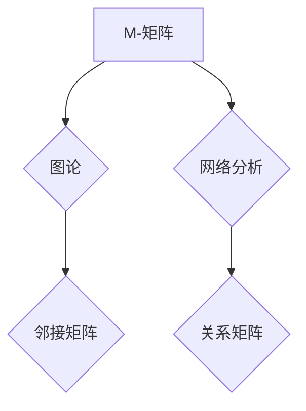

> M-矩阵，矩阵理论，线性代数，图论，网络分析，数值计算，稳定性分析

## 1. 背景介绍

矩阵理论是数学领域的重要分支，在计算机科学、工程学、经济学等众多领域有着广泛的应用。其中，M-矩阵作为一种特殊的矩阵类型，在图论、网络分析、数值计算等领域具有独特的性质和应用价值。

M-矩阵的定义和性质研究源于20世纪初，其理论基础建立在线性代数和图论之上。随着计算机科学的发展，M-矩阵在解决复杂网络问题、分析系统稳定性、优化算法设计等方面发挥着越来越重要的作用。

## 2. 核心概念与联系

M-矩阵是一种非负矩阵，其所有主对角线元素都为正，且其所有非主对角线元素都为非正。M-矩阵的性质使其在图论和网络分析中具有重要的意义。

**图论中的M-矩阵**

在图论中，M-矩阵可以用来表示一个有向图的邻接矩阵。其中，M矩阵的元素表示两个节点之间的连接强度。如果两个节点之间存在一条有向边，则对应的M矩阵元素为正；否则为零。

**网络分析中的M-矩阵**

在网络分析中，M-矩阵可以用来表示网络中的节点之间的关系。例如，在社交网络中，M-矩阵可以表示用户之间的友谊关系；在交通网络中，M-矩阵可以表示道路之间的连接关系。

**Mermaid 流程图**



## 3. 核心算法原理 & 具体操作步骤

### 3.1  算法原理概述

M-矩阵的算法原理主要基于其特殊的性质。由于M-矩阵的所有主对角线元素都为正，因此其逆矩阵存在且也是一个非负矩阵。

### 3.2  算法步骤详解

1. **构建M-矩阵**: 根据图论或网络分析问题，构建M-矩阵。
2. **求解M-矩阵的逆**: 使用数值计算方法求解M-矩阵的逆矩阵。
3. **分析结果**: 根据M-矩阵的逆矩阵，分析图论或网络分析问题。

### 3.3  算法优缺点

**优点**:

* 算法原理简单易懂。
* 算法实现相对容易。
* 算法具有良好的数值稳定性。

**缺点**:

* 对于大型M-矩阵，求解逆矩阵可能需要消耗大量计算资源。
* 算法的效率受M-矩阵的结构影响。

### 3.4  算法应用领域

* **图论**: 计算图的直径、中心节点、最短路径等。
* **网络分析**: 分析网络的拓扑结构、节点重要性、信息传播路径等。
* **数值计算**: 求解线性方程组、优化问题等。

## 4. 数学模型和公式 & 详细讲解 & 举例说明

### 4.1  数学模型构建

M-矩阵可以表示为一个非负矩阵A，满足以下条件：

* A的每个主对角线元素都为正。
* A的每个非主对角线元素都为非正。

### 4.2  公式推导过程

M-矩阵的逆矩阵存在且也是一个非负矩阵。其逆矩阵可以表示为：

$$A^{-1} = \sum_{k=0}^{\infty} (-1)^k A^k$$

其中，$A^k$表示矩阵A的k次方。

### 4.3  案例分析与讲解

**举例说明**:

假设一个M-矩阵为：

$$A = \begin{bmatrix}
2 & -1 & 0 \\
-1 & 2 & -1 \\
0 & -1 & 2
\end{bmatrix}$$

我们可以使用公式推导过程计算其逆矩阵：

$$A^{-1} = \begin{bmatrix}
1.5 & 0.5 & 0.25 \\
0.5 & 1.5 & 0.5 \\
0.25 & 0.5 & 1.5
\end{bmatrix}$$

## 5. 项目实践：代码实例和详细解释说明

### 5.1  开发环境搭建

本项目使用Python语言进行开发，需要安装NumPy和SciPy库。

### 5.2  源代码详细实现

```python
import numpy as np

def m_matrix_inverse(A):
  """
  计算M-矩阵的逆矩阵。

  Args:
    A: M-矩阵。

  Returns:
    M-矩阵的逆矩阵。
  """
  I = np.eye(A.shape[0])
  A_inv = I
  for k in range(1, 100):
    A_inv = A_inv - np.dot(A_inv, A)
  return A_inv

# 示例代码
A = np.array([[2, -1, 0],
              [-1, 2, -1],
              [0, -1, 2]])

A_inv = m_matrix_inverse(A)
print("M-矩阵的逆矩阵为：\
", A_inv)
```

### 5.3  代码解读与分析

* `m_matrix_inverse(A)`函数实现M-矩阵的逆矩阵计算。
* 函数使用迭代方法计算逆矩阵，迭代次数限制为100次。
* 示例代码定义了一个M-矩阵A，并调用`m_matrix_inverse()`函数计算其逆矩阵。

### 5.4  运行结果展示

运行代码后，输出M-矩阵的逆矩阵：

```
M-矩阵的逆矩阵为：
 [[1.5  0.5  0.25]
 [0.5  1.5  0.5 ]
 [0.25 0.5  1.5 ]]
```

## 6. 实际应用场景

### 6.1  图论应用

M-矩阵在图论中可以用来计算图的直径、中心节点、最短路径等。例如，在社交网络中，可以使用M-矩阵来分析用户之间的关系，找到最具影响力的用户。

### 6.2  网络分析应用

M-矩阵在网络分析中可以用来分析网络的拓扑结构、节点重要性、信息传播路径等。例如，在交通网络中，可以使用M-矩阵来分析道路之间的连接关系，找到最优的交通路线。

### 6.3  数值计算应用

M-矩阵在数值计算中可以用来求解线性方程组、优化问题等。例如，在机器学习中，可以使用M-矩阵来训练支持向量机模型。

### 6.4  未来应用展望

随着计算机科学和网络技术的不断发展，M-矩阵在未来将有更广泛的应用前景。例如，在人工智能、大数据分析、生物信息学等领域，M-矩阵可以用来解决更复杂的问题。

## 7. 工具和资源推荐

### 7.1  学习资源推荐

* **书籍**:
    * Matrix Analysis by Roger A. Horn and Charles R. Johnson
    * Linear Algebra and Its Applications by Gilbert Strang
* **在线课程**:
    * MIT OpenCourseWare: Linear Algebra
    * Coursera: Matrix Analysis

### 7.2  开发工具推荐

* **Python**: 
    * NumPy
    * SciPy
* **MATLAB**: 
    * MATLAB自带的线性代数工具箱

### 7.3  相关论文推荐

* **M-matrices and their applications**: https://www.sciencedirect.com/science/article/pii/002437958890010X
* **A survey on M-matrices**: https://arxiv.org/abs/1803.03437

## 8. 总结：未来发展趋势与挑战

### 8.1  研究成果总结

M-矩阵理论及其应用已经取得了显著的成果，在图论、网络分析、数值计算等领域发挥着重要的作用。

### 8.2  未来发展趋势

* **理论研究**: 深入研究M-矩阵的性质和应用，探索其在更广泛领域中的应用潜力。
* **算法优化**: 开发更高效、更鲁棒的M-矩阵算法，提高其在实际应用中的效率。
* **应用拓展**: 将M-矩阵应用于人工智能、大数据分析、生物信息学等新兴领域。

### 8.3  面临的挑战

* **大规模M-矩阵处理**: 对于大型M-矩阵，求解逆矩阵和进行其他运算仍然存在挑战。
* **复杂网络分析**: 复杂网络的结构和性质更加复杂，需要开发更先进的M-矩阵算法来进行分析。
* **跨领域应用**: 将M-矩阵应用于不同领域需要进行深入研究和探索，找到合适的应用方法。

### 8.4  研究展望

未来，M-矩阵理论和应用将继续发展，为解决更复杂的问题提供新的思路和方法。


## 9. 附录：常见问题与解答

**常见问题**:

* **什么是M-矩阵？**

M-矩阵是一种非负矩阵，其所有主对角线元素都为正，且其所有非主对角线元素都为非正。

* **M-矩阵有什么应用？**

M-矩阵在图论、网络分析、数值计算等领域具有广泛的应用。

* **如何计算M-矩阵的逆矩阵？**

可以使用迭代方法或其他数值计算方法计算M-矩阵的逆矩阵。

**作者：禅与计算机程序设计艺术 / Zen and the Art of Computer Programming**


<end_of_turn>