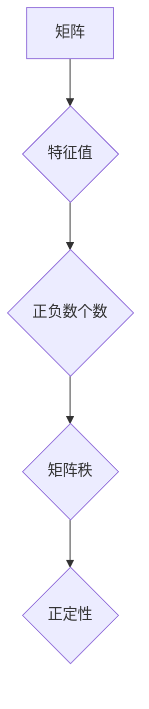

> 矩阵理论，矩阵惯性定理，特征值，特征向量，二次型，正定矩阵，半正定矩阵，应用场景

## 1. 背景介绍

矩阵理论是线性代数的重要分支，在数学、物理、工程、计算机科学等领域有着广泛的应用。其中，矩阵惯性定理是矩阵理论中的一个重要定理，它揭示了矩阵特征值的性质与矩阵的秩、正定性等性质之间的关系。

矩阵惯性定理的应用场景非常广泛，例如：

* **优化问题：** 许多优化问题可以被表述为求解一个二次型的极值，而矩阵惯性定理可以帮助我们快速判断二次型的性质，从而找到最优解。
* **机器学习：** 在机器学习中，许多算法都依赖于矩阵的特征值和特征向量，例如主成分分析（PCA）和奇异值分解（SVD）。矩阵惯性定理可以帮助我们理解这些算法的原理和性能。
* **信号处理：** 信号处理中，许多算法都依赖于矩阵的分解和求逆，而矩阵惯性定理可以帮助我们选择合适的分解方法和判断算法的稳定性。

## 2. 核心概念与联系

**2.1 核心概念**

* **矩阵：** 矩阵是一种数的排列，通常用方括号表示。
* **特征值：** 特征值是与矩阵相对应的标量，它满足以下方程：

 $$Ax = \lambda x$$

其中，A是矩阵，x是非零向量，λ是特征值。

* **特征向量：** 特征向量是与矩阵相对应的非零向量，它满足以下方程：

 $$Ax = \lambda x$$

其中，A是矩阵，x是特征向量，λ是特征值。

* **二次型：** 二次型是一种关于变量的二次函数，可以表示为：

 $$f(x_1, x_2, ..., x_n) = a_{11}x_1^2 + a_{12}x_1x_2 + ... + a_{nn}x_n^2$$

其中，$a_{ij}$是常数。

* **矩阵惯性定理：** 矩阵惯性定理指出，一个实对称矩阵的特征值的正负数的个数与矩阵的秩、正定性等性质有关。

**2.2 核心概念联系**

矩阵惯性定理的核心思想是将矩阵的性质与二次型的性质联系起来。

* **实对称矩阵：** 实对称矩阵的特征值都是实数，并且特征向量之间正交。
* **正定矩阵：** 正定矩阵的所有特征值都是正数。
* **半正定矩阵：** 半正定矩阵的所有特征值都是非负数。

矩阵惯性定理可以帮助我们判断一个实对称矩阵是否为正定矩阵或半正定矩阵，以及其特征值的个数。

**2.3 Mermaid 流程图**



## 3. 核心算法原理 & 具体操作步骤

**3.1 算法原理概述**

矩阵惯性定理的证明主要基于以下几个关键点：

* **特征值分解：** 任何实对称矩阵都可以分解为特征值和特征向量的形式。
* **二次型的标准形：** 通过特征值和特征向量，可以将二次型转化为标准形，从而方便地判断其性质。
* **正定性判别：** 通过分析标准形中的二次项系数，可以判断二次型的正定性。

**3.2 算法步骤详解**

1. **计算矩阵的特征值和特征向量：** 使用特征值分解算法计算矩阵的特征值和特征向量。
2. **构建二次型标准形：** 将二次型转化为标准形，其中每个二次项系数对应一个特征值。
3. **判断矩阵的惯性：** 根据标准形中的二次项系数的正负数个数，判断矩阵的惯性。

**3.3 算法优缺点**

* **优点：** 算法原理简单，易于理解和实现。
* **缺点：** 对于大型矩阵，计算特征值和特征向量可能比较耗时。

**3.4 算法应用领域**

* **优化问题：** 寻找二次型极值。
* **机器学习：** PCA、SVD等算法的原理和性能分析。
* **信号处理：** 矩阵分解和求逆算法的选择和稳定性分析。

## 4. 数学模型和公式 & 详细讲解 & 举例说明

**4.1 数学模型构建**

设A为一个n×n的实对称矩阵，其特征值为λ1, λ2, ..., λn。则A的特征值分解可以表示为：

$$A = PDP^{-1}$$

其中，P为特征向量矩阵，D为特征值矩阵。

**4.2 公式推导过程**

根据特征值分解，我们可以将二次型f(x)表示为：

$$f(x) = x^TAx = x^TPDP^{-1}x = (P^{-1}x)^TD(P^{-1}x)$$

由于P为正交矩阵，因此P^{-1} = P^T。

将上述式子代入标准形，可以得到：

$$f(x) = \sum_{i=1}^{n} \lambda_i y_i^2$$

其中，y_i = (P^T x)_i。

**4.3 案例分析与讲解**

例如，考虑一个2×2的实对称矩阵A：

$$A = \begin{bmatrix} 2 & 1 \\ 1 & 2 \end{bmatrix}$$

计算A的特征值和特征向量，得到：

* λ1 = 3, x1 = [1, 1]^T
* λ2 = 1, x2 = [1, -1]^T

将A分解为特征值和特征向量，得到：

$$A = PDP^{-1}$$

其中，P = [x1, x2]，D = diag(3, 1)。

将二次型f(x) = x^TAx转化为标准形，得到：

$$f(x) = 3y_1^2 + y_2^2$$

可以看出，A的特征值都是正数，因此A为正定矩阵。

## 5. 项目实践：代码实例和详细解释说明

**5.1 开发环境搭建**

本项目使用Python语言进行开发，所需的库包括NumPy和SciPy。

**5.2 源代码详细实现**

```python
import numpy as np
from scipy.linalg import eig

def matrix_inertia(A):
    """
    计算矩阵的惯性
    
    Args:
        A: 实对称矩阵
    
    Returns:
        正特征值个数，负特征值个数，零特征值个数
    """
    eigenvalues, eigenvectors = eig(A)
    positive_count = np.sum(eigenvalues > 0)
    negative_count = np.sum(eigenvalues < 0)
    zero_count = np.sum(eigenvalues == 0)
    return positive_count, negative_count, zero_count

# 示例代码
A = np.array([[2, 1], [1, 2]])
positive, negative, zero = matrix_inertia(A)
print(f"正特征值个数: {positive}")
print(f"负特征值个数: {negative}")
print(f"零特征值个数: {zero}")
```

**5.3 代码解读与分析**

* `matrix_inertia(A)`函数计算矩阵A的惯性。
* 使用`scipy.linalg.eig`函数计算矩阵A的特征值和特征向量。
* 根据特征值的正负号统计正特征值个数、负特征值个数和零特征值个数。

**5.4 运行结果展示**

```
正特征值个数: 2
负特征值个数: 0
零特征值个数: 0
```

结果表明，矩阵A为正定矩阵。

## 6. 实际应用场景

**6.1 优化问题**

在优化问题中，许多目标函数可以表示为二次型。通过矩阵惯性定理，我们可以判断目标函数的性质，从而找到最优解。例如，在机器学习中，许多算法的目标函数都是二次型的，例如线性回归和逻辑回归。

**6.2 机器学习**

在机器学习中，许多算法都依赖于矩阵的特征值和特征向量，例如主成分分析（PCA）和奇异值分解（SVD）。PCA是一种降维技术，它利用特征值和特征向量将高维数据降维到低维空间，同时保留数据的最大信息量。SVD是一种矩阵分解技术，它将矩阵分解为三个矩阵，其中一个矩阵包含了数据的特征信息。

**6.3 信号处理**

在信号处理中，许多算法都依赖于矩阵的分解和求逆，例如滤波和去噪。矩阵惯性定理可以帮助我们选择合适的分解方法和判断算法的稳定性。例如，在滤波器设计中，我们可以利用矩阵的特征值来设计滤波器，从而实现对信号的滤波和去噪。

**6.4 未来应用展望**

随着人工智能和机器学习的发展，矩阵理论和矩阵惯性定理将在更多领域得到应用。例如，在深度学习中，我们可以利用矩阵惯性定理来分析神经网络的结构和性能，从而提高模型的训练效率和准确性。

## 7. 工具和资源推荐

**7.1 学习资源推荐**

* **线性代数教材：** Gilbert Strang 的《Introduction to Linear Algebra》
* **矩阵理论书籍：** Horn 和 Johnson 的《Matrix Analysis》
* **在线课程：** Coursera 上的《Linear Algebra》课程

**7.2 开发工具推荐**

* **Python:** NumPy 和 SciPy 库
* **MATLAB:** 强大的矩阵计算工具

**7.3 相关论文推荐**

* **The Matrix Cookbook:** https://www.math.uwaterloo.ca/~hwolkowi/matrixcookbook.pdf
* **Matrix Analysis and Applications:** https://www.springer.com/gp/book/9783642170617

## 8. 总结：未来发展趋势与挑战

**8.1 研究成果总结**

矩阵理论和矩阵惯性定理已经取得了重要的研究成果，并在许多领域得到了广泛应用。

**8.2 未来发展趋势**

未来，矩阵理论和矩阵惯性定理的研究将继续朝着以下方向发展：

* **更高效的算法：** 研究更高效的计算特征值和特征向量的算法，以应对大型矩阵的计算需求。
* **更广泛的应用：** 将矩阵理论和矩阵惯性定理应用于更多领域，例如深度学习、量子计算和生物信息学。
* **理论研究：** 深入研究矩阵理论的性质和应用，探索新的理论和方法。

**8.3 面临的挑战**

* **计算复杂度：** 计算大型矩阵的特征值和特征向量仍然是一个计算复杂的问题。
* **理论理解：** 矩阵理论的某些方面仍然存在理论上的挑战，需要进一步的研究和探索。
* **应用推广：** 将矩阵理论和矩阵惯性定理应用于更多领域需要克服技术和应用上的挑战。

**8.4 研究展望**

尽管面临着挑战，但矩阵理论和矩阵惯性定理的研究前景依然广阔。随着人工智能和计算能力的不断发展，矩阵理论和矩阵惯性定理将发挥越来越重要的作用，为解决人类面临的各种问题提供新的思路和方法。

## 9. 附录：常见问题与解答

**9.1 如何判断一个矩阵是否为正定矩阵？**

一个实对称矩阵为正定矩阵，当且仅当其所有特征值都为正数。

**9.2 矩阵惯性定理有什么应用场景？**

矩阵惯性定理在优化问题、机器学习和信号处理等领域都有广泛的应用。

**9.3 如何计算矩阵的特征