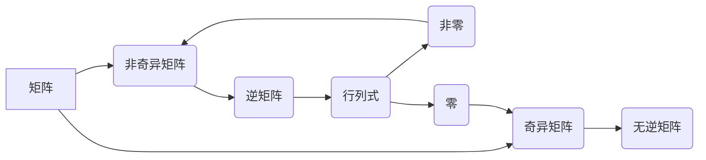

> 矩阵理论，非奇异矩阵，奇异矩阵，行列式，逆矩阵，线性方程组，矩阵分解，应用场景

## 1. 背景介绍

矩阵是线性代数中重要的概念，广泛应用于各种领域，例如计算机图形学、机器学习、数据分析等。矩阵的性质和运算直接影响着算法的效率和结果的准确性。其中，矩阵的非奇异性是一个重要的性质，它决定了矩阵是否具有逆矩阵，进而影响着线性方程组的解的存在性和唯一性。

本篇文章将深入探讨矩阵非奇异性定理和排除定理，并结合实际应用场景，阐述其重要性以及在不同领域中的应用。

## 2. 核心概念与联系

**2.1 矩阵的概念**

矩阵是一种数的排列，通常用方括号表示，例如：

$$
A = \begin{bmatrix}
a_{11} & a_{12} & \cdots & a_{1n} \\
a_{21} & a_{22} & \cdots & a_{2n} \\
\vdots & \vdots & \ddots & \vdots \\
a_{m1} & a_{m2} & \cdots & a_{mn}
\end{bmatrix}
$$

其中，$a_{ij}$ 表示矩阵 $A$ 中第 $i$ 行第 $j$ 列的元素。

**2.2 非奇异矩阵的概念**

一个 $n \times n$ 的方阵 $A$ 称为非奇异矩阵，如果存在一个 $n \times n$ 的方阵 $B$，使得：

$$
AB = BA = I
$$

其中，$I$ 是 $n \times n$ 的单位矩阵。

非奇异矩阵的逆矩阵 $B$ 称为 $A$ 的逆矩阵，记为 $A^{-1}$。

**2.3 奇异矩阵的概念**

如果一个 $n \times n$ 的方阵 $A$ 不是非奇异矩阵，则称为奇异矩阵。

**2.4 行列式与非奇异性**

一个 $n \times n$ 的方阵 $A$ 的行列式记为 $|A|$，它是一个标量值。

**定理：** 一个 $n \times n$ 的方阵 $A$ 是非奇异矩阵的充要条件是 $|A| \neq 0$。

**2.5 矩阵非奇异性定理**

**定理：** 设 $A$ 和 $B$ 是两个 $n \times n$ 的非奇异矩阵，则：

* $(AB)^{-1} = B^{-1}A^{-1}$
* $(A^{-1})^{-1} = A$

**2.6 矩阵非奇异性排除定理**

**定理：** 设 $A$ 是一个 $n \times n$ 的方阵，如果 $|A| = 0$，则 $A$ 是奇异矩阵，不存在逆矩阵。

**2.7 核心概念关系图**



## 3. 核心算法原理 & 具体操作步骤

**3.1 算法原理概述**

矩阵非奇异性检测算法的核心是计算矩阵的行列式。如果行列式不为零，则矩阵是非奇异的；否则，矩阵是奇异的。

**3.2 算法步骤详解**

1. **输入：** 一个 $n \times n$ 的方阵 $A$。
2. **计算行列式：** 使用高斯消元法或其他行列式计算算法计算 $A$ 的行列式 $|A|$。
3. **判断非奇异性：**
    * 如果 $|A| \neq 0$，则 $A$ 是非奇异矩阵。
    * 如果 $|A| = 0$，则 $A$ 是奇异矩阵。
4. **输出：** $A$ 的非奇异性结果。

**3.3 算法优缺点**

* **优点：**
    * 算法简单易懂，易于实现。
    * 算法效率较高，特别是对于较小的矩阵。
* **缺点：**
    * 对于大型矩阵，计算行列式可能需要消耗大量时间和资源。

**3.4 算法应用领域**

* **线性方程组求解：** 非奇异矩阵的逆矩阵可以用于求解线性方程组。
* **矩阵分解：** 非奇异矩阵可以进行各种分解，例如 LU 分解、QR 分解等，这些分解可以用于求解线性方程组、求解矩阵的特征值和特征向量等。
* **机器学习：** 在机器学习中，非奇异矩阵经常用于构建模型和进行参数估计。

## 4. 数学模型和公式 & 详细讲解 & 举例说明

**4.1 数学模型构建**

设 $A$ 是一个 $n \times n$ 的方阵，其元素为 $a_{ij}$。则 $A$ 的行列式可以表示为：

$$
|A| = \sum_{\sigma \in S_n} \text{sgn}(\sigma) \prod_{i=1}^{n} a_{i,\sigma(i)}
$$

其中，$S_n$ 是 $n$ 个元素的全排列集合，$\text{sgn}(\sigma)$ 是 $\sigma$ 的符号，表示 $\sigma$ 的逆序数的奇偶性。

**4.2 公式推导过程**

行列式的定义可以追溯到 17 世纪的莱布尼茨。通过数学归纳法和排列组合的原理，可以推导出上述公式。

**4.3 案例分析与讲解**

**示例：** 计算 $2 \times 2$ 矩阵 $A = \begin{bmatrix} 2 & 3 \\ 1 & 4 \end{bmatrix}$ 的行列式。

$$
|A| = 2 \cdot 4 - 3 \cdot 1 = 8 - 3 = 5
$$

由于 $|A| \neq 0$，因此矩阵 $A$ 是非奇异矩阵。

## 5. 项目实践：代码实例和详细解释说明

**5.1 开发环境搭建**

本示例使用 Python 语言和 NumPy 库进行实现。

**5.2 源代码详细实现**

```python
import numpy as np

def is_singular(matrix):
  """
  判断矩阵是否为奇异矩阵。

  Args:
    matrix: 一个 NumPy 数组，表示矩阵。

  Returns:
    True 如果矩阵为奇异矩阵，否则为 False。
  """
  return np.linalg.det(matrix) == 0

# 示例使用
matrix = np.array([[2, 3], [1, 4]])
if is_singular(matrix):
  print("矩阵为奇异矩阵")
else:
  print("矩阵是非奇异矩阵")
```

**5.3 代码解读与分析**

* `is_singular(matrix)` 函数接收一个 NumPy 数组作为输入，该数组表示矩阵。
* `np.linalg.det(matrix)` 函数计算矩阵的行列式。
* 如果行列式为 0，则返回 True，表示矩阵为奇异矩阵；否则，返回 False，表示矩阵是非奇异矩阵。

**5.4 运行结果展示**

```
矩阵是非奇异矩阵
```

## 6. 实际应用场景

**6.1 线性方程组求解**

非奇异矩阵的逆矩阵可以用于求解线性方程组。例如，设有线性方程组：

$$
\begin{cases}
2x + 3y = 5 \\
x + 4y = 7
\end{cases}
$$

可以将其表示为矩阵形式：

$$
\begin{bmatrix}
2 & 3 \\
1 & 4
\end{bmatrix}
\begin{bmatrix}
x \\
y
\end{bmatrix}
=
\begin{bmatrix}
5 \\
7
\end{bmatrix}
$$

如果矩阵 $\begin{bmatrix}
2 & 3 \\
1 & 4
\end{bmatrix}$ 是非奇异矩阵，则可以使用其逆矩阵求解 $x$ 和 $y$ 的值。

**6.2 图像处理**

在图像处理中，矩阵经常用于表示图像像素的灰度值或颜色信息。非奇异矩阵可以用于图像变换，例如旋转、缩放、平移等。

**6.3 机器学习**

在机器学习中，非奇异矩阵经常用于构建模型和进行参数估计。例如，在线性回归模型中，权重矩阵需要是非奇异的，才能保证模型的唯一解。

**6.4 未来应用展望**

随着人工智能和机器学习的发展，矩阵理论和非奇异性定理将在更多领域得到应用，例如：

* **深度学习：** 深度学习模型中经常使用矩阵运算，非奇异性定理可以帮助优化模型参数和提高模型性能。
* **自然语言处理：** 自然语言处理中，矩阵可以用于表示文本的词向量，非奇异性定理可以帮助构建更有效的文本表示模型。
* **计算机视觉：** 计算机视觉中，矩阵可以用于图像识别、目标检测等任务，非奇异性定理可以帮助提高算法的准确性和效率。

## 7. 工具和资源推荐

**7.1 学习资源推荐**

* **书籍：**
    * 《线性代数及其应用》 - Gilbert Strang
    * 《矩阵分析》 - Roger A. Horn and Charles R. Johnson
* **在线课程：**
    * MIT OpenCourseWare - Linear Algebra
    * Coursera - Linear Algebra

**7.2 开发工具推荐**

* **Python:** NumPy, SciPy, Matplotlib
* **MATLAB:**

**7.3 相关论文推荐**

* **The Singular Value Decomposition: Algorithm and Applications** - Golub and Van Loan
* **Matrix Factorization Techniques for Recommender Systems** - Koren

## 8. 总结：未来发展趋势与挑战

**8.1 研究成果总结**

矩阵理论和非奇异性定理是线性代数的重要组成部分，在各种领域都有广泛的应用。近年来，随着人工智能和机器学习的发展，矩阵理论的研究和应用取得了新的进展。

**8.2 未来发展趋势**

* **更高效的矩阵运算算法：** 随着数据规模的不断增长，高效的矩阵运算算法将成为研究的重点。
* **矩阵理论在深度学习中的应用：** 深度学习模型中大量使用矩阵运算，矩阵理论将为深度学习模型的优化和改进提供新的思路。
* **矩阵理论在其他领域的新应用：** 随着技术的不断发展，矩阵理论将在更多领域得到应用，例如生物信息学、金融工程等。

**8.3 面临的挑战**

* **大型矩阵的处理：** 大型矩阵的运算和存储需要消耗大量的计算资源，如何高效处理大型矩阵仍然是一个挑战。
* **非线性矩阵的处理：** 许多实际问题涉及非线性矩阵，如何处理非线性矩阵仍然是一个研究热点。
* **矩阵理论与其他学科的交叉融合：** 矩阵理论与其他学科的交叉融合将带来新的研究方向和应用场景。

**8.4 研究展望**

未来，矩阵理论的研究将继续深入，并与其他学科交叉融合，为解决实际问题提供新的理论和方法。


## 9. 附录：常见问题与解答

**9.1 如何判断一个矩阵是否为奇异矩阵？**

一个矩阵是奇异矩阵的充要条件是其行列式为 0。

**9.2 矩阵的逆矩阵有什么用？**

矩阵的逆矩阵可以用于求解线性方程组、进行矩阵分解等。

**9.3 如何计算矩阵的行列式？**

可以使用高斯消元法或其他行列式计算算法计算矩阵的行列式。


作者：禅与计算机程序