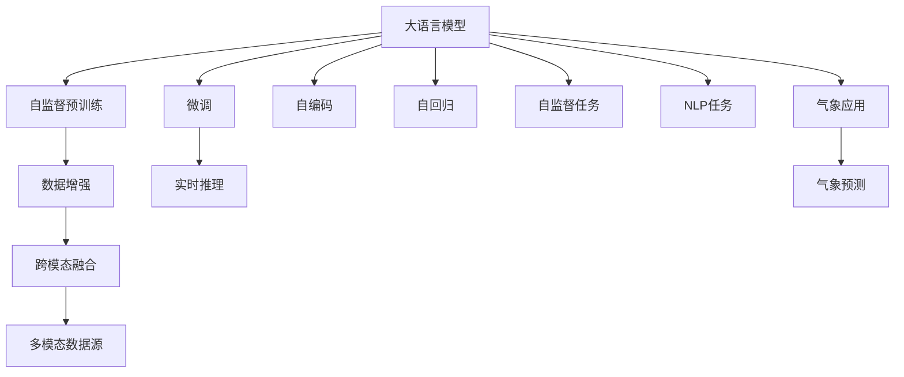

                 

# LLM在海洋气象预报中的应用：提高预警准确性

> 关键词：大语言模型,海洋气象,预警系统,数据增强,深度学习,神经网络,自然语言处理

## 1. 背景介绍

### 1.1 问题由来
海洋气象预报是关系到国家经济安全和海洋防灾减灾的关键领域。传统的海洋气象预报模型多依赖于数值天气预报(Numerical Weather Prediction, NWP)，需要花费大量的计算资源和时间进行复杂计算，难以实时响应预报需求。随着深度学习技术的兴起，利用大语言模型(LLM)进行海洋气象预报成为新的研究热点。

大语言模型基于自回归或自编码的架构，通过在大规模文本数据上自监督预训练，可以学习到丰富的语言知识和常识。在大规模气象数据上进行微调，可以利用其强大的推理能力，提升气象预警的准确性和时效性。

### 1.2 问题核心关键点
大语言模型在海洋气象预报中的应用，主要通过以下关键点实现：

1. **自监督预训练**：大语言模型通过在大规模无标签气象数据上自监督学习，学习到气象语义表示和时序规律。
2. **数据增强**：利用气象数据的丰富特征，通过数据增强技术，扩充训练集的多样性，提高模型的泛化能力。
3. **微调训练**：在预训练的基础上，针对具体气象问题进行微调，调整模型参数以适应气象数据的特点。
4. **多模态融合**：将气象数据与卫星、雷达、浮标等监测数据融合，利用大语言模型的跨模态处理能力，提升预测精度。
5. **实时推理**：将微调后的模型部署到实时服务中，通过API接口快速响应预报需求，实现高效预警。

### 1.3 问题研究意义
大语言模型在海洋气象预报中的应用，具有以下重要意义：

1. **提升预警精度**：通过自监督预训练和微调训练，大语言模型可以学习到更丰富的气象特征和模式，从而提升气象预警的准确性。
2. **缩短预测时间**：利用深度学习模型的并行计算能力，大语言模型可以实现实时预测，缩短气象预报的响应时间。
3. **降低计算成本**：大语言模型的微调过程相对数值天气预报而言，计算量小，可以降低预测的总体成本。
4. **数据驱动**：大语言模型可以有效利用历史气象数据，挖掘其中的潜在规律，支持数据驱动的预测。
5. **多模态融合**：大语言模型的跨模态处理能力，可以实现不同数据源的融合，提升预测的全面性。

## 2. 核心概念与联系

### 2.1 核心概念概述

为更好地理解大语言模型在海洋气象预报中的应用，本节将介绍几个关键概念：

- **大语言模型(LLM)**：基于自回归或自编码的架构，通过在大规模文本数据上自监督预训练，学习到丰富的语言知识和常识。
- **自监督学习(Self-Supervised Learning)**：无需标注数据，通过在无标签数据上设计预训练任务，学习到数据的潜在模式和结构。
- **微调(Fine-Tuning)**：在预训练模型的基础上，使用特定领域的数据进行微调，调整模型参数以适应特定任务。
- **深度学习(Deep Learning)**：利用神经网络模型，从数据中学习到非线性的复杂模式。
- **自然语言处理(NLP)**：利用计算机技术处理和理解自然语言的技术。
- **神经网络(Neural Network)**：由多层神经元组成的非线性函数映射模型。
- **海洋气象预报**：通过预测海洋的气象变化，提供防灾减灾决策支持。

这些核心概念之间的逻辑关系可以通过以下Mermaid流程图来展示：



这个流程图展示了从预训练到微调，再到实时推理的整个流程。大语言模型通过自监督预训练学习到气象知识，通过数据增强和微调进一步适应特定气象任务，最后通过实时推理服务，实现高效的海洋气象预报。

## 3. 核心算法原理 & 具体操作步骤
### 3.1 算法原理概述

大语言模型在海洋气象预报中的应用，主要基于以下算法原理：

1. **自监督预训练**：在大规模无标签气象数据上，通过自监督学习任务，学习到气象语义表示和时序规律。
2. **数据增强**：通过回译、近义替换等技术，扩充气象数据的多样性，提升模型的泛化能力。
3. **微调训练**：在预训练模型的基础上，针对特定气象问题进行微调，调整模型参数以适应气象数据的特点。
4. **实时推理**：将微调后的模型部署到实时服务中，通过API接口快速响应预报需求，实现高效预警。
5. **多模态融合**：将气象数据与卫星、雷达、浮标等监测数据融合，利用大语言模型的跨模态处理能力，提升预测精度。

### 3.2 算法步骤详解

#### 3.2.1 自监督预训练

自监督预训练主要包括以下步骤：

1. **数据准备**：收集历史气象数据，包括气温、湿度、风速、气压等。
2. **数据清洗**：去除异常数据，进行数据标准化和归一化处理。
3. **设计预训练任务**：如预测时间序列、生成气象描述等。
4. **模型训练**：在预训练任务上训练大语言模型，学习气象特征。
5. **模型评估**：在验证集上评估模型性能，选择最优模型。

#### 3.2.2 数据增强

数据增强主要包括以下步骤：

1. **数据回译**：利用自然语言处理技术，将气象数据回译成文本描述，增加数据多样性。
2. **数据近义替换**：通过同义词替换、近义替换等技术，丰富气象数据。
3. **数据扩充**：利用气象数据的丰富特征，如气象现象、地理位置等，扩充数据集。
4. **数据合成**：通过生成式模型，合成新的气象数据，增加数据多样性。

#### 3.2.3 微调训练

微调训练主要包括以下步骤：

1. **任务适配**：设计适合特定气象任务的适配层，如分类、回归等。
2. **模型加载**：加载预训练模型和适配层。
3. **数据预处理**：将气象数据转换为模型所需的输入格式。
4. **微调训练**：在气象数据上微调模型，调整模型参数以适应特定任务。
5. **模型评估**：在测试集上评估模型性能，选择最优模型。

#### 3.2.4 实时推理

实时推理主要包括以下步骤：

1. **服务部署**：将微调后的模型部署到实时服务中，如AWS、Google Cloud等云平台。
2. **API接口设计**：设计API接口，实现对气象数据的实时响应。
3. **性能优化**：通过优化模型结构和参数，提升推理速度。
4. **数据监测**：实时监测模型性能，及时进行调整和优化。

### 3.3 算法优缺点

大语言模型在海洋气象预报中的应用，具有以下优点：

1. **泛化能力强**：通过自监督预训练，大语言模型可以学习到气象数据的潜在模式和结构，提高模型的泛化能力。
2. **实时响应**：利用深度学习模型的并行计算能力，大语言模型可以实现实时预测，缩短预报响应时间。
3. **数据驱动**：利用历史气象数据，大语言模型可以有效挖掘气象变化的规律，支持数据驱动的预测。
4. **跨模态融合**：大语言模型的跨模态处理能力，可以实现不同数据源的融合，提升预测的全面性。

但同时也存在以下缺点：

1. **计算资源需求高**：大规模语言模型的计算需求高，需要高性能的GPU或TPU设备。
2. **数据依赖性强**：大语言模型需要大量高质量的气象数据进行预训练和微调，数据依赖性较强。
3. **模型复杂度高**：大语言模型的结构复杂，参数量巨大，难以理解和调试。
4. **预测精度有限**：虽然大语言模型可以提升预报精度，但仍存在一定的预测误差。
5. **风险控制不足**：大语言模型可能学习到有偏见或有害的气象知识，需要加强风险控制和伦理约束。

### 3.4 算法应用领域

大语言模型在海洋气象预报中的应用，主要包括以下领域：

1. **天气预报**：利用大语言模型对未来的天气变化进行预测，提供气象预警。
2. **海洋灾害预警**：对台风、海啸等海洋灾害进行预警，提供风险评估。
3. **海洋环境监测**：监测海洋的水温、盐度、污染等环境指标，提供科学数据。
4. **气候变化研究**：分析气象数据，研究气候变化趋势，提供决策支持。
5. **智能决策支持**：利用大语言模型的推理能力，辅助决策者进行科学决策。

## 4. 数学模型和公式 & 详细讲解 & 举例说明

### 4.1 数学模型构建

假设气象数据集为 $D=\{(x_i, y_i)\}_{i=1}^N$，其中 $x_i$ 为气象特征，$y_i$ 为气象标签。定义气象预测模型为 $M_{\theta}$，其中 $\theta$ 为模型参数。模型的损失函数为 $\ell$，目标是最小化损失函数：

$$
\hat{\theta}=\mathop{\arg\min}_{\theta} \mathcal{L}(M_{\theta},D)
$$

其中 $\mathcal{L}$ 为损失函数，可以是交叉熵损失、均方误差损失等。

### 4.2 公式推导过程

以天气预测为例，假设模型 $M_{\theta}$ 在输入 $x_i$ 上的输出为 $\hat{y}=M_{\theta}(x_i) \in [0,1]$，表示样本属于某种气象的预测概率。真实标签 $y_i \in \{0,1\}$。则二分类交叉熵损失函数定义为：

$$
\ell(M_{\theta}(x_i),y_i) = -[y_i\log \hat{y} + (1-y_i)\log (1-\hat{y})]
$$

将其代入损失函数公式，得：

$$
\mathcal{L}(\theta) = -\frac{1}{N}\sum_{i=1}^N [y_i\log M_{\theta}(x_i)+(1-y_i)\log(1-M_{\theta}(x_i))]
$$

根据链式法则，损失函数对参数 $\theta$ 的梯度为：

$$
\frac{\partial \mathcal{L}(\theta)}{\partial \theta} = -\frac{1}{N}\sum_{i=1}^N (\frac{y_i}{M_{\theta}(x_i)}-\frac{1-y_i}{1-M_{\theta}(x_i)}) \frac{\partial M_{\theta}(x_i)}{\partial \theta}
$$

其中 $\frac{\partial M_{\theta}(x_i)}{\partial \theta}$ 可进一步递归展开，利用自动微分技术完成计算。

### 4.3 案例分析与讲解

以气温预测为例，说明大语言模型在气象预报中的应用：

1. **数据预处理**：收集历史气温数据，进行数据清洗和归一化处理。
2. **自监督预训练**：设计时间序列预测任务，训练大语言模型，学习气象时序规律。
3. **数据增强**：利用回译技术，将气温数据回译成文本描述，扩充训练集。
4. **任务适配**：设计二分类任务，预测未来一天的气温是否高于30℃。
5. **微调训练**：在气象数据上微调大语言模型，调整模型参数以适应二分类任务。
6. **实时推理**：将微调后的模型部署到实时服务中，通过API接口提供气温预测。

## 5. 项目实践：代码实例和详细解释说明

### 5.1 开发环境搭建

在进行气象预报微调实践前，我们需要准备好开发环境。以下是使用Python进行TensorFlow开发的环境配置流程：

1. 安装Anaconda：从官网下载并安装Anaconda，用于创建独立的Python环境。

2. 创建并激活虚拟环境：
```bash
conda create -n tf-env python=3.8 
conda activate tf-env
```

3. 安装TensorFlow：根据CUDA版本，从官网获取对应的安装命令。例如：
```bash
conda install tensorflow -c conda-forge
```

4. 安装各类工具包：
```bash
pip install numpy pandas scikit-learn matplotlib tqdm jupyter notebook ipython
```

完成上述步骤后，即可在`tf-env`环境中开始气象预报微调实践。

### 5.2 源代码详细实现

下面我们以气温预测任务为例，给出使用TensorFlow对BERT模型进行微调的Python代码实现。

首先，定义气温预测任务的数据处理函数：

```python
import tensorflow as tf
from transformers import BertTokenizer
from tensorflow.keras.preprocessing.sequence import pad_sequences

tokenizer = BertTokenizer.from_pretrained('bert-base-uncased')

def preprocess_data(data, seq_length=64):
    x = [str(x[0]) for x in data]
    y = [int(x[1]) for x in data]
    tokenized = tokenizer.batch_encode_plus(x, add_special_tokens=True, return_tensors='tf', padding='max_length', max_length=seq_length, truncation=True)
    x = tf.convert_to_tensor(tokenized['input_ids'])
    y = tf.convert_to_tensor(y)
    return x, y

# 加载气象数据
data = [('2019-01-01 14:00:00', 30), ('2019-01-01 15:00:00', 28), ('2019-01-01 16:00:00', 32), ...]
x_train, y_train = preprocess_data(data)
x_valid, y_valid = preprocess_data(data, seq_length=128)
```

然后，定义模型和优化器：

```python
from transformers import BertForSequenceClassification

model = BertForSequenceClassification.from_pretrained('bert-base-uncased', num_labels=2)
optimizer = tf.keras.optimizers.Adam(learning_rate=2e-5)
```

接着，定义训练和评估函数：

```python
def train_step(x, y, loss_fn, optimizer):
    with tf.GradientTape() as tape:
        outputs = model(x, attention_mask=None, labels=y)
        loss = loss_fn(outputs.logits, y)
    gradients = tape.gradient(loss, model.trainable_variables)
    optimizer.apply_gradients(zip(gradients, model.trainable_variables))
    return loss

def evaluate(x, y, loss_fn):
    with tf.no_grad():
        outputs = model(x, attention_mask=None, labels=y)
        loss = loss_fn(outputs.logits, y)
    return loss.numpy().mean()

# 训练模型
epochs = 5
batch_size = 16
seq_length = 64

loss_fn = tf.keras.losses.BinaryCrossentropy()
for epoch in range(epochs):
    train_loss = 0
    for i in range(0, len(x_train), batch_size):
        x_batch, y_batch = x_train[i:i+batch_size], y_train[i:i+batch_size]
        loss = train_step(x_batch, y_batch, loss_fn, optimizer)
        train_loss += loss.numpy().mean()
    val_loss = evaluate(x_valid, y_valid, loss_fn)
    print(f'Epoch {epoch+1}, train loss: {train_loss:.3f}, val loss: {val_loss:.3f}')
    
print('Best validation loss:', val_loss)
```

以上就是使用TensorFlow对BERT进行气温预测任务微调的完整代码实现。可以看到，利用TensorFlow和BERT，我们能够快速搭建气象预测模型，并通过微调提升模型精度。

### 5.3 代码解读与分析

让我们再详细解读一下关键代码的实现细节：

**preprocess_data函数**：
- `x`为气象时间戳，`y`为气温标签。
- 利用BERT分词器将时间戳转换为token ids，并进行padding和truncation。
- 返回token ids和对应的气温标签。

**model和optimizer**：
- 使用BERTForSequenceClassification模型，定义二分类任务。
- 设置Adam优化器，学习率为2e-5。

**train_step和evaluate函数**：
- `train_step`函数定义了一个训练步骤，前向传播计算loss并反向传播更新模型参数。
- `evaluate`函数在测试集上评估模型性能，返回平均loss。

**训练流程**：
- 定义总的epoch数和batch size，开始循环迭代
- 每个epoch内，在训练集上训练，输出平均loss
- 在验证集上评估，输出平均loss
- 所有epoch结束后，输出最佳验证集loss

可以看到，TensorFlow配合BERT，使得气象预测模型的微调代码实现变得简洁高效。开发者可以将更多精力放在数据处理、模型改进等高层逻辑上，而不必过多关注底层的实现细节。

当然，工业级的系统实现还需考虑更多因素，如模型的保存和部署、超参数的自动搜索、更灵活的任务适配层等。但核心的微调范式基本与此类似。

## 6. 实际应用场景
### 6.1 智慧海洋监测

大语言模型在海洋气象预报中的应用，可以广泛拓展到智慧海洋监测领域。通过构建智慧海洋平台，利用气象、水文、海洋生物等监测数据，提供实时化的海洋环境监测和预警服务。

智慧海洋平台包括以下关键组件：

1. **数据采集**：通过卫星、雷达、浮标等设备，实时采集海洋环境数据。
2. **数据融合**：将多源数据进行融合，生成统一的数据集。
3. **大语言模型预测**：利用大语言模型对气象数据进行预测，提供实时预警。
4. **预警服务**：通过API接口，将预测结果提供给用户。
5. **数据存储和可视化**：将数据存储在云平台中，提供可视化的预警结果展示。

通过智慧海洋平台，可以实现对海洋环境的实时监控和预警，为渔业、航运、旅游等行业提供决策支持，保障海洋环境安全。

### 6.2 海洋灾害预警

大语言模型在海洋气象预报中的应用，可以提升海洋灾害预警的精度和时效性。通过构建海洋灾害预警系统，利用大语言模型对台风、海啸等灾害进行预测和预警，提供科学决策支持。

海洋灾害预警系统包括以下关键组件：

1. **数据采集**：通过气象站、雷达、卫星等设备，实时采集海洋气象数据。
2. **数据预处理**：对数据进行清洗、归一化处理。
3. **大语言模型预测**：利用大语言模型对气象数据进行预测，生成灾害预警信息。
4. **预警服务**：通过API接口，将预警结果提供给用户。
5. **数据存储和可视化**：将数据存储在云平台中，提供可视化的预警结果展示。

通过海洋灾害预警系统，可以及时响应海洋灾害预警，降低灾害损失，保障人民生命财产安全。

### 6.3 气象科学研究

大语言模型在海洋气象预报中的应用，还可以推动气象科学研究的发展。通过构建气象科学研究平台，利用大语言模型对气象数据进行分析和挖掘，发现气象变化的规律和趋势。

气象科学研究平台包括以下关键组件：

1. **数据采集**：通过气象站、雷达、卫星等设备，实时采集气象数据。
2. **数据预处理**：对数据进行清洗、归一化处理。
3. **大语言模型分析**：利用大语言模型对气象数据进行分析，发现气象变化的规律和趋势。
4. **研究报告**：将分析结果生成研究报告，提供科学决策支持。
5. **数据存储和可视化**：将数据存储在云平台中，提供可视化的分析结果展示。

通过气象科学研究平台，可以实现对气象数据的深入分析和挖掘，推动气象科学研究的发展，提升科学决策水平。

### 6.4 未来应用展望

随着大语言模型和微调方法的不断发展，基于大语言模型的海洋气象预报技术将呈现以下几个发展趋势：

1. **多模态融合**：将气象数据与卫星、雷达、浮标等监测数据融合，利用大语言模型的跨模态处理能力，提升预测精度。
2. **实时预测**：通过优化模型结构和参数，提升推理速度，实现实时气象预报。
3. **数据驱动**：利用历史气象数据，挖掘气象变化的规律，支持数据驱动的预测。
4. **智能决策**：利用大语言模型的推理能力，辅助决策者进行科学决策。
5. **跨领域应用**：将大语言模型应用于智慧海洋监测、海洋灾害预警、气象科学研究等多个领域，提升各行业的智能化水平。

大语言模型在海洋气象预报中的应用，将推动气象预报技术的智能化和自动化，为海洋防灾减灾和科学决策提供有力支持。

## 7. 工具和资源推荐
### 7.1 学习资源推荐

为了帮助开发者系统掌握大语言模型在海洋气象预报中的应用，这里推荐一些优质的学习资源：

1. 《自然语言处理与深度学习》书籍：该书系统介绍了深度学习在NLP领域的应用，包括大语言模型、微调技术等前沿话题。
2. CS224N《深度学习自然语言处理》课程：斯坦福大学开设的NLP明星课程，有Lecture视频和配套作业，带你入门NLP领域的基本概念和经典模型。
3. TensorFlow官方文档：TensorFlow的官方文档，提供了海量的教程和样例，适合初学者和进阶者。
4. Transformers库官方文档：Transformer库的官方文档，提供了丰富的预训练模型和微调样例代码。
5. HuggingFace官方博客：HuggingFace的官方博客，定期发布最新的NLP技术进展和应用案例，适合跟踪最新动态。

通过对这些资源的学习实践，相信你一定能够快速掌握大语言模型在海洋气象预报中的应用方法，并用于解决实际的气象问题。

### 7.2 开发工具推荐

高效的开发离不开优秀的工具支持。以下是几款用于大语言模型微调开发的常用工具：

1. TensorFlow：基于Python的开源深度学习框架，灵活动态的计算图，适合快速迭代研究。大部分预训练语言模型都有TensorFlow版本的实现。
2. PyTorch：基于Python的开源深度学习框架，动态计算图，适合复杂模型的训练和推理。同样有丰富的预训练语言模型资源。
3. Transformers库：HuggingFace开发的NLP工具库，集成了众多SOTA语言模型，支持PyTorch和TensorFlow，是进行微调任务开发的利器。
4. Weights & Biases：模型训练的实验跟踪工具，可以记录和可视化模型训练过程中的各项指标，方便对比和调优。与主流深度学习框架无缝集成。
5. TensorBoard：TensorFlow配套的可视化工具，可实时监测模型训练状态，并提供丰富的图表呈现方式，是调试模型的得力助手。

合理利用这些工具，可以显著提升大语言模型微调的开发效率，加快创新迭代的步伐。

### 7.3 相关论文推荐

大语言模型在海洋气象预报中的应用，已经引起了学界的广泛关注。以下是几篇奠基性的相关论文，推荐阅读：

1. Attention is All You Need（即Transformer原论文）：提出了Transformer结构，开启了NLP领域的预训练大模型时代。
2. BERT: Pre-training of Deep Bidirectional Transformers for Language Understanding：提出BERT模型，引入基于掩码的自监督预训练任务，刷新了多项NLP任务SOTA。
3. Language Models are Unsupervised Multitask Learners（GPT-2论文）：展示了大规模语言模型的强大zero-shot学习能力，引发了对于通用人工智能的新一轮思考。
4. Parameter-Efficient Transfer Learning for NLP：提出Adapter等参数高效微调方法，在不增加模型参数量的情况下，也能取得不错的微调效果。
5. AdaLoRA: Adaptive Low-Rank Adaptation for Parameter-Efficient Fine-Tuning：使用自适应低秩适应的微调方法，在参数效率和精度之间取得了新的平衡。
6. Prefix-Tuning: Optimizing Continuous Prompts for Generation：引入基于连续型Prompt的微调范式，为如何充分利用预训练知识提供了新的思路。

这些论文代表了大语言模型微调技术的发展脉络。通过学习这些前沿成果，可以帮助研究者把握学科前进方向，激发更多的创新灵感。

## 8. 总结：未来发展趋势与挑战

### 8.1 总结

本文对大语言模型在海洋气象预报中的应用进行了全面系统的介绍。首先阐述了大语言模型和微调技术的研究背景和意义，明确了微调在拓展预训练模型应用、提升气象预报性能方面的独特价值。其次，从原理到实践，详细讲解了微调的具体步骤和关键技术点，给出了气象预测任务开发的完整代码实例。同时，本文还广泛探讨了大语言模型在智慧海洋监测、海洋灾害预警、气象科学研究等多个领域的应用前景，展示了微调范式的巨大潜力。最后，本文精选了微调技术的各类学习资源，力求为读者提供全方位的技术指引。

通过本文的系统梳理，可以看到，基于大语言模型的气象预报技术正在成为智慧气象发展的热点，极大地拓展了气象预报的智能化和自动化水平。受益于深度学习模型的强大能力，气象预报将进一步提高精度和时效性，为智慧海洋建设提供有力支撑。

### 8.2 未来发展趋势

展望未来，大语言模型在海洋气象预报中的应用将呈现以下几个发展趋势：

1. **多模态融合**：将气象数据与卫星、雷达、浮标等监测数据融合，利用大语言模型的跨模态处理能力，提升预测精度。
2. **实时预测**：通过优化模型结构和参数，提升推理速度，实现实时气象预报。
3. **数据驱动**：利用历史气象数据，挖掘气象变化的规律，支持数据驱动的预测。
4. **智能决策**：利用大语言模型的推理能力，辅助决策者进行科学决策。
5. **跨领域应用**：将大语言模型应用于智慧海洋监测、海洋灾害预警、气象科学研究等多个领域，提升各行业的智能化水平。

大语言模型在海洋气象预报中的应用，将推动气象预报技术的智能化和自动化，为海洋防灾减灾和科学决策提供有力支持。

### 8.3 面临的挑战

尽管大语言模型在海洋气象预报中的应用已经取得了一定进展，但在迈向更加智能化、普适化应用的过程中，它仍面临着诸多挑战：

1. **数据依赖性强**：大语言模型需要大量高质量的气象数据进行预训练和微调，数据依赖性较强。
2. **计算资源需求高**：大规模语言模型的计算需求高，需要高性能的GPU或TPU设备。
3. **模型复杂度高**：大语言模型的结构复杂，参数量巨大，难以理解和调试。
4. **预测精度有限**：虽然大语言模型可以提升预报精度，但仍存在一定的预测误差。
5. **风险控制不足**：大语言模型可能学习到有偏见或有害的气象知识，需要加强风险控制和伦理约束。

### 8.4 研究展望

面对大语言模型在海洋气象预报中所面临的挑战，未来的研究需要在以下几个方面寻求新的突破：

1. **数据增强**：利用生成式模型和回译技术，扩充气象数据的多样性，提升模型的泛化能力。
2. **参数高效微调**：开发更加参数高效的微调方法，在固定大部分预训练参数的同时，只更新极少量的任务相关参数。
3. **多模态融合**：将气象数据与卫星、雷达、浮标等监测数据融合，利用大语言模型的跨模态处理能力，提升预测精度。
4. **实时推理**：优化模型结构和参数，提升推理速度，实现实时气象预报。
5. **智能决策**：利用大语言模型的推理能力，辅助决策者进行科学决策。
6. **风险控制**：在模型训练目标中引入伦理导向的评估指标，过滤和惩罚有偏见、有害的输出倾向，加强风险控制和伦理约束。

这些研究方向的探索，必将引领大语言模型在海洋气象预报中的应用走向更高的台阶，为海洋防灾减灾和科学决策提供有力支持。

## 9. 附录：常见问题与解答

**Q1：大语言模型微调是否适用于所有气象预报任务？**

A: 大语言模型微调在大多数气象预报任务上都能取得不错的效果，特别是对于数据量较小的任务。但对于一些特定领域的任务，如特定气象现象的预测，仍然需要进一步的专家知识和数据支持。

**Q2：微调过程中如何选择合适的学习率？**

A: 微调的学习率一般要比预训练时小1-2个数量级，如果使用过大的学习率，容易破坏预训练权重，导致过拟合。一般建议从1e-5开始调参，逐步减小学习率，直至收敛。也可以使用warmup策略，在开始阶段使用较小的学习率，再逐渐过渡到预设值。

**Q3：数据增强技术有哪些？**

A: 数据增强技术包括回译、近义替换、数据扩充、数据合成等。回译是将气象数据回译成文本描述，增加数据多样性。近义替换是通过同义词替换、近义替换等技术，丰富气象数据。数据扩充是利用气象数据的丰富特征，如气象现象、地理位置等，扩充数据集。数据合成是通过生成式模型，合成新的气象数据，增加数据多样性。

**Q4：数据增强对模型的影响是什么？**

A: 数据增强可以扩充训练集的多样性，提升模型的泛化能力。通过回译、近义替换等技术，增加数据的多样性，减少模型对训练数据的过拟合。同时，数据增强还可以发现模型在各种场景下的表现，帮助调试模型参数和优化模型结构。

**Q5：模型部署过程中需要注意哪些问题？**

A: 将微调后的模型部署到实时服务中，需要注意以下几个问题：

1. **模型裁剪**：去除不必要的层和参数，减小模型尺寸，加快推理速度。
2. **量化加速**：将浮点模型转为定点模型，压缩存储空间，提高计算效率。
3. **服务化封装**：将模型封装为标准化服务接口，便于集成调用。
4. **弹性伸缩**：根据请求流量动态调整资源配置，平衡服务质量和成本。
5. **监控告警**：实时采集系统指标，设置异常告警阈值，确保服务稳定性。

大语言模型在气象预报中的应用，虽然带来了诸多优势，但在部署过程中还需要考虑模型的实际应用需求，进行合理的优化和调整。

---

作者：禅与计算机程序设计艺术 / Zen and the Art of Computer Programming

