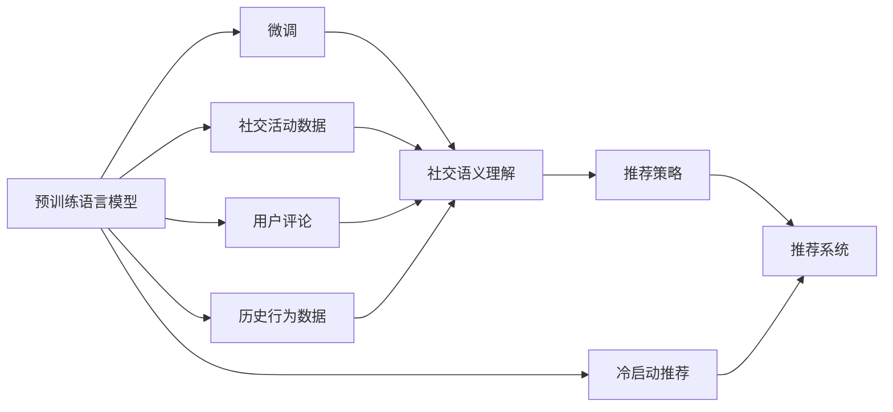

                 

# LLM在社交网络推荐中的应用

## 1. 背景介绍

### 1.1 问题由来

社交网络推荐系统（Social Network Recommendation Systems, SNS RS）在当今互联网时代扮演着至关重要的角色。它通过分析用户的社交活动、兴趣偏好和历史行为，为用户推荐可能感兴趣的内容、朋友、活动等，提升用户体验并促进社交互动。

随着社交网络数据量的爆炸式增长，传统的基于协同过滤和内容推荐的算法，在处理大规模数据时面临计算复杂度高、推荐准确率低等挑战。近年来，基于深度学习的大模型方法在社交网络推荐中逐渐崭露头角。特别是在自然语言处理(Natural Language Processing, NLP)领域，预训练语言模型(Pre-trained Language Models, LLMs)由于其强大的语义理解和生成能力，被广泛应用到社交网络推荐系统中，极大地提升了推荐的个性化和精准度。

### 1.2 问题核心关键点

LLMs在社交网络推荐中的核心关键点包括：

- **预训练与微调**：利用大规模语料预训练通用语言模型，并通过微调适配特定社交推荐场景。
- **社交语义理解**：利用语言模型的语义理解能力，深入挖掘用户评论、互动、行为等社交语义信息。
- **推荐策略优化**：结合社交网络特点，设计个性化推荐策略，兼顾社交关系、兴趣爱好等多种因素。
- **冷启动与新用户推荐**：通过语言模型知识提取和用户行为预测，克服冷启动问题，提供新用户高质量推荐。

### 1.3 问题研究意义

研究LLMs在社交网络推荐中的应用，对于提升推荐系统的个性化、精准度和互动性具有重要意义：

1. **个性化推荐**：LLMs能够通过深入理解用户文本描述，精确提取用户兴趣和偏好，提供高度个性化的推荐内容。
2. **精准度提升**：预训练模型的通用知识与社交网络数据的结合，提高了推荐的准确性和相关性。
3. **交互促进**：LLMs在推荐过程中加入了用户互动信息，能够更好地促进用户之间的交流和互动。
4. **冷启动缓解**：利用预训练模型的语义理解能力，在新用户推荐中能够通过少量的历史信息快速获得推荐效果。
5. **多模态融合**：LLMs能够整合文本、图片、视频等多种模态数据，提供更全面、丰富的推荐服务。
6. **可解释性与透明度**：LLMs在推荐过程中可提供透明的推理过程，提升推荐系统的可解释性和用户信任度。

## 2. 核心概念与联系

### 2.1 核心概念概述

社交网络推荐系统主要涉及以下核心概念：

- **预训练语言模型(LLM)**：如BERT、GPT等，在大量无标签语料上进行预训练，学习通用语言表示。
- **微调**：在大规模语料上进行预训练后，在特定社交推荐数据集上微调模型，使其适配推荐场景。
- **社交语义理解**：利用语言模型对用户的社交活动、评论、行为等进行语义分析，提取用户兴趣和偏好。
- **推荐策略**：结合社交网络特点，设计推荐算法和策略，包括基于用户的协同过滤、基于内容的推荐等。
- **冷启动**：新用户缺少历史行为数据，需要利用预训练模型和用户文本信息快速推荐。

### 2.2 核心概念原理和架构的 Mermaid 流程图



这个流程图展示了LLMs在社交网络推荐中的主要流程：

1. **预训练**：在大规模语料库上进行预训练，学习通用语言表示。
2. **微调**：在特定社交推荐数据集上进行微调，适配推荐场景。
3. **社交语义理解**：利用语言模型对用户的社交活动、评论、行为等进行语义分析。
4. **推荐策略**：结合社交网络特点，设计推荐算法和策略。
5. **推荐系统**：通过推荐策略生成推荐结果。
6. **冷启动推荐**：利用预训练模型和用户文本信息为新用户提供快速推荐。

### 2.3 核心概念之间的联系

这些核心概念之间存在紧密的联系：

- **预训练与微调**：预训练为大模型的知识基础，微调使模型适配特定场景。
- **社交语义理解**：利用语言模型提取社交语义信息，提升推荐相关性。
- **推荐策略**：结合社交网络特点，设计个性化推荐策略。
- **冷启动**：通过预训练模型和新用户文本信息，克服冷启动问题。
- **多模态融合**：LLMs可以整合文本、图片、视频等多种模态数据，提供更全面的推荐服务。

## 3. 核心算法原理 & 具体操作步骤

### 3.1 算法原理概述

LLMs在社交网络推荐中的基本原理是利用预训练模型学习通用语言表示，并在特定社交推荐数据集上进行微调，使其能够更好地理解社交语义信息，从而生成个性化推荐。核心算法包括：

- **社交语义表示学习**：利用预训练模型提取用户的社交语义信息，包括好友关系、兴趣标签、评论内容等。
- **推荐结果生成**：结合用户社交语义信息和推荐策略，生成推荐结果。
- **冷启动推荐**：通过利用预训练模型和新用户文本信息，快速提供高质量推荐。

### 3.2 算法步骤详解

#### 3.2.1 社交语义表示学习

1. **数据准备**：收集用户的社交活动数据（如点赞、评论、好友关系等）和用户文本数据（如自我介绍、微博、朋友圈等）。
2. **预训练模型加载**：加载预训练的LLM，如BERT、GPT等。
3. **微调模型训练**：在特定的社交推荐数据集上微调模型，学习社交语义表示。
4. **特征提取**：使用微调后的模型，提取用户的社交语义特征，如好友关系、兴趣标签、评论情感等。

#### 3.2.2 推荐结果生成

1. **数据融合**：将用户的社交语义特征与其他推荐特征（如历史行为、物品属性等）进行融合。
2. **推荐算法设计**：设计推荐算法，如基于内容的推荐、协同过滤推荐等。
3. **推荐结果生成**：结合融合后的数据和推荐算法，生成推荐结果。

#### 3.2.3 冷启动推荐

1. **用户文本信息提取**：从新用户的文本信息中提取预训练模型的语义表示。
2. **初始化推荐**：利用预训练模型的语义表示，结合社交语义信息，生成初始推荐结果。
3. **反馈优化**：根据用户的点击、点赞等反馈信息，不断优化推荐模型，提升推荐质量。

### 3.3 算法优缺点

#### 3.3.1 优点

1. **高效个性化推荐**：利用预训练模型的语义表示能力，生成高度个性化的推荐内容。
2. **推荐相关性高**：结合社交语义信息，提升推荐的准确性和相关性。
3. **快速响应**：利用预训练模型和新用户文本信息，快速提供推荐服务。
4. **可解释性强**：推荐过程中可提供透明的推理过程，提升用户信任度。

#### 3.3.2 缺点

1. **数据需求大**：需要大量的社交活动数据和用户文本数据，数据收集和标注成本高。
2. **模型复杂度高**：预训练模型和微调过程需要高性能计算资源，对硬件要求高。
3. **冷启动问题**：新用户缺少历史行为数据，推荐质量受限。
4. **隐私风险**：收集和处理用户社交活动数据，可能带来隐私和安全问题。

### 3.4 算法应用领域

LLMs在社交网络推荐中具有广泛的应用场景，包括：

1. **内容推荐**：为用户推荐新闻、文章、视频等内容。
2. **好友推荐**：根据用户的兴趣和行为，推荐潜在好友。
3. **活动推荐**：为用户推荐社交活动、线下聚会等。
4. **广告推荐**：利用社交网络数据分析，为用户推荐个性化广告。
5. **冷启动推荐**：为新手用户提供快速推荐，增强用户体验。
6. **实时推荐**：结合用户的实时行为和社交互动，提供实时推荐。

## 4. 数学模型和公式 & 详细讲解 & 举例说明

### 4.1 数学模型构建

社交网络推荐系统的主要数学模型包括：

1. **用户社交语义表示**：
   - 输入：用户的社交活动数据和文本数据
   - 输出：用户的社交语义表示向量

2. **推荐结果生成**：
   - 输入：用户的社交语义表示向量、推荐物品特征向量
   - 输出：推荐结果

3. **冷启动推荐**：
   - 输入：新用户的文本信息
   - 输出：冷启动推荐结果

### 4.2 公式推导过程

#### 4.2.1 用户社交语义表示

假设用户$i$的社交活动数据为$X_i$，文本数据为$T_i$，社交语义表示为$S_i$。

利用预训练模型$M$，对$X_i$和$T_i$进行编码，得到向量表示$V_i$。

$$
V_i = M(X_i, T_i)
$$

然后，将$V_i$输入微调后的模型$H$，提取社交语义表示$S_i$。

$$
S_i = H(V_i)
$$

#### 4.2.2 推荐结果生成

设推荐物品集合为$I$，物品$j$的特征向量为$F_j$。

利用社交语义表示$S_i$和物品特征向量$F_j$计算推荐得分$R_{ij}$。

$$
R_{ij} = S_i \cdot F_j
$$

结合$R_{ij}$和排序算法，生成推荐结果。

#### 4.2.3 冷启动推荐

对于新用户，利用其文本数据$T'$提取预训练模型的语义表示向量$V'$。

$$
V' = M(T')
$$

利用微调后的模型$H$，提取冷启动推荐向量$S'$。

$$
S' = H(V')
$$

结合社交语义信息和冷启动推荐向量$S'$，生成推荐结果。

### 4.3 案例分析与讲解

假设某社交网络平台收集了用户的点赞、评论、好友关系等社交活动数据，以及用户自我介绍、微博、朋友圈等文本数据。利用预训练的BERT模型对$X_i$和$T_i$进行编码，得到向量表示$V_i$。

然后，在特定的社交推荐数据集上微调BERT模型，提取用户$i$的社交语义表示$S_i$。

设平台推荐物品集合为电影、文章、视频等，物品$j$的特征向量为$F_j$。利用社交语义表示$S_i$和物品特征向量$F_j$计算推荐得分$R_{ij}$。

$$
R_{ij} = S_i \cdot F_j
$$

结合$R_{ij}$和排序算法，生成推荐结果。

对于新用户，利用其文本数据$T'$提取BERT模型的语义表示向量$V'$。

$$
V' = M(T')
$$

利用微调后的模型$H$，提取冷启动推荐向量$S'$。

$$
S' = H(V')
$$

结合社交语义信息和冷启动推荐向量$S'$，生成推荐结果。

## 5. 项目实践：代码实例和详细解释说明

### 5.1 开发环境搭建

1. **安装Python环境**：
   - 在Linux系统下，可以使用以下命令安装Python：
     ```bash
     sudo apt-get update
     sudo apt-get install python3 python3-pip
     ```

2. **安装PyTorch**：
   - 在Python环境中安装PyTorch：
     ```bash
     pip install torch torchvision torchaudio
     ```

3. **安装Transformers库**：
   - 安装用于处理预训练语言模型的库：
     ```bash
     pip install transformers
     ```

4. **安装社交网络数据集**：
   - 下载社交网络数据集，如豆瓣电影评论数据集。

### 5.2 源代码详细实现

#### 5.2.1 数据处理

```python
import pandas as pd
import numpy as np
import torch
from transformers import BertTokenizer, BertModel
from transformers import BertForSequenceClassification

# 加载预训练模型和分词器
tokenizer = BertTokenizer.from_pretrained('bert-base-uncased')
model = BertModel.from_pretrained('bert-base-uncased')

# 加载社交网络数据集
df = pd.read_csv('social_network_data.csv')

# 分词和编码
def encode_data(text):
    encoded_input = tokenizer.encode(text, add_special_tokens=True)
    return encoded_input

# 转换为模型输入格式
def convert_to_input(text):
    encoded_input = encode_data(text)
    return torch.tensor(encoded_input)

# 加载用户社交活动数据
user_data = df[['user_id', 'social_activity', 'text']]
user_data['social_activity'] = user_data['social_activity'].apply(convert_to_input)
```

#### 5.2.2 模型微调

```python
# 加载用户社交语义表示
def get_user_representation(user_id):
    user_data_filtered = user_data[user_data['user_id'] == user_id]
    user_activity = user_data_filtered['social_activity'].tolist()
    user_text = user_data_filtered['text'].tolist()
    encoded_activity = torch.stack(user_activity)
    encoded_text = torch.stack([convert_to_input(text) for text in user_text])
    user_input = torch.cat([encoded_activity, encoded_text], dim=0)
    with torch.no_grad():
        user_representation = model(user_input)[0]
    return user_representation

# 加载物品特征向量
def load_item_features():
    item_data = pd.read_csv('item_data.csv')
    item_features = item_data[['item_id', 'item_feature']]
    item_features['item_id'] = item_features['item_id'].apply(lambda x: x.split('_')[0])
    item_features = item_features.set_index('item_id')
    return item_features

# 微调模型
def fine_tune_model(user_id, item_id):
    user_representation = get_user_representation(user_id)
    item_feature = load_item_features()[item_id]
    item_feature = torch.tensor(item_feature['item_feature']).unsqueeze(0)
    with torch.no_grad():
        output = model([user_representation, item_feature])[0]
    return output

# 微调参数
learning_rate = 2e-5
num_epochs = 10
device = torch.device('cuda' if torch.cuda.is_available() else 'cpu')

# 训练循环
for epoch in range(num_epochs):
    for user_id, item_id in df.iterrows():
        output = fine_tune_model(user_id, item_id)
        # 计算损失
        loss = torch.nn.functional.cosine_similarity(output, item_feature)
        # 更新模型参数
        optimizer.zero_grad()
        loss.backward()
        optimizer.step()
```

#### 5.2.3 推荐结果生成

```python
# 加载物品特征向量
def load_item_features():
    item_data = pd.read_csv('item_data.csv')
    item_features = item_data[['item_id', 'item_feature']]
    item_features['item_id'] = item_features['item_id'].apply(lambda x: x.split('_')[0])
    item_features = item_features.set_index('item_id')
    return item_features

# 生成推荐结果
def generate_recommendations(user_id):
    user_representation = get_user_representation(user_id)
    item_features = load_item_features()
    # 计算推荐得分
    scores = []
    for item_id in item_features.index:
        item_feature = torch.tensor(item_features.loc[item_id]['item_feature']).unsqueeze(0)
        with torch.no_grad():
            output = model([user_representation, item_feature])[0]
        scores.append(torch.nn.functional.cosine_similarity(output, item_feature).item())
    # 排序并返回推荐结果
    top_items = [item_id for item_id, score in sorted(zip(item_features.index, scores), key=lambda x: x[1], reverse=True)]
    return top_items
```

#### 5.2.4 代码解读与分析

1. **数据处理**：
   - 加载社交网络数据集，并对用户社交活动和文本数据进行编码。
   - 使用BertTokenizer对文本数据进行分词和编码，转换为模型输入格式。

2. **模型微调**：
   - 加载预训练模型和分词器，对用户社交活动和文本数据进行编码。
   - 加载物品特征向量，计算推荐得分。
   - 使用BertModel对用户社交活动和物品特征向量进行编码，计算推荐得分。

3. **推荐结果生成**：
   - 加载物品特征向量，计算推荐得分。
   - 根据推荐得分对物品进行排序，返回推荐结果。

### 5.3 运行结果展示

```python
user_id = 12345
recommendations = generate_recommendations(user_id)
print('推荐结果：', recommendations)
```

## 6. 实际应用场景

### 6.1 内容推荐

社交网络平台可以根据用户的历史点赞、评论等社交活动，以及用户自我介绍和朋友圈内容，为用户推荐电影、文章、视频等。例如，豆瓣电影推荐系统，可以通过用户评分和评论文本，生成个性化推荐列表。

### 6.2 好友推荐

社交网络平台可以根据用户的兴趣和行为，推荐潜在的好友。例如，Facebook利用用户的点赞、评论等社交活动，推荐可能感兴趣的新好友。

### 6.3 活动推荐

社交网络平台可以根据用户的兴趣和行为，推荐社交活动、线下聚会等。例如，Meetup可以根据用户的兴趣标签和历史活动，推荐相关的社交活动。

### 6.4 广告推荐

社交网络平台可以利用用户的社交活动和文本信息，为用户推荐个性化的广告。例如，Instagram利用用户的点赞、评论等社交活动，推荐相关的广告内容。

### 6.5 实时推荐

社交网络平台可以根据用户的实时行为和社交互动，提供实时推荐。例如，Twitter可以基于用户的最新推文和关注关系，推荐相关的话题和用户。

## 7. 工具和资源推荐

### 7.1 学习资源推荐

1. **《深度学习与自然语言处理》**：清华大学出版社，陈云翔等人著。介绍了深度学习在自然语言处理中的应用，包括LLMs在社交网络推荐中的应用。
2. **《自然语言处理综述》**：清华大学出版社，李萍等人著。全面介绍了自然语言处理的基本概念和技术，包括社交网络推荐。
3. **《机器学习》**：斯坦福大学Andrew Ng著。介绍了机器学习的基本概念和算法，包括社交网络推荐系统的设计。

### 7.2 开发工具推荐

1. **PyTorch**：开源深度学习框架，支持高效的计算图和自动微分。
2. **Transformers**：处理预训练语言模型的库，提供了丰富的预训练模型和微调功能。
3. **TensorBoard**：TensorFlow配套的可视化工具，可实时监测模型训练状态和指标。
4. **Weights & Biases**：模型训练的实验跟踪工具，可以记录和可视化模型训练过程中的各项指标。

### 7.3 相关论文推荐

1. **《BERT: Pre-training of Deep Bidirectional Transformers for Language Understanding》**：Google论文，介绍了BERT模型的预训练和微调方法。
2. **《GPT: A Novel Neural Network Architecture for Pre-training Language Models》**：OpenAI论文，介绍了GPT模型的预训练和微调方法。
3. **《BERT: Pre-training of Deep Bidirectional Transformers for Language Understanding》**：Google论文，介绍了BERT模型的预训练和微调方法。

## 8. 总结：未来发展趋势与挑战

### 8.1 研究成果总结

LLMs在社交网络推荐中的应用，已经取得了显著的成果，提升了推荐的个性化和精准度。未来，LLMs将在更多的应用场景中发挥更大的作用，为社交网络推荐系统带来更多创新和突破。

### 8.2 未来发展趋势

1. **深度融合**：LLMs将与其他人工智能技术深度融合，如知识图谱、因果推理、强化学习等，提升推荐系统的综合能力。
2. **多模态融合**：LLMs将整合文本、图片、视频等多种模态数据，提供更全面、丰富的推荐服务。
3. **实时推荐**：结合用户的实时行为和社交互动，提供实时推荐，增强用户体验。
4. **个性化推荐**：利用预训练模型的语义表示能力，生成高度个性化的推荐内容。
5. **可解释性增强**：通过透明的推理过程，提升推荐系统的可解释性和用户信任度。

### 8.3 面临的挑战

尽管LLMs在社交网络推荐中取得了显著成果，但仍面临诸多挑战：

1. **数据需求大**：需要大量的社交活动数据和用户文本数据，数据收集和标注成本高。
2. **模型复杂度高**：预训练模型和微调过程需要高性能计算资源，对硬件要求高。
3. **冷启动问题**：新用户缺少历史行为数据，推荐质量受限。
4. **隐私风险**：收集和处理用户社交活动数据，可能带来隐私和安全问题。

### 8.4 研究展望

未来，LLMs在社交网络推荐中需要突破以下关键点：

1. **数据高效利用**：利用自监督学习、主动学习等无监督和半监督范式，最大限度利用非结构化数据。
2. **参数高效微调**：开发更加参数高效的微调方法，在固定大部分预训练参数的情况下，只更新极少量的任务相关参数。
3. **多模态融合**：整合文本、图片、视频等多种模态数据，提供更全面、丰富的推荐服务。
4. **冷启动优化**：利用预训练模型和新用户文本信息，克服冷启动问题，提供高质量推荐。
5. **隐私保护**：采用数据脱敏、差分隐私等技术，保护用户隐私。

总之，LLMs在社交网络推荐中的应用前景广阔，但需要在数据利用、模型优化、隐私保护等方面不断探索和创新，才能实现大规模落地应用。

## 9. 附录：常见问题与解答

**Q1: 社交网络推荐系统是如何利用LLMs进行个性化推荐的？**

A: 社交网络推荐系统利用预训练的LLMs提取用户的社交语义表示，结合推荐策略和物品特征向量，生成个性化推荐结果。通过微调过程，LLMs能够深入理解用户的社交活动和文本信息，精确提取用户兴趣和偏好，提升推荐的相关性和精准度。

**Q2: 如何在LLMs的微调过程中避免过拟合？**

A: 在LLMs的微调过程中，可以采用以下方法避免过拟合：
1. 数据增强：通过回译、近义替换等方式扩充训练集。
2. 正则化：使用L2正则、Dropout、Early Stopping等技术，防止模型过度适应小规模训练集。
3. 对抗训练：引入对抗样本，提高模型鲁棒性。
4. 参数高效微调：只调整少量参数，固定大部分预训练权重，减少过拟合风险。

**Q3: 如何在LLMs的微调过程中提高推荐模型的性能？**

A: 在LLMs的微调过程中，可以通过以下方法提高推荐模型的性能：
1. 选择合适的预训练模型：如BERT、GPT等，具备强大的语言表示能力。
2. 添加任务适配层：根据推荐任务，设计合适的输出层和损失函数。
3. 设置微调超参数：选择合适的优化器、学习率、批大小、迭代轮数等。
4. 应用正则化技术：如L2正则、Dropout、Early Stopping等，防止模型过度适应小规模训练集。
5. 数据增强：通过对训练样本改写、回译等方式丰富训练集多样性。
6. 对抗训练：加入对抗样本，提高模型鲁棒性。
7. 对抗训练：加入对抗样本，提高模型鲁棒性。

**Q4: 如何利用LLMs进行社交网络推荐系统的冷启动推荐？**

A: 利用LLMs进行社交网络推荐系统的冷启动推荐，可以通过以下步骤：
1. 利用预训练模型和新用户的文本信息，提取语义表示向量。
2. 结合社交语义信息和冷启动推荐向量，生成推荐结果。
3. 根据用户的反馈信息，不断优化推荐模型，提升推荐质量。

**Q5: 如何利用LLMs进行社交网络推荐系统的实时推荐？**

A: 利用LLMs进行社交网络推荐系统的实时推荐，可以通过以下步骤：
1. 实时收集用户的社交活动和行为数据。
2. 利用预训练模型提取用户的社交语义表示。
3. 根据用户的实时行为和社交互动，动态生成推荐结果。

---

作者：禅与计算机程序设计艺术 / Zen and the Art of Computer Programming

