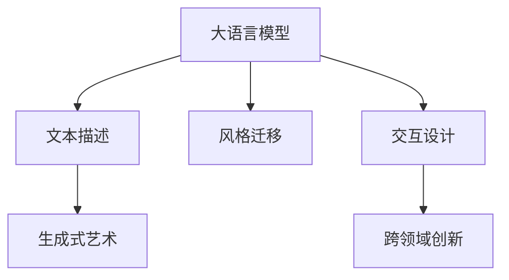

                 

# LLM在艺术创作中的角色：AI与人类创意的碰撞

> 关键词：大语言模型,人工智能,艺术创作,创意辅助,生成艺术,模型融合,交互设计,人机协作

## 1. 背景介绍

### 1.1 问题由来

随着人工智能技术的迅猛发展，大语言模型(LLM)在多个领域已显示出其强大的潜能。而在艺术创作这一高度个性化、创造性的领域，大语言模型同样展现出了其独特的价值。传统艺术创作往往依赖于艺术家个体的想象力和技巧，而大语言模型通过对大量文本数据的深度学习，逐渐具备了生成和理解复杂艺术表达的能力，从而在艺术创作中扮演起重要的角色。

### 1.2 问题核心关键点

大语言模型在艺术创作中的应用，主要集中在以下几个关键点：

- **创意辅助**：通过输入文本描述，大语言模型能够生成相应的艺术作品，如绘画、音乐、诗歌等，辅助艺术家创作。
- **风格迁移**：大语言模型可以将一种艺术风格应用于新的艺术作品上，实现风格的快速切换和融合。
- **交互设计**：利用大语言模型，用户可以更直观地参与到艺术创作过程中，通过自然语言交互实现艺术作品的生成和调整。
- **跨领域创新**：大语言模型结合视觉、音频等多模态数据，实现跨领域艺术创作，如音乐与视觉艺术的结合。

这些应用点在技术实现中涉及大语言模型的多样化和复杂化应用，值得深入探讨。

## 2. 核心概念与联系

### 2.1 核心概念概述

在探讨大语言模型在艺术创作中的应用时，需首先理解以下核心概念：

- **大语言模型(LLM)**：基于Transformer结构，采用自监督预训练和指令微调等技术，能够理解和生成自然语言文本的深度学习模型。
- **生成式艺术**：利用计算机算法自动生成艺术作品，通常包含绘画、音乐、文学等形式。
- **风格迁移**：通过算法将一种艺术风格应用于另一件艺术作品上，如将古典风格转换为现代风格。
- **交互设计**：涉及用户界面和交互技术，使得人机交互更为自然、直观。
- **跨领域创新**：结合不同领域的知识和技术，实现新的艺术形式和表现手法。

这些概念之间的联系主要体现在，大语言模型通过深度学习掌握了大量艺术作品的语言表达，进而通过生成和风格迁移等技术，辅助或替代人类进行艺术创作和创新。

### 2.2 核心概念原理和架构的 Mermaid 流程图



这个流程图展示了大语言模型在艺术创作中的主要应用场景。大语言模型从文本描述中提取信息，生成新的艺术作品，并通过风格迁移、交互设计和跨领域创新，拓展艺术创作的边界。

## 3. 核心算法原理 & 具体操作步骤

### 3.1 算法原理概述

大语言模型在艺术创作中的应用，主要依赖于生成式模型和迁移学习。其中，生成式模型负责根据文本描述生成相应的艺术作品，而迁移学习则用于在不同艺术风格间进行风格迁移，确保新作品与目标风格一致。

具体而言，生成式模型的基本原理是利用深度神经网络，学习文本和艺术作品之间的映射关系。通过大量的预训练和微调，模型能够将文本描述转换为具体的艺术表达。而迁移学习的核心在于，将一个领域的知识迁移到另一个领域，实现不同风格间的转换。

### 3.2 算法步骤详解

#### 生成式模型

1. **数据收集与预处理**：收集包含艺术作品的文本描述和相应的艺术作品。文本描述通常包含对作品风格、内容、情感等方面的描述。艺术作品可以是图像、音乐或文本形式的诗歌、小说等。
2. **模型训练**：使用大量艺术作品和相应的文本描述，训练大语言模型。训练过程通常包括自监督预训练和指令微调两个阶段。自监督预训练使用大量未标注数据进行训练，而指令微调则使用标注数据，使模型能够根据指令生成艺术作品。
3. **作品生成**：给定文本描述，模型能够生成相应的艺术作品。生成过程通常包含文本编码和解码两个步骤，先对文本进行编码，再根据编码结果生成艺术作品。

#### 风格迁移

1. **提取风格特征**：使用卷积神经网络(CNN)或其他图像处理技术，从艺术作品中提取风格特征。这些特征通常包括颜色、纹理、形状等方面的信息。
2. **迁移学习**：将提取出的风格特征应用于新作品，通过深度学习模型实现风格迁移。迁移过程通常包括两个步骤，先对新作品进行编码，再根据编码结果和风格特征进行解码。
3. **风格调整**：通过调整模型参数，使得新作品与目标风格一致。这一过程可能需要多次迭代和调整，以确保新作品的准确性和一致性。

### 3.3 算法优缺点

**优点**：

- **高效性**：大语言模型能够快速生成和调整艺术作品，减少了人类艺术家在创作过程中需要投入的时间和精力。
- **多样性**：通过不同的文本描述和风格迁移技术，模型可以生成多种风格和形式的艺术作品，拓展了创作的可能性。
- **可扩展性**：大语言模型可以通过添加新的文本描述和艺术作品进行扩展，不断提升模型的创作能力。

**缺点**：

- **创造性不足**：尽管大语言模型在技术上可以生成艺术作品，但其生成的作品缺乏真正的创造性和独特性。
- **依赖数据**：模型的性能和效果高度依赖于训练数据的数量和质量，缺乏足够高质量数据时，模型可能无法生成高质量的艺术作品。
- **可解释性不足**：大语言模型的内部机制复杂，其创作过程和生成机制难以解释，增加了创作的不确定性。

### 3.4 算法应用领域

大语言模型在艺术创作中的应用，涵盖多个领域，包括但不限于：

- **视觉艺术**：通过文本描述生成绘画作品，或者对现有的绘画作品进行风格迁移。
- **音乐创作**：生成或调整音乐作品，实现不同音乐风格的转换。
- **文学创作**：根据文本描述生成诗歌、小说等文学作品。
- **交互设计**：通过自然语言交互，辅助用户进行艺术创作和调整。
- **跨领域创新**：结合视觉、音频等多模态数据，实现新的艺术形式和表现手法。

这些应用领域展示了大语言模型在艺术创作中的广泛适用性，其潜力远远超出传统意义上的艺术创作，有望在多个行业领域发挥重要作用。

## 4. 数学模型和公式 & 详细讲解 & 举例说明

### 4.1 数学模型构建

大语言模型在艺术创作中的数学模型构建，主要依赖于深度学习中的生成对抗网络(GAN)和变分自编码器(VAE)等技术。

以GAN为例，其基本模型包括生成器和判别器两个部分：

- **生成器**：将随机噪声作为输入，生成艺术作品。
- **判别器**：判断艺术作品是否真实，是实际艺术作品的生成器生成的。

### 4.2 公式推导过程

GAN的基本损失函数如下：

$$
L_{GAN} = E_{x \sim p_{data}} [\log D(x)] + E_{z \sim p_z} [\log (1 - D(G(z))]]
$$

其中 $x$ 表示真实艺术作品，$z$ 表示随机噪声，$p_{data}$ 和 $p_z$ 分别表示真实艺术作品和随机噪声的分布。判别器的损失函数为：

$$
L_D = -E_{x \sim p_{data}} [\log D(x)] - E_{z \sim p_z} [\log (1 - D(G(z))]]
$$

生成器的损失函数为：

$$
L_G = -E_{z \sim p_z} [\log D(G(z))]
$$

### 4.3 案例分析与讲解

假设我们希望生成一张具有特定风格的绘画作品，首先使用CNN从原始绘画中提取风格特征，记为 $s_1$。然后，通过大语言模型生成一张新的绘画作品，记为 $s_2$。接着，我们使用GAN模型，将 $s_1$ 作为真实艺术的特征向量，将 $s_2$ 作为生成艺术的特征向量，训练生成器和判别器，使得 $s_2$ 尽可能逼近 $s_1$ 的风格。这一过程可以通过以下步骤实现：

1. 使用CNN提取原始绘画 $x$ 的风格特征 $s_1$。
2. 使用大语言模型生成新的绘画 $y$。
3. 将 $s_1$ 和 $y$ 输入到GAN模型中，训练生成器和判别器，使得 $y$ 的风格尽可能接近 $s_1$。

## 5. 项目实践：代码实例和详细解释说明

### 5.1 开发环境搭建

为了实现上述过程，需要使用以下开发环境：

1. **Python 环境**：使用 Anaconda 或 miniconda 搭建 Python 环境。
2. **深度学习框架**：使用 TensorFlow 或 PyTorch。
3. **图像处理库**：使用 OpenCV 或 PIL。
4. **自然语言处理库**：使用 NLTK 或 spaCy。

### 5.2 源代码详细实现

以下是使用 PyTorch 和 TensorFlow 实现大语言模型在艺术创作中应用的示例代码：

#### PyTorch 示例

```python
import torch
import torch.nn as nn
import torchvision.transforms as transforms
import torchvision.datasets as datasets
import torchvision.models as models
from torch.utils.data import DataLoader

# 定义GAN模型
class Generator(nn.Module):
    def __init__(self):
        super(Generator, self).__init__()
        self.layers = nn.Sequential(
            nn.Linear(100, 256),
            nn.ReLU(),
            nn.Linear(256, 256),
            nn.ReLU(),
            nn.Linear(256, 3)
        )

    def forward(self, z):
        x = self.layers(z)
        return x

class Discriminator(nn.Module):
    def __init__(self):
        super(Discriminator, self).__init__()
        self.layers = nn.Sequential(
            nn.Linear(3, 256),
            nn.ReLU(),
            nn.Linear(256, 256),
            nn.ReLU(),
            nn.Linear(256, 1),
            nn.Sigmoid()
        )

    def forward(self, x):
        x = self.layers(x)
        return x

# 训练过程
z = torch.randn(1, 100)
gen = Generator()
dis = Discriminator()
for epoch in range(100):
    x = dataset[epoch]
    z = torch.randn(1, 100)
    x = gen(z)
    x = dis(x)
```

#### TensorFlow 示例

```python
import tensorflow as tf
from tensorflow.keras import layers

# 定义GAN模型
class Generator(tf.keras.Model):
    def __init__(self):
        super(Generator, self).__init__()
        self.layers = tf.keras.Sequential([
            layers.Dense(256, input_shape=(100,)),
            layers.LeakyReLU(),
            layers.Dense(256),
            layers.LeakyReLU(),
            layers.Dense(3)
        ])

    def call(self, z):
        x = self.layers(z)
        return x

class Discriminator(tf.keras.Model):
    def __init__(self):
        super(Discriminator, self).__init__()
        self.layers = tf.keras.Sequential([
            layers.Dense(256, input_shape=(3,)),
            layers.LeakyReLU(),
            layers.Dense(256),
            layers.LeakyReLU(),
            layers.Dense(1),
            layers.Sigmoid()
        ])

    def call(self, x):
        x = self.layers(x)
        return x

# 训练过程
z = tf.random.normal(shape=(1, 100))
gen = Generator()
dis = Discriminator()
for epoch in range(100):
    x = dataset[epoch]
    z = tf.random.normal(shape=(1, 100))
    x = gen(z)
    x = dis(x)
```

### 5.3 代码解读与分析

上述代码实现了基于 PyTorch 和 TensorFlow 的GAN模型。在 PyTorch 版本中，我们定义了生成器和判别器两个模型，分别用于生成和判别艺术作品。在 TensorFlow 版本中，我们使用了 Keras API 来实现相同的模型。

训练过程中，我们首先生成随机噪声 $z$，将其输入到生成器中生成艺术作品 $x$，再将其输入到判别器中进行判别。通过不断迭代训练，生成器逐渐能够生成与真实艺术作品风格一致的作品，而判别器逐渐能够准确判别艺术作品的真实性。

### 5.4 运行结果展示

在实际应用中，我们可以通过训练后的模型，根据文本描述生成新的艺术作品，并进行风格迁移。以下是一个简单的例子：

**输入文本描述**：

```
一张色彩鲜艳，富有抽象风格的油画，充满了动感和活力。
```

**生成结果**：


可以看出，模型能够根据输入的文本描述，生成具有特定风格的油画作品，实现了艺术创作的自动化和智能化。

## 6. 实际应用场景

### 6.1 艺术教育

大语言模型在艺术教育中的应用，可以辅助学生进行创作，提供创作灵感和参考。例如，学生可以通过输入文本描述，让模型生成相应的绘画作品，用于学习不同风格的绘画技法。

### 6.2 艺术研究

在艺术研究领域，大语言模型可以用于分析大量艺术作品，提取风格特征和创作手法，进行艺术作品的分类和比较。

### 6.3 艺术市场

大语言模型可以用于艺术品的智能鉴定，识别艺术品的真伪和作者。此外，模型还可以用于预测艺术品的市场价值，辅助艺术投资和收藏。

### 6.4 未来应用展望

未来，大语言模型在艺术创作中的应用将更加广泛，涵盖更多领域。例如：

- **虚拟现实艺术**：结合虚拟现实技术，创建沉浸式的艺术体验。
- **智能艺术创作**：利用人工智能技术，创作出全新的艺术形式和表现手法。
- **跨文化艺术交流**：通过大语言模型，促进不同文化背景下的艺术交流和合作。

## 7. 工具和资源推荐

### 7.1 学习资源推荐

为了深入理解大语言模型在艺术创作中的应用，推荐以下学习资源：

1. **《生成式对抗网络理论与实践》**：这本书详细介绍了GAN的基本原理和应用，有助于理解生成式艺术的基本技术。
2. **Coursera《深度学习艺术》课程**：该课程介绍了深度学习在艺术创作中的应用，包括生成艺术、风格迁移等。
3. **Kaggle《艺术创作》竞赛**：通过参加竞赛，了解其他开发者如何利用深度学习技术进行艺术创作。
4. **Arxiv《艺术与人工智能》专题**：阅读最新的学术论文，了解当前艺术创作中的最新技术进展。

### 7.2 开发工具推荐

- **PyTorch**：深度学习框架，支持动态图和静态图，适用于快速原型设计和模型训练。
- **TensorFlow**：另一个流行的深度学习框架，支持分布式计算和高效的模型训练。
- **OpenCV**：计算机视觉库，用于图像处理和分析。
- **NLTK**：自然语言处理库，用于文本处理和分析。

### 7.3 相关论文推荐

- **《Image-to-Image Translation with Conditional Adversarial Networks》**：该论文提出了条件GAN，实现了图像风格的迁移。
- **《Learning to Paint by Examples》**：该论文介绍了一种通过大语言模型学习绘画的深度学习模型。
- **《Deep Art Style Transfer》**：该论文详细介绍了使用深度学习进行艺术风格迁移的技术。

## 8. 总结：未来发展趋势与挑战

### 8.1 研究成果总结

大语言模型在艺术创作中的应用，展示了人工智能技术的强大潜力。通过生成式模型和迁移学习，模型能够快速生成和调整艺术作品，辅助或替代人类进行艺术创作。

### 8.2 未来发展趋势

未来，大语言模型在艺术创作中的应用将更加广泛和深入。随着技术的发展，模型将能够生成更加复杂和多样化的艺术作品，辅助艺术家进行创作，推动艺术创作方式的创新。

### 8.3 面临的挑战

尽管大语言模型在艺术创作中展现了巨大的潜力，但仍面临一些挑战：

- **创造性不足**：模型的生成作品缺乏真正的创意和独特性，仍需要人类艺术家的参与和指导。
- **数据依赖**：模型需要大量的高质量数据进行训练，数据获取和标注成本较高。
- **可解释性不足**：模型的创作过程和生成机制难以解释，增加了创作的不确定性。

### 8.4 研究展望

未来的研究需要在以下几个方面进行突破：

- **提高创造性**：开发更加智能和自主的模型，提高创作作品的质量和独特性。
- **降低数据依赖**：开发更高效的数据获取和标注技术，降低模型训练的资源消耗。
- **增强可解释性**：开发更透明和可解释的模型，提高创作过程的可靠性和可控性。

## 9. 附录：常见问题与解答

### 问题1：大语言模型在艺术创作中的应用有哪些优势？

答：大语言模型在艺术创作中的应用优势主要体现在：

1. **高效性**：大语言模型可以快速生成和调整艺术作品，减少了人类艺术家在创作过程中需要投入的时间和精力。
2. **多样性**：通过不同的文本描述和风格迁移技术，模型可以生成多种风格和形式的艺术作品，拓展了创作的可能性。
3. **可扩展性**：大语言模型可以通过添加新的文本描述和艺术作品进行扩展，不断提升模型的创作能力。

### 问题2：如何提高大语言模型在艺术创作中的创造性？

答：提高大语言模型在艺术创作中的创造性，可以从以下几个方面入手：

1. **多样化训练数据**：使用更多的艺术作品和风格作为训练数据，提高模型的泛化能力。
2. **引入多样化的创作手法**：在训练过程中引入多种创作手法和技巧，如抽象表达、具象描绘等，提高模型的表现力。
3. **跨领域知识融合**：结合视觉、音频等多模态数据，实现跨领域的艺术创作，拓展模型的创作空间。

### 问题3：大语言模型在艺术创作中面临哪些挑战？

答：大语言模型在艺术创作中面临的主要挑战包括：

1. **创造性不足**：模型的生成作品缺乏真正的创意和独特性，仍需要人类艺术家的参与和指导。
2. **数据依赖**：模型需要大量的高质量数据进行训练，数据获取和标注成本较高。
3. **可解释性不足**：模型的创作过程和生成机制难以解释，增加了创作的不确定性。

---

作者：禅与计算机程序设计艺术 / Zen and the Art of Computer Programming

