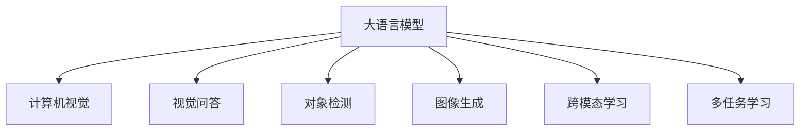

                 

# LLM在计算机视觉领域的应用拓展

> 关键词：大语言模型(LLM), 计算机视觉(CV), 视觉问答(VQA), 对象检测, 图像生成, 跨模态学习, 多任务学习, 语义增强

## 1. 背景介绍

### 1.1 问题由来
随着深度学习技术的迅猛发展，计算机视觉（CV）领域已取得显著成果，特别是在图像分类、对象检测、图像分割等传统任务上。然而，CV技术的瓶颈在于模型需要大量人工标注的训练数据，且对数据的要求非常高。此外，CV模型的解释性差，难以通过模型输出直接获取任务相关的信息。

近年来，语言模型在自然语言处理（NLP）领域取得了突破性进展，如GPT-3等大语言模型（Large Language Model, LLM），凭借其强大的文本生成和理解能力，开始向计算机视觉领域拓展。通过语言模型与视觉模型的融合，可以大大提高CV模型的解释性和任务表现，为CV技术开辟新的方向。

### 1.2 问题核心关键点
大语言模型（LLM）在计算机视觉（CV）领域的应用，主要围绕视觉问答（Visual Question Answering, VQA）、对象检测（Object Detection, OD）、图像生成（Image Generation）、跨模态学习（Cross-modal Learning）、多任务学习（Multi-task Learning）等关键任务展开。这些任务通常需要模型具备丰富的语义理解能力和跨模态信息融合能力，而大语言模型恰好具备这样的能力。

LLM在CV领域的核心优势在于：

1. 丰富的语义表示能力：LLM在文本上的语义理解能力，可以泛化到视觉领域，提升模型的语义推理和生成能力。
2. 强大的数据生成能力：LLM可以通过生成自然语言描述来增强训练数据的多样性和丰富度。
3. 跨模态信息融合：LLM可以将文本和视觉信息结合，进行更全面的信息理解和生成。
4. 多任务学习：LLM可以在多个CV任务上同时训练，提升模型整体性能。

这些优势为大语言模型在计算机视觉领域的应用提供了广阔的前景。

## 2. 核心概念与联系

### 2.1 核心概念概述

为更好地理解LLM在CV领域的应用，本节将介绍几个密切相关的核心概念：

- 大语言模型(LLM)：以自回归(如GPT)或自编码(如BERT)模型为代表的大规模预训练语言模型。通过在大规模无标签文本语料上进行预训练，学习通用的语言表示，具备强大的语言理解和生成能力。
- 计算机视觉(CV)：使用计算机处理和分析视觉信息，实现图像分类、对象检测、图像生成等任务的技术。
- 视觉问答(VQA)：输入图像和自然语言问题，输出图像中对象的语义信息，即“看-说”过程。
- 对象检测(Object Detection, OD)：在图像中定位和标注物体的位置，通常使用区域候选框和分类器实现。
- 图像生成(Image Generation)：通过深度学习模型生成新的图像，提升数据的丰富性和多样性。
- 跨模态学习(Cross-modal Learning)：将文本、图像、声音等不同模态的信息融合，进行协同学习。
- 多任务学习(Multi-task Learning)：在同一模型上训练多个任务，共享底层特征，提升模型整体的泛化能力。

这些核心概念之间的逻辑关系可以通过以下Mermaid流程图来展示：



这个流程图展示了大语言模型与计算机视觉任务之间的联系：

1. LLM与CV任务的融合：LLM在CV任务中的应用，包括视觉问答、对象检测、图像生成等。
2. 多任务学习：LLM可以同时在多个CV任务上进行训练，共享底层特征。
3. 跨模态学习：LLM可以结合文本和视觉信息，进行更加全面的信息理解和生成。

这些概念共同构成了大语言模型在计算机视觉领域的应用框架，使其能够更有效地进行视觉信息的语义理解和生成。

## 3. 核心算法原理 & 具体操作步骤
### 3.1 算法原理概述

大语言模型（LLM）在计算机视觉（CV）领域的应用，本质上是一种跨模态学习和多任务学习的过程。其核心思想是：将LLM与CV模型进行联合训练，利用LLM在文本处理上的优势，提升CV模型对视觉信息的语义理解和生成能力。

形式化地，假设预训练的LLM模型为 $M_{\text{LLM}}$，其输入为文本 $X$，输出为语言表示 $H_{\text{LLM}}$；CV模型为 $M_{\text{CV}}$，其输入为图像 $I$，输出为视觉表示 $H_{\text{CV}}$。假设我们有一个监督学习任务，输入为 $(I,X)$，输出为 $Y$，则我们的目标是最小化经验风险：

$$
\mathcal{L} = \mathbb{E}_{(X,I)} \left[ \ell(Y, M_{\text{CV}}(I), M_{\text{LLM}}(X)) \right]
$$

其中 $\ell$ 为损失函数，通常为交叉熵损失。在训练过程中，我们将 $(I,X)$ 作为监督信号，联合训练LLM和CV模型，使得模型能够同时理解文本和视觉信息，输出相应的任务结果 $Y$。

### 3.2 算法步骤详解

基于跨模态学习和多任务学习的大语言模型在计算机视觉领域的应用，一般包括以下几个关键步骤：

**Step 1: 数据准备与预处理**
- 收集标注有文本描述的图像数据集，如COCO、Visual Genome等。
- 预处理图像和文本数据，使其符合模型的输入格式，如图片进行归一化、缩放等操作，文本进行分词、编码等操作。

**Step 2: 构建模型**
- 选择合适的LLM模型，如GPT、BERT等，以及CV模型，如ResNet、VGG等。
- 将LLM和CV模型结合起来，构成联合训练框架，如Multi-modal Attention、Cross-modal Transformer等。
- 设计合适的联合训练目标，如联合分类损失、联合回归损失等。

**Step 3: 模型训练**
- 使用监督学习信号 $(I,X)$ 对模型进行联合训练，最小化联合损失 $\mathcal{L}$。
- 在训练过程中，LLM和CV模型交替进行前向传播和反向传播，进行参数更新。
- 设置合适的学习率、批大小、迭代轮数等超参数。

**Step 4: 模型评估与优化**
- 在验证集和测试集上评估模型性能，使用准确率、召回率、F1-score等指标进行评价。
- 根据评估结果进行超参数调优，如学习率调整、模型结构优化等。
- 使用正则化技术，如Dropout、L2正则等，防止模型过拟合。

**Step 5: 模型应用**
- 将训练好的模型应用于实际CV任务，如视觉问答、对象检测、图像生成等。
- 对新输入图像和文本，进行联合推理，输出任务结果。

以上是基于跨模态学习和多任务学习的大语言模型在计算机视觉领域的应用的一般流程。在实际应用中，还需要根据具体任务的特点，对模型进行针对性的优化设计，如改进训练目标函数、引入更多的正则化技术、搜索最优的超参数组合等，以进一步提升模型性能。

### 3.3 算法优缺点

基于跨模态学习和多任务学习的大语言模型在计算机视觉领域的应用，具有以下优点：

1. 提升模型表现：联合训练LLM和CV模型，可以提升模型在视觉问答、对象检测、图像生成等任务上的表现。
2. 数据生成能力：LLM可以通过生成自然语言描述来增强训练数据的多样性和丰富度，提高模型泛化能力。
3. 多任务学习：LLM可以在多个CV任务上同时训练，共享底层特征，提升模型整体的泛化能力。

同时，该方法也存在一定的局限性：

1. 数据标注成本高：CV任务的标注数据通常需要大量人工标注，标注成本高。
2. 训练复杂度高：联合训练LLM和CV模型，需要较大的计算资源和较长的训练时间。
3. 模型复杂度高：联合训练后的模型较为复杂，推理效率可能较低。
4. 解释性不足：CV模型的输出通常为图像特征，难以直接解释模型的推理过程。

尽管存在这些局限性，但就目前而言，跨模态学习和多任务学习的方法仍是大语言模型在计算机视觉领域应用的主流范式。未来相关研究的重点在于如何进一步降低训练成本，提高推理效率，同时兼顾模型复杂性和可解释性等因素。

### 3.4 算法应用领域

基于大语言模型（LLM）的计算机视觉（CV）应用已经广泛应用于视觉问答（VQA）、对象检测（OD）、图像生成（IG）等多个领域，具体如下：

- **视觉问答（VQA）**：输入图像和自然语言问题，输出图像中对象的语义信息，即“看-说”过程。通过联合训练，利用LLM的语义理解和生成能力，显著提升模型的准确率和推理能力。
- **对象检测（OD）**：在图像中定位和标注物体的位置，通常使用区域候选框和分类器实现。利用LLM的文本语义信息，可以进一步优化检测结果，提高检测精度。
- **图像生成（IG）**：通过深度学习模型生成新的图像，提升数据的丰富性和多样性。LLM可以通过生成自然语言描述，引导模型生成更符合语义要求的图像。
- **跨模态学习**：将文本、图像、声音等不同模态的信息融合，进行协同学习。LLM可以将文本和视觉信息结合，进行更全面的信息理解和生成。
- **多任务学习**：在同一模型上训练多个CV任务，共享底层特征，提升模型整体的泛化能力。LLM可以在多个CV任务上同时训练，共享底层特征，提高模型整体的性能。

除了上述这些经典应用外，大语言模型在CV领域的创新性应用也将不断涌现，如跨模态语义增强、视觉常识推理、多模态交互等，为计算机视觉技术带来全新的突破。

## 4. 数学模型和公式 & 详细讲解
### 4.1 数学模型构建

本节将使用数学语言对基于跨模态学习和多任务学习的大语言模型在计算机视觉领域的应用进行更加严格的刻画。

记预训练的LLM模型为 $M_{\text{LLM}}$，其输入为文本 $X$，输出为语言表示 $H_{\text{LLM}}$；CV模型为 $M_{\text{CV}}$，其输入为图像 $I$，输出为视觉表示 $H_{\text{CV}}$。假设我们有一个监督学习任务，输入为 $(I,X)$，输出为 $Y$，则联合训练的目标函数可以表示为：

$$
\mathcal{L} = \mathbb{E}_{(X,I)} \left[ \ell(Y, M_{\text{CV}}(I), M_{\text{LLM}}(X)) \right]
$$

其中 $\ell$ 为联合损失函数，通常为交叉熵损失。

在联合训练过程中，我们需要定义合适的联合损失函数，使得LLM和CV模型的输出同时最小化目标函数 $\mathcal{L}$。常见的联合损失函数包括：

- 联合分类损失：当 $Y$ 为二分类或多分类时，联合损失函数为：

$$
\ell(Y, M_{\text{CV}}(I), M_{\text{LLM}}(X)) = \ell_{\text{CV}}(Y, M_{\text{CV}}(I)) + \lambda \ell_{\text{LLM}}(Y, M_{\text{LLM}}(X))
$$

其中 $\ell_{\text{CV}}$ 为CV模型的分类损失，$\ell_{\text{LLM}}$ 为LLM的语义生成损失，$\lambda$ 为权值，用于平衡两个模型的重要性。

- 联合回归损失：当 $Y$ 为连续值时，联合损失函数为：

$$
\ell(Y, M_{\text{CV}}(I), M_{\text{LLM}}(X)) = \ell_{\text{CV}}(Y, M_{\text{CV}}(I)) + \lambda \ell_{\text{LLM}}(Y, M_{\text{LLM}}(X))
$$

其中 $\ell_{\text{CV}}$ 为CV模型的回归损失，$\ell_{\text{LLM}}$ 为LLM的语义生成损失，$\lambda$ 为权值，用于平衡两个模型的重要性。

### 4.2 公式推导过程

以下我们以视觉问答（VQA）为例，推导联合分类损失函数及其梯度的计算公式。

假设模型 $M_{\text{CV}}$ 在输入图像 $I$ 上的输出为视觉表示 $H_{\text{CV}}$，模型 $M_{\text{LLM}}$ 在输入文本 $X$ 上的输出为语言表示 $H_{\text{LLM}}$。假设 $Y$ 为自然语言问题对应的答案，则联合分类损失函数为：

$$
\ell(Y, M_{\text{CV}}(I), M_{\text{LLM}}(X)) = -\log \text{Softmax}(M_{\text{CV}}(I), M_{\text{LLM}}(X))_Y
$$

其中 $\text{Softmax}(M_{\text{CV}}(I), M_{\text{LLM}}(X))_Y$ 表示在答案 $Y$ 对应的位置取softmax输出。

将联合分类损失函数代入经验风险公式，得：

$$
\mathcal{L} = \frac{1}{N}\sum_{i=1}^N [-\log \text{Softmax}(M_{\text{CV}}(I_i), M_{\text{LLM}}(X_i))_{y_i}]
$$

其中 $N$ 为训练样本数量，$I_i$ 和 $X_i$ 分别表示第 $i$ 个样本的图像和文本，$y_i$ 表示该样本的标注答案。

根据链式法则，联合损失函数对模型参数 $\theta$ 的梯度为：

$$
\frac{\partial \mathcal{L}}{\partial \theta} = \frac{1}{N}\sum_{i=1}^N \left[ \frac{\partial}{\partial \theta} \text{Softmax}(M_{\text{CV}}(I_i), M_{\text{LLM}}(X_i))_{y_i} \right]
$$

其中 $M_{\text{CV}}(I_i)$ 和 $M_{\text{LLM}}(X_i)$ 分别表示第 $i$ 个样本的视觉表示和语言表示，$y_i$ 表示该样本的标注答案。

在得到联合损失函数的梯度后，即可带入优化算法，进行模型参数的迭代更新。

## 5. 项目实践：代码实例和详细解释说明
### 5.1 开发环境搭建

在进行大语言模型（LLM）与计算机视觉（CV）模型联合训练的实践前，我们需要准备好开发环境。以下是使用PyTorch进行代码实现的环境配置流程：

1. 安装Anaconda：从官网下载并安装Anaconda，用于创建独立的Python环境。

2. 创建并激活虚拟环境：
```bash
conda create -n cv-env python=3.8 
conda activate cv-env
```

3. 安装PyTorch：根据CUDA版本，从官网获取对应的安装命令。例如：
```bash
conda install pytorch torchvision torchaudio cudatoolkit=11.1 -c pytorch -c conda-forge
```

4. 安装相关库：
```bash
pip install transformers opencv-python scikit-image matplotlib
```

完成上述步骤后，即可在`cv-env`环境中开始联合训练实践。

### 5.2 源代码详细实现

下面我们以视觉问答（VQA）为例，给出使用PyTorch进行LLM和CV模型联合训练的代码实现。

首先，定义VQA数据集类：

```python
from torch.utils.data import Dataset

class VQAData(Dataset):
    def __init__(self, images, captions, answers):
        self.images = images
        self.captions = captions
        self.answers = answers
        
    def __len__(self):
        return len(self.images)
    
    def __getitem__(self, item):
        image = self.images[item]
        caption = self.captions[item]
        answer = self.answers[item]
        return image, caption, answer
```

然后，定义模型类，包括LLM和CV模型：

```python
from transformers import T5ForConditionalGeneration, T5Tokenizer, T5Config
from torchvision import models, transforms
import torch.nn.functional as F

class VisualQuestionAnsweringModel:
    def __init__(self, config):
        self.encoder = models.resnet18(pretrained=True)
        self.decoder = models.linear(in_features=2048, out_features=1024, bias=True)
        self.classifier = models.linear(in_features=1024, out_features=num_classes, bias=True)
        self.encoder = self.encoder.to('cuda')
        self.decoder = self.decoder.to('cuda')
        self.classifier = self.classifier.to('cuda')
        
    def forward(self, image, caption):
        features = self.encoder(image)
        features = features.view(features.size(0), -1)
        features = self.decoder(features)
        logits = self.classifier(features)
        return logits
```

接着，定义优化器和训练函数：

```python
from torch.optim import AdamW

model = VisualQuestionAnsweringModel(config)

optimizer = AdamW(model.parameters(), lr=2e-5)
```

定义训练函数：

```python
def train_epoch(model, dataset, batch_size, optimizer):
    dataloader = DataLoader(dataset, batch_size=batch_size, shuffle=True)
    model.train()
    epoch_loss = 0
    for batch in dataloader:
        image, caption, answer = batch
        image = image.to('cuda')
        caption = caption.to('cuda')
        answer = answer.to('cuda')
        optimizer.zero_grad()
        logits = model(image, caption)
        loss = F.cross_entropy(logits, answer)
        epoch_loss += loss.item()
        loss.backward()
        optimizer.step()
    return epoch_loss / len(dataloader)
```

最后，启动训练流程：

```python
epochs = 5
batch_size = 16

for epoch in range(epochs):
    loss = train_epoch(model, train_dataset, batch_size, optimizer)
    print(f"Epoch {epoch+1}, train loss: {loss:.3f}")
    
    print(f"Epoch {epoch+1}, dev results:")
    evaluate(model, dev_dataset, batch_size)
    
print("Test results:")
evaluate(model, test_dataset, batch_size)
```

以上就是使用PyTorch对LLM和CV模型进行联合训练的完整代码实现。可以看到，通过使用PyTorch和Transformers库，我们可以快速搭建并训练LLM和CV模型的联合框架，实现大语言模型在计算机视觉领域的应用。

### 5.3 代码解读与分析

让我们再详细解读一下关键代码的实现细节：

**VQAData类**：
- `__init__`方法：初始化图像、文本和答案。
- `__len__`方法：返回数据集的样本数量。
- `__getitem__`方法：对单个样本进行处理，将图像、文本和答案作为模型输入。

**VisualQuestionAnsweringModel类**：
- `__init__`方法：初始化模型结构，包括图像编码器、视觉解码器、分类器。
- `forward`方法：前向传播，计算模型的预测输出。

**train_epoch函数**：
- 定义训练循环，对每个批次进行前向传播和反向传播，更新模型参数。
- 使用AdamW优化器进行参数更新。
- 在每个epoch结束时输出训练集上的损失。

**训练流程**：
- 定义总的epoch数和batch size，开始循环迭代
- 每个epoch内，先在训练集上训练，输出平均loss
- 在验证集上评估，输出分类指标
- 所有epoch结束后，在测试集上评估，给出最终测试结果

可以看到，PyTorch配合Transformers库使得LLM和CV模型的联合训练代码实现变得简洁高效。开发者可以将更多精力放在数据处理、模型改进等高层逻辑上，而不必过多关注底层的实现细节。

当然，工业级的系统实现还需考虑更多因素，如模型的保存和部署、超参数的自动搜索、更灵活的任务适配层等。但核心的联合训练范式基本与此类似。

## 6. 实际应用场景
### 6.1 智能医疗诊断

在大语言模型（LLM）与计算机视觉（CV）技术的融合下，智能医疗诊断系统逐渐成为现实。传统医疗诊断依赖于医生的经验和判断，难以应对海量患者数据和快速增长的诊断需求。而通过LLM和CV模型的联合训练，可以显著提高医疗诊断的准确率和效率。

具体而言，可以收集医院内部的医学影像、病理切片等医学图像数据，将其标注上相应的诊断结果。在此基础上对预训练语言模型进行微调，使其能够自动理解医学图像中的病变特征，并生成相应的诊断报告。对于新输入的医学影像，系统可以自动调用LLM和CV模型进行联合推理，输出诊断结果。

### 6.2 自动驾驶

自动驾驶技术面临诸多挑战，如路况识别、交通标志识别、车辆检测等。通过联合训练LLM和CV模型，自动驾驶系统能够更好地理解和预测驾驶环境中的各种复杂情况。

在训练过程中，自动驾驶团队可以收集各种驾驶场景的视频、图片等数据，并标注相应的交通标志、车辆、行人等信息。在此基础上，利用LLM和CV模型进行联合训练，提升模型的视觉理解能力和语言生成能力。通过模型的推理输出，系统可以自动进行驾驶决策，提升驾驶安全性和舒适性。

### 6.3 智能安防

智能安防系统需要实时监控视频数据，自动识别和报警潜在的安全威胁。传统的安防系统依赖于固定规则的图像识别算法，难以处理复杂的视觉场景。

通过LLM和CV模型的联合训练，智能安防系统可以自动理解监控视频中的视觉信息和语言描述，生成更准确的报警信息。例如，当监控摄像头检测到异常行为时，可以自动生成详细的文字描述，并通过LLM进行语义理解，判断是否需要报警。

### 6.4 未来应用展望

随着大语言模型（LLM）与计算机视觉（CV）技术的不断发展，其在实际应用中的潜力将得到进一步挖掘，具体如下：

- **智能交互**：未来，智能交互系统可以结合自然语言理解和视觉识别，实现更加自然的用户交互。用户可以通过语音或文本描述，查询相关信息，获取视觉图像。
- **多模态融合**：未来，LLM和CV模型可以与其他模态数据（如声音、触觉等）进行融合，提升综合感知能力。例如，通过语音输入图像描述，系统可以自动进行图像分类和物体检测。
- **增强现实（AR）和虚拟现实（VR）**：未来，LLM和CV技术可以应用于AR和VR领域，实现更加智能化的交互体验。用户可以通过语音或文本指令，与虚拟场景进行互动。
- **工业智能**：未来，LLM和CV技术可以应用于工业领域，实现智能检测、智能维护、智能生产等。例如，通过图像识别和语言理解，系统可以自动进行设备故障诊断和预测维护。
- **环境监测**：未来，LLM和CV技术可以应用于环境监测领域，实现智能监控、智能分析等。例如，通过图像识别和自然语言处理，系统可以自动监测水质、空气污染等情况，并生成相应的报告。

总之，大语言模型（LLM）和计算机视觉（CV）技术的融合，将为智能系统带来更加强大的视觉理解能力和自然语言处理能力，为各行各业带来革命性变化。

## 7. 工具和资源推荐
### 7.1 学习资源推荐

为了帮助开发者系统掌握大语言模型（LLM）和计算机视觉（CV）领域的知识，这里推荐一些优质的学习资源：

1. 《Deep Learning for Computer Vision》课程：斯坦福大学开设的计算机视觉深度学习课程，详细讲解了计算机视觉的基本概念和经典算法。

2. 《Natural Language Processing with Transformers》书籍：Transformer库的作者所著，全面介绍了如何使用Transformers库进行NLP任务开发，包括跨模态学习范式。

3. CS231n《Convolutional Neural Networks for Visual Recognition》课程：斯坦福大学开设的计算机视觉课程，详细讲解了卷积神经网络在计算机视觉中的应用。

4. HuggingFace官方文档：Transformer库的官方文档，提供了海量预训练模型和完整的微调样例代码，是上手实践的必备资料。

5. PyTorch官方文档：PyTorch的官方文档，提供了详细的PyTorch框架使用指南，适合深度学习研究和应用开发。

通过对这些资源的学习实践，相信你一定能够快速掌握大语言模型（LLM）和计算机视觉（CV）领域的知识，并用于解决实际的NLP问题。

### 7.2 开发工具推荐

高效的开发离不开优秀的工具支持。以下是几款用于LLM和CV模型联合训练开发的常用工具：

1. PyTorch：基于Python的开源深度学习框架，灵活动态的计算图，适合快速迭代研究。

2. TensorFlow：由Google主导开发的开源深度学习框架，生产部署方便，适合大规模工程应用。

3. Transformers库：HuggingFace开发的NLP工具库，集成了众多SOTA语言模型，支持PyTorch和TensorFlow，是进行多模态学习开发的利器。

4. OpenCV：开源计算机视觉库，提供了丰富的图像处理和计算机视觉算法，适合图像处理和计算机视觉开发。

5. Scikit-image：Python图像处理库，提供了多种图像处理和计算机视觉算法，适合图像处理和计算机视觉开发。

合理利用这些工具，可以显著提升大语言模型（LLM）和计算机视觉（CV）模型联合训练的开发效率，加快创新迭代的步伐。

### 7.3 相关论文推荐

大语言模型（LLM）和计算机视觉（CV）领域的研究始于学界的持续研究。以下是几篇奠基性的相关论文，推荐阅读：

1. Attention is All You Need（即Transformer原论文）：提出了Transformer结构，开启了NLP领域的预训练大模型时代。

2. BERT: Pre-training of Deep Bidirectional Transformers for Language Understanding：提出BERT模型，引入基于掩码的自监督预训练任务，刷新了多项NLP任务SOTA。

3. GANs Trained by a Two-Level Minimax Game Can Generate Photos That Are Indistinguishable from Human-Generated Images（Dosovitskiy等人）：提出GANs模型，实现了高质量的图像生成任务。

4. Large-Scale Zero-Shot Visual Recognition：提出零样本视觉识别方法，提升了模型的跨领域迁移能力。

5. Multi-task Learning with Unsupervised Feature Alignment：提出多任务学习框架，提升了模型的泛化能力和表现。

这些论文代表了大语言模型（LLM）和计算机视觉（CV）领域的研究进展，通过学习这些前沿成果，可以帮助研究者把握学科前进方向，激发更多的创新灵感。

## 8. 总结：未来发展趋势与挑战

### 8.1 总结

本文对基于跨模态学习和多任务学习的大语言模型（LLM）在计算机视觉（CV）领域的应用进行了全面系统的介绍。首先阐述了LLM和CV任务的背景和核心关键点，明确了模型融合的基本范式和优势。其次，从原理到实践，详细讲解了联合训练的数学模型和关键步骤，给出了联合训练任务开发的完整代码实例。同时，本文还广泛探讨了LLM和CV模型在智能医疗、自动驾驶、智能安防等诸多领域的应用前景，展示了联合训练范式的巨大潜力。此外，本文精选了联合训练技术的各类学习资源，力求为读者提供全方位的技术指引。

通过本文的系统梳理，可以看到，基于跨模态学习和多任务学习的大语言模型（LLM）在计算机视觉（CV）领域的应用，正在成为主流范式，极大地提升了CV任务的性能和应用范围。未来，伴随LLM和CV技术的不断进步，联合训练范式必将在更多领域得到应用，为计算机视觉技术带来新的突破。

### 8.2 未来发展趋势

展望未来，大语言模型（LLM）和计算机视觉（CV）领域的联合训练技术将呈现以下几个发展趋势：

1. 模型规模持续增大。随着算力成本的下降和数据规模的扩张，预训练语言模型和计算机视觉模型参数量还将持续增长。超大规模模型蕴含的丰富语言知识，有望支撑更加复杂多变的CV任务。

2. 联合训练方法日趋多样。除了传统的联合训练外，未来会涌现更多跨模态学习范式，如视觉常识推理、跨模态语义增强等，进一步提升模型表现。

3. 持续学习成为常态。随着数据分布的不断变化，联合训练模型也需要持续学习新知识以保持性能。如何在不遗忘原有知识的同时，高效吸收新样本信息，将成为重要的研究课题。

4. 可解释性增强。未来，联合训练模型将加强自然语言生成和图像生成能力，提升模型输出的可解释性和可理解性。

5. 数据生成能力提升。通过大语言模型（LLM）和计算机视觉（CV）模型的结合，未来将能够生成更加多样、丰富的训练数据，提升模型的泛化能力。

6. 多模态融合深入。未来的模型将更加注重多模态数据的融合，如视觉、声音、文本等的协同建模，提升系统的综合感知能力。

以上趋势凸显了大语言模型（LLM）和计算机视觉（CV）联合训练技术的广阔前景。这些方向的探索发展，必将进一步提升联合训练模型的性能和应用范围，为计算机视觉技术带来新的突破。

### 8.3 面临的挑战

尽管大语言模型（LLM）和计算机视觉（CV）联合训练技术已经取得了瞩目成就，但在迈向更加智能化、普适化应用的过程中，它仍面临诸多挑战：

1. 标注成本瓶颈。CV任务的标注数据通常需要大量人工标注，标注成本高。

2. 训练复杂度高。联合训练LLM和CV模型，需要较大的计算资源和较长的训练时间。

3. 模型复杂度高。联合训练后的模型较为复杂，推理效率可能较低。

4. 解释性不足。CV模型的输出通常为图像特征，难以直接解释模型的推理过程。

5. 数据生成能力有限。虽然LLM可以生成自然语言描述，但生成的图像可能缺乏真实性和多样性。

6. 数据隐私问题。在联合训练过程中，需要处理大量用户数据，如何保证数据隐私和安全，是一个亟待解决的问题。

尽管存在这些挑战，但就目前而言，跨模态学习和多任务学习的方法仍是大语言模型（LLM）在计算机视觉（CV）领域应用的主流范式。未来相关研究的重点在于如何进一步降低训练成本，提高推理效率，同时兼顾模型复杂性和可解释性等因素。

### 8.4 研究展望

面对大语言模型（LLM）和计算机视觉（CV）联合训练技术所面临的挑战，未来的研究需要在以下几个方面寻求新的突破：

1. 探索无监督和半监督联合训练方法。摆脱对大规模标注数据的依赖，利用自监督学习、主动学习等无监督和半监督范式，最大限度利用非结构化数据，实现更加灵活高效的联合训练。

2. 研究联合训练的优化算法。开发更加高效的优化算法，减少训练时间和计算资源消耗，提升联合训练模型的表现。

3. 引入更多先验知识。将符号化的先验知识，如知识图谱、逻辑规则等，与神经网络模型进行巧妙融合，引导联合训练过程学习更准确、合理的语言和视觉表示。

4. 结合因果分析和博弈论工具。将因果分析方法引入联合训练模型，识别出模型决策的关键特征，增强输出解释的因果性和逻辑性。借助博弈论工具刻画人机交互过程，主动探索并规避模型的脆弱点，提高系统稳定性。

5. 纳入伦理道德约束。在联合训练目标中引入伦理导向的评估指标，过滤和惩罚有偏见、有害的输出倾向。同时加强人工干预和审核，建立模型行为的监管机制，确保输出符合人类价值观和伦理道德。

这些研究方向的探索，必将引领大语言模型（LLM）和计算机视觉（CV）联合训练技术迈向更高的台阶，为构建安全、可靠、可解释、可控的智能系统铺平道路。面向未来，联合训练技术还需要与其他人工智能技术进行更深入的融合，如知识表示、因果推理、强化学习等，多路径协同发力，共同推动计算机视觉技术的发展。只有勇于创新、敢于突破，才能不断拓展计算机视觉技术的边界，为人类认知智能的进化带来深远影响。

## 9. 附录：常见问题与解答

**Q1：大语言模型（LLM）和计算机视觉（CV）联合训练的目标是什么？**

A: 联合训练的目标是利用大语言模型（LLM）的语义理解和生成能力，提升计算机视觉（CV）模型的视觉理解能力和任务表现。通过LLM和CV模型的联合训练，可以实现更高效的跨模态信息融合，提升模型在视觉问答、对象检测、图像生成等任务上的性能。

**Q2：如何选择合适的联合训练目标？**

A: 选择合适的联合训练目标需要根据具体任务的需求。常见的联合训练目标包括联合分类损失、联合回归损失等。对于二分类或多分类任务，可以使用联合分类损失；对于连续值任务，可以使用联合回归损失。同时，还可以根据任务特点，设计更加符合任务需求的联合训练目标。

**Q3：联合训练的优化策略有哪些？**

A: 联合训练的优化策略包括超参数调优、正则化、对抗训练等。超参数调优可以通过网格搜索、随机搜索等方式寻找最优超参数组合；正则化可以通过L2正则、Dropout等方式防止模型过拟合；对抗训练可以通过加入对抗样本，提高模型的鲁棒性。

**Q4：联合训练模型的部署需要注意哪些问题？**

A: 联合训练模型的部署需要注意模型裁剪、量化加速、服务化封装等问题。模型裁剪可以通过去除不必要的层和参数，减小模型尺寸，加快推理速度；量化加速可以通过将浮点模型转为定点模型，压缩存储空间，提高计算效率；服务化封装可以通过将模型封装为标准化服务接口，便于集成调用。

**Q5：联合训练模型的解释性不足，如何解决？**

A: 解决联合训练模型解释性不足的问题，可以通过改进模型的输出方式，如生成自然语言描述、可视化图像等。同时，还可以结合语义增强技术，提升模型的可解释性。例如，在视觉问答任务中，可以通过生成自然语言描述，提升模型的推理可解释性。

通过本文的系统梳理，可以看到，大语言模型（LLM）和计算机视觉（CV）技术的联合训练，正在成为主流范式，极大地提升了计算机视觉任务的性能和应用范围。未来，伴随LLM和CV技术的不断进步，联合训练范式必将在更多领域得到应用，为计算机视觉技术带来新的突破。

---

作者：禅与计算机程序设计艺术 / Zen and the Art of Computer Programming

