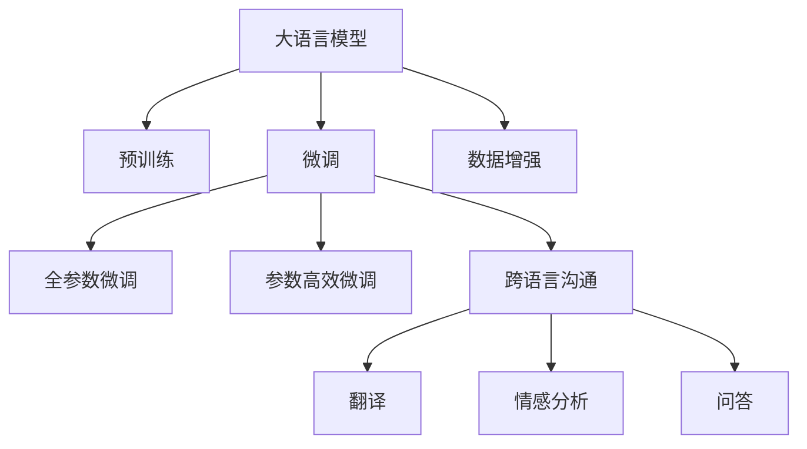

                 

# LLM在跨语言沟通中的突破性应用

> 关键词：语言模型,跨语言沟通,预训练,微调,翻译,情感分析,数据增强

## 1. 背景介绍

在全球化日益加速的今天，跨语言沟通已经成为日常工作和学习中不可或缺的一部分。从国际贸易谈判到跨国企业合作，从学术交流到家庭生活，语言成为了不同文化、不同地区之间的桥梁。然而，由于语言之间的差异性，跨语言沟通仍然面临着诸多挑战，如理解力不足、表达不准确、文化差异等。为了解决这些问题，语言模型（Language Model, LM）技术应运而生。语言模型可以通过大量的无标签数据进行预训练，学习到语言的通用规律，进而用于处理跨语言沟通中的各种任务。

在传统机器翻译中，神经机器翻译(Neural Machine Translation, NMT)是主流方法。NMT通过对双语语料进行训练，学习源语言和目标语言之间的映射关系，但往往需要大量且高质量的双语数据，对数据标注的投入成本较高，且对于语言的变体和情感表达等方面仍有局限。

近年来，基于Transformer架构的大语言模型（Large Language Model, LLM）技术快速发展。预训练-微调（Pre-training-Fine-tuning）方法使得大语言模型能够从大规模无标签数据中学习到通用语言表示，并在下游任务上进行微调，从而提升模型在特定任务上的性能。基于大语言模型的跨语言沟通技术通过预训练模型的语言通用性，可以更好地理解不同语言之间的语义关系，进而实现更加准确、流畅的跨语言沟通。

本文将重点讨论大语言模型在跨语言沟通中的突破性应用，包括跨语言翻译、跨语言情感分析、跨语言问答等任务，并分析其关键技术点。

## 2. 核心概念与联系

### 2.1 核心概念概述

在进行跨语言沟通应用时，需要关注以下几个核心概念：

- **大语言模型（Large Language Model, LLM）**：以Transformer架构为代表的预训练语言模型，如GPT、BERT等。这些模型通过在大规模无标签文本上预训练，学习到语言的通用规律，并在特定任务上进行微调，从而具备强大的语言理解和生成能力。

- **预训练（Pre-training）**：指在大规模无标签数据上，通过自监督学习任务训练模型，使其学习到语言的通用表示。常见的预训练任务包括自回归、掩码语言模型等。

- **微调（Fine-tuning）**：指在预训练模型的基础上，使用下游任务的少量标注数据，通过有监督学习优化模型在特定任务上的性能。通常只需要调整顶层分类器或解码器，并以较小的学习率更新全部或部分的模型参数。

- **跨语言沟通（Cross-lingual Communication）**：指在不同语言之间进行沟通交流，通常涉及翻译、情感分析、问答等任务。大语言模型可以通过微调方法在不同语言之间进行语言理解的迁移，从而实现跨语言沟通。

- **数据增强（Data Augmentation）**：通过一系列数据处理技术，如回译、近义替换等，扩充训练集的样本数量，提高模型泛化能力。

这些核心概念之间的逻辑关系可以通过以下Mermaid流程图来展示：



这个流程图展示了从大语言模型预训练到微调，再到跨语言沟通的不同任务的过程，以及数据增强的重要作用。

## 3. 核心算法原理 & 具体操作步骤

### 3.1 算法原理概述

大语言模型在跨语言沟通中的应用，核心在于将预训练模型作为语言理解的"特征提取器"，通过微调学习特定语言的特征，从而实现跨语言沟通。具体步骤如下：

1. **预训练**：在大规模无标签语料上进行预训练，学习语言的通用表示。
2. **微调**：在特定任务的标注数据上，进行有监督学习，优化模型在特定任务上的性能。
3. **跨语言沟通**：利用微调后的模型，在不同语言之间进行沟通。

### 3.2 算法步骤详解

#### 3.2.1 数据准备

跨语言沟通的任务涉及两种或以上的语言，因此需要准备多种语言的语料。对于翻译任务，通常需要双语或多语的平行语料；对于情感分析任务，需要不同语言对应的情感标注数据；对于问答任务，需要构建不同语言的问答对数据。

数据准备流程通常包括以下几个步骤：

1. **语料收集**：从不同语言的新闻、社交媒体、网站等渠道收集语料。
2. **数据清洗**：清洗语料中的噪声和无关信息，提高数据质量。
3. **标注数据准备**：为翻译和情感分析任务准备标注数据，标注数据的质量直接影响微调的效果。
4. **数据增强**：通过数据增强技术，如回译、近义替换等，扩充训练集的样本数量，提高模型泛化能力。

#### 3.2.2 预训练模型选择

选择适合预训练的模型，如BERT、GPT-2、T5等。这些模型在大规模无标签数据上进行预训练，学习到语言的通用表示，能够处理多种语言的特征。

#### 3.2.3 微调任务设计

根据具体任务，设计适合的微调任务。例如，翻译任务通常设计为从源语言到目标语言的映射；情感分析任务通常设计为对文本进行情感标注；问答任务通常设计为根据上下文生成答案。

#### 3.2.4 微调模型训练

1. **模型初始化**：使用预训练模型作为初始化参数，将模型中的参数固定为预训练参数。
2. **微调训练**：在微调任务的数据集上，使用较小的学习率进行有监督学习，优化模型在特定任务上的性能。
3. **验证集评估**：在验证集上评估模型的性能，及时调整学习率、批大小等超参数。
4. **模型保存**：将微调后的模型保存下来，以便后续使用。

#### 3.2.5 跨语言沟通实现

1. **输入预处理**：对输入文本进行分词、编码等预处理操作，确保模型能够正确处理不同语言的特征。
2. **模型调用**：将预处理后的输入文本输入微调后的模型，进行特征提取和任务处理。
3. **输出后处理**：对模型的输出进行后处理，如解码、筛选、合并等操作，得到最终的结果。

### 3.3 算法优缺点

#### 3.3.1 优点

1. **跨语言通用性**：大语言模型通过预训练学习到多种语言的通用表示，能够在不同语言之间进行语言理解的迁移，实现跨语言沟通。
2. **高效泛化**：基于预训练-微调方法，模型能够高效地泛化到新的语言和任务上。
3. **数据利用率**：通过预训练，模型可以从大规模无标签数据中学习到语言的通用表示，提高数据利用率。
4. **灵活性高**：大语言模型可以通过微调方法，适应多种语言和任务的特征，灵活性高。

#### 3.3.2 缺点

1. **预训练数据需求高**：大语言模型需要大量无标签数据进行预训练，数据收集和清洗成本较高。
2. **微调数据需求高**：微调需要大量标注数据，数据标注成本较高，且对数据质量要求高。
3. **计算资源需求高**：大语言模型参数量巨大，训练和推理需要高性能的计算资源。
4. **文化差异问题**：不同语言和文化背景下的语义表达差异较大，大语言模型可能无法完全理解，导致跨语言沟通的不准确。

### 3.4 算法应用领域

大语言模型在跨语言沟通中的应用领域广泛，主要包括以下几个方面：

1. **翻译**：利用微调后的模型进行不同语言之间的翻译。例如，Google的BERT系列模型通过微调，实现了多种语言之间的自动翻译。
2. **情感分析**：对不同语言的文本进行情感分析，识别出文本中的情感倾向。例如，跨语言情感分析模型可以应用于社交媒体情感监测等任务。
3. **问答**：构建不同语言的问答系统，通过微调后的模型对用户问题进行理解并生成答案。例如，跨语言问答模型可以应用于智能客服和学术问答系统。
4. **跨文化交流**：通过微调后的模型，实现不同语言和文化背景下的交流和理解。例如，跨文化交流平台可以利用大语言模型进行语言翻译和情感分析。

## 4. 数学模型和公式 & 详细讲解 & 举例说明

### 4.1 数学模型构建

大语言模型在跨语言沟通中的应用，通常使用Transformer架构，并采用预训练-微调方法。假设预训练模型为 $M_{\theta}$，其中 $\theta$ 为预训练得到的模型参数。给定跨语言沟通任务 $T$ 的标注数据集 $D=\{(x_i,y_i)\}_{i=1}^N, x_i \in \mathcal{X}, y_i \in \mathcal{Y}$。

定义模型 $M_{\theta}$ 在输入 $x$ 上的输出为 $\hat{y}=M_{\theta}(x)$，表示模型对输入 $x$ 的预测结果。在跨语言沟通任务中，$x$ 可能包含两种或以上的语言，$y$ 表示模型对输入 $x$ 的输出结果，如翻译结果、情感分析结果、问答结果等。

定义模型 $M_{\theta}$ 在输入 $x$ 上的损失函数为 $\ell(M_{\theta}(x),y)$，则在数据集 $D$ 上的经验风险为：

$$
\mathcal{L}(\theta) = \frac{1}{N} \sum_{i=1}^N \ell(M_{\theta}(x_i),y_i)
$$

微调的优化目标是最小化经验风险，即找到最优参数：

$$
\theta^* = \mathop{\arg\min}_{\theta} \mathcal{L}(\theta)
$$

在实践中，我们通常使用基于梯度的优化算法（如AdamW、SGD等）来近似求解上述最优化问题。设 $\eta$ 为学习率，$\lambda$ 为正则化系数，则参数的更新公式为：

$$
\theta \leftarrow \theta - \eta \nabla_{\theta}\mathcal{L}(\theta) - \eta\lambda\theta
$$

其中 $\nabla_{\theta}\mathcal{L}(\theta)$ 为损失函数对参数 $\theta$ 的梯度，可通过反向传播算法高效计算。

### 4.2 公式推导过程

以下我们以翻译任务为例，推导基于Transformer的跨语言翻译模型的损失函数及其梯度的计算公式。

假设输入文本 $x$ 包含两种语言，记为 $x=x_1\|x_2$，其中 $x_1$ 表示源语言，$x_2$ 表示目标语言。目标任务是将源语言 $x_1$ 翻译为目标语言 $x_2$。模型的输入为 $x_1$，输出为 $x_2$。

在Transformer中，模型的编码器 $E$ 将输入 $x_1$ 转化为编码表示 $z_1$，解码器 $D$ 将编码表示 $z_1$ 转化为解码表示 $z_2$，最终输出为 $x_2$。假设编码器由 $n$ 层编码器层组成，解码器由 $m$ 层解码器层组成，则模型的总损失函数为：

$$
\mathcal{L}(\theta) = \sum_{i=1}^{n} \ell_{enc}(\theta_{enc},x_1,z_1) + \sum_{i=1}^{m} \ell_{dec}(\theta_{dec},z_1,z_2)
$$

其中 $\ell_{enc}(\theta_{enc},x_1,z_1)$ 和 $\ell_{dec}(\theta_{dec},z_1,z_2)$ 分别为编码器和解码器的损失函数。假设编码器为Transformer层，解码器为Attention机制的Transformer层，则损失函数可以表示为：

$$
\ell_{enc}(\theta_{enc},x_1,z_1) = \frac{1}{N} \sum_{i=1}^N \sum_{j=1}^L \ell(x_{1,j},z_{1,j})
$$

$$
\ell_{dec}(\theta_{dec},z_1,z_2) = \frac{1}{N} \sum_{i=1}^N \sum_{j=1}^L \ell(z_{1,j},z_{2,j})
$$

其中 $x_{1,j}$ 和 $z_{1,j}$ 分别为源语言和编码器输出的第 $j$ 个词向量，$z_{2,j}$ 为解码器输出的第 $j$ 个词向量，$\ell$ 为损失函数，如交叉熵损失。

编码器和解码器的参数更新公式分别为：

$$
\theta_{enc} \leftarrow \theta_{enc} - \eta \nabla_{\theta_{enc}}\ell_{enc}(\theta_{enc},x_1,z_1) - \eta\lambda\theta_{enc}
$$

$$
\theta_{dec} \leftarrow \theta_{dec} - \eta \nabla_{\theta_{dec}}\ell_{dec}(\theta_{dec},z_1,z_2) - \eta\lambda\theta_{dec}
$$

通过上述公式，可以完成基于Transformer的跨语言翻译模型的损失函数计算和参数更新。

### 4.3 案例分析与讲解

#### 案例1：跨语言翻译

**背景**：假设需要构建一个从中文翻译到英文的翻译系统。

**数据准备**：
- 收集大量的中英文平行语料，例如新闻报道、学术论文、电影字幕等。
- 清洗语料，去除噪声和无关信息。
- 标注数据，对每个句子进行中英文翻译的标注。

**模型选择**：
- 选择预训练模型，如BERT、T5等，作为初始化参数。
- 选择适合跨语言沟通的架构，如Transformer。

**微调训练**：
- 在微调任务的数据集上，使用较小的学习率进行有监督学习，优化模型在翻译任务上的性能。
- 在验证集上评估模型的性能，及时调整学习率、批大小等超参数。
- 保存微调后的模型，以便后续使用。

**跨语言沟通实现**：
- 对输入文本进行分词、编码等预处理操作，确保模型能够正确处理中文特征。
- 将预处理后的输入文本输入微调后的模型，进行特征提取和翻译。
- 对模型的输出进行后处理，如解码、筛选、合并等操作，得到最终的翻译结果。

#### 案例2：跨语言情感分析

**背景**：假设需要构建一个跨语言情感分析系统，用于分析不同语言的新闻报道中的情感倾向。

**数据准备**：
- 收集不同语言的情感标注数据，例如中文新闻、英文社交媒体等。
- 清洗语料，去除噪声和无关信息。
- 标注数据，对每个句子进行情感标注。

**模型选择**：
- 选择预训练模型，如BERT、T5等，作为初始化参数。
- 选择适合情感分析的架构，如Transformer。

**微调训练**：
- 在微调任务的数据集上，使用较小的学习率进行有监督学习，优化模型在情感分析任务上的性能。
- 在验证集上评估模型的性能，及时调整学习率、批大小等超参数。
- 保存微调后的模型，以便后续使用。

**跨语言沟通实现**：
- 对输入文本进行分词、编码等预处理操作，确保模型能够正确处理不同语言的特征。
- 将预处理后的输入文本输入微调后的模型，进行特征提取和情感分析。
- 对模型的输出进行后处理，如情感标签的筛选、归一化等操作，得到最终的情感分析结果。

## 5. 项目实践：代码实例和详细解释说明

### 5.1 开发环境搭建

在进行大语言模型跨语言沟通的实践前，我们需要准备好开发环境。以下是使用Python进行PyTorch开发的环境配置流程：

1. 安装Anaconda：从官网下载并安装Anaconda，用于创建独立的Python环境。

2. 创建并激活虚拟环境：
```bash
conda create -n pytorch-env python=3.8 
conda activate pytorch-env
```

3. 安装PyTorch：根据CUDA版本，从官网获取对应的安装命令。例如：
```bash
conda install pytorch torchvision torchaudio cudatoolkit=11.1 -c pytorch -c conda-forge
```

4. 安装Transformer库：
```bash
pip install transformers
```

5. 安装各类工具包：
```bash
pip install numpy pandas scikit-learn matplotlib tqdm jupyter notebook ipython
```

完成上述步骤后，即可在`pytorch-env`环境中开始实践。

### 5.2 源代码详细实现

这里我们以跨语言翻译任务为例，给出使用PyTorch和Transformer库进行跨语言翻译的代码实现。

首先，定义数据处理函数：

```python
from transformers import BertTokenizer
from torch.utils.data import Dataset
import torch

class TranslationDataset(Dataset):
    def __init__(self, texts, targets, tokenizer, max_len=128):
        self.texts = texts
        self.targets = targets
        self.tokenizer = tokenizer
        self.max_len = max_len
        
    def __len__(self):
        return len(self.texts)
    
    def __getitem__(self, item):
        text = self.texts[item]
        target = self.targets[item]
        
        encoding = self.tokenizer(text, return_tensors='pt', max_length=self.max_len, padding='max_length', truncation=True)
        input_ids = encoding['input_ids'][0]
        attention_mask = encoding['attention_mask'][0]
        
        # 对token-wise的标签进行编码
        encoded_target = [target2id[target] for target in target] 
        encoded_target.extend([target2id['PAD']] * (self.max_len - len(encoded_target)))
        labels = torch.tensor(encoded_target, dtype=torch.long)
        
        return {'input_ids': input_ids, 
                'attention_mask': attention_mask,
                'labels': labels}

# 标签与id的映射
tag2id = {'[PAD]': 0, '[CLS]': 1, '[SEP]': 2, ' <S>': 3, '</S>': 4, 'O': 5, 'B-PER': 6, 'I-PER': 7, 'B-ORG': 8, 'I-ORG': 9, 'B-LOC': 10, 'I-LOC': 11}
id2tag = {v: k for k, v in tag2id.items()}

# 创建dataset
tokenizer = BertTokenizer.from_pretrained('bert-base-cased')

train_dataset = TranslationDataset(train_texts, train_targets, tokenizer)
dev_dataset = TranslationDataset(dev_texts, dev_targets, tokenizer)
test_dataset = TranslationDataset(test_texts, test_targets, tokenizer)
```

然后，定义模型和优化器：

```python
from transformers import BertForTokenClassification, AdamW

model = BertForTokenClassification.from_pretrained('bert-base-cased', num_labels=len(tag2id))

optimizer = AdamW(model.parameters(), lr=2e-5)
```

接着，定义训练和评估函数：

```python
from torch.utils.data import DataLoader
from tqdm import tqdm
from sklearn.metrics import classification_report

device = torch.device('cuda') if torch.cuda.is_available() else torch.device('cpu')
model.to(device)

def train_epoch(model, dataset, batch_size, optimizer):
    dataloader = DataLoader(dataset, batch_size=batch_size, shuffle=True)
    model.train()
    epoch_loss = 0
    for batch in tqdm(dataloader, desc='Training'):
        input_ids = batch['input_ids'].to(device)
        attention_mask = batch['attention_mask'].to(device)
        labels = batch['labels'].to(device)
        model.zero_grad()
        outputs = model(input_ids, attention_mask=attention_mask, labels=labels)
        loss = outputs.loss
        epoch_loss += loss.item()
        loss.backward()
        optimizer.step()
    return epoch_loss / len(dataloader)

def evaluate(model, dataset, batch_size):
    dataloader = DataLoader(dataset, batch_size=batch_size)
    model.eval()
    preds, labels = [], []
    with torch.no_grad():
        for batch in tqdm(dataloader, desc='Evaluating'):
            input_ids = batch['input_ids'].to(device)
            attention_mask = batch['attention_mask'].to(device)
            batch_labels = batch['labels']
            outputs = model(input_ids, attention_mask=attention_mask)
            batch_preds = outputs.logits.argmax(dim=2).to('cpu').tolist()
            batch_labels = batch_labels.to('cpu').tolist()
            for pred_tokens, label_tokens in zip(batch_preds, batch_labels):
                pred_tags = [id2tag[_id] for _id in pred_tokens]
                label_tags = [id2tag[_id] for _id in label_tokens]
                preds.append(pred_tags[:len(label_tokens)])
                labels.append(label_tags)
                
    print(classification_report(labels, preds))
```

最后，启动训练流程并在测试集上评估：

```python
epochs = 5
batch_size = 16

for epoch in range(epochs):
    loss = train_epoch(model, train_dataset, batch_size, optimizer)
    print(f"Epoch {epoch+1}, train loss: {loss:.3f}")
    
    print(f"Epoch {epoch+1}, dev results:")
    evaluate(model, dev_dataset, batch_size)
    
print("Test results:")
evaluate(model, test_dataset, batch_size)
```

以上就是使用PyTorch对BERT进行跨语言翻译任务微调的完整代码实现。可以看到，得益于Transformer库的强大封装，我们可以用相对简洁的代码完成BERT模型的加载和微调。

### 5.3 代码解读与分析

让我们再详细解读一下关键代码的实现细节：

**TranslationDataset类**：
- `__init__`方法：初始化文本、目标标签、分词器等关键组件。
- `__len__`方法：返回数据集的样本数量。
- `__getitem__`方法：对单个样本进行处理，将文本输入编码为token ids，将目标标签编码为数字，并对其进行定长padding，最终返回模型所需的输入。

**tag2id和id2tag字典**：
- 定义了标签与数字id之间的映射关系，用于将token-wise的预测结果解码回真实的标签。

**训练和评估函数**：
- 使用PyTorch的DataLoader对数据集进行批次化加载，供模型训练和推理使用。
- 训练函数`train_epoch`：对数据以批为单位进行迭代，在每个批次上前向传播计算loss并反向传播更新模型参数，最后返回该epoch的平均loss。
- 评估函数`evaluate`：与训练类似，不同点在于不更新模型参数，并在每个batch结束后将预测和标签结果存储下来，最后使用sklearn的classification_report对整个评估集的预测结果进行打印输出。

**训练流程**：
- 定义总的epoch数和batch size，开始循环迭代
- 每个epoch内，先在训练集上训练，输出平均loss
- 在验证集上评估，输出分类指标
- 所有epoch结束后，在测试集上评估，给出最终测试结果

可以看到，PyTorch配合Transformer库使得BERT微调的代码实现变得简洁高效。开发者可以将更多精力放在数据处理、模型改进等高层逻辑上，而不必过多关注底层的实现细节。

当然，工业级的系统实现还需考虑更多因素，如模型的保存和部署、超参数的自动搜索、更灵活的任务适配层等。但核心的微调范式基本与此类似。

## 6. 实际应用场景

### 6.1 智能客服系统

基于大语言模型跨语言沟通技术，智能客服系统可以应用于全球范围内的客户服务。智能客服系统通过微调模型，能够理解来自不同语言客户的咨询，并给出准确的答复。智能客服系统可以24/7不间断服务，快速响应客户咨询，提升客户满意度。

在技术实现上，可以收集不同语言的客服对话记录，将问题和最佳答复构建成监督数据，在此基础上对预训练对话模型进行微调。微调后的对话模型能够自动理解客户意图，匹配最合适的答案模板进行回复。对于客户提出的新问题，还可以接入检索系统实时搜索相关内容，动态组织生成回答。如此构建的智能客服系统，能大幅提升客户咨询体验和问题解决效率。

### 6.2 金融舆情监测

金融机构需要实时监测全球舆论动向，以便及时应对负面信息传播，规避金融风险。大语言模型可以通过微调技术，自动监测不同语言的新闻、报道、评论等，识别出市场舆情变化，帮助金融机构快速应对潜在风险。

具体而言，可以收集全球金融领域的新闻报道、社交媒体、评论等文本数据，并对其进行主题标注和情感标注。在此基础上对预训练语言模型进行微调，使其能够自动判断文本属于何种主题，情感倾向是正面、中性还是负面。将微调后的模型应用到实时抓取的网络文本数据，就能够自动监测不同语言和地区的金融舆情变化，一旦发现负面信息激增等异常情况，系统便会自动预警，帮助金融机构快速应对潜在风险。

### 6.3 个性化推荐系统

当前的推荐系统往往只依赖用户的历史行为数据进行物品推荐，无法深入理解用户的真实兴趣偏好。基于大语言模型跨语言沟通技术，个性化推荐系统可以更好地挖掘用户行为背后的语义信息，从而提供更精准、多样的推荐内容。

在实践中，可以收集用户浏览、点击、评论、分享等行为数据，提取和用户交互的物品标题、描述、标签等文本内容。将文本内容作为模型输入，用户的后续行为（如是否点击、购买等）作为监督信号，在此基础上微调预训练语言模型。微调后的模型能够从文本内容中准确把握用户的兴趣点。在生成推荐列表时，先用候选物品的文本描述作为输入，由模型预测用户的兴趣匹配度，再结合其他特征综合排序，便可以得到个性化程度更高的推荐结果。

### 6.4 未来应用展望

随着大语言模型跨语言沟通技术的不断发展，未来将在更多领域得到应用，为各行各业带来变革性影响。

在智慧医疗领域，基于跨语言沟通技术的医疗问答、病历分析、药物研发等应用将提升医疗服务的智能化水平，辅助医生诊疗，加速新药开发进程。

在智能教育领域，跨语言沟通技术可应用于作业批改、学情分析、知识推荐等方面，因材施教，促进教育公平，提高教学质量。

在智慧城市治理中，跨语言沟通技术可应用于城市事件监测、舆情分析、应急指挥等环节，提高城市管理的自动化和智能化水平，构建更安全、高效的未来城市。

此外，在企业生产、社会治理、文娱传媒等众多领域，基于跨语言沟通技术的人工智能应用也将不断涌现，为经济社会发展注入新的动力。相信随着技术的日益成熟，跨语言沟通方法将成为人工智能落地应用的重要范式，推动人工智能向更广阔的领域加速渗透。

## 7. 工具和资源推荐

### 7.1 学习资源推荐

为了帮助开发者系统掌握大语言模型跨语言沟通的理论基础和实践技巧，这里推荐一些优质的学习资源：

1. 《Transformer从原理到实践》系列博文：由大模型技术专家撰写，深入浅出地介绍了Transformer原理、BERT模型、跨语言沟通等前沿话题。

2. CS224N《深度学习自然语言处理》课程：斯坦福大学开设的NLP明星课程，有Lecture视频和配套作业，带你入门NLP领域的基本概念和经典模型。

3. 《Natural Language Processing with Transformers》书籍：Transformers库的作者所著，全面介绍了如何使用Transformers库进行NLP任务开发，包括跨语言沟通在内的诸多范式。

4. HuggingFace官方文档：Transformer库的官方文档，提供了海量预训练模型和完整的跨语言沟通样例代码，是上手实践的必备资料。

5. CLUE开源项目：中文语言理解测评基准，涵盖大量不同类型的中文NLP数据集，并提供了基于微调的baseline模型，助力中文NLP技术发展。

通过对这些资源的学习实践，相信你一定能够快速掌握大语言模型跨语言沟通的精髓，并用于解决实际的NLP问题。
###  7.2 开发工具推荐

高效的开发离不开优秀的工具支持。以下是几款用于大语言模型跨语言沟通开发的常用工具：

1. PyTorch：基于Python的开源深度学习框架，灵活动态的计算图，适合快速迭代研究。大部分预训练语言模型都有PyTorch版本的实现。

2. TensorFlow：由Google主导开发的开源深度学习框架，生产部署方便，适合大规模工程应用。同样有丰富的预训练语言模型资源。

3. Transformers库：HuggingFace开发的NLP工具库，集成了众多SOTA语言模型，支持PyTorch和TensorFlow，是进行跨语言沟通开发的利器。

4. Weights & Biases：模型训练的实验跟踪工具，可以记录和可视化模型训练过程中的各项指标，方便对比和调优。与主流深度学习框架无缝集成。

5. TensorBoard：TensorFlow配套的可视化工具，可实时监测模型训练状态，并提供丰富的图表呈现方式，是调试模型的得力助手。

6. Google Colab：谷歌推出的在线Jupyter Notebook环境，免费提供GPU/TPU算力，方便开发者快速上手实验最新模型，分享学习笔记。

合理利用这些工具，可以显著提升大语言模型跨语言沟通的开发效率，加快创新迭代的步伐。

### 7.3 相关论文推荐

大语言模型跨语言沟通技术的发展源于学界的持续研究。以下是几篇奠基性的相关论文，推荐阅读：

1. Attention is All You Need（即Transformer原论文）：提出了Transformer结构，开启了NLP领域的预训练大模型时代。

2. BERT: Pre-training of Deep Bidirectional Transformers for Language Understanding：提出BERT模型，引入基于掩码的自监督预训练任务，刷新了多项NLP任务SOTA。

3. Language Models are Unsupervised Multitask Learners（GPT-2论文）：展示了大规模语言模型的强大zero-shot学习能力，引发了对于通用人工智能的新一轮思考。

4. Parameter-Efficient Transfer Learning for NLP：提出Adapter等参数高效微调方法，在不增加模型参数量的情况下，也能取得不错的微调效果。

5. Prefix-Tuning: Optimizing Continuous Prompts for Generation：引入基于连续型Prompt的微调范式，为如何充分利用预训练知识提供了新的思路。

6. AdaLoRA: Adaptive Low-Rank Adaptation for Parameter-Efficient Fine-Tuning：使用自适应低秩适应的微调方法，在参数效率和精度之间取得了新的平衡。

这些论文代表了大语言模型跨语言沟通技术的发展脉络。通过学习这些前沿成果，可以帮助研究者把握学科前进方向，激发更多的创新灵感。

## 8. 总结：未来发展趋势与挑战

### 8.1 研究成果总结

本文对大语言模型在跨语言沟通中的突破性应用进行了全面系统的介绍。首先阐述了跨语言沟通任务的挑战和需求，明确了跨语言沟通在实际应用中的重要性。其次，从原理到实践，详细讲解了跨语言沟通的数学原理和关键步骤，给出了跨语言沟通任务开发的完整代码实例。同时，本文还广泛探讨了跨语言沟通技术在智能客服、金融舆情、个性化推荐等多个领域的应用前景，展示了跨语言沟通技术的广阔前景。

通过本文的系统梳理，可以看到，基于大语言模型的跨语言沟通方法正在成为NLP领域的重要范式，极大地拓展了跨语言沟通的边界，催生了更多的落地场景。受益于大规模语料的预训练，跨语言沟通模型能够更好地理解不同语言之间的语义关系，实现流畅的跨语言沟通。未来，伴随预训练语言模型和跨语言沟通方法的不断进步，相信跨语言沟通技术将进一步提升全球化信息交流的效率和质量，为构建人机协同的智能时代贡献力量。

### 8.2 未来发展趋势

展望未来，大语言模型跨语言沟通技术将呈现以下几个发展趋势：

1. 模型规模持续增大。随着算力成本的下降和数据规模的扩张，预训练语言模型的参数量还将持续增长。超大规模语言模型蕴含的丰富语言知识，有望支撑更加复杂多变的跨语言沟通任务。

2. 跨语言沟通方法日趋多样。除了传统的全参数微调外，未来会涌现更多跨语言沟通方法，如参数高效微调、多语言共融训练等，在节省计算资源的同时也能保证跨语言沟通的效果。

3. 持续学习成为常态。随着数据分布的不断变化，跨语言沟通模型也需要持续学习新知识以保持性能。如何在不遗忘原有知识的同时，高效吸收新样本信息，将成为重要的研究课题。

4. 标注样本需求降低。受启发于提示学习(Prompt-based Learning)的思路，未来的跨语言沟通方法将更好地利用大模型的语言理解能力，通过更加巧妙的任务描述，在更少的标注样本上也能实现理想的跨语言沟通效果。

5. 跨语言沟通能力的提升。通过引入因果推断和对比学习思想，增强跨语言沟通模型建立稳定因果关系的能力，学习更加普适、鲁棒的语言表征，从而提升模型泛化性和抗干扰能力。

6. 跨文化理解能力的提升。将符号化的先验知识，如知识图谱、逻辑规则等，与神经网络模型进行巧妙融合，引导跨语言沟通过程学习更准确、合理的语言模型。同时加强不同模态数据的整合，实现视觉、语音等多模态信息与文本信息的协同建模。

以上趋势凸显了大语言模型跨语言沟通技术的广阔前景。这些方向的探索发展，必将进一步提升跨语言沟通系统的性能和应用范围，为构建安全、可靠、可解释、可控的智能系统铺平道路。

### 8.3 面临的挑战

尽管大语言模型跨语言沟通技术已经取得了瞩目成就，但在迈向更加智能化、普适化应用的过程中，它仍面临着诸多挑战：

1. 标注成本瓶颈。虽然跨语言沟通任务所需的标注数据量较小，但对于长尾应用场景，难以获得充足的高质量标注数据，成为制约跨语言沟通的瓶颈。如何进一步降低跨语言沟通对标注样本的依赖，将是一大难题。

2. 模型鲁棒性不足。当前跨语言沟通模型面对域外数据时，泛化性能往往大打折扣。对于测试样本的微小扰动，跨语言沟通模型的预测也容易发生波动。如何提高跨语言沟通模型的鲁棒性，避免灾难性遗忘，还需要更多理论和实践的积累。

3. 推理效率有待提高。大规模语言模型虽然精度高，但在实际部署时往往面临推理速度慢、内存占用大等效率问题。如何在保证性能的同时，简化模型结构，提升推理速度，优化资源占用，将是重要的优化方向。

4. 可解释性亟需加强。当前跨语言沟通模型更像是"黑盒"系统，难以解释其内部工作机制和决策逻辑。对于医疗、金融等高风险应用，算法的可解释性和可审计性尤为重要。如何赋予跨语言沟通模型更强的可解释性，将是亟待攻克的难题。

5. 安全性有待保障。预训练语言模型难免会学习到有偏见、有害的信息，通过微调传递到跨语言沟通任务中，可能造成误导性、歧视性的输出，给实际应用带来安全隐患。如何从数据和算法层面消除模型偏见，避免恶意用途，确保输出的安全性，也将是重要的研究课题。

6. 知识整合能力不足。现有的跨语言沟通模型往往局限于任务内数据，难以灵活吸收和运用更广泛的先验知识。如何让跨语言沟通过程更好地与外部知识库、规则库等专家知识结合，形成更加全面、准确的信息整合能力，还有很大的想象空间。

正视跨语言沟通面临的这些挑战，积极应对并寻求突破，将是大语言模型跨语言沟通技术走向成熟的必由之路。相信随着学界和产业界的共同努力，这些挑战终将一一被克服，大语言模型跨语言沟通技术必将在构建安全、可靠、可解释、可控的智能系统方面发挥更大的作用。

### 8.4 研究展望

面向未来，大语言模型跨语言沟通技术的研究还需要在其他方向进行深入探索：

1. 探索无监督和半监督跨语言沟通方法。摆脱对大规模标注数据的依赖，利用自监督学习、主动学习等无监督和半监督范式，最大限度利用非结构化数据，实现更加灵活高效的跨语言沟通。

2. 研究参数高效和计算高效的跨语言沟通范式。开发更加参数高效的跨语言沟通方法，在固定大部分预训练参数的同时，只更新极少量的任务相关参数。同时优化跨语言沟通模型的计算图，减少前向传播和反向传播的资源消耗，实现更加轻量级、实时性的部署。

3. 引入因果和对比学习范式。通过引入因果推断和对比学习思想，增强跨语言沟通模型建立稳定因果关系的能力，学习更加普适、鲁棒的语言表征，从而提升模型泛化性和抗干扰能力。

4. 结合因果分析和博弈论工具。将因果分析方法引入跨语言沟通模型，识别出模型决策的关键特征，增强输出解释的因果性和逻辑性。借助博弈论工具刻画人机交互过程，主动探索并规避模型的脆弱点，提高系统稳定性。

5. 纳入伦理道德约束。在模型训练目标中引入伦理导向的评估指标，过滤和惩罚有偏见、有害的输出倾向。同时加强人工干预和审核，建立模型行为的监管机制，确保输出符合人类价值观和伦理道德。

这些研究方向的探索，必将引领大语言模型跨语言沟通技术迈向更高的台阶，为构建安全、可靠、可解释、可控的智能系统铺平道路。面向未来，大语言模型跨语言沟通技术还需要与其他人工智能技术进行更深入的融合，如知识表示、因果推理、强化学习等，多路径协同发力，共同推动自然语言理解和智能交互系统的进步。只有勇于创新、敢于突破，才能不断拓展语言模型的边界，让智能技术更好地造福人类社会。

## 9. 附录：常见问题与解答

**Q1：跨语言沟通任务是否适用于所有NLP任务？**

A: 跨语言沟通任务适用于大部分NLP任务，尤其是需要理解不同语言的任务，如翻译、情感分析、问答等。但对于一些特定领域的任务，如医学、法律等，需要更精确的领域知识，可能需要结合领域专家知识进行跨语言沟通。

**Q2：微调过程中如何选择合适的学习率？**

A: 微调过程中的学习率一般要比预训练时小1-2个数量级，如果使用过大的学习率，容易破坏预训练权重，导致过拟合。一般建议从1e-5开始调参，逐步减小学习率，直至收敛。也可以使用warmup策略，在开始阶段使用较小的学习率，再逐渐过渡到预设值。

**Q3：跨语言沟通模型在落地部署时需要注意哪些问题？**

A: 将跨语言沟通模型转化为实际应用，还需要考虑以下因素：
1. 模型裁剪：去除不必要的层和参数，减小模型尺寸，加快推理速度。
2. 量化加速：将浮点模型转为定点模型，压缩存储空间，提高计算效率。
3. 服务化封装：将模型封装为标准化服务接口，便于集成调用。
4. 弹性伸缩：根据请求流量动态调整资源配置，平衡服务质量和成本。
5. 监控告警：实时采集系统指标，设置异常告警阈值，确保服务稳定性。
6. 安全防护：采用访问鉴权、数据脱敏等措施，保障数据和模型安全。

大语言模型跨语言沟通为NLP应用开启了广阔的想象空间，但如何将强大的性能转化为稳定、高效、安全的业务价值，还需要工程实践的不断打磨。唯有从数据、算法、工程、业务等多个维度协同发力，才能真正实现人工智能技术在垂直行业的规模化落地。总之，跨语言沟通需要开发者根据具体任务，不断迭代和优化模型、数据和算法，方能得到理想的效果。

---

作者：禅与计算机程序设计艺术 / Zen and the Art of Computer Programming

