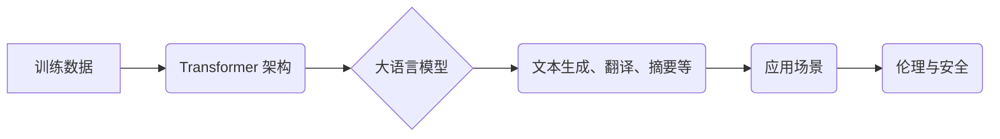

> GPT-5, 人工智能, 大语言模型, 硅谷, 期待, 疑虑, 伦理, 安全, 监管

## 1. 背景介绍

近年来，人工智能（AI）技术飞速发展，特别是大语言模型（LLM）的突破性进展，引发了全球范围内的广泛关注和热议。作为LLM领域的领军者，OpenAI的GPT系列模型（GPT-3、GPT-3.5、ChatGPT）凭借其强大的文本生成能力和广泛的应用场景，迅速成为科技界和大众的焦点。

GPT-5的发布，无疑将成为AI领域的一场重大事件，其强大的能力和潜在的影响力引发了硅谷科技巨头和研究机构的期待和担忧。

## 2. 核心概念与联系

**2.1 大语言模型 (LLM)**

大语言模型是一种基于深度学习的强大人工智能模型，能够理解和生成人类语言。它们通过训练海量文本数据，学习语言的语法、语义和上下文关系，从而具备强大的文本生成、翻译、摘要、问答等能力。

**2.2 Transformer 架构**

Transformer是一种新型的神经网络架构，是LLM的核心技术之一。它通过“注意力机制”，能够有效地捕捉文本序列中的长距离依赖关系，从而提升了LLM的理解和生成能力。

**2.3 训练数据**

LLM的训练数据是其性能的关键因素。高质量、海量的数据能够帮助模型学习更丰富的语言知识和表达方式。

**2.4 伦理与安全**

LLM的强大能力也带来了伦理和安全方面的挑战。例如，模型可能被用于生成虚假信息、进行网络攻击或传播偏见。因此，如何确保LLM的负责任使用，是需要认真思考的问题。

**Mermaid 流程图**



## 3. 核心算法原理 & 具体操作步骤

**3.1 算法原理概述**

GPT-5的核心算法原理是基于Transformer架构的深度学习模型。它通过多层Transformer编码器和解码器结构，学习文本序列的上下文关系和语义信息。

**3.2 算法步骤详解**

1. **数据预处理:** 将文本数据进行清洗、分词、标记等预处理操作，使其能够被模型理解。
2. **模型训练:** 使用训练数据训练GPT-5模型，通过反向传播算法不断调整模型参数，使其能够生成更准确、更流畅的文本。
3. **模型评估:** 使用测试数据评估模型的性能，例如准确率、流畅度、多样性等指标。
4. **模型部署:** 将训练好的模型部署到实际应用场景中，例如聊天机器人、文本生成工具等。

**3.3 算法优缺点**

**优点:**

* 强大的文本生成能力
* 广泛的应用场景
* 可学习和适应不同语言

**缺点:**

* 训练成本高
* 数据依赖性强
* 存在伦理和安全风险

**3.4 算法应用领域**

* 聊天机器人
* 文本生成工具
* 机器翻译
* 文本摘要
* 代码生成
* 内容创作

## 4. 数学模型和公式 & 详细讲解 & 举例说明

**4.1 数学模型构建**

GPT-5的数学模型基于Transformer架构，其核心是注意力机制和多头注意力机制。

**注意力机制:**

注意力机制允许模型关注输入序列中与当前输出相关的部分，从而提高模型的理解能力。

公式:

$$
Attention(Q, K, V) = softmax(\frac{QK^T}{\sqrt{d_k}})V
$$

其中:

* Q: 查询矩阵
* K: 键矩阵
* V: 值矩阵
* $d_k$: 键向量的维度

**多头注意力机制:**

多头注意力机制通过并行计算多个注意力头，能够捕捉不同层次的语义信息。

公式:

$$
MultiHeadAttention(Q, K, V) = Concat(head_1, head_2, ..., head_h)W^O
$$

其中:

* head_1, head_2, ..., head_h: 多个注意力头的输出
* $W^O$: 输出权重矩阵

**4.2 公式推导过程**

注意力机制的公式推导过程涉及到矩阵运算和softmax函数。

**4.3 案例分析与讲解**

例如，在机器翻译任务中，注意力机制可以帮助模型关注源语言句子中与目标语言单词相关的部分，从而提高翻译的准确性。

## 5. 项目实践：代码实例和详细解释说明

**5.1 开发环境搭建**

* Python 3.7+
* PyTorch 1.7+
* CUDA 10.2+

**5.2 源代码详细实现**

```python
import torch
import torch.nn as nn

class Transformer(nn.Module):
    def __init__(self, d_model, nhead, num_encoder_layers, num_decoder_layers):
        super(Transformer, self).__init__()
        self.encoder = nn.TransformerEncoder(nn.TransformerEncoderLayer(d_model, nhead), num_encoder_layers)
        self.decoder = nn.TransformerDecoder(nn.TransformerDecoderLayer(d_model, nhead), num_decoder_layers)

    def forward(self, src, tgt, src_mask, tgt_mask):
        src = self.encoder(src, src_mask)
        tgt = self.decoder(tgt, src, tgt_mask)
        return tgt

# ... 其他代码 ...
```

**5.3 代码解读与分析**

* Transformer类定义了编码器和解码器结构。
* nn.TransformerEncoderLayer和nn.TransformerDecoderLayer分别定义了编码器和解码器的单个层。
* forward方法定义了模型的输入和输出。

**5.4 运行结果展示**

* 使用训练好的模型进行文本生成、翻译等任务，并展示结果。

## 6. 实际应用场景

**6.1 聊天机器人**

GPT-5可以用于构建更智能、更自然的聊天机器人，能够理解用户的意图并提供更精准的回复。

**6.2 文本生成工具**

GPT-5可以用于生成各种类型的文本，例如文章、故事、诗歌、代码等，提高内容创作效率。

**6.3 机器翻译**

GPT-5可以用于实现更高质量的机器翻译，能够更好地捕捉语言的语义和文化差异。

**6.4 未来应用展望**

GPT-5的应用场景远不止以上列举的，随着技术的不断发展，GPT-5将应用于更多领域，例如教育、医疗、法律等。

## 7. 工具和资源推荐

**7.1 学习资源推荐**

* Transformer论文: https://arxiv.org/abs/1706.03762
* OpenAI GPT系列文档: https://openai.com/blog/gpt-3/

**7.2 开发工具推荐**

* PyTorch: https://pytorch.org/
* TensorFlow: https://www.tensorflow.org/

**7.3 相关论文推荐**

* BERT: https://arxiv.org/abs/1810.04805
* T5: https://arxiv.org/abs/1910.10683

## 8. 总结：未来发展趋势与挑战

**8.1 研究成果总结**

GPT-5的发布标志着LLM技术取得了新的突破，其强大的能力和广泛的应用场景，为人工智能的发展带来了新的机遇。

**8.2 未来发展趋势**

* 模型规模进一步扩大
* 训练数据质量和多样性提升
* 算法效率和鲁棒性增强
* 多模态LLM的开发

**8.3 面临的挑战**

* 伦理和安全问题
* 数据隐私和安全问题
* 模型可解释性和透明度问题
* 偏见和歧视问题

**8.4 研究展望**

未来，LLM技术将继续朝着更智能、更安全、更负责任的方向发展，并将在更多领域发挥重要作用。

## 9. 附录：常见问题与解答

* **GPT-5与GPT-3有什么区别？**

* **GPT-5的训练数据是什么？**

* **如何使用GPT-5进行文本生成？**

* **GPT-5存在哪些伦理和安全风险？**

* **GPT-5的未来发展趋势是什么？**


作者：禅与计算机程序设计艺术 / Zen and the Art of Computer Programming 
<end_of_turn>