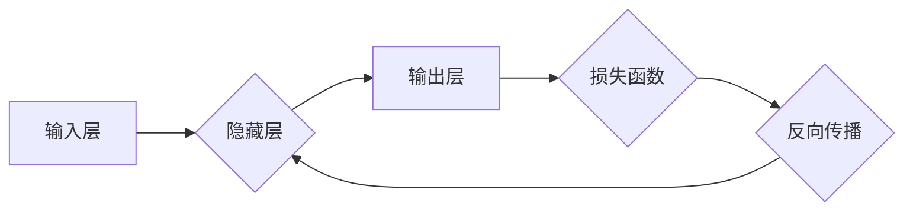

> 神经网络,深度学习,机器学习,人工神经网络,激活函数,反向传播,卷积神经网络,循环神经网络

## 1. 背景介绍

在当今数据爆炸的时代，机器学习（Machine Learning）作为人工智能（Artificial Intelligence）的核心技术，正在迅速发展并改变着我们生活的方方面面。其中，神经网络（Neural Networks）作为机器学习领域最具潜力的算法之一，在图像识别、自然语言处理、语音识别等领域取得了令人瞩目的成就。

神经网络的灵感来源于人类大脑的结构和功能。它由相互连接的“神经元”组成，这些神经元通过权重来传递信息，并通过激活函数来处理信息。通过训练，神经网络可以学习到数据中的复杂模式和关系，从而实现各种智能任务。

## 2. 核心概念与联系

**2.1 神经网络的基本结构**

神经网络通常由三层组成：输入层、隐藏层和输出层。

* **输入层:**接收原始数据，每个神经元代表一个特征。
* **隐藏层:**对输入数据进行处理和转换，可以有多个隐藏层，每个隐藏层包含多个神经元。
* **输出层:**输出最终结果，每个神经元代表一个类别或预测值。

**2.2 激活函数**

激活函数是神经网络中一个重要的组成部分，它决定了神经元的输出值。常见的激活函数包括 sigmoid 函数、ReLU 函数、tanh 函数等。激活函数的作用是引入非线性，使神经网络能够学习到更复杂的模式。

**2.3 权重和偏置**

权重和偏置是神经网络的参数，它们决定了神经元之间的连接强度和阈值。通过训练，神经网络会不断调整权重和偏置，以最小化预测误差。

**2.4 前向传播和反向传播**

* **前向传播:**将输入数据通过神经网络传递，最终得到输出结果。
* **反向传播:**计算输出结果与真实值的误差，并根据误差反向调整权重和偏置，以减小误差。

**2.5 损失函数**

损失函数用于衡量预测结果与真实值的差异。常见的损失函数包括均方误差（MSE）、交叉熵损失等。

**2.6 优化算法**

优化算法用于更新权重和偏置，以最小化损失函数。常见的优化算法包括梯度下降法、Adam 算法等。

**Mermaid 流程图**



## 3. 核心算法原理 & 具体操作步骤

### 3.1 算法原理概述

神经网络的核心算法是反向传播算法（Backpropagation Algorithm）。该算法通过计算误差梯度，逐步调整神经网络的权重和偏置，以最小化预测误差。

### 3.2 算法步骤详解

1. **前向传播:** 将输入数据通过神经网络传递，计算每个神经元的输出值。
2. **损失函数计算:** 计算输出结果与真实值的误差。
3. **反向传播:** 计算误差梯度，并根据梯度更新权重和偏置。
4. **重复步骤1-3:** 迭代训练，直到误差达到预设阈值。

### 3.3 算法优缺点

**优点:**

* 能够学习到复杂的数据模式。
* 泛化能力强，能够应用于不同的任务。

**缺点:**

* 训练时间长，需要大量的计算资源。
* 容易过拟合，需要进行正则化处理。

### 3.4 算法应用领域

* **图像识别:** 人脸识别、物体检测、图像分类等。
* **自然语言处理:** 文本分类、机器翻译、情感分析等。
* **语音识别:** 语音转文本、语音助手等。
* **推荐系统:** 商品推荐、用户画像等。

## 4. 数学模型和公式 & 详细讲解 & 举例说明

### 4.1 数学模型构建

神经网络的数学模型可以表示为一个多层感知机（Multilayer Perceptron，MLP）。

**输入层:**

$$
x = [x_1, x_2, ..., x_n]
$$

**隐藏层:**

$$
h = f(W_1x + b_1)
$$

**输出层:**

$$
y = f(W_2h + b_2)
$$

其中:

* $x$ 是输入向量。
* $h$ 是隐藏层的输出向量。
* $y$ 是输出向量。
* $W_1$ 和 $W_2$ 是权重矩阵。
* $b_1$ 和 $b_2$ 是偏置向量。
* $f$ 是激活函数。

### 4.2 公式推导过程

损失函数通常采用均方误差（MSE）：

$$
L = \frac{1}{2} \sum_{i=1}^{m} (y_i - t_i)^2
$$

其中:

* $y_i$ 是预测值。
* $t_i$ 是真实值。
* $m$ 是样本数量。

通过反向传播算法，可以计算出每个参数的梯度：

$$
\frac{\partial L}{\partial W} = \frac{\partial L}{\partial y} \cdot \frac{\partial y}{\partial W}
$$

然后利用梯度下降法更新参数:

$$
W = W - \eta \frac{\partial L}{\partial W}
$$

其中:

* $\eta$ 是学习率。

### 4.3 案例分析与讲解

假设我们有一个简单的二分类问题，输入数据为图像特征，输出为类别标签（0 或 1）。我们可以使用一个两层神经网络进行训练。

第一层隐藏层有 10 个神经元，使用 ReLU 激活函数。第二层输出层有 1 个神经元，使用 sigmoid 激活函数。

通过训练，神经网络可以学习到图像特征与类别标签之间的关系，从而实现图像分类。

## 5. 项目实践：代码实例和详细解释说明

### 5.1 开发环境搭建

* Python 3.x
* TensorFlow 或 PyTorch

### 5.2 源代码详细实现

```python
import tensorflow as tf

# 定义模型
model = tf.keras.models.Sequential([
    tf.keras.layers.Dense(10, activation='relu', input_shape=(784,)),
    tf.keras.layers.Dense(1, activation='sigmoid')
])

# 编译模型
model.compile(optimizer='adam',
              loss='binary_crossentropy',
              metrics=['accuracy'])

# 训练模型
model.fit(x_train, y_train, epochs=10)

# 评估模型
loss, accuracy = model.evaluate(x_test, y_test)
print('Loss:', loss)
print('Accuracy:', accuracy)
```

### 5.3 代码解读与分析

* **定义模型:** 使用 Keras API 定义一个两层神经网络模型。第一层隐藏层有 10 个神经元，使用 ReLU 激活函数。第二层输出层有 1 个神经元，使用 sigmoid 激活函数。
* **编译模型:** 使用 Adam 优化器、二分类交叉熵损失函数和精度指标编译模型。
* **训练模型:** 使用训练数据训练模型，训练 10 个 epochs。
* **评估模型:** 使用测试数据评估模型的性能，输出损失值和精度。

### 5.4 运行结果展示

训练完成后，可以观察模型的损失值和精度值的变化趋势。如果模型训练成功，损失值会逐渐降低，精度值会逐渐提高。

## 6. 实际应用场景

### 6.1 图像识别

* **人脸识别:** 用于解锁手机、验证身份、监控安全等。
* **物体检测:** 用于自动驾驶、安防监控、医疗诊断等。
* **图像分类:** 用于图片搜索、内容推荐、电商商品分类等。

### 6.2 自然语言处理

* **文本分类:** 用于垃圾邮件过滤、情感分析、新闻主题分类等。
* **机器翻译:** 用于将文本从一种语言翻译成另一种语言。
* **语音识别:** 用于语音转文本、语音助手等。

### 6.3 其他应用场景

* **推荐系统:** 基于用户行为和偏好，推荐商品、电影、音乐等。
* **医疗诊断:** 基于病历和影像数据，辅助医生诊断疾病。
* **金融预测:** 基于市场数据，预测股票价格、汇率等。

### 6.4 未来应用展望

随着人工智能技术的不断发展，神经网络将在更多领域得到应用，例如：

* **个性化教育:** 根据学生的学习情况，提供个性化的学习方案。
* **智能家居:** 通过语音控制、图像识别等技术，实现智能家居的自动化控制。
* **自动驾驶:** 利用神经网络实现车辆的感知、决策和控制，实现自动驾驶。

## 7. 工具和资源推荐

### 7.1 学习资源推荐

* **书籍:**
    * 《深度学习》
    * 《神经网络与深度学习》
* **在线课程:**
    * Coursera: 深度学习
    * Udacity: 深度学习工程师
* **博客:**
    * TensorFlow Blog
    * PyTorch Blog

### 7.2 开发工具推荐

* **TensorFlow:** 开源深度学习框架。
* **PyTorch:** 开源深度学习框架。
* **Keras:** 高级深度学习 API，可以运行在 TensorFlow、Theano 或 CNTK 后端。

### 7.3 相关论文推荐

* **AlexNet:** ImageNet Classification with Deep Convolutional Neural Networks
* **VGGNet:** Very Deep Convolutional Networks for Large-Scale Image Recognition
* **ResNet:** Deep Residual Learning for Image Recognition

## 8. 总结：未来发展趋势与挑战

### 8.1 研究成果总结

近年来，神经网络在图像识别、自然语言处理等领域取得了显著的成果，推动了人工智能技术的快速发展。

### 8.2 未来发展趋势

* **模型规模和复杂度:** 随着计算资源的不断提升，神经网络模型的规模和复杂度将进一步提高，从而实现更强大的学习能力。
* **新颖的网络架构:** 研究人员将不断探索新的网络架构，例如 Transformer、Graph Neural Networks 等，以解决更复杂的任务。
* **可解释性:** 如何提高神经网络的解释性，使其决策过程更加透明，是未来研究的重要方向。

### 8.3 面临的挑战

* **数据获取和标注:** 训练高质量的神经网络模型需要大量的标注数据，数据获取和标注成本较高。
* **计算资源:** 训练大型神经网络模型需要大量的计算资源，这对于资源有限的机构或个人来说是一个挑战。
* **伦理问题:** 神经网络的应用可能会带来一些伦理问题，例如数据隐私、算法偏见等，需要引起重视和解决。

### 8.4 研究展望

未来，神经网络技术将继续发展，并在更多领域得到应用。研究人员将继续探索新的算法、架构和应用场景，推动人工智能技术的进步，为人类社会带来更多福祉。

## 9. 附录：常见问题与解答

**1. 神经网络和深度学习有什么区别？**

深度学习是利用多层神经网络进行学习的一种机器学习方法。神经网络是深度学习的基础，而深度学习则是利用神经网络的深度结构来学习更复杂的模式。

**2. 如何选择合适的激活函数？**

不同的激活函数适用于不同的任务和网络结构。常见的激活函数包括 sigmoid、ReLU、tanh 等，需要根据具体情况选择合适的激活函数。

**3. 如何防止神经网络过拟合？**

过拟合是指神经网络在训练数据上表现很好，但在测试数据上表现较差。常用的防止过拟合的方法包括正则化、 dropout、数据增强等。

**4. 如何评估神经网络的性能？**

常用的评估指标包括精度、召回