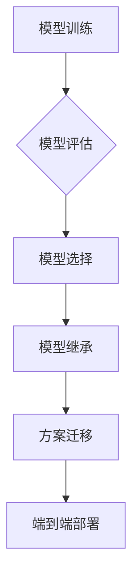

> 模型继承，方案迁移，端到端部署，机器学习，深度学习，软件工程

## 1. 背景介绍

在机器学习和深度学习领域，模型和方案的开发是一个迭代的过程。随着技术的不断进步和应用场景的不断拓展，我们往往需要将之前积累的模型和方案应用到新的项目中。然而，直接将旧的模型和方案移植到新的项目中并不总是可行的，因为新的项目可能存在不同的数据结构、业务逻辑和技术环境。因此，如何在端到端落地过程中有效地继承此前积累的模型和方案，成为了一个重要的技术挑战。

## 2. 核心概念与联系

**2.1 模型继承**

模型继承是指将之前训练好的模型作为新的模型的基础，进行微调或进一步训练。通过继承已有模型，可以节省训练时间和资源，并提高模型的性能。

**2.2 方案迁移**

方案迁移是指将之前开发的机器学习或深度学习解决方案迁移到新的项目中。这包括将模型、数据处理流程、评估指标等所有相关组件迁移到新的环境中。

**2.3 端到端部署**

端到端部署是指将机器学习模型从训练阶段部署到实际应用环境中，实现模型的自动化运行和数据处理。

**2.4 核心概念关系**

模型继承和方案迁移是端到端部署过程中不可或缺的环节。通过有效地继承和迁移模型和方案，可以提高端到端部署的效率和可靠性。



## 3. 核心算法原理 & 具体操作步骤

**3.1 算法原理概述**

模型继承和方案迁移的核心算法原理是基于模型的结构和参数的相似性。通过分析和比较模型的结构和参数，可以找到合适的继承和迁移策略。常见的模型继承方法包括：

* **微调 (Fine-tuning):** 将预训练模型的权重作为初始值，在新的数据集上进行训练。
* **特征提取 (Feature Extraction):** 使用预训练模型提取特征，并将特征作为新的模型的输入。
* **模型融合 (Model Ensemble):** 将多个预训练模型的输出进行融合，以提高模型的性能。

**3.2 算法步骤详解**

**3.2.1 模型继承步骤**

1. 选择合适的预训练模型。
2. 分析新数据集的特点，并进行数据预处理。
3. 将预训练模型的权重作为初始值，在新的数据集上进行微调训练。
4. 评估模型的性能，并进行调整。

**3.2.2 方案迁移步骤**

1. 分析旧方案的结构和组件。
2. 识别旧方案中可迁移的组件。
3. 将可迁移的组件移植到新的项目中。
4. 对移植的组件进行调整和优化。
5. 评估新方案的性能，并进行调整。

**3.3 算法优缺点**

**3.3.1 模型继承**

* **优点:** 可以节省训练时间和资源，提高模型性能。
* **缺点:** 需要选择合适的预训练模型，并进行微调训练，否则可能会导致模型性能下降。

**3.3.2 方案迁移**

* **优点:** 可以复用之前开发的经验和成果，提高开发效率。
* **缺点:** 需要仔细分析旧方案的结构和组件，并进行调整和优化，否则可能会导致新方案的性能下降。

**3.4 算法应用领域**

模型继承和方案迁移在各个机器学习和深度学习领域都有广泛的应用，例如：

* **图像识别:** 使用预训练的图像识别模型进行微调，可以提高对特定图像类型的识别精度。
* **自然语言处理:** 使用预训练的语言模型进行微调，可以提高对特定任务的自然语言处理能力，例如文本分类、情感分析等。
* **语音识别:** 使用预训练的语音识别模型进行微调，可以提高对特定语音类型的识别精度。

## 4. 数学模型和公式 & 详细讲解 & 举例说明

**4.1 数学模型构建**

在模型继承过程中，我们可以使用数学模型来描述模型的结构和参数之间的关系。例如，我们可以使用神经网络的激活函数来描述神经元的输出，并使用权重矩阵来描述神经元之间的连接。

**4.2 公式推导过程**

在微调训练过程中，我们使用梯度下降算法来更新模型的参数。梯度下降算法的目标是找到一个参数值，使得模型的损失函数最小化。

损失函数的定义如下：

$$
L(w) = \frac{1}{N} \sum_{i=1}^{N} loss(y_i, \hat{y}_i)
$$

其中：

* $L(w)$ 是损失函数
* $w$ 是模型的参数
* $N$ 是训练样本的数量
* $y_i$ 是第 $i$ 个样本的真实标签
* $\hat{y}_i$ 是第 $i$ 个样本的预测标签
* $loss(y_i, \hat{y}_i)$ 是第 $i$ 个样本的损失

梯度下降算法的更新规则如下：

$$
w = w - \eta \nabla L(w)
$$

其中：

* $\eta$ 是学习率
* $\nabla L(w)$ 是损失函数关于参数 $w$ 的梯度

**4.3 案例分析与讲解**

假设我们有一个预训练的图像识别模型，我们想将其用于识别特定类型的水果。我们可以使用微调训练的方法来继承这个预训练模型。

1. 将预训练模型的权重作为初始值。
2. 在新的水果图像数据集上进行微调训练。
3. 评估模型在水果图像识别任务上的性能。

通过微调训练，我们可以将预训练模型的知识迁移到新的水果图像识别任务中，从而提高模型的性能。

## 5. 项目实践：代码实例和详细解释说明

**5.1 开发环境搭建**

* Python 3.7+
* TensorFlow 2.0+
* PyTorch 1.0+
* CUDA 10.0+ (可选)

**5.2 源代码详细实现**

```python
# 模型继承示例代码 (使用 TensorFlow)

import tensorflow as tf

# 加载预训练模型
model = tf.keras.applications.ResNet50(weights='imagenet', include_top=False)

# 冻结预训练模型的权重
for layer in model.layers:
    layer.trainable = False

# 添加新的全连接层
x = model.output
x = tf.keras.layers.GlobalAveragePooling2D()(x)
x = tf.keras.layers.Dense(1024, activation='relu')(x)
predictions = tf.keras.layers.Dense(num_classes, activation='softmax')(x)

# 创建新的模型
model = tf.keras.Model(inputs=model.input, outputs=predictions)

# 编译模型
model.compile(optimizer='adam',
              loss='categorical_crossentropy',
              metrics=['accuracy'])

# 微调训练
model.fit(train_data, train_labels, epochs=10)
```

**5.3 代码解读与分析**

* 首先，我们加载预训练的 ResNet50 模型，并将其作为基础模型。
* 然后，我们冻结预训练模型的权重，防止其在微调训练过程中被更新。
* 接着，我们添加新的全连接层，并将预训练模型的输出作为输入。
* 最后，我们创建新的模型，并使用 Adam 优化器、交叉熵损失函数和准确率指标进行微调训练。

**5.4 运行结果展示**

在微调训练完成后，我们可以评估模型在测试数据集上的性能。

## 6. 实际应用场景

**6.1 图像分类**

在图像分类任务中，我们可以使用预训练的图像识别模型进行微调，以识别特定类型的物体。例如，我们可以使用预训练的 ResNet50 模型进行微调，以识别不同种类的水果。

**6.2 自然语言处理**

在自然语言处理任务中，我们可以使用预训练的语言模型进行微调，以提高对特定任务的性能。例如，我们可以使用预训练的 BERT 模型进行微调，以进行文本分类、情感分析等任务。

**6.3 语音识别**

在语音识别任务中，我们可以使用预训练的语音识别模型进行微调，以提高对特定语音类型的识别精度。例如，我们可以使用预训练的 Wav2Vec2 模型进行微调，以识别不同口音的语音。

**6.4 未来应用展望**

随着模型和方案迁移技术的不断发展，其应用场景将会更加广泛。例如，我们可以将预训练模型应用于医疗诊断、金融风险评估等领域。

## 7. 工具和资源推荐

**7.1 学习资源推荐**

* TensorFlow 官方文档：https://www.tensorflow.org/
* PyTorch 官方文档：https://pytorch.org/
* 深度学习书籍：
    * 深度学习 (Deep Learning) - Ian Goodfellow, Yoshua Bengio, Aaron Courville
    * 深度学习实践 (Deep Learning with Python) - Francois Chollet

**7.2 开发工具推荐**

* Jupyter Notebook
* Google Colab
* Kaggle

**7.3 相关论文推荐**

* Transfer Learning (2015) - Yoshua Bengio, Jean-Michel

## 8. 总结：未来发展趋势与挑战

**8.1 研究成果总结**

模型继承和方案迁移技术已经取得了显著的成果，为机器学习和深度学习的应用提供了重要的支持。

**8.2 未来发展趋势**

* **自动化模型继承和方案迁移:** 开发自动化工具，简化模型继承和方案迁移的过程。
* **跨平台模型迁移:** 实现模型在不同平台之间的迁移，例如从 CPU 到 GPU。
* **联邦学习:** 在不共享原始数据的情况下，实现模型的协同训练和迁移。

**8.3 面临的挑战**

* **数据偏差:** 不同数据集的分布可能存在偏差，导致模型性能下降。
* **模型可解释性:** 模型的决策过程往往难以理解，这可能会导致模型的信任度降低。
* **模型安全:** 模型可能受到攻击，导致其输出结果被篡改。

**8.4 研究展望**

未来，我们将继续研究模型继承和方案迁移技术，以提高其效率、可靠性和安全性。


## 9. 附录：常见问题与解答

**9.1 如何选择合适的预训练模型？**

选择合适的预训练模型取决于具体的应用场景和数据集。

**9.2 如何进行模型微调训练？**

模型微调训练需要根据具体的应用场景和数据集进行调整。

**9.3 如何评估模型的性能？**

模型的性能可以通过准确率、召回率、F1-score等指标进行评估。


作者：禅与计算机程序设计艺术 / Zen and the Art of Computer Programming 
<end_of_turn>