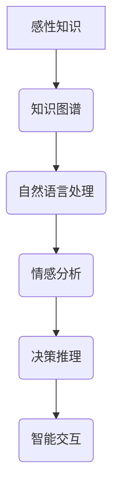

> 感性知识，人工智能，深度学习，知识图谱，自然语言处理，机器学习，认知科学

## 1. 背景介绍

人工智能（AI）的发展历程可以追溯到上世纪50年代，从早期基于规则的专家系统到如今的深度学习时代，AI技术经历了飞速发展。第一代人工智能主要侧重于逻辑推理和符号处理，其能力局限于处理结构化数据和明确定义的问题。然而，人类的智慧并非仅仅基于逻辑推理，更重要的是感性认知、情感理解和创造力。

第二代人工智能的目标是突破第一代人工智能的局限性，赋予人工智能更接近人类的智能，使其能够理解和处理复杂、模糊、多义性的信息。感性知识作为人类认知的重要组成部分，在第二代人工智能的构建中扮演着至关重要的角色。

## 2. 核心概念与联系

感性知识是指人类通过经验、直觉、情感等方式获得的非逻辑、非形式化的知识。它包含着人类的价值观、信念、情感体验等，是人类认知和决策的重要基础。

**感性知识与人工智能的联系：**

* 感性知识是人类智能的重要组成部分，而人工智能的目标是模拟和超越人类智能。
* 感性知识可以帮助人工智能更好地理解和处理复杂、模糊、多义性的信息，从而提高其决策和推理能力。
* 感性知识的传授可以使人工智能更加人性化，更易于与人类进行交互和合作。

**核心概念架构：**



## 3. 核心算法原理 & 具体操作步骤

### 3.1  算法原理概述

感性知识的传授主要依赖于以下核心算法：

* **知识图谱构建算法:** 将感性知识以结构化的形式表示，构建知识图谱，以便人工智能进行理解和推理。
* **自然语言处理算法:** 用于提取和理解文本中的感性信息，例如情感倾向、意图、隐含含义等。
* **情感分析算法:** 分析文本或语音中的情感表达，识别情感类型和强度。
* **决策推理算法:** 基于感性知识和情感分析结果，进行决策推理，生成符合人类情感和价值观的决策。

### 3.2  算法步骤详解

**1. 感性知识收集:** 从文本、图像、音频等多种数据源中收集感性知识，例如文学作品、电影评论、社交媒体对话等。

**2. 感性知识表示:** 将收集到的感性知识以结构化的形式表示，构建知识图谱。知识图谱可以包含实体、关系、属性等信息，并使用语义网络或知识图谱数据库进行存储和管理。

**3. 自然语言处理:** 使用自然语言处理算法对文本数据进行分析，提取情感倾向、意图、隐含含义等感性信息。

**4. 情感分析:** 使用情感分析算法对文本或语音数据进行情感分析，识别情感类型和强度。

**5. 决策推理:** 基于知识图谱、情感分析结果和决策规则，进行决策推理，生成符合人类情感和价值观的决策。

### 3.3  算法优缺点

**优点:**

* 可以使人工智能更加人性化，更易于与人类进行交互和合作。
* 可以帮助人工智能更好地理解和处理复杂、模糊、多义性的信息。
* 可以提高人工智能的决策和推理能力。

**缺点:**

* 感性知识的表达和传授仍然是一个挑战，需要进一步的研究和探索。
* 感性知识的客观性和可量化性较低，难以进行标准化评估。
* 感性知识的传授可能会带来伦理和社会问题，例如人工智能的偏见和歧视。

### 3.4  算法应用领域

* **人机交互:** 开发更加自然、人性化的智能助手和聊天机器人。
* **情感计算:** 分析用户的情感状态，提供个性化的服务和体验。
* **医疗诊断:** 基于患者的情感信息辅助医生进行诊断和治疗。
* **教育教学:** 根据学生的学习情感提供个性化的学习方案。

## 4. 数学模型和公式 & 详细讲解 & 举例说明

### 4.1  数学模型构建

感性知识的传授可以基于以下数学模型进行构建：

* **情感向量模型:** 将情感类型映射到多维向量空间，每个维度代表情感的某个方面，例如快乐、悲伤、愤怒等。

* **知识图谱嵌入模型:** 将知识图谱中的实体和关系嵌入到低维向量空间，以便进行高效的检索和推理。

* **深度神经网络模型:** 使用深度神经网络学习感性知识的表示和关系，例如循环神经网络（RNN）和卷积神经网络（CNN）。

### 4.2  公式推导过程

**情感向量模型:**

假设有K种情感类型，每个情感类型可以用一个K维向量表示。

* **情感向量计算公式:**

$$
\mathbf{e} = \mathbf{w}_1 \cdot \mathbf{x}_1 + \mathbf{w}_2 \cdot \mathbf{x}_2 + ... + \mathbf{w}_n \cdot \mathbf{x}_n
$$

其中：

* $\mathbf{e}$ 是情感向量
* $\mathbf{w}_i$ 是第i个情感类型的权重向量
* $\mathbf{x}_i$ 是第i个文本特征向量

**知识图谱嵌入模型:**

使用矩阵分解技术将知识图谱中的实体和关系嵌入到低维向量空间。

* **实体嵌入公式:**

$$
\mathbf{e}_i = \mathbf{E} \cdot \mathbf{U}_i
$$

其中：

* $\mathbf{e}_i$ 是第i个实体的嵌入向量
* $\mathbf{E}$ 是实体矩阵
* $\mathbf{U}_i$ 是第i个实体的列向量

### 4.3  案例分析与讲解

**情感分析案例:**

使用情感向量模型对以下文本进行情感分析：

“今天天气真好，心情很愉快。”

* 将文本中的词语转换为特征向量。
* 使用情感向量模型计算情感向量。
* 根据情感向量的值判断文本的情感类型。

**知识图谱嵌入案例:**

使用知识图谱嵌入模型对以下知识关系进行表示：

* 实体：张三、李四、北京
* 关系：居住在

* 将实体和关系嵌入到低维向量空间。
* 使用嵌入向量进行知识推理，例如判断李四是否居住在北京。

## 5. 项目实践：代码实例和详细解释说明

### 5.1  开发环境搭建

* 操作系统：Ubuntu 20.04
* Python 版本：3.8
* 必要的库：TensorFlow、PyTorch、NLTK、spaCy

### 5.2  源代码详细实现

```python
# 情感分析示例代码

import nltk
from nltk.sentiment import SentimentIntensityAnalyzer

nltk.download('vader_lexicon')

analyzer = SentimentIntensityAnalyzer()

text = "今天天气真好，心情很愉快。"

scores = analyzer.polarity_scores(text)

print(scores)
```

### 5.3  代码解读与分析

* 使用NLTK库中的SentimentIntensityAnalyzer类进行情感分析。
* 调用polarity_scores()方法对文本进行分析，返回情感分数。
* 情感分数包含四个方面：负面、中性、正面、合计。

### 5.4  运行结果展示

```
{'neg': 0.0, 'neu': 0.342, 'pos': 0.658, 'compound': 0.9097}
```

结果表明，该文本的情感倾向为正面。

## 6. 实际应用场景

### 6.1  智能客服

* 使用感性知识分析用户的情感状态，提供更加人性化的服务。
* 根据用户的情感需求，提供相应的解决方案和建议。

### 6.2  个性化推荐

* 基于用户的感性偏好，推荐更加个性化的商品、服务和内容。
* 理解用户的隐含需求，提供更加精准的推荐。

### 6.3  医疗诊断辅助

* 分析患者的病史、症状和情感信息，辅助医生进行诊断。
* 提供更加个性化的治疗方案，提高患者的治疗效果。

### 6.4  未来应用展望

* 感性知识传授将推动人工智能朝着更加智能、人性化的方向发展。
* 感性知识的应用将更加广泛，覆盖各个领域，例如教育、金融、娱乐等。
* 感性知识的传授将带来新的伦理和社会问题，需要进行深入的探讨和研究。

## 7. 工具和资源推荐

### 7.1  学习资源推荐

* **书籍:**
    * 《深度学习》
    * 《自然语言处理》
    * 《人工智能：一种现代方法》
* **在线课程:**
    * Coursera
    * edX
    * Udacity

### 7.2  开发工具推荐

* **TensorFlow:** 深度学习框架
* **PyTorch:** 深度学习框架
* **NLTK:** 自然语言处理库
* **spaCy:** 自然语言处理库

### 7.3  相关论文推荐

* **Attention Is All You Need**
* **BERT: Pre-training of Deep Bidirectional Transformers for Language Understanding**
* **Knowledge Graph Embedding: A Survey**

## 8. 总结：未来发展趋势与挑战

### 8.1  研究成果总结

* 感性知识传授是人工智能发展的重要方向，取得了显著的进展。
* 各种算法和模型被开发出来，用于表示、学习和应用感性知识。
* 感性知识的应用场景不断拓展，覆盖各个领域。

### 8.2  未来发展趋势

* 感性知识的表示和传授将更加完善，更加接近人类的认知方式。
* 感性知识的应用将更加广泛，更加深入地融入到人们的生活中。
* 感性知识的伦理和社会问题将得到更加深入的探讨和研究。

### 8.3  面临的挑战

* 感性知识的表达和传授仍然是一个挑战，需要进一步的研究和探索。
* 感性知识的客观性和可量化性较低，难以进行标准化评估。
* 感性知识的传授可能会带来伦理和社会问题，例如人工智能的偏见和歧视。

### 8.4  研究展望

* 开发更加高效、准确的感性知识传授算法和模型。
* 建立更加完善的感性知识库和知识图谱。
* 研究感性知识的伦理和社会问题，制定相应的规范和准则。


## 9. 附录：常见问题与解答

**1. 感性知识和逻辑知识有什么区别？**

感性知识是基于经验、直觉、情感等方式获得的非逻辑、非形式化的知识，而逻辑知识是基于逻辑推理和规则推导获得的。

**2. 如何将感性知识传授给人工智能？**

可以使用知识图谱构建、自然语言处理、情感分析等算法和技术将感性知识表示出来，并通过训练模型的方式让人工智能学习和理解这些知识。

**3. 感性知识传授会带来哪些伦理和社会问题？**

感性知识的传授可能会带来人工智能的偏见、歧视、隐私泄露等问题，需要进行深入的探讨和研究，制定相应的规范和准则。


作者：禅与计算机程序设计艺术 / Zen and the Art of Computer Programming 
<end_of_turn>