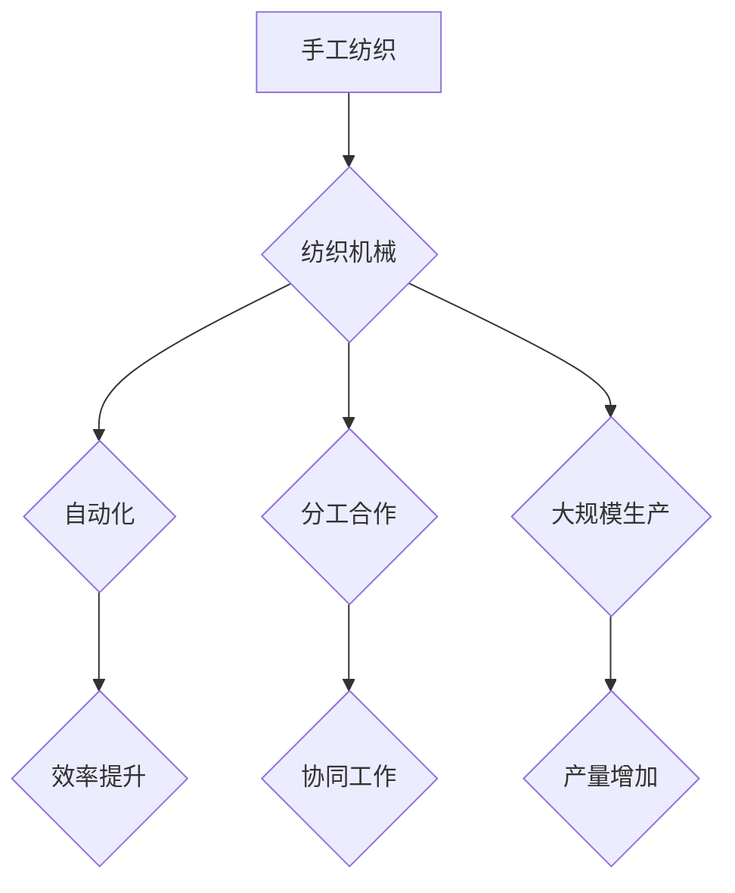

> 纺织机械、工业革命、自动化、生产效率、社会变革

## 1. 背景介绍

1.1. 纺织业的传统发展

纺织业作为人类文明的重要组成部分，自远古时代起就扮演着重要的角色。早期，纺织工艺主要依靠手工操作，例如使用纺锤、梭子等工具进行纺纱和织布。这种手工纺织方式效率低下，产量有限，只能满足当地居民的基本需求。

1.2. 纺织机械的诞生

18世纪，随着工业革命的兴起，纺织机械的出现彻底改变了纺织业的面貌。詹姆斯·哈格雷夫斯发明的纺纱机、理查德·阿克里特的织布机等重大发明，大大提高了纺织生产的效率和产量。

## 2. 核心概念与联系

2.1. 自动化

纺织机械的核心概念是自动化。通过机械装置和动力系统，纺织机械能够自动完成纺纱、织布等一系列复杂的操作，无需人工干预。

2.2. 分工合作

纺织机械的出现促进了生产过程的分工合作。不同类型的纺织机械负责不同的工序，各司其职，协同工作，提高了整体生产效率。

2.3. 大规模生产

纺织机械的应用使得纺织品的大规模生产成为可能。大量纺织机械的协同工作，能够生产出大量、标准化的纺织品，满足社会日益增长的需求。

**Mermaid 流程图**



## 3. 核心算法原理 & 具体操作步骤

3.1. 算法原理概述

纺织机械的运作原理基于一系列复杂的机械设计和控制算法。这些算法控制着纺纱机、织布机等设备的运动轨迹、速度和力度，确保纺织品的质量和一致性。

3.2. 算法步骤详解

纺织机械的算法步骤通常包括以下几个方面：

* **原料处理:** 将棉花等原料进行清洗、梳理、卷绕等处理，使其具备纺纱的条件。
* **纺纱:** 利用纺纱机将纤维束成线状，形成纱线。
* **织布:** 利用织布机将纱线编织成布料。
* **后处理:** 对织好的布料进行染色、印花、整理等后处理，使其具有更佳的性能和外观。

3.3. 算法优缺点

纺织机械的算法具有以下优点：

* **效率高:** 自动化操作大大提高了纺织生产的效率。
* **精度高:** 算法控制的机械运动精度高，纺织品质量稳定。
* **可重复性强:** 算法可以重复执行，保证纺织品的质量一致性。

缺点：

* **成本高:** 纺织机械的开发和维护成本较高。
* **灵活性低:** 算法难以适应复杂、多变的纺织需求。

3.4. 算法应用领域

纺织机械的算法广泛应用于服装、家纺、工业用布等各个领域。

## 4. 数学模型和公式 & 详细讲解 & 举例说明

4.1. 数学模型构建

纺织机械的运作可以抽象为一系列数学模型，例如：

* **力学模型:** 描述纺纱机、织布机等机械装置的运动轨迹和力学特性。
* **热力学模型:** 描述纺织过程中的热传递和能量转换。
* **材料力学模型:** 描述纺织材料的力学性能和变形特性。

4.2. 公式推导过程

例如，我们可以用牛顿第二定律来描述纺纱机旋转轴的运动：

$$F = ma$$

其中：

* $F$ 是作用在旋转轴上的力
* $m$ 是旋转轴的质量
* $a$ 是旋转轴的加速度

4.3. 案例分析与讲解

我们可以利用上述公式来分析纺纱机的工作原理。当纺纱机电机旋转时，会产生一个扭矩作用在旋转轴上。根据牛顿第二定律，旋转轴会产生相应的加速度，从而带动纺纱装置进行旋转，最终将纤维束成线状。

## 5. 项目实践：代码实例和详细解释说明

5.1. 开发环境搭建

为了实现纺织机械的自动化控制，我们可以使用以下开发环境：

* **操作系统:** Linux 或 Windows
* **编程语言:** Python 或 C++
* **控制平台:** ROS 或 PLC

5.2. 源代码详细实现

以下是一个简单的 Python 代码示例，用于控制纺纱机的旋转速度：

```python
import RPi.GPIO as GPIO
import time

# 设置 GPIO 引脚
motor_pin = 18

# 初始化 GPIO
GPIO.setmode(GPIO.BCM)
GPIO.setup(motor_pin, GPIO.OUT)

# 设置旋转速度
speed = 100

# 控制电机旋转
while True:
    GPIO.output(motor_pin, GPIO.HIGH)
    time.sleep(speed / 1000)
    GPIO.output(motor_pin, GPIO.LOW)
    time.sleep(speed / 1000)

```

5.3. 代码解读与分析

这段代码利用 RPi.GPIO 库控制 Raspberry Pi 的 GPIO 引脚，控制纺纱机的电机旋转。

* `GPIO.setmode(GPIO.BCM)` 设置 GPIO 引脚模式为 BCM 模式。
* `GPIO.setup(motor_pin, GPIO.OUT)` 设置 `motor_pin` 为输出引脚。
* `GPIO.output(motor_pin, GPIO.HIGH)` 将 `motor_pin` 设置为高电平，使电机旋转。
* `GPIO.output(motor_pin, GPIO.LOW)` 将 `motor_pin` 设置为低电平，停止电机旋转。
* `time.sleep(speed / 1000)` 延迟一段时间，控制电机旋转速度。

5.4. 运行结果展示

运行这段代码后，纺纱机的电机将以指定的旋转速度进行旋转。

## 6. 实际应用场景

6.1. 服装制造

纺织机械广泛应用于服装制造业，用于生产各种类型的服装面料，例如棉布、麻布、丝绸等。

6.2. 家纺生产

纺织机械也用于生产各种家纺产品，例如床单、被褥、毛巾等。

6.3. 工业用布制造

纺织机械还用于生产工业用布，例如帆布、帐篷布、防护服等。

6.4. 未来应用展望

随着人工智能、机器学习等技术的不断发展，纺织机械将更加智能化、自动化，能够更好地满足人们日益增长的需求。

## 7. 工具和资源推荐

7.1. 学习资源推荐

* **书籍:** 《纺织机械原理》
* **网站:** 纺织机械行业协会网站

7.2. 开发工具推荐

* **ROS:** Robot Operating System
* **PLC:** Programmable Logic Controller

7.3. 相关论文推荐

* **纺织机械自动化控制研究进展**
* **人工智能在纺织业中的应用**

## 8. 总结：未来发展趋势与挑战

8.1. 研究成果总结

纺织机械的出现彻底改变了纺织业的面貌，提高了生产效率、降低了生产成本，推动了社会经济发展。

8.2. 未来发展趋势

未来，纺织机械将朝着更加智能化、自动化、个性化方向发展。

* **智能化:** 利用人工智能、机器学习等技术，实现纺织机械的自主学习、决策和控制。
* **自动化:** 进一步提高纺织生产的自动化程度，减少人工干预。
* **个性化:** 满足个性化定制需求，生产更加多样化的纺织品。

8.3. 面临的挑战

纺织机械的发展也面临着一些挑战：

* **技术难题:** 如何实现更加智能化、自动化、高效的纺织机械控制算法。
* **成本问题:** 智能化纺织机械的开发和维护成本较高。
* **人才缺口:** 缺乏具备相关专业知识和技能的人才。

8.4. 研究展望

未来，我们需要继续加大对纺织机械技术的研发投入，突破技术瓶颈，推动纺织机械的创新发展。

## 9. 附录：常见问题与解答

9.1. 纺织机械的安全性如何保证？

纺织机械的设计和制造必须符合安全标准，并配备必要的安全防护装置，以确保操作人员的安全。

9.2. 纺织机械的维护保养需要注意哪些方面？

纺织机械的维护保养需要定期检查和清洁，及时更换磨损部件，以确保设备的正常运行。

9.3. 纺织机械的未来发展趋势是什么？

纺织机械的未来发展趋势是更加智能化、自动化、个性化。


作者：禅与计算机程序设计艺术 / Zen and the Art of Computer Programming 
<end_of_turn>