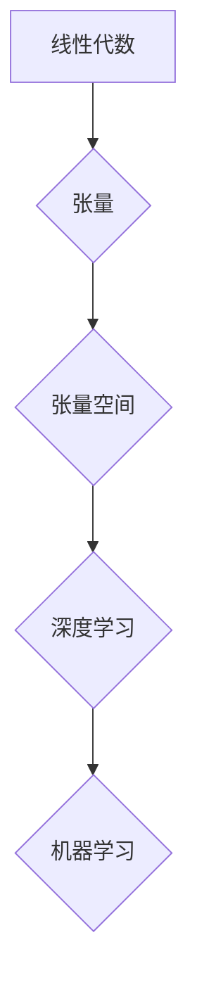

> 线性代数，张量，张量空间，深度学习，机器学习，人工智能

## 1. 背景介绍

在现代人工智能领域，深度学习和机器学习算法的蓬勃发展，使得对数据的高效处理和表示能力提出了更高的要求。线性代数作为数学基础，为理解和构建这些算法提供了坚实的基础。而张量，作为一种高维数组的表示形式，成为了深度学习和机器学习的核心数据结构。

本篇文章将从线性代数的角度出发，深入探讨张量与张量空间的概念，并阐述其在深度学习和机器学习中的重要应用。

## 2. 核心概念与联系

**2.1 张量**

张量是一种多维数组，可以理解为一个具有多个维度的数据结构。例如，一个标量是零维张量，一个向量是一维张量，一个矩阵是二维张量，而一个三维张量可以表示一个立方体的数据。

**2.2 张量空间**

张量空间是指所有具有特定维数和数据类型的张量的集合。每个张量都可以看作是该空间中的一个点，而张量空间的维度由张量的维数决定。

**2.3 线性代数与张量**

线性代数的许多概念和运算都可以应用于张量空间。例如，张量加法、标量乘法、矩阵乘法等都是线性运算，它们在张量空间中保持其性质。

**2.4 Mermaid 流程图**



## 3. 核心算法原理 & 具体操作步骤

**3.1 算法原理概述**

张量分解是一种将高维张量分解成多个低维张量的技术。它可以用于数据压缩、特征提取和模型参数共享等方面。常见的张量分解算法包括：

* **奇异值分解 (SVD)**
* **核分解 (Tucker Decomposition)**
* **CP分解 (Canonical Polyadic Decomposition)**

**3.2 算法步骤详解**

以SVD为例，其步骤如下：

1. 将高维张量分解成三个矩阵，分别表示张量的左奇异向量、奇异值和右奇异向量。
2. 奇异值按照降序排列，并选择前k个奇异值作为近似值。
3. 使用前k个奇异值和对应的奇异向量重建近似张量。

**3.3 算法优缺点**

* **优点:** 能够有效地降低张量的维度，提高计算效率。
* **缺点:** 对于高维张量，计算复杂度较高。

**3.4 算法应用领域**

* **数据压缩:** 将高维数据压缩成低维表示，节省存储空间和传输带宽。
* **特征提取:** 从高维数据中提取重要的特征，用于机器学习和模式识别。
* **模型参数共享:** 在深度学习模型中，使用张量分解可以共享模型参数，减少模型参数量和训练时间。

## 4. 数学模型和公式 & 详细讲解 & 举例说明

**4.1 数学模型构建**

假设一个高维张量为 A，其维度为 m x n x p，则可以将其表示为一个三阶张量：

$$
A = \begin{bmatrix}
a_{111} & a_{112} & \cdots & a_{11p} \\
a_{121} & a_{122} & \cdots & a_{12p} \\
\vdots & \vdots & \ddots & \vdots \\
a_{m11} & a_{m12} & \cdots & a_{m1p}
\end{bmatrix}
$$

其中，$a_{ijk}$ 表示张量 A 中第 i 行、第 j 列、第 k 层的元素。

**4.2 公式推导过程**

SVD 的核心思想是将张量 A 分解成三个矩阵的乘积：

$$
A = U \Sigma V^T
$$

其中，U 和 V 分别是左奇异向量矩阵和右奇异向量矩阵，Σ 是一个对角矩阵，其对角线元素为张量的奇异值。

**4.3 案例分析与讲解**

假设一个二维矩阵 A：

$$
A = \begin{bmatrix}
1 & 2 \\
3 & 4
\end{bmatrix}
$$

对其进行 SVD 分解，可以得到 U、Σ 和 V 的值。

## 5. 项目实践：代码实例和详细解释说明

**5.1 开发环境搭建**

本项目使用 Python 语言和 NumPy 库进行实现。

**5.2 源代码详细实现**

```python
import numpy as np

# 生成一个二维矩阵
A = np.array([[1, 2], [3, 4]])

# 对矩阵进行 SVD 分解
U, S, Vh = np.linalg.svd(A)

# 打印分解结果
print("U:\
", U)
print("S:\
", S)
print("Vh:\
", Vh)
```

**5.3 代码解读与分析**

* `np.linalg.svd(A)` 函数对矩阵 A 进行 SVD 分解，返回三个矩阵：U、S 和 Vh。
* U 是左奇异向量矩阵，S 是奇异值矩阵，Vh 是右奇异向量矩阵的转置。

**5.4 运行结果展示**

运行代码后，将输出 U、S 和 Vh 的值。

## 6. 实际应用场景

**6.1 数据压缩**

在图像处理领域，可以使用张量分解技术将图像数据压缩成更小的尺寸，同时保持图像质量。

**6.2 特征提取**

在自然语言处理领域，可以使用张量分解技术提取文本数据的特征，用于文本分类、情感分析等任务。

**6.3 模型参数共享**

在深度学习模型中，可以使用张量分解技术共享模型参数，减少模型参数量和训练时间。

**6.4 未来应用展望**

随着人工智能技术的不断发展，张量分解技术将在更多领域得到应用，例如：

* **推荐系统:** 使用张量分解技术对用户行为数据进行分析，推荐个性化内容。
* **药物发现:** 使用张量分解技术分析药物分子结构，预测药物活性。
* **材料科学:** 使用张量分解技术分析材料结构，预测材料性能。

## 7. 工具和资源推荐

**7.1 学习资源推荐**

* **书籍:**
    * 《深度学习》
    * 《机器学习》
* **在线课程:**
    * Coursera 上的深度学习课程
    * edX 上的机器学习课程

**7.2 开发工具推荐**

* **Python:** 
* **NumPy:** 用于数值计算
* **TensorFlow:** 用于深度学习
* **PyTorch:** 用于深度学习

**7.3 相关论文推荐**

* **SVD:** Singular Value Decomposition
* **Tucker Decomposition:** Tucker Decomposition of Multidimensional Arrays
* **CP Decomposition:** Canonical Polyadic Decomposition

## 8. 总结：未来发展趋势与挑战

**8.1 研究成果总结**

张量分解技术在深度学习和机器学习领域取得了显著的成果，为数据处理、特征提取和模型参数共享提供了有效的方法。

**8.2 未来发展趋势**

未来，张量分解技术将朝着以下方向发展：

* **更高效的算法:** 研究更高效的张量分解算法，降低计算复杂度。
* **更广泛的应用:** 将张量分解技术应用到更多领域，例如推荐系统、药物发现和材料科学。
* **理论研究:** 深入研究张量分解的理论基础，探索其更深层次的性质。

**8.3 面临的挑战**

张量分解技术也面临一些挑战：

* **高维数据处理:** 对于高维数据，张量分解算法的计算复杂度较高。
* **稀疏数据处理:** 对于稀疏数据，张量分解算法的效率较低。
* **非线性数据处理:** 张量分解技术主要适用于线性数据，对于非线性数据处理效果较差。

**8.4 研究展望**

未来，将继续研究更高效、更鲁棒的张量分解算法，并将其应用到更多领域，推动人工智能技术的进步。

## 9. 附录：常见问题与解答

**9.1 张量分解的应用场景有哪些？**

张量分解的应用场景非常广泛，包括数据压缩、特征提取、模型参数共享等。

**9.2 张量分解的优缺点是什么？**

张量分解的优点是能够有效地降低张量的维度，提高计算效率。缺点是对于高维张量，计算复杂度较高。

**9.3 如何选择合适的张量分解算法？**

选择合适的张量分解算法需要根据具体应用场景和数据特点进行选择。

作者：禅与计算机程序设计艺术 / Zen and the Art of Computer Programming


<end_of_turn>