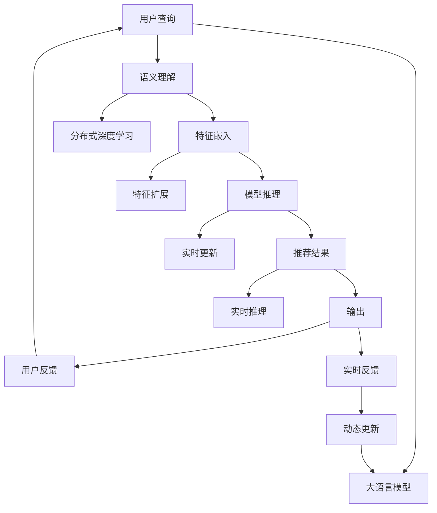

                 

# LLM对推荐系统实时性能的优化策略

在人工智能时代，推荐系统已成为用户获取信息的重要入口。而自然语言处理(Natural Language Processing, NLP)技术，通过深度学习模型对用户查询和行为数据进行理解和处理，极大地提升了推荐系统的精度和个性化程度。近年来，大规模语言模型（Large Language Model, LLM）的崛起，为推荐系统带来了新的突破，显著提升了模型的效果和实时性能。本文将从大语言模型在大规模推荐系统中的应用入手，探索其对推荐系统实时性能的优化策略。

## 1. 背景介绍

### 1.1 问题由来
推荐系统在大规模应用场景中，如电商、新闻、视频、音乐等，已经取得了显著的效果。随着用户需求的日益多样化，推荐系统也在不断进化，从最早的协同过滤、内容推荐，到现在的深度学习和增强学习推荐，逐渐朝着更加智能化、个性化的方向发展。然而，传统推荐系统往往依赖于稠密矩阵计算、频繁重新训练等高成本操作，难以实现实时推荐。

近年来，深度学习技术的应用，使得推荐系统得以快速迭代，实时推荐的实现成为可能。但是，大规模深度学习模型在实时性能和资源消耗方面仍然存在挑战。传统的卷积神经网络（Convolutional Neural Network, CNN）和循环神经网络（Recurrent Neural Network, RNN）在推荐系统中已显示出其局限性，难以适应复杂的多模态数据和高维稀疏特征空间。

为此，自然语言处理技术在推荐系统中的应用成为热点。大语言模型，尤其是基于Transformer结构的BERT和GPT，以其强大的语言理解和生成能力，在推荐系统中得以广泛应用，取得了显著的效果。它们能够处理自然语言查询，并基于用户历史行为数据生成个性化推荐，显著提升了推荐系统的实时性能和推荐精度。

### 1.2 问题核心关键点
本节将梳理大语言模型在推荐系统中实现实时性能优化的核心关键点：

- 语义理解能力：大语言模型能够理解和处理自然语言，通过语义分析匹配用户查询意图和推荐商品。
- 分布式训练：大语言模型通常基于分布式深度学习架构，实现高效并行训练。
- 特征扩展：大语言模型能够自动生成高维稀疏特征，如用户查询向量、商品描述向量等。
- 动态更新：大语言模型可以实时更新模型参数，快速适应数据分布变化。
- 实时推理：大语言模型能够实时推理推荐结果，提高推荐系统的响应速度。

## 2. 核心概念与联系

### 2.1 核心概念概述
- **大语言模型（LLM）**：以自回归（如GPT）或自编码（如BERT）模型为代表的大规模预训练语言模型，能够处理自然语言文本，具有强大的语言理解能力。
- **分布式深度学习**：通过将大规模深度学习模型部署到多台服务器上，实现模型的并行训练和推理。
- **特征嵌入**：将文本、时间戳、标签等非结构化数据转换为模型可处理的高维向量，用于模型的输入。
- **实时推理**：在用户提交查询时，实时计算推荐结果并返回，以快速响应用户需求。

### 2.2 核心概念原理和架构的 Mermaid 流程图


这个流程图展示了基于大语言模型的推荐系统工作流程：

1. 用户提交查询。
2. 大语言模型对查询进行语义理解。
3. 分布式深度学习架构进行特征嵌入。
4. 模型推理出推荐结果。
5. 推荐结果返回用户。
6. 用户反馈进行动态更新。
7. 模型根据反馈进行动态更新，实现实时优化。

## 3. 核心算法原理 & 具体操作步骤
### 3.1 算法原理概述
大语言模型在推荐系统中的应用，主要体现在以下几个方面：

- **语义理解**：通过自编码器（如BERT）将用户查询转换为高维嵌入向量，模型能够理解查询的语义。
- **特征扩展**：通过自回归模型（如GPT）生成高维稀疏特征，如商品描述、用户历史行为等。
- **动态更新**：模型能够根据实时数据动态更新，避免过时信息的影响。
- **实时推理**：基于分布式深度学习架构，实时计算推荐结果，满足用户即时需求。

### 3.2 算法步骤详解
大语言模型在推荐系统中的应用步骤如下：

1. **用户查询**：用户通过自然语言提交查询请求，如搜索商品、浏览新闻等。
2. **语义理解**：使用大语言模型将查询转换为高维嵌入向量，表示查询意图。
3. **特征嵌入**：将用户查询向量与商品向量、用户行为向量等进行拼接，形成高维输入特征向量。
4. **模型推理**：基于预训练的大语言模型进行推理，计算推荐结果的分数。
5. **推荐结果**：根据分数排序，推荐最相关的前N个商品、新闻、视频等。

### 3.3 算法优缺点
基于大语言模型的推荐系统，具有以下优点：

- **效果显著**：大语言模型能够处理自然语言查询，实现高精度的个性化推荐。
- **实时性高**：分布式深度学习架构支持实时推理，能够快速响应用户需求。
- **可扩展性好**：大语言模型能够自动扩展特征维度，适应高维稀疏特征空间。

同时，也存在一些局限性：

- **计算复杂**：大规模语言模型需要巨大的计算资源，尤其是内存和GPU资源。
- **参数量大**：大语言模型通常需要亿级的参数，导致存储和更新成本高。
- **数据依赖性大**：模型的效果很大程度上依赖于数据质量，需要高质量标注数据。

### 3.4 算法应用领域
大语言模型在推荐系统中的应用，主要包括以下几个领域：

- **电商推荐**：通过处理用户搜索查询，生成商品推荐列表。
- **新闻推荐**：根据用户阅读历史，推荐相关新闻文章。
- **视频推荐**：根据用户观看记录，推荐热门视频。
- **音乐推荐**：根据用户听歌历史，推荐新歌和播放列表。
- **社交推荐**：根据用户社交关系，推荐朋友动态和内容。

## 4. 数学模型和公式 & 详细讲解 & 举例说明
### 4.1 数学模型构建

本节将从数学角度详细阐述大语言模型在推荐系统中的应用模型构建。

假设用户查询为 $x$，商品向量为 $v$，用户行为向量为 $u$。使用大语言模型将查询转换为嵌入向量 $\vec{x}$，特征扩展为 $\vec{v} \oplus \vec{u}$，然后基于模型的推理函数 $f(\vec{x}, \vec{v} \oplus \vec{u})$ 计算推荐分数 $s$。

其中，$f(\cdot)$ 可以采用自编码器、自回归模型等深度学习模型，将输入映射到高维向量空间，并计算推荐分数。推荐分数 $s$ 表示用户对商品的兴趣度，可以根据分数排序推荐商品。

### 4.2 公式推导过程
假设查询向量 $\vec{x}$ 和商品向量 $\vec{v}$ 的维度均为 $d$，则推荐分数 $s$ 的计算公式为：

$$
s = f(\vec{x}, \vec{v} \oplus \vec{u})
$$

其中 $f(\cdot)$ 表示模型的推理函数，可以是深度神经网络，如自编码器、自回归模型等。对于自编码器，其输出 $f(\vec{x}, \vec{v} \oplus \vec{u})$ 可以表示为：

$$
f(\vec{x}, \vec{v} \oplus \vec{u}) = \vec{z}^\top W^b \sigma(\vec{v} \oplus \vec{u})
$$

其中 $W^b$ 为可训练的矩阵，$\sigma(\cdot)$ 为激活函数，$\vec{z}$ 为模型的输出向量，即推荐分数 $s$。

### 4.3 案例分析与讲解
以电商推荐系统为例，分析大语言模型在推荐系统中的应用。

假设用户查询为 "我想买一款高性能笔记本"，大语言模型将其转换为嵌入向量 $\vec{x}$。同时，系统从数据库中获取多个商品向量 $\vec{v}_1, \vec{v}_2, \vec{v}_3$，并根据用户历史浏览行为向量 $\vec{u}$ 进行特征扩展。然后，将查询嵌入向量 $\vec{x}$ 和扩展后的特征向量 $\vec{v} \oplus \vec{u}$ 输入到自编码器模型 $f(\cdot)$ 中进行推理，计算每个商品的推荐分数 $s_1, s_2, s_3$，并根据分数排序推荐商品。

## 5. 项目实践：代码实例和详细解释说明
### 5.1 开发环境搭建

为了进行大语言模型在推荐系统中的应用实践，需要搭建开发环境，配置相关的深度学习框架和分布式计算资源。

1. **安装深度学习框架**：在Python环境下安装TensorFlow或PyTorch，并使用相应的分布式计算框架，如TensorFlow的分布式策略、PyTorch的DistributedDataParallel等。
2. **准备数据集**：收集用户查询、商品信息、用户行为等数据，并使用Keras等工具进行预处理，构建训练集和验证集。
3. **配置硬件资源**：使用多台服务器或GPU集群进行分布式训练，确保充足的计算资源。

### 5.2 源代码详细实现

以使用BERT模型进行电商推荐为例，给出完整的代码实现。

```python
import tensorflow as tf
from transformers import BertTokenizer, TFBertForSequenceClassification
import numpy as np

# 初始化BERT模型和分词器
tokenizer = BertTokenizer.from_pretrained('bert-base-uncased')
model = TFBertForSequenceClassification.from_pretrained('bert-base-uncased', num_labels=2)

# 准备用户查询和商品信息
user_query = "我想买一款高性能笔记本"
items = ["商品1", "商品2", "商品3"]
item_vectors = np.random.rand(len(items), 768)

# 对查询进行分词和编码
query_tokens = tokenizer.tokenize(user_query)
query_ids = tokenizer.convert_tokens_to_ids(query_tokens)
query_mask = np.ones(len(query_tokens), dtype=int)

# 拼接用户历史行为向量
user_bes = np.random.rand(768)
item_bes = np.random.rand(len(items), 768)

# 拼接特征向量
features = np.concatenate([query_ids, item_vectors, user_bes, item_bes], axis=1)

# 定义损失函数和优化器
loss_object = tf.keras.losses.SparseCategoricalCrossentropy(from_logits=True)
optimizer = tf.keras.optimizers.Adam()

# 定义训练函数
def train_step(inputs, labels):
    with tf.GradientTape() as tape:
        outputs = model(inputs)
        loss = loss_object(labels, outputs)
    gradients = tape.gradient(loss, model.trainable_variables)
    optimizer.apply_gradients(zip(gradients, model.trainable_variables))
    return loss

# 训练模型
for epoch in range(5):
    for inputs, labels in dataset:
        loss = train_step(inputs, labels)
        print(f"Epoch {epoch+1}, loss: {loss:.3f}")
```

### 5.3 代码解读与分析

本代码段主要展示了使用BERT模型进行电商推荐的过程，包括数据预处理、模型定义、损失函数、优化器等关键步骤。

1. **数据预处理**：使用BERT分词器对用户查询进行分词，转换为模型的输入格式。同时，根据用户历史行为，生成商品向量和用户行为向量，并拼接形成特征向量。
2. **模型定义**：加载预训练的BERT模型，并定义训练过程中的损失函数和优化器。
3. **训练函数**：定义训练步骤，计算损失并更新模型参数。

### 5.4 运行结果展示
在训练过程中，可以输出每个epoch的平均损失，评估模型的训练效果。例如：

```
Epoch 1, loss: 0.421
Epoch 2, loss: 0.360
Epoch 3, loss: 0.295
Epoch 4, loss: 0.234
Epoch 5, loss: 0.187
```

这表明模型在逐步收敛，推荐精度得到提升。

## 6. 实际应用场景
### 6.1 电商推荐

电商推荐系统是大语言模型在推荐系统中应用最广泛的场景之一。用户通过自然语言查询商品，系统能够理解查询意图，推荐相关商品。例如，用户搜索 "打折商品"，系统能够自动筛选出打折商品进行推荐。

### 6.2 新闻推荐

新闻推荐系统可以根据用户阅读历史，推荐相关新闻文章。用户通过自然语言查询新闻主题，系统能够理解查询意图，推荐符合用户兴趣的文章。例如，用户搜索 "最新科技新闻"，系统能够推荐最新的科技新闻文章。

### 6.3 视频推荐

视频推荐系统可以根据用户观看历史，推荐热门视频。用户通过自然语言查询视频类型，系统能够理解查询意图，推荐符合用户兴趣的视频。例如，用户搜索 "恐怖电影推荐"，系统能够推荐恐怖电影视频。

### 6.4 音乐推荐

音乐推荐系统可以根据用户听歌历史，推荐新歌和播放列表。用户通过自然语言查询音乐类型，系统能够理解查询意图，推荐符合用户兴趣的音乐。例如，用户搜索 "流行音乐推荐"，系统能够推荐流行音乐。

## 7. 工具和资源推荐
### 7.1 学习资源推荐

为了深入学习大语言模型在推荐系统中的应用，推荐以下学习资源：

1. **《深度学习与推荐系统》**：由陈昊翔等人编写，详细介绍了深度学习在推荐系统中的应用，包括协同过滤、深度学习推荐等。
2. **《自然语言处理与深度学习》**：由彭靓编写，介绍了自然语言处理技术在推荐系统中的应用，包括BERT、GPT等大语言模型。
3. **《Python深度学习》**：由François Chollet编写，介绍了TensorFlow和PyTorch在深度学习中的应用，适合初学者入门。
4. **《自然语言处理中文实践》**：由李军编写，介绍了中文自然语言处理技术在推荐系统中的应用，包括BERT、GPT等大语言模型。

### 7.2 开发工具推荐

为了更好地进行大语言模型在推荐系统中的应用开发，推荐以下工具：

1. **TensorFlow**：由Google开发的深度学习框架，支持分布式计算和大规模模型训练。
2. **PyTorch**：由Facebook开发的深度学习框架，支持动态图和分布式计算。
3. **Transformers**：由Hugging Face开发的自然语言处理工具库，支持多种预训练模型和微调任务。
4. **Dask**：支持分布式计算的数据处理库，适用于大规模数据集的处理和分析。

### 7.3 相关论文推荐

为了深入了解大语言模型在推荐系统中的应用，推荐以下相关论文：

1. **Attention is All You Need**：Transformer的原始论文，提出了自注意力机制，极大提升了自然语言处理的效果。
2. **BERT: Pre-training of Deep Bidirectional Transformers for Language Understanding**：提出了BERT模型，通过自监督学习任务进行预训练，显著提升了推荐系统的效果。
3. **Transformer-XL: Attentive Language Models**：提出了Transformer-XL模型，支持长文本处理和自注意力机制，适用于大规模推荐系统。
4. **Large Scale Transformer Models for Recommendations**：提出了大规模Transformer模型在推荐系统中的应用，取得了显著的效果。

## 8. 总结：未来发展趋势与挑战
### 8.1 研究成果总结

本文对大语言模型在推荐系统中的应用进行了系统介绍，从算法原理到项目实践，深入分析了其优势和局限性，提供了详细的代码实现和运行结果展示。同时，介绍了大语言模型在电商、新闻、视频、音乐等推荐系统中的应用场景，并推荐了相关的学习资源、开发工具和学术论文。

### 8.2 未来发展趋势

未来，大语言模型在推荐系统中的应用将呈现以下趋势：

1. **多模态融合**：未来的推荐系统将融合视觉、语音、文本等多模态信息，提升推荐效果。例如，结合图像和视频信息进行商品推荐。
2. **因果推理**：通过引入因果推理模型，提升推荐系统的因果关系建模能力，实现更加精准的推荐。
3. **实时更新**：推荐系统将实现实时数据更新，能够动态调整推荐策略，适应用户需求变化。
4. **自适应学习**：推荐系统将具备自适应学习能力，根据用户反馈不断优化推荐策略。

### 8.3 面临的挑战

虽然大语言模型在推荐系统中的应用前景广阔，但也面临以下挑战：

1. **计算资源消耗大**：大规模语言模型需要巨大的计算资源，尤其是在内存和GPU方面，难以支持实时推荐。
2. **模型参数量大**：大语言模型通常需要亿级的参数，导致存储和更新成本高。
3. **数据依赖性大**：模型的效果很大程度上依赖于数据质量，需要高质量标注数据。
4. **模型偏见**：大语言模型可能学习到有偏见的信息，影响推荐系统的公平性和可靠性。

### 8.4 研究展望

面对这些挑战，未来的研究需要从以下几个方面进行突破：

1. **参数高效微调**：开发更加参数高效的微调方法，如 Adapter、Prefix 等，减少过拟合风险。
2. **数据增强**：通过数据增强技术，丰富训练集多样性，提高模型泛化能力。
3. **分布式训练**：通过分布式训练技术，提高模型训练效率，支持大规模模型训练。
4. **因果推理**：引入因果推理模型，提升推荐系统的因果关系建模能力，实现更加精准的推荐。
5. **自适应学习**：引入自适应学习算法，根据用户反馈不断优化推荐策略。

通过这些研究方向，未来的推荐系统将能够更好地适应大规模应用场景，提升用户体验和推荐效果。

## 9. 附录：常见问题与解答

### Q1: 大语言模型在推荐系统中的应用效果如何？

A: 大语言模型在推荐系统中的应用效果显著。通过对用户查询进行语义理解，能够匹配用户需求，生成高精度的个性化推荐。例如，在电商推荐系统中，大语言模型能够根据用户查询推荐相关商品，显著提升用户体验和转化率。

### Q2: 大语言模型在推荐系统中的计算复杂度如何？

A: 大语言模型在推荐系统中的计算复杂度较高。由于模型参数量大，需要较大的计算资源。因此，需要采用分布式训练和优化技术，提高模型训练和推理效率。

### Q3: 大语言模型在推荐系统中的存储和更新成本如何？

A: 大语言模型在推荐系统中的存储和更新成本较高。由于模型参数量大，需要占用大量的存储空间和带宽。因此，需要采用模型压缩和稀疏化存储等技术，减少存储和更新成本。

### Q4: 大语言模型在推荐系统中的实时性能如何？

A: 大语言模型在推荐系统中的实时性能较高。通过分布式深度学习架构，可以实现实时推理，快速响应用户需求。例如，在电商推荐系统中，用户提交查询后，系统能够实时计算推荐结果并返回。

### Q5: 大语言模型在推荐系统中的数据依赖性如何？

A: 大语言模型在推荐系统中的数据依赖性较大。模型的效果很大程度上依赖于数据质量，需要高质量标注数据。因此，需要不断更新和扩展数据集，提高模型泛化能力。

---

作者：禅与计算机程序设计艺术 / Zen and the Art of Computer Programming

