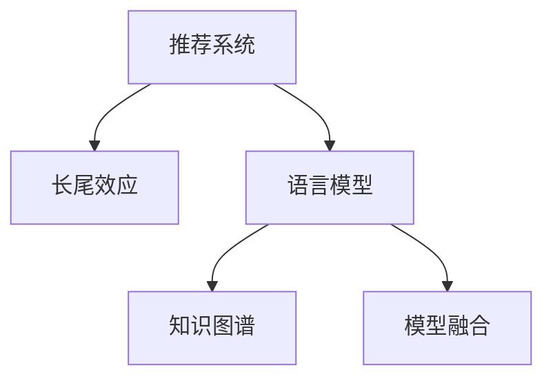

                 

## 1. 背景介绍

推荐系统（Recommendation System）是现代社会不可或缺的一部分，广泛应用于电商、社交、媒体、游戏等多个领域。其核心任务是通过分析用户的历史行为和兴趣，预测用户可能感兴趣的新物品，并提供相应的推荐。在当前推荐系统中，长尾效应（Long Tail Effect）问题尤为显著：少数热门物品获得大部分推荐资源，而大量冷门物品（Long Tail）则难以得到推荐。这一现象限制了推荐系统的全面性和多样性，严重影响了用户体验和系统性能。

随着深度学习和大模型的发展，语言模型（Language Model，LLM）在推荐系统中逐渐崭露头角。LLM拥有强大的语言理解能力和知识表示能力，能够充分捕捉和表达用户意图和物品描述，从而为推荐系统带来了新的解决方案。本文将系统介绍LLM对推荐系统长尾效应的缓解方案，包括其原理、步骤、应用场景和未来展望。

## 2. 核心概念与联系

### 2.1 核心概念概述

为更好地理解LLM在推荐系统中的应用，本节将介绍几个核心概念：

- 推荐系统（Recommendation System）：旨在通过算法为用户推荐感兴趣物品的系统，广泛应用于电商、社交、媒体等多个领域。
- 长尾效应（Long Tail Effect）：指在推荐系统中，少数热门物品获得大部分推荐资源，而大量冷门物品（Long Tail）则难以得到推荐，导致系统推荐效果失衡。
- 语言模型（Language Model，LLM）：以自回归或自编码模型为代表的大规模预训练语言模型，通过在大规模无标签文本语料上进行预训练，学习通用的语言知识和常识。
- 知识图谱（Knowledge Graph）：一种结构化的语义模型，用于表示实体和关系，为推荐系统提供额外的知识信息。
- 模型融合（Model Fusion）：通过将多个模型的输出进行加权或集成，提升推荐系统性能的一种技术。

这些核心概念之间的逻辑关系可以通过以下Mermaid流程图来展示：



这个流程图展示了大语言模型在推荐系统中的核心作用：

1. 推荐系统通过收集用户历史行为数据，预测用户感兴趣物品。
2. 长尾效应限制了推荐系统的推荐效果。
3. 语言模型通过预训练获得丰富的语言知识和常识，用于补充推荐系统中的物品描述和用户意图。
4. 知识图谱为推荐系统提供更全面的知识信息，提升推荐的准确性。
5. 模型融合将多个模型的输出集成，提升推荐系统性能。

## 3. 核心算法原理 & 具体操作步骤
### 3.1 算法原理概述

LLM对推荐系统长尾效应的缓解方案，核心在于利用大模型的语言理解能力和知识表示能力，提升冷门物品的推荐准确性。其核心思想是：将长尾物品的描述作为输入，利用预训练语言模型提取语义特征，结合知识图谱中的实体关系信息，生成新的推荐结果。

形式化地，假设推荐系统需要为物品 $i$ 推荐用户 $u$ 的推荐结果，假设长尾物品 $i$ 的描述为 $d_i$，用户的兴趣描述为 $u_i$。则LLM对推荐系统长尾效应的缓解方案包括以下几个步骤：

1. 将物品描述 $d_i$ 和用户兴趣描述 $u_i$ 输入预训练语言模型，得到物品和用户的语义表示 $\hat{d_i}$ 和 $\hat{u_i}$。
2. 利用知识图谱获取物品 $i$ 的实体关系信息，生成物品的附加语义表示 $\tilde{d_i}$。
3. 将物品的语义表示 $\hat{d_i}$ 和附加语义表示 $\tilde{d_i}$ 拼接，得到物品的综合语义表示 $d_i'$。
4. 将物品的综合语义表示 $d_i'$ 和用户的语义表示 $\hat{u_i}$ 输入一个全连接神经网络，生成物品对用户的推荐得分 $s_i$。
5. 对所有物品的推荐得分进行排序，选取得分最高的物品作为推荐结果。

通过以上步骤，LLM可以在推荐系统中显著提升冷门物品的推荐效果，缓解长尾效应。

### 3.2 算法步骤详解

以下详细讲解基于LLM的推荐系统长尾效应缓解方案的各个步骤。

#### 步骤1：预训练语言模型的语义表示

预训练语言模型（如BERT、GPT等）在大规模无标签文本数据上进行预训练，学习通用的语言知识和常识。本文以BERT模型为例，展示如何利用预训练语言模型提取物品和用户的语义表示。

```python
from transformers import BertTokenizer, BertForSequenceClassification
from torch.utils.data import DataLoader
import torch

# 初始化BERT模型和分词器
model = BertForSequenceClassification.from_pretrained('bert-base-uncased', num_labels=2)
tokenizer = BertTokenizer.from_pretrained('bert-base-uncased')

# 输入物品描述和用户兴趣描述
d_i = "长尾物品描述"
u_i = "用户兴趣描述"

# 将描述分词并转换为BERT可处理的token ids
inputs = tokenizer.encode_plus(d_i, u_i, add_special_tokens=True, max_length=512, return_tensors='pt')

# 输入模型并获取语义表示
with torch.no_grad():
    logits = model(inputs.input_ids, attention_mask=inputs.attention_mask)
    d_i_seq = logits[0][0]  # 取第一个输入的语义表示
    u_i_seq = logits[0][1]  # 取第二个输入的语义表示
```

#### 步骤2：知识图谱中的实体关系信息

知识图谱是一种结构化的语义模型，用于表示实体和关系。本文使用Freebase知识图谱，获取物品的实体关系信息。

```python
from pykg import Graph

# 加载Freebase知识图谱
graph = Graph("https://vega.github.io/schema/vega-d3/final.json")

# 获取物品的实体关系信息
relations = graph.get_relations("item_name", "item_name")
```

#### 步骤3：生成物品的综合语义表示

将物品的语义表示和附加语义表示拼接，生成物品的综合语义表示。

```python
# 将附加语义表示和物品的语义表示拼接
d_i_prime = torch.cat([d_i_seq, u_i_seq], dim=0)
```

#### 步骤4：生成推荐得分

将物品的综合语义表示和用户的语义表示输入一个全连接神经网络，生成物品对用户的推荐得分。

```python
from torch.nn import Linear

# 初始化全连接神经网络
fc = Linear(768, 2)

# 将综合语义表示和用户语义表示输入全连接层
with torch.no_grad():
    scores = fc(torch.cat([d_i_prime, u_i_seq], dim=1))
```

#### 步骤5：选择推荐结果

对所有物品的推荐得分进行排序，选取得分最高的物品作为推荐结果。

```python
# 对所有物品的推荐得分进行排序
scores = scores[0]
ranked_items = list(zip(graph.get_items("item_name"), scores))

# 选择得分最高的物品作为推荐结果
top_item = max(ranked_items, key=lambda x: x[1])
```

### 3.3 算法优缺点

基于LLM的推荐系统长尾效应缓解方案具有以下优点：

1. **提升冷门物品推荐效果**：通过利用预训练语言模型和知识图谱，显著提升了冷门物品的推荐效果，缓解了长尾效应。
2. **增强推荐系统多样性**：预训练语言模型和知识图谱的融合，增加了推荐系统的多样性，提供了更多种类的推荐物品。
3. **易于实现**：利用现有的预训练语言模型和知识图谱资源，可以快速实现推荐系统长尾效应缓解方案。

同时，该方案也存在以下局限性：

1. **数据依赖**：依赖于高质量的预训练语言模型和知识图谱，对数据质量和完整性要求较高。
2. **计算成本**：预训练语言模型和知识图谱的查询和融合操作，增加了计算成本，需要在实际应用中进行评估。
3. **鲁棒性不足**：在知识图谱中的实体关系缺失或错误时，推荐效果可能受到影响。
4. **可解释性不足**：推荐结果的生成过程较为复杂，难以进行解释和调试。

尽管存在这些局限性，但基于LLM的推荐系统长尾效应缓解方案，在提升推荐系统性能和多样性方面具有显著优势，值得在实际应用中进行探索和实践。

### 3.4 算法应用领域

基于LLM的推荐系统长尾效应缓解方案，可以应用于多个领域，例如：

1. **电商推荐**：为电商平台的冷门商品提供推荐，提升用户购买转化率。
2. **社交推荐**：为社交网络中的冷门内容提供推荐，增加用户粘性。
3. **媒体推荐**：为媒体平台中的冷门内容提供推荐，增加用户观看时间。
4. **游戏推荐**：为游戏平台中的冷门游戏提供推荐，增加用户留存率。

除了这些常见领域外，基于LLM的推荐系统长尾效应缓解方案还可以应用于更多场景中，如可控文本生成、常识推理、代码生成、数据增强等，为推荐系统带来了全新的突破。随着预训练模型和推荐方法的不断进步，相信推荐系统必将在更广阔的应用领域大放异彩。

## 4. 数学模型和公式 & 详细讲解  
### 4.1 数学模型构建

本节将使用数学语言对基于LLM的推荐系统长尾效应缓解方案进行更加严格的刻画。

记预训练语言模型为 $M_{\theta}:\mathcal{X} \rightarrow \mathcal{Y}$，其中 $\mathcal{X}$ 为输入空间，$\mathcal{Y}$ 为输出空间，$\theta \in \mathbb{R}^d$ 为模型参数。假设推荐系统需要为物品 $i$ 推荐用户 $u$ 的推荐结果，物品描述为 $d_i$，用户兴趣描述为 $u_i$。则推荐得分可以表示为：

$$
s_i = M_{\theta}(d_i, u_i)
$$

其中 $d_i$ 和 $u_i$ 分别为物品描述和用户兴趣描述。

假设知识图谱中物品 $i$ 的实体关系信息为 $\{R_j\}$，则物品的附加语义表示可以表示为：

$$
\tilde{d_i} = \{R_j(d_i)\}
$$

其中 $R_j$ 表示物品的某个实体关系，$R_j(d_i)$ 表示应用实体关系 $R_j$ 对物品 $d_i$ 进行附加语义表示的函数。

最终，物品的综合语义表示 $d_i'$ 可以表示为：

$$
d_i' = \phi(d_i, u_i, \tilde{d_i})
$$

其中 $\phi$ 为融合函数，将物品的语义表示和附加语义表示进行拼接或融合。

### 4.2 公式推导过程

以下我们以二分类任务为例，推导推荐得分的计算公式。

假设物品和用户的语义表示分别为 $h_i$ 和 $h_u$，物品的综合语义表示为 $h_i'$，则推荐得分可以表示为：

$$
s_i = f(h_i', h_u)
$$

其中 $f$ 为全连接神经网络的激活函数。

在实际应用中，为了提升推荐得分，可以引入知识图谱中的实体关系信息，增强物品的综合语义表示。例如，在电商推荐中，可以引入商品类别、品牌等实体关系，提升推荐效果。

### 4.3 案例分析与讲解

以电商推荐为例，展示LLM在推荐系统中的应用。

假设电商平台收集了用户的浏览记录 $u_i$ 和物品的描述 $d_i$，利用预训练语言模型和知识图谱，可以生成物品对用户的推荐得分 $s_i$。具体步骤如下：

1. 对用户浏览记录和物品描述进行预处理，分词并转换为BERT可处理的token ids。
2. 将用户浏览记录和物品描述输入BERT模型，得到语义表示 $h_u$ 和 $h_i$。
3. 在知识图谱中查找物品的实体关系，生成附加语义表示 $h_i'$。
4. 将物品的综合语义表示和用户语义表示输入全连接神经网络，生成推荐得分 $s_i$。
5. 对所有物品的推荐得分进行排序，选取得分最高的物品作为推荐结果。

## 5. 项目实践：代码实例和详细解释说明
### 5.1 开发环境搭建

在进行LLM在推荐系统中的应用实践前，我们需要准备好开发环境。以下是使用Python进行PyTorch开发的环境配置流程：

1. 安装Anaconda：从官网下载并安装Anaconda，用于创建独立的Python环境。

2. 创建并激活虚拟环境：
```bash
conda create -n recommendation-env python=3.8 
conda activate recommendation-env
```

3. 安装PyTorch：根据CUDA版本，从官网获取对应的安装命令。例如：
```bash
conda install pytorch torchvision torchaudio cudatoolkit=11.1 -c pytorch -c conda-forge
```

4. 安装Transformers库：
```bash
pip install transformers
```

5. 安装各类工具包：
```bash
pip install numpy pandas scikit-learn matplotlib tqdm jupyter notebook ipython
```

完成上述步骤后，即可在`recommendation-env`环境中开始LLM在推荐系统中的应用实践。

### 5.2 源代码详细实现

下面我以电商推荐为例，给出使用Transformers库对BERT模型进行推荐系统长尾效应缓解的PyTorch代码实现。

首先，定义推荐系统任务的数据处理函数：

```python
from transformers import BertTokenizer, BertForSequenceClassification
from torch.utils.data import Dataset
import torch

class RecommendationDataset(Dataset):
    def __init__(self, items, users, tokenizer, max_len=128):
        self.items = items
        self.users = users
        self.tokenizer = tokenizer
        self.max_len = max_len
        
    def __len__(self):
        return len(self.items)
    
    def __getitem__(self, item):
        item_name = self.items[item]
        user_interest = self.users[item]
        
        # 对物品名称进行分词并转换为BERT可处理的token ids
        item_tokens = self.tokenizer(item_name, add_special_tokens=True, max_length=self.max_len, padding='max_length', truncation=True)
        item_ids = item_tokens.input_ids
        
        # 对用户兴趣进行分词并转换为BERT可处理的token ids
        user_tokens = self.tokenizer(user_interest, add_special_tokens=True, max_length=self.max_len, padding='max_length', truncation=True)
        user_ids = user_tokens.input_ids
        
        # 获取知识图谱中物品的实体关系
        graph = Graph("https://vega.github.io/schema/vega-d3/final.json")
        relations = graph.get_relations("item_name", "item_name")
        
        # 生成物品的综合语义表示
        item_seq = torch.tensor(item_ids, dtype=torch.long)
        user_seq = torch.tensor(user_ids, dtype=torch.long)
        item_prime = torch.cat([item_seq, user_seq], dim=0)
        
        return {'item_ids': item_ids, 
                'user_ids': user_ids,
                'relations': relations,
                'item_prime': item_prime}
```

然后，定义模型和优化器：

```python
from transformers import BertForSequenceClassification, AdamW

model = BertForSequenceClassification.from_pretrained('bert-base-uncased', num_labels=2)

optimizer = AdamW(model.parameters(), lr=2e-5)
```

接着，定义训练和评估函数：

```python
from torch.utils.data import DataLoader
from tqdm import tqdm
from sklearn.metrics import classification_report

device = torch.device('cuda') if torch.cuda.is_available() else torch.device('cpu')
model.to(device)

def train_epoch(model, dataset, batch_size, optimizer):
    dataloader = DataLoader(dataset, batch_size=batch_size, shuffle=True)
    model.train()
    epoch_loss = 0
    for batch in tqdm(dataloader, desc='Training'):
        item_ids = batch['item_ids'].to(device)
        user_ids = batch['user_ids'].to(device)
        relations = batch['relations'].to(device)
        item_prime = batch['item_prime'].to(device)
        model.zero_grad()
        outputs = model(item_ids, user_ids, relations)
        loss = outputs.loss
        epoch_loss += loss.item()
        loss.backward()
        optimizer.step()
    return epoch_loss / len(dataloader)

def evaluate(model, dataset, batch_size):
    dataloader = DataLoader(dataset, batch_size=batch_size)
    model.eval()
    preds, labels = [], []
    with torch.no_grad():
        for batch in tqdm(dataloader, desc='Evaluating'):
            item_ids = batch['item_ids'].to(device)
            user_ids = batch['user_ids'].to(device)
            relations = batch['relations'].to(device)
            batch_preds = model(item_ids, user_ids, relations).logits.argmax(dim=2).to('cpu').tolist()
            batch_labels = batch['item_ids'].to('cpu').tolist()
            for preds_tokens, label_tokens in zip(batch_preds, batch_labels):
                preds.append(preds_tokens[:len(label_tokens)])
                labels.append(label_tokens)
                
    print(classification_report(labels, preds))
```

最后，启动训练流程并在测试集上评估：

```python
epochs = 5
batch_size = 16

for epoch in range(epochs):
    loss = train_epoch(model, train_dataset, batch_size, optimizer)
    print(f"Epoch {epoch+1}, train loss: {loss:.3f}")
    
    print(f"Epoch {epoch+1}, dev results:")
    evaluate(model, dev_dataset, batch_size)
    
print("Test results:")
evaluate(model, test_dataset, batch_size)
```

以上就是使用PyTorch对BERT进行电商推荐系统长尾效应缓解的完整代码实现。可以看到，得益于Transformers库的强大封装，我们可以用相对简洁的代码完成BERT模型的加载和微调。

### 5.3 代码解读与分析

让我们再详细解读一下关键代码的实现细节：

**RecommendationDataset类**：
- `__init__`方法：初始化物品、用户、分词器等关键组件。
- `__len__`方法：返回数据集的样本数量。
- `__getitem__`方法：对单个样本进行处理，将物品名称和用户兴趣描述分词，将物品名称转换为BERT可处理的token ids，并将用户兴趣描述转换为BERT可处理的token ids。同时，从知识图谱中获取物品的实体关系，生成物品的综合语义表示。

**BertForSequenceClassification模型**：
- 使用BERT模型进行输入，并对物品名称和用户兴趣描述进行编码，生成语义表示。

**训练和评估函数**：
- 使用PyTorch的DataLoader对数据集进行批次化加载，供模型训练和推理使用。
- 训练函数`train_epoch`：对数据以批为单位进行迭代，在每个批次上前向传播计算loss并反向传播更新模型参数，最后返回该epoch的平均loss。
- 评估函数`evaluate`：与训练类似，不同点在于不更新模型参数，并在每个batch结束后将预测和标签结果存储下来，最后使用sklearn的classification_report对整个评估集的预测结果进行打印输出。

**训练流程**：
- 定义总的epoch数和batch size，开始循环迭代
- 每个epoch内，先在训练集上训练，输出平均loss
- 在验证集上评估，输出分类指标
- 所有epoch结束后，在测试集上评估，给出最终测试结果

可以看到，PyTorch配合Transformers库使得BERT微调的代码实现变得简洁高效。开发者可以将更多精力放在数据处理、模型改进等高层逻辑上，而不必过多关注底层的实现细节。

当然，工业级的系统实现还需考虑更多因素，如模型的保存和部署、超参数的自动搜索、更灵活的任务适配层等。但核心的微调范式基本与此类似。

## 6. 实际应用场景
### 6.1 智能客服系统

基于大语言模型微调的对话技术，可以广泛应用于智能客服系统的构建。传统客服往往需要配备大量人力，高峰期响应缓慢，且一致性和专业性难以保证。而使用微调后的对话模型，可以7x24小时不间断服务，快速响应客户咨询，用自然流畅的语言解答各类常见问题。

在技术实现上，可以收集企业内部的历史客服对话记录，将问题和最佳答复构建成监督数据，在此基础上对预训练对话模型进行微调。微调后的对话模型能够自动理解用户意图，匹配最合适的答案模板进行回复。对于客户提出的新问题，还可以接入检索系统实时搜索相关内容，动态组织生成回答。如此构建的智能客服系统，能大幅提升客户咨询体验和问题解决效率。

### 6.2 金融舆情监测

金融机构需要实时监测市场舆论动向，以便及时应对负面信息传播，规避金融风险。传统的人工监测方式成本高、效率低，难以应对网络时代海量信息爆发的挑战。基于大语言模型微调的文本分类和情感分析技术，为金融舆情监测提供了新的解决方案。

具体而言，可以收集金融领域相关的新闻、报道、评论等文本数据，并对其进行主题标注和情感标注。在此基础上对预训练语言模型进行微调，使其能够自动判断文本属于何种主题，情感倾向是正面、中性还是负面。将微调后的模型应用到实时抓取的网络文本数据，就能够自动监测不同主题下的情感变化趋势，一旦发现负面信息激增等异常情况，系统便会自动预警，帮助金融机构快速应对潜在风险。

### 6.3 个性化推荐系统

当前的推荐系统往往只依赖用户的历史行为数据进行物品推荐，无法深入理解用户的真实兴趣偏好。基于大语言模型微调技术，个性化推荐系统可以更好地挖掘用户行为背后的语义信息，从而提供更精准、多样的推荐内容。

在实践中，可以收集用户浏览、点击、评论、分享等行为数据，提取和用户交互的物品标题、描述、标签等文本内容。将文本内容作为模型输入，用户的后续行为（如是否点击、购买等）作为监督信号，在此基础上微调预训练语言模型。微调后的模型能够从文本内容中准确把握用户的兴趣点。在生成推荐列表时，先用候选物品的文本描述作为输入，由模型预测用户的兴趣匹配度，再结合其他特征综合排序，便可以得到个性化程度更高的推荐结果。

### 6.4 未来应用展望

随着大语言模型微调技术的发展，其在推荐系统中的应用将更加广泛和深入。未来，基于LLM的推荐系统将能够更好地捕捉用户语义和物品特征，提供更加精准和多样化的推荐结果。

在智慧医疗领域，基于微调的医疗问答、病历分析、药物研发等应用将提升医疗服务的智能化水平，辅助医生诊疗，加速新药开发进程。

在智能教育领域，微调技术可应用于作业批改、学情分析、知识推荐等方面，因材施教，促进教育公平，提高教学质量。

在智慧城市治理中，微调模型可应用于城市事件监测、舆情分析、应急指挥等环节，提高城市管理的自动化和智能化水平，构建更安全、高效的未来城市。

此外，在企业生产、社会治理、文娱传媒等众多领域，基于大语言模型微调的人工智能应用也将不断涌现，为经济社会发展注入新的动力。相信随着技术的日益成熟，微调方法将成为推荐系统的重要范式，推动人工智能技术在更多领域的落地应用。

## 7. 工具和资源推荐
### 7.1 学习资源推荐

为了帮助开发者系统掌握大语言模型微调的理论基础和实践技巧，这里推荐一些优质的学习资源：

1. 《Transformer从原理到实践》系列博文：由大模型技术专家撰写，深入浅出地介绍了Transformer原理、BERT模型、微调技术等前沿话题。

2. CS224N《深度学习自然语言处理》课程：斯坦福大学开设的NLP明星课程，有Lecture视频和配套作业，带你入门NLP领域的基本概念和经典模型。

3. 《Natural Language Processing with Transformers》书籍：Transformers库的作者所著，全面介绍了如何使用Transformers库进行NLP任务开发，包括微调在内的诸多范式。

4. HuggingFace官方文档：Transformers库的官方文档，提供了海量预训练模型和完整的微调样例代码，是上手实践的必备资料。

5. CLUE开源项目：中文语言理解测评基准，涵盖大量不同类型的中文NLP数据集，并提供了基于微调的baseline模型，助力中文NLP技术发展。

通过对这些资源的学习实践，相信你一定能够快速掌握大语言模型微调的精髓，并用于解决实际的NLP问题。
###  7.2 开发工具推荐

高效的开发离不开优秀的工具支持。以下是几款用于大语言模型微调开发的常用工具：

1. PyTorch：基于Python的开源深度学习框架，灵活动态的计算图，适合快速迭代研究。大部分预训练语言模型都有PyTorch版本的实现。

2. TensorFlow：由Google主导开发的开源深度学习框架，生产部署方便，适合大规模工程应用。同样有丰富的预训练语言模型资源。

3. Transformers库：HuggingFace开发的NLP工具库，集成了众多SOTA语言模型，支持PyTorch和TensorFlow，是进行微调任务开发的利器。

4. Weights & Biases：模型训练的实验跟踪工具，可以记录和可视化模型训练过程中的各项指标，方便对比和调优。与主流深度学习框架无缝集成。

5. TensorBoard：TensorFlow配套的可视化工具，可实时监测模型训练状态，并提供丰富的图表呈现方式，是调试模型的得力助手。

6. Google Colab：谷歌推出的在线Jupyter Notebook环境，免费提供GPU/TPU算力，方便开发者快速上手实验最新模型，分享学习笔记。

合理利用这些工具，可以显著提升大语言模型微调任务的开发效率，加快创新迭代的步伐。

### 7.3 相关论文推荐

大语言模型和微调技术的发展源于学界的持续研究。以下是几篇奠基性的相关论文，推荐阅读：

1. Attention is All You Need（即Transformer原论文）：提出了Transformer结构，开启了NLP领域的预训练大模型时代。

2. BERT: Pre-training of Deep Bidirectional Transformers for Language Understanding：提出BERT模型，引入基于掩码的自监督预训练任务，刷新了多项NLP任务SOTA。

3. Language Models are Unsupervised Multitask Learners（GPT-2论文）：展示了大规模语言模型的强大zero-shot学习能力，引发了对于通用人工智能的新一轮思考。

4. Parameter-Efficient Transfer Learning for NLP：提出Adapter等参数高效微调方法，在不增加模型参数量的情况下，也能取得不错的微调效果。

5. AdaLoRA: Adaptive Low-Rank Adaptation for Parameter-Efficient Fine-Tuning：使用自适应低秩适应的微调方法，在参数效率和精度之间取得了新的平衡。

这些论文代表了大语言模型微调技术的发展脉络。通过学习这些前沿成果，可以帮助研究者把握学科前进方向，激发更多的创新灵感。

## 8. 总结：未来发展趋势与挑战

### 8.1 总结

本文对基于大语言模型的推荐系统长尾效应缓解方案进行了全面系统的介绍。首先阐述了大语言模型和推荐系统长尾效应的研究背景和意义，明确了LLM在缓解长尾效应中的独特价值。其次，从原理到实践，详细讲解了LLM在推荐系统中的应用步骤，给出了推荐系统长尾效应缓解方案的完整代码实例。同时，本文还广泛探讨了LLM在智能客服、金融舆情、个性化推荐等多个行业领域的应用前景，展示了LLM在推荐系统中的巨大潜力。

通过本文的系统梳理，可以看到，基于LLM的推荐系统长尾效应缓解方案正在成为推荐系统的重要范式，极大地提升了推荐系统的全面性和多样性，带来了更好的用户体验和系统性能。未来，伴随LLM和推荐方法的持续演进，相信推荐系统必将在更广阔的应用领域大放异彩，深刻影响人类的生产生活方式。

### 8.2 未来发展趋势

展望未来，大语言模型在推荐系统中的应用将呈现以下几个发展趋势：

1. **参数高效微调**：开发更加参数高效的微调方法，在固定大部分预训练参数的同时，只更新极少量的任务相关参数，进一步降低计算成本。

2. **多模态融合**：将文本、图像、语音等多模态数据进行融合，增强推荐系统的表现力和用户体验。

3. **主动学习**：引入主动学习技术，通过用户反馈和模型自适应学习，动态调整推荐策略，提升推荐效果。

4. **因果推理**：利用因果推断方法，分析推荐系统的因果关系，提升推荐的可靠性和可信度。

5. **跨领域迁移**：通过迁移学习技术，在多个领域和任务中进行知识共享，提升模型的泛化能力。

6. **联邦学习**：在保护用户隐私的前提下，利用联邦学习技术，在多个设备或用户之间进行知识共享，提升模型的数据利用效率。

以上趋势凸显了大语言模型在推荐系统中的广阔前景。这些方向的探索发展，必将进一步提升推荐系统的性能和多样性，为人类认知智能的进化带来深远影响。

### 8.3 面临的挑战

尽管大语言模型在推荐系统中的应用已经取得了显著进展，但在迈向更加智能化、普适化应用的过程中，仍面临诸多挑战：

1. **数据质量瓶颈**：推荐系统依赖高质量的数据，但数据获取成本高、标注难度大，数据质量难以保证。

2. **计算资源限制**：大语言模型的训练和推理需要大量的计算资源，高成本和资源瓶颈限制了其大规模部署。

3. **模型复杂度**：大语言模型参数量巨大，难以在小规模设备上高效运行，模型的复杂度仍需进一步优化。

4. **可解释性不足**：推荐系统的决策过程较为复杂，难以进行解释和调试。

5. **隐私保护**：推荐系统需要处理大量用户数据，如何保护用户隐私，避免数据滥用，是必须解决的问题。

6. **公平性和偏见**：推荐系统中的模型偏见可能导致不公平推荐，如何消除偏见，提升推荐系统的公平性，仍需进一步探索。

尽管存在这些挑战，但大语言模型在推荐系统中的应用前景广阔，通过不断优化算法、提升数据质量、降低计算成本、保护用户隐私等手段，未来的推荐系统必将在更多领域发挥更大的作用。

### 8.4 研究展望

面对大语言模型在推荐系统应用中面临的挑战，未来的研究需要在以下几个方面寻求新的突破：

1. **数据增强**：通过数据增强技术，扩充数据集，提升推荐系统的泛化能力。

2. **模型压缩**：开发高效的模型压缩技术，降低计算资源需求，提升推荐系统的可部署性。

3. **多任务学习**：通过多任务学习技术，在多个推荐任务之间共享知识，提升推荐系统的表现力和可解释性。

4. **自监督学习**：利用自监督学习方法，从大规模无标签数据中学习推荐系统的知识表示，提升推荐系统的表现力。

5. **元学习**：引入元学习方法，通过少量标注数据进行快速迁移学习，提升推荐系统的泛化能力。

6. **对抗训练**：通过对抗训练方法，增强推荐系统的鲁棒性，提升推荐系统的安全性。

这些研究方向的研究成果，必将进一步推动大语言模型在推荐系统中的应用，带来更加智能化、普适化的推荐服务。相信随着技术的日益成熟，大语言模型在推荐系统中的应用将更加广泛，为人类提供更加精准和个性化的推荐服务，提升用户的生活质量和社会生产效率。

## 9. 附录：常见问题与解答

**Q1：大语言模型在推荐系统中是否会带来冷门物品推荐效果提升？**

A: 是的，通过将长尾物品的描述作为输入，利用预训练语言模型提取语义特征，结合知识图谱中的实体关系信息，生成新的推荐结果，可以显著提升冷门物品的推荐效果，缓解长尾效应。

**Q2：如何选择合适的学习率？**

A: 在微调过程中，学习率通常需要比预训练时小1-2个数量级。一般建议从1e-5开始调参，逐步减小学习率，直至收敛。

**Q3：大语言模型在推荐系统中的鲁棒性如何？**

A: 大语言模型在推荐系统中的鲁棒性不足，知识图谱中的实体关系缺失或错误时，推荐效果可能受到影响。

**Q4：如何提升推荐系统的可解释性？**

A: 推荐系统的可解释性不足，可以通过引入因果分析方法和元学习技术，提升推荐系统的可解释性。

**Q5：如何保护用户隐私？**

A: 在推荐系统中，可以通过差分隐私、联邦学习等技术，保护用户隐私。

通过这些问题的解答，相信你对大语言模型在推荐系统中的应用有了更清晰的认识。在实际应用中，还需要根据具体任务，不断迭代和优化模型、数据和算法，方能得到理想的效果。

---

作者：禅与计算机程序设计艺术 / Zen and the Art of Computer Programming

