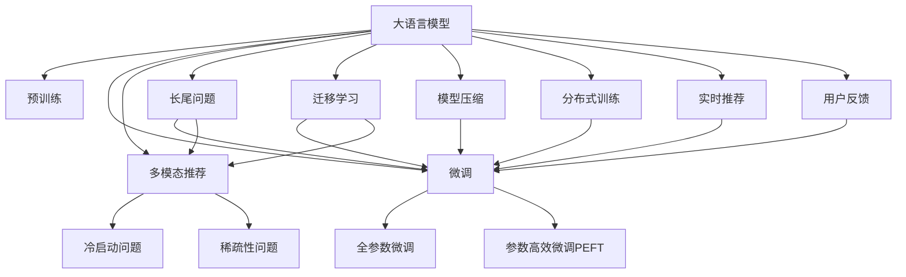

                 

## 1. 背景介绍

### 1.1 推荐系统的问题由来

推荐系统是现代互联网的基石，通过精准推荐，极大提升了用户满意度，驱动了电商、视频、社交网络等平台的用户粘性和收入增长。然而，传统推荐算法通常基于用户历史行为数据进行个性化推荐，无法充分挖掘长尾领域中的潜在用户，难以覆盖平台上的多样化需求。

推荐系统的问题主要体现在以下几个方面：

1. **长尾问题**：大部分用户只对少数物品进行过评价，有大量的长尾物品没有评价信息，从而难以获得有效反馈，难以进入推荐列表。
2. **冷启动问题**：新用户、新物品刚开始没有足够的历史行为数据，传统推荐算法难以提供精准推荐。
3. **稀疏性问题**：用户历史行为数据通常十分稀疏，导致推荐系统难以学习到用户的完整偏好，容易产生偏差。
4. **泛化能力不足**：推荐系统在真实场景中往往表现不佳，无法泛化到未见过的新场景和新数据。

### 1.2 大语言模型（LLM）的引入

近年来，随着深度学习技术的发展，大语言模型（Large Language Models, LLMs）在自然语言处理领域取得了显著进步。预训练语言模型，如GPT、BERT、RoBERTa等，通过在海量无标签文本上预训练，学习到了丰富的语言知识和语法规则，具备强大的语言理解和生成能力。

大语言模型在推荐系统中的应用，为解决上述问题带来了新的希望。通过预训练模型学习语言中的隐含信息，结合推荐系统中的用户行为数据，可以有效提升推荐系统对长尾用户和物品的覆盖能力。

## 2. 核心概念与联系

### 2.1 核心概念概述

本节将介绍几个与LLM在推荐系统中应用密切相关的核心概念：

1. **大语言模型（LLM）**：以自回归(如GPT)或自编码(如BERT)模型为代表的大规模预训练语言模型。通过在大规模无标签文本语料上进行预训练，学习通用的语言表示，具备强大的语言理解和生成能力。

2. **预训练（Pre-training）**：指在大规模无标签文本语料上，通过自监督学习任务训练通用语言模型的过程。常见的预训练任务包括言语建模、遮挡语言模型等。

3. **微调（Fine-tuning）**：指在预训练模型的基础上，使用推荐系统的用户行为数据，通过有监督地训练来优化模型在推荐任务上的性能。通常只需要调整顶层分类器或解码器，并以较小的学习率更新全部或部分的模型参数。

4. **迁移学习（Transfer Learning）**：指将一个领域学习到的知识，迁移应用到另一个不同但相关的领域的学习范式。LLM的预训练-微调过程即是一种典型的迁移学习方式。

5. **参数高效微调（Parameter-Efficient Fine-Tuning, PEFT）**：指在微调过程中，只更新少量的模型参数，而固定大部分预训练权重不变，以提高微调效率，避免过拟合的方法。

6. **长尾问题（Long-Tail Problem）**：指在数据集中，大部分用户只对少数物品进行了评价，而大量长尾物品没有评价信息，从而难以进入推荐列表的问题。

7. **多模态推荐（Multimodal Recommendation）**：将用户的行为数据（如点击、浏览、评分等）和物品的属性信息（如图片、视频、音频等）结合起来，提升推荐系统的精准度和用户满意度。

8. **冷启动问题（Cold-Start Problem）**：新用户、新物品刚开始没有足够的历史行为数据，推荐系统难以提供精准推荐。

9. **稀疏性问题（Sparse Problem）**：用户历史行为数据通常十分稀疏，难以学习到用户的完整偏好，容易产生偏差。

这些概念之间的逻辑关系可以通过以下Mermaid流程图来展示：



这个流程图展示了大语言模型与推荐系统各个关键概念的关联：

1. 大语言模型通过预训练获得基础能力。
2. 微调是对预训练模型进行任务特定的优化，可以分为全参数微调和参数高效微调（PEFT）。
3. 多模态推荐结合用户行为和物品属性信息，提升推荐系统的效果。
4. 长尾问题、冷启动问题和稀疏性问题需要通过大语言模型来解决。
5. 迁移学习是连接预训练模型与推荐任务的桥梁，可以通过微调或多模态推荐来解决。
6. 模型压缩、分布式训练、实时推荐等都是基于大语言模型的优化技术。
7. 用户反馈对推荐系统进行持续优化，实现动态调整。

## 3. 核心算法原理 & 具体操作步骤

### 3.1 算法原理概述

基于大语言模型（LLM）的推荐系统，通过预训练模型学习通用语言知识，再结合推荐系统的用户行为数据，对预训练模型进行微调，从而提升推荐系统对长尾用户和物品的覆盖能力。

具体来说，通过以下步骤实现：

1. 将用户行为数据进行编码，得到LLM模型可处理的形式。
2. 在预训练模型的基础上，通过微调学习到用户对物品的评分或偏好。
3. 使用微调后的模型，对推荐系统的用户行为数据进行预测，输出物品评分。
4. 结合物品属性信息和其他推荐算法，生成推荐列表。

### 3.2 算法步骤详解

基于LLM的推荐系统主要包括以下几个关键步骤：

**Step 1: 准备预训练模型和数据集**

- 选择合适的预训练语言模型，如GPT、BERT等。
- 准备推荐系统的用户行为数据集，通常包含用户对物品的评分、点击、浏览、收藏等信息。
- 将数据集划分为训练集、验证集和测试集，确保数据分布的代表性。

**Step 2: 数据预处理**

- 对用户行为数据进行编码，得到LLM模型可处理的输入形式。
- 对物品属性数据进行处理，提取有用的特征。
- 对数据集进行标准化、归一化等预处理操作，确保数据一致性。

**Step 3: 添加任务适配层**

- 在预训练模型顶层设计合适的输出层和损失函数。
- 对于评分预测任务，通常在顶层添加线性分类器或回归器，使用交叉熵或均方误差损失函数。
- 对于序列推荐任务，使用自回归模型，输出序列中每个物品的评分或概率分布。

**Step 4: 设置微调超参数**

- 选择合适的优化算法及其参数，如AdamW、SGD等，设置学习率、批大小、迭代轮数等。
- 设置正则化技术及强度，包括权重衰减、Dropout、Early Stopping等。
- 确定冻结预训练参数的策略，如仅微调顶层，或全部参数都参与微调。

**Step 5: 执行梯度训练**

- 将训练集数据分批次输入模型，前向传播计算损失函数。
- 反向传播计算参数梯度，根据设定的优化算法和学习率更新模型参数。
- 周期性在验证集上评估模型性能，根据性能指标决定是否触发Early Stopping。
- 重复上述步骤直到满足预设的迭代轮数或Early Stopping条件。

**Step 6: 测试和部署**

- 在测试集上评估微调后模型，对比微调前后的精度提升。
- 使用微调后的模型对新用户和新物品进行推荐。
- 持续收集新的用户行为和物品属性数据，定期重新微调模型，以适应数据分布的变化。

### 3.3 算法优缺点

基于LLM的推荐系统具有以下优点：

1. **提升长尾物品的曝光率**：LLM模型能够从大规模无标签文本中学习到丰富的语言知识和语法规则，对长尾物品的推荐效果显著提升。
2. **泛化能力强**：LLM模型具备强大的语言理解和生成能力，对新用户和新物品的推荐效果较好。
3. **减少冷启动问题**：LLM模型能够利用用户的历史行为数据，对新用户和新物品进行精准推荐。
4. **稀疏性问题改善**：LLM模型能够利用用户的行为数据，学习到用户的完整偏好，改善稀疏性问题。

同时，该方法也存在一定的局限性：

1. **高计算成本**：预训练模型通常参数量巨大，计算资源消耗较大。
2. **数据隐私问题**：用户行为数据涉及个人隐私，如何保护数据隐私是重要问题。
3. **模型复杂度高**：LLM模型结构复杂，微调过程较复杂，调试难度较大。
4. **高昂标注成本**：标注数据对微调效果影响较大，但高质量标注数据的获取成本较高。
5. **泛化能力差**：LLM模型在泛化到未见过的新场景和新数据时，效果不佳。

尽管存在这些局限性，但LLM在推荐系统中的应用，为解决长尾问题、冷启动问题和稀疏性问题提供了新的思路。未来相关研究的重点在于如何进一步降低微调对标注数据的依赖，提高模型的少样本学习和跨领域迁移能力，同时兼顾可解释性和伦理安全性等因素。

### 3.4 算法应用领域

基于LLM的推荐系统已经在多个领域得到应用，如电商、视频、社交网络、新闻等，为推荐系统带来了新的突破：

1. **电商推荐**：基于LLM的电商推荐系统，能够对长尾商品进行精准推荐，提升平台商品曝光率和用户满意度。
2. **视频推荐**：LLM能够学习视频中的自然语言描述，结合用户行为数据，生成个性化视频推荐。
3. **社交网络**：在社交网络中，LLM能够学习用户评论、帖子等文本信息，结合用户行为数据，生成个性化的社交内容推荐。
4. **新闻推荐**：LLM能够学习新闻文章的语言特征，结合用户阅读历史，生成个性化的新闻推荐。
5. **旅游推荐**：LLM能够学习旅游目的地描述，结合用户历史旅游记录，生成个性化的旅游推荐。

除了上述这些经典领域外，LLM在更多场景中也能发挥其独特的优势，如可控推荐、知识图谱推荐、实时推荐等，为推荐系统带来了全新的突破。

## 4. 数学模型和公式 & 详细讲解

### 4.1 数学模型构建

假设预训练语言模型为 $M_{\theta}$，其中 $\theta$ 为预训练得到的模型参数。给定推荐系统的用户行为数据集 $D=\{(x_i,y_i)\}_{i=1}^N$，其中 $x_i$ 为用户的行为数据（如点击、浏览、评分等），$y_i$ 为推荐物品的评分或概率分布。微调的目标是找到新的模型参数 $\hat{\theta}$，使得：

$$
\hat{\theta}=\mathop{\arg\min}_{\theta} \mathcal{L}(M_{\theta},D)
$$

其中 $\mathcal{L}$ 为针对推荐任务设计的损失函数，用于衡量模型预测输出与真实标签之间的差异。常见的损失函数包括均方误差损失、交叉熵损失等。

### 4.2 公式推导过程

以下我们以评分预测任务为例，推导均方误差损失函数及其梯度的计算公式。

假设模型 $M_{\theta}$ 在输入 $x_i$ 上的输出为 $\hat{y}=M_{\theta}(x_i) \in \mathbb{R}$，表示用户对物品 $i$ 的评分预测。真实标签 $y_i \in \mathbb{R}$。则均方误差损失函数定义为：

$$
\ell(M_{\theta}(x_i),y_i) = \frac{1}{2}(y_i - \hat{y})^2
$$

将其代入经验风险公式，得：

$$
\mathcal{L}(\theta) = \frac{1}{N}\sum_{i=1}^N \ell(M_{\theta}(x_i),y_i)
$$

根据链式法则，损失函数对参数 $\theta_k$ 的梯度为：

$$
\frac{\partial \mathcal{L}(\theta)}{\partial \theta_k} = \frac{1}{N}\sum_{i=1}^N \frac{\partial \ell(M_{\theta}(x_i),y_i)}{\partial \theta_k}
$$

其中：

$$
\frac{\partial \ell(M_{\theta}(x_i),y_i)}{\partial \theta_k} = (y_i - \hat{y}) \cdot \frac{\partial \hat{y}}{\partial \theta_k}
$$

$$
\frac{\partial \hat{y}}{\partial \theta_k} = \frac{\partial M_{\theta}(x_i)}{\partial \theta_k} \cdot \frac{\partial M_{\theta}(x_i)}{\partial \hat{y}}
$$

$$
\frac{\partial M_{\theta}(x_i)}{\partial \hat{y}} = 1
$$

在得到损失函数的梯度后，即可带入参数更新公式，完成模型的迭代优化。重复上述过程直至收敛，最终得到适应推荐任务的最优模型参数 $\hat{\theta}$。

## 5. 项目实践：代码实例和详细解释说明

### 5.1 开发环境搭建

在进行推荐系统开发前，我们需要准备好开发环境。以下是使用Python进行PyTorch开发的环境配置流程：

1. 安装Anaconda：从官网下载并安装Anaconda，用于创建独立的Python环境。

2. 创建并激活虚拟环境：
```bash
conda create -n pytorch-env python=3.8 
conda activate pytorch-env
```

3. 安装PyTorch：根据CUDA版本，从官网获取对应的安装命令。例如：
```bash
conda install pytorch torchvision torchaudio cudatoolkit=11.1 -c pytorch -c conda-forge
```

4. 安装Transformers库：
```bash
pip install transformers
```

5. 安装各类工具包：
```bash
pip install numpy pandas scikit-learn matplotlib tqdm jupyter notebook ipython
```

完成上述步骤后，即可在`pytorch-env`环境中开始推荐系统开发。

### 5.2 源代码详细实现

这里我们以电商推荐系统为例，给出使用Transformers库对BERT模型进行评分预测微调的PyTorch代码实现。

首先，定义评分预测任务的数据处理函数：

```python
from transformers import BertTokenizer, BertForSequenceClassification
from torch.utils.data import Dataset
import torch

class ReviewsDataset(Dataset):
    def __init__(self, texts, labels, tokenizer, max_len=128):
        self.texts = texts
        self.labels = labels
        self.tokenizer = tokenizer
        self.max_len = max_len
        
    def __len__(self):
        return len(self.texts)
    
    def __getitem__(self, item):
        text = self.texts[item]
        label = self.labels[item]
        
        encoding = self.tokenizer(text, return_tensors='pt', max_length=self.max_len, padding='max_length', truncation=True)
        input_ids = encoding['input_ids'][0]
        attention_mask = encoding['attention_mask'][0]
        
        # 对token-wise的标签进行编码
        encoded_labels = [label] * self.max_len
        labels = torch.tensor(encoded_labels, dtype=torch.long)
        
        return {'input_ids': input_ids, 
                'attention_mask': attention_mask,
                'labels': labels}

# 加载预训练模型和分词器
tokenizer = BertTokenizer.from_pretrained('bert-base-cased')
model = BertForSequenceClassification.from_pretrained('bert-base-cased', num_labels=2)

# 准备数据集
train_dataset = ReviewsDataset(train_texts, train_labels, tokenizer)
dev_dataset = ReviewsDataset(dev_texts, dev_labels, tokenizer)
test_dataset = ReviewsDataset(test_texts, test_labels, tokenizer)
```

然后，定义模型和优化器：

```python
from transformers import AdamW

# 设置微调超参数
learning_rate = 2e-5
batch_size = 16
epochs = 5
optimizer = AdamW(model.parameters(), lr=learning_rate)
```

接着，定义训练和评估函数：

```python
from torch.utils.data import DataLoader
from tqdm import tqdm
from sklearn.metrics import mean_squared_error

device = torch.device('cuda') if torch.cuda.is_available() else torch.device('cpu')
model.to(device)

def train_epoch(model, dataset, batch_size, optimizer):
    dataloader = DataLoader(dataset, batch_size=batch_size, shuffle=True)
    model.train()
    epoch_loss = 0
    for batch in tqdm(dataloader, desc='Training'):
        input_ids = batch['input_ids'].to(device)
        attention_mask = batch['attention_mask'].to(device)
        labels = batch['labels'].to(device)
        model.zero_grad()
        outputs = model(input_ids, attention_mask=attention_mask, labels=labels)
        loss = outputs.loss
        epoch_loss += loss.item()
        loss.backward()
        optimizer.step()
    return epoch_loss / len(dataloader)

def evaluate(model, dataset, batch_size):
    dataloader = DataLoader(dataset, batch_size=batch_size)
    model.eval()
    mse = mean_squared_error(y_true=dataset.labels, y_pred=model(torch.tensor(dataset.texts, dtype=torch.long)).detach().cpu().numpy())
    return mse

```

最后，启动训练流程并在测试集上评估：

```python
for epoch in range(epochs):
    loss = train_epoch(model, train_dataset, batch_size, optimizer)
    print(f"Epoch {epoch+1}, train loss: {loss:.3f}")
    
    print(f"Epoch {epoch+1}, dev MSE: {evaluate(model, dev_dataset, batch_size):.3f}")
    
print("Test MSE: {:.3f}".format(evaluate(model, test_dataset, batch_size)))
```

以上就是使用PyTorch对BERT进行评分预测任务微调的完整代码实现。可以看到，得益于Transformers库的强大封装，我们可以用相对简洁的代码完成BERT模型的加载和微调。

### 5.3 代码解读与分析

让我们再详细解读一下关键代码的实现细节：

**ReviewsDataset类**：
- `__init__`方法：初始化文本、标签、分词器等关键组件。
- `__len__`方法：返回数据集的样本数量。
- `__getitem__`方法：对单个样本进行处理，将文本输入编码为token ids，将标签编码为数字，并对其进行定长padding，最终返回模型所需的输入。

**模型和优化器**：
- 使用BertForSequenceClassification作为评分预测任务模型，选择适当的预训练模型和任务适配层。
- 设置微调超参数，包括学习率、批大小、迭代轮数等。

**训练和评估函数**：
- 使用PyTorch的DataLoader对数据集进行批次化加载，供模型训练和推理使用。
- 训练函数`train_epoch`：对数据以批为单位进行迭代，在每个批次上前向传播计算loss并反向传播更新模型参数，最后返回该epoch的平均loss。
- 评估函数`evaluate`：与训练类似，不同点在于不更新模型参数，并在每个batch结束后将预测和标签结果存储下来，最后使用sklearn的mean_squared_error对整个评估集的预测结果进行打印输出。

**训练流程**：
- 定义总的epoch数和批大小，开始循环迭代
- 每个epoch内，先在训练集上训练，输出平均loss
- 在验证集上评估，输出MSE
- 所有epoch结束后，在测试集上评估，给出最终测试结果

可以看到，PyTorch配合Transformers库使得BERT微调的代码实现变得简洁高效。开发者可以将更多精力放在数据处理、模型改进等高层逻辑上，而不必过多关注底层的实现细节。

当然，工业级的系统实现还需考虑更多因素，如模型的保存和部署、超参数的自动搜索、更灵活的任务适配层等。但核心的微调范式基本与此类似。

## 6. 实际应用场景

### 6.1 电商推荐系统

基于大语言模型（LLM）的电商推荐系统，通过将用户评论、商品描述等文本信息输入LLM模型，结合用户行为数据，生成个性化的商品推荐。

具体来说，可以收集用户对商品的评论、评分等信息，将评论文本输入LLM模型，得到商品的语言特征表示。然后将用户的浏览、点击、收藏等行为数据输入LLM模型，结合商品的语言特征，生成推荐列表。对于新用户和新商品，LLM能够通过学习历史数据，提供精准推荐。

### 6.2 视频推荐系统

在视频推荐系统中，LLM可以学习视频中的自然语言描述，结合用户观看历史，生成个性化视频推荐。

例如，对于视频推荐任务，可以收集用户对视频的观看历史和评分数据，将视频描述文本输入LLM模型，得到视频的语言特征表示。然后将用户的观看历史数据输入LLM模型，结合视频的语言特征，生成推荐列表。对于新视频和新用户，LLM能够通过学习历史数据，提供精准推荐。

### 6.3 社交网络推荐系统

在社交网络推荐系统中，LLM可以学习用户评论、帖子等文本信息，结合用户行为数据，生成个性化的社交内容推荐。

例如，对于社交网络推荐任务，可以收集用户对帖子、评论的点赞、评论、分享等行为数据，将帖子、评论文本输入LLM模型，得到内容的语言特征表示。然后将用户的行为数据输入LLM模型，结合内容的语言特征，生成推荐列表。对于新用户和新内容，LLM能够通过学习历史数据，提供精准推荐。

### 6.4 新闻推荐系统

在新闻推荐系统中，LLM可以学习新闻文章的语言特征，结合用户阅读历史，生成个性化的新闻推荐。

例如，对于新闻推荐任务，可以收集用户对新闻文章的阅读历史和评分数据，将新闻文章文本输入LLM模型，得到文章的语言特征表示。然后将用户的阅读历史数据输入LLM模型，结合文章的语言特征，生成推荐列表。对于新用户和新文章，LLM能够通过学习历史数据，提供精准推荐。

### 6.5 旅游推荐系统

在旅游推荐系统中，LLM可以学习旅游目的地描述，结合用户历史旅游记录，生成个性化的旅游推荐。

例如，对于旅游推荐任务，可以收集用户对旅游目的地的评论、评分等信息，将目的地描述文本输入LLM模型，得到目的地的语言特征表示。然后将用户的旅游历史数据输入LLM模型，结合目的地的语言特征，生成推荐列表。对于新用户和新目的地，LLM能够通过学习历史数据，提供精准推荐。

## 7. 工具和资源推荐

### 7.1 学习资源推荐

为了帮助开发者系统掌握LLM在推荐系统中的应用，这里推荐一些优质的学习资源：

1. 《Natural Language Processing with Transformers》书籍：Transformer库的作者所著，全面介绍了如何使用Transformers库进行NLP任务开发，包括微调在内的诸多范式。

2. 《Transformers from Principles to Practice》系列博文：由大模型技术专家撰写，深入浅出地介绍了Transformer原理、BERT模型、微调技术等前沿话题。

3. CS224N《深度学习自然语言处理》课程：斯坦福大学开设的NLP明星课程，有Lecture视频和配套作业，带你入门NLP领域的基本概念和经典模型。

4. 《Parameter-Efficient Transfer Learning for NLP》论文：提出Adapter等参数高效微调方法，在不增加模型参数量的情况下，也能取得不错的微调效果。

5. 《Few-Shot Learning in Natural Language Processing》书籍：介绍了少样本学习在自然语言处理中的应用，涵盖多模态学习、迁移学习等前沿话题。

通过对这些资源的学习实践，相信你一定能够快速掌握LLM在推荐系统中的应用，并用于解决实际的推荐问题。

### 7.2 开发工具推荐

高效的开发离不开优秀的工具支持。以下是几款用于LLM在推荐系统中应用开发的常用工具：

1. PyTorch：基于Python的开源深度学习框架，灵活动态的计算图，适合快速迭代研究。大部分预训练语言模型都有PyTorch版本的实现。

2. TensorFlow：由Google主导开发的开源深度学习框架，生产部署方便，适合大规模工程应用。同样有丰富的预训练语言模型资源。

3. Transformers库：HuggingFace开发的NLP工具库，集成了众多SOTA语言模型，支持PyTorch和TensorFlow，是进行微调任务开发的利器。

4. Weights & Biases：模型训练的实验跟踪工具，可以记录和可视化模型训练过程中的各项指标，方便对比和调优。与主流深度学习框架无缝集成。

5. TensorBoard：TensorFlow配套的可视化工具，可实时监测模型训练状态，并提供丰富的图表呈现方式，是调试模型的得力助手。

6. Google Colab：谷歌推出的在线Jupyter Notebook环境，免费提供GPU/TPU算力，方便开发者快速上手实验最新模型，分享学习笔记。

合理利用这些工具，可以显著提升LLM在推荐系统中的应用开发效率，加快创新迭代的步伐。

### 7.3 相关论文推荐

LLM在推荐系统中的应用源于学界的持续研究。以下是几篇奠基性的相关论文，推荐阅读：

1. Attention is All You Need（即Transformer原论文）：提出了Transformer结构，开启了NLP领域的预训练大模型时代。

2. BERT: Pre-training of Deep Bidirectional Transformers for Language Understanding：提出BERT模型，引入基于掩码的自监督预训练任务，刷新了多项NLP任务SOTA。

3. Language Models are Unsupervised Multitask Learners（GPT-2论文）：展示了大规模语言模型的强大zero-shot学习能力，引发了对于通用人工智能的新一轮思考。

4. Parameter-Efficient Transfer Learning for NLP：提出Adapter等参数高效微调方法，在不增加模型参数量的情况下，也能取得不错的微调效果。

5. Few-Shot Learning in Natural Language Processing：介绍少样本学习在自然语言处理中的应用，涵盖多模态学习、迁移学习等前沿话题。

6. Contextual Language Model Pretraining: A Survey of Recent Advances：综述了近年来基于上下文预训练的语言模型，展示了其在推荐系统中的应用前景。

这些论文代表了大语言模型在推荐系统中的应用发展脉络。通过学习这些前沿成果，可以帮助研究者把握学科前进方向，激发更多的创新灵感。

## 8. 总结：未来发展趋势与挑战

### 8.1 总结

本文对基于大语言模型（LLM）的推荐系统进行了全面系统的介绍。首先阐述了推荐系统中的长尾问题，以及LLM在解决长尾问题中的优势。其次，从原理到实践，详细讲解了LLM在推荐系统中的应用方法，给出了LLM模型微调的完整代码实现。同时，本文还广泛探讨了LLM在电商、视频、社交网络等推荐系统中的应用前景，展示了LLM在推荐系统中的巨大潜力。此外，本文精选了LLM在推荐系统中的学习资源，力求为开发者提供全方位的技术指引。

通过本文的系统梳理，可以看到，基于LLM的推荐系统正在成为推荐系统的重要范式，极大地拓展了推荐系统的应用边界，催生了更多的落地场景。受益于大规模语料的预训练，LLM模型能够对长尾用户和物品进行精准推荐，显著提升推荐系统的覆盖能力和用户满意度。未来，伴随LLM模型的不断演进，基于LLM的推荐系统将为推荐系统带来新的突破，进一步推动推荐技术在各个领域的落地应用。

### 8.2 未来发展趋势

展望未来，基于LLM的推荐系统将呈现以下几个发展趋势：

1. **长尾推荐效果提升**：随着LLM模型的不断演进，对长尾用户和物品的推荐效果将不断提升，推荐系统将覆盖更多的用户和物品，提升平台的用户粘性和满意度。

2. **跨领域推荐能力增强**：LLM模型将结合跨领域的多模态数据，提升推荐系统的多场景推荐能力，拓展推荐系统的应用边界。

3. **实时推荐能力提升**：LLM模型将结合实时数据流处理技术，提升推荐系统的实时推荐能力，满足用户对即时反馈的需求。

4. **冷启动问题解决**：LLM模型将结合知识图谱、用户画像等先验知识，提升新用户和新物品的推荐效果，缩短推荐系统的冷启动时间。

5. **稀疏性问题改善**：LLM模型将结合稀疏矩阵分解等技术，提升对稀疏数据的建模能力，提升推荐系统的精准度。

6. **隐私保护技术发展**：为了保护用户隐私，推荐系统将采用差分隐私、联邦学习等隐私保护技术，确保用户数据的安全性。

以上趋势凸显了基于LLM的推荐系统的广阔前景。这些方向的探索发展，必将进一步提升推荐系统的性能和应用范围，为推荐技术在各个领域的落地应用带来新的突破。

### 8.3 面临的挑战

尽管基于LLM的推荐系统已经取得了瞩目成就，但在迈向更加智能化、普适化应用的过程中，它仍面临着诸多挑战：

1. **高计算成本**：预训练模型通常参数量巨大，计算资源消耗较大。未来需要优化算法和硬件设备，提升推荐系统的计算效率。

2. **数据隐私问题**：用户行为数据涉及个人隐私，如何保护数据隐私是重要问题。推荐系统需采用差分隐私、联邦学习等隐私保护技术，确保用户数据的安全性。

3. **模型复杂度高**：LLM模型结构复杂，微调过程较复杂，调试难度较大。未来需要简化模型结构，提升推荐系统的可解释性和可调试性。

4. **泛化能力差**：LLM模型在泛化到未见过的新场景和新数据时，效果不佳。未来需要结合多种模型，提升推荐系统的泛化能力。

5. **可解释性不足**：LLM模型通常是"黑盒"系统，难以解释其内部工作机制和决策逻辑。推荐系统需结合可解释性技术，提升推荐过程的可理解性。

6. **服务性能问题**：推荐系统需结合分布式计算、模型压缩等技术，提升服务性能和响应速度，满足实时推荐的需求。

正视基于LLM的推荐系统面临的这些挑战，积极应对并寻求突破，将是大语言模型推荐系统走向成熟的必由之路。相信随着学界和产业界的共同努力，这些挑战终将一一被克服，基于LLM的推荐系统必将在推荐领域带来新的突破。

### 8.4 研究展望

面对基于LLM的推荐系统所面临的种种挑战，未来的研究需要在以下几个方面寻求新的突破：

1. **优化推荐算法**：结合LLM模型的语言特征表示，优化推荐算法，提升推荐系统的覆盖能力和精准度。

2. **数据隐私保护**：采用差分隐私、联邦学习等隐私保护技术，确保用户数据的安全性。

3. **简化模型结构**：简化LLM模型的结构，提升推荐系统的可解释性和可调试性。

4. **提升泛化能力**：结合多种模型，提升推荐系统的泛化能力，满足不同场景的需求。

5. **增强可解释性**：结合可解释性技术，提升推荐过程的可理解性，增强推荐系统的可信度。

6. **提升服务性能**：结合分布式计算、模型压缩等技术，提升推荐系统的服务性能和响应速度，满足实时推荐的需求。

这些研究方向的探索，必将引领基于LLM的推荐系统迈向更高的台阶，为推荐技术在各个领域的落地应用带来新的突破。面向未来，基于LLM的推荐系统还需要与其他推荐技术进行更深入的融合，如协同过滤、内容推荐、知识图谱推荐等，多路径协同发力，共同推动推荐技术的进步。

## 9. 附录：常见问题与解答

**Q1：基于LLM的推荐系统是否适用于所有推荐任务？**

A: 基于LLM的推荐系统在大多数推荐任务上都能取得不错的效果，特别是对于数据量较小的任务。但对于一些特定领域的任务，如医学、法律等，仅仅依靠通用语料预训练的模型可能难以很好地适应。此时需要在特定领域语料上进一步预训练，再进行微调，才能获得理想效果。此外，对于一些需要时效性、个性化很强的任务，如对话、推荐等，LLM模型也需要针对性的改进优化。

**Q2：LLM在推荐系统中的学习率如何设置？**

A: 基于LLM的推荐系统的学习率一般要比预训练时小1-2个数量级，如果使用过大的学习率，容易破坏预训练权重，导致过拟合。一般建议从1e-5开始调参，逐步减小学习率，直至收敛。也可以使用warmup策略，在开始阶段使用较小的学习率，再逐渐过渡到预设值。需要注意的是，不同的优化器(如AdamW、Adafactor等)以及不同的学习率调度策略，可能需要设置不同的学习率阈值。

**Q3：LLM在推荐系统中如何应对高计算成本？**

A: 预训练模型通常参数量巨大，计算资源消耗较大。为了应对高计算成本，可以采用以下优化措施：
1. 数据增强：通过回译、近义替换等方式扩充训练集，提高模型泛化能力。
2. 分布式训练：将大规模计算任务分配到多台计算设备上并行处理，提升训练速度。
3. 模型压缩：通过剪枝、量化等技术，减小模型参数量，提升计算效率。
4. 增量训练：只更新新数据对应的模型参数，避免不必要的重复计算。

这些措施可以有效降低计算成本，提升推荐系统的训练效率。

**Q4：LLM在推荐系统中如何保护数据隐私？**

A: 用户行为数据涉及个人隐私，推荐系统需采用以下隐私保护措施：
1. 差分隐私：在模型训练过程中加入噪声，确保用户数据隐私不被泄露。
2. 联邦学习：在多个数据源之间分布式训练模型，避免集中存储用户数据。
3. 数据匿名化：将用户数据进行匿名化处理，确保数据不可逆识别。

这些措施可以有效保护用户数据隐私，确保推荐系统的安全性。

**Q5：LLM在推荐系统中如何应对可解释性不足的问题？**

A: 为了提升LLM在推荐系统中的可解释性，可以采用以下方法：
1. 模型可解释性：结合可解释性技术，如LIME、SHAP等，解释推荐模型的决策过程。
2. 特征重要性：分析推荐模型的特征重要性，了解用户偏好的来源。
3. 可视化工具：使用可视化工具，展示推荐模型的决策路径，帮助用户理解推荐结果。

这些措施可以有效提升LLM在推荐系统中的可解释性，增强推荐系统的可信度。

**Q6：LLM在推荐系统中如何应对服务性能问题？**

A: 推荐系统需结合分布式计算、模型压缩等技术，提升服务性能和响应速度，满足实时推荐的需求。具体措施包括：
1. 分布式计算：利用多台计算设备并行处理，提升推荐系统计算能力。
2. 模型压缩：通过剪枝、量化等技术，减小模型参数量，提升计算效率。
3. 增量训练：只更新新数据对应的模型参数，避免不必要的重复计算。
4. 缓存机制：将高频数据进行缓存，减少重复计算和数据读取。

这些措施可以有效提升推荐系统的服务性能，满足实时推荐的需求。

---

作者：禅与计算机程序设计艺术 / Zen and the Art of Computer Programming

