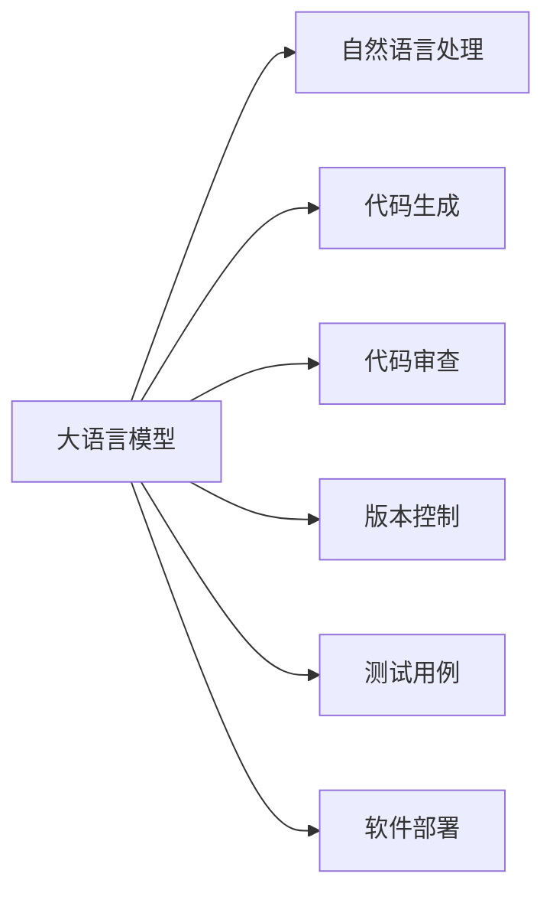

                 

# LLM对软件开发流程的潜在影响

> 关键词：大语言模型(LLM)，自然语言处理(NLP)，软件开发，自动化开发，代码生成，质量保证，版本控制，软件部署

## 1. 背景介绍

在软件开发领域，自动化开发流程一直是提升开发效率、降低人为错误的关键。随着人工智能技术的进步，大语言模型（Large Language Models, LLM）被广泛应用于软件开发流程的各个环节，从代码生成、质量保证、版本控制、测试到部署，都可能借助LLM的强大能力实现自动化，极大提升软件开发效率和质量。

### 1.1 问题由来

在软件开发的各个阶段，诸如代码编写、质量检查、版本管理、测试、部署等环节，都需要大量人工介入，耗时长、出错率高。传统上，开发者往往需要依赖经验丰富的工程师或开发者进行手工处理，但这种模式不仅效率低，且难以保证代码的一致性、高质量和可维护性。

近年来，大语言模型技术飞速发展，特别是基于Transformer架构的BERT、GPT-3等模型，在处理自然语言任务上表现出色。将大语言模型引入软件开发流程，利用其强大的自然语言理解和生成能力，可以大幅提升自动化开发效率，降低人为错误。

### 1.2 问题核心关键点

将大语言模型应用于软件开发流程，主要是利用其：
- **自然语言理解与生成**：通过自然语言理解和生成能力，大语言模型可以自动生成代码、编写文档、生成测试用例、生成部署脚本等，极大地减少人工工作量。
- **语义分析与推理**：通过语义分析与推理，大语言模型可以辅助进行代码审查、错误检测、代码重构等，提升代码质量。
- **知识检索与整合**：利用大语言模型知识库检索和整合能力，辅助进行需求分析、技术调研等。

这些能力使得大语言模型成为软件开发流程自动化优化的一个强大工具。

## 2. 核心概念与联系

### 2.1 核心概念概述

为更好地理解大语言模型在软件开发流程中的应用，本节将介绍几个密切相关的核心概念：

- **大语言模型(Large Language Model, LLM)**：指通过大规模无监督学习任务（如语言建模、掩码语言模型）预训练的语言模型，如BERT、GPT-3等。能够处理自然语言的任务，如文本分类、命名实体识别、情感分析等。

- **自然语言处理(Natural Language Processing, NLP)**：指利用计算机技术，处理、分析和生成人类语言的过程，包括文本分析、机器翻译、信息检索等。

- **自动化开发(Automated Development)**：指通过工具和流程，自动完成软件的开发、测试、部署等任务，提升开发效率和质量。

- **代码生成(Code Generation)**：指通过自然语言描述或需求，自动生成代码的过程。

- **代码审查(Code Review)**：指由其他开发者检查代码的质量、可维护性等，确保代码符合项目标准和最佳实践。

- **版本控制(Version Control)**：指通过工具（如Git）记录代码的历史变化，管理多个版本之间的差异和协同工作。

- **测试用例(Test Case)**：指为了验证软件功能或性能，设计的可执行测试数据和步骤。

- **软件部署(Software Deployment)**：指将软件产品发布到生产环境中，保证其稳定运行。

这些概念之间的逻辑关系可以通过以下Mermaid流程图来展示：



这个流程图展示了大语言模型与软件开发流程各环节的紧密联系：

1. 大语言模型通过自然语言处理能力，自动生成代码、编写文档、生成测试用例、生成部署脚本等。
2. 通过语义分析与推理，大语言模型辅助进行代码审查、错误检测、代码重构等。
3. 利用知识检索与整合能力，辅助进行需求分析、技术调研等。

这些能力使得大语言模型成为软件开发流程自动化优化的一个强大工具。

## 3. 核心算法原理 & 具体操作步骤

### 3.1 算法原理概述

大语言模型在软件开发流程中的应用，主要是基于自然语言处理和生成的原理。通过自然语言处理，大语言模型能够理解和解析输入的自然语言描述，生成对应的代码、测试用例、文档等。通过自然语言生成，大语言模型能够自动编写代码、生成文本说明、生成自动化测试脚本等。

形式化地，假设输入的自然语言描述为 $D=\{x_i\}_{i=1}^N$，大语言模型 $M_{\theta}$ 在 $D$ 上的输出为 $Y=\{y_i\}_{i=1}^N$，其中 $y_i$ 为生成的代码、文档、测试用例等，则目标函数可以表示为：

$$
\mathcal{L}(\theta) = \frac{1}{N} \sum_{i=1}^N \ell(y_i, \hat{y_i})
$$

其中 $\ell(y_i, \hat{y_i})$ 为损失函数，衡量生成结果与自然语言描述之间的差异。通过最小化目标函数 $\mathcal{L}(\theta)$，使得大语言模型生成结果与输入描述高度一致。

### 3.2 算法步骤详解

基于大语言模型的软件开发流程自动化一般包括以下几个关键步骤：

**Step 1: 收集和准备数据**
- 收集目标任务的样本数据，包括代码描述、测试用例、需求文档等。
- 清洗数据，去除噪音和不必要的字段，保证数据质量。
- 划分数据集为训练集、验证集和测试集。

**Step 2: 模型训练**
- 选择合适的预训练模型（如BERT、GPT-3等），作为基础模型。
- 添加任务适配层，将自然语言描述转化为模型的输入格式。
- 在训练集上使用监督学习方式训练模型。
- 在验证集上评估模型性能，调整超参数。

**Step 3: 代码生成**
- 对于代码生成任务，将自然语言描述输入模型，生成代码片段或完整代码。
- 使用代码检测工具（如MyPy、Linter）检查生成的代码语法和风格。
- 优化代码，确保其符合项目标准和最佳实践。

**Step 4: 代码审查**
- 对于代码审查任务，将生成的代码和自然语言描述输入模型，判断代码质量、可维护性等。
- 使用代码质量评估工具（如SonarQube、CodeClimate）辅助进行代码审查。
- 提出改进建议，优化代码质量。

**Step 5: 版本控制**
- 对于版本控制任务，将自然语言描述转化为版本控制指令，自动更新版本控制系统的代码库。
- 记录代码变更历史，方便追踪和协同工作。

**Step 6: 测试用例生成**
- 对于测试用例生成任务，将自然语言描述转化为测试用例和执行脚本。
- 运行测试用例，评估代码功能是否符合要求。
- 根据测试结果，调整和优化测试用例。

**Step 7: 软件部署**
- 对于软件部署任务，将自然语言描述转化为部署脚本和配置文件。
- 自动执行部署脚本，确保软件稳定运行。

### 3.3 算法优缺点

基于大语言模型的软件开发自动化方法具有以下优点：
1. 提升开发效率：通过自动化生成代码、测试用例等，显著减少人工工作量，提升开发速度。
2. 提高代码质量：利用大语言模型的语义分析和推理能力，辅助进行代码审查和错误检测，提升代码质量。
3. 降低人为错误：自动生成代码和测试用例，减少人工输入的错误，提高代码的正确性。
4. 灵活性高：大语言模型可以处理各种自然语言描述，适应不同场景的需求。

同时，该方法也存在一定的局限性：
1. 依赖自然语言描述质量：生成的代码、测试用例等依赖输入的自然语言描述，描述不清可能导致生成的结果不正确。
2. 上下文理解难度高：大语言模型需要理解输入的自然语言描述的上下文，对于复杂场景的理解可能不够深入。
3. 模型训练成本高：大语言模型的训练需要大量计算资源和标注数据，成本较高。
4. 可解释性差：大语言模型的内部决策过程难以解释，缺乏透明度。

尽管存在这些局限性，但大语言模型在软件开发自动化方面的应用潜力巨大，仍有进一步探索和优化的空间。

### 3.4 算法应用领域

大语言模型在软件开发流程中的应用，主要集中在以下几个领域：

1. **代码生成**：对于编程语言自动生成代码、API调用、SQL语句等，减少手工编写代码的时间。
2. **代码审查**：辅助进行代码审查，生成改进建议，优化代码质量。
3. **测试用例生成**：自动生成测试用例，提高测试覆盖率和准确性。
4. **版本控制**：自动生成版本控制命令，记录代码变更历史。
5. **文档生成**：自动生成代码文档、用户手册、API文档等，提升文档质量和维护效率。
6. **软件部署**：自动生成部署脚本和配置文件，简化软件部署流程。

除了上述这些经典应用外，大语言模型还可应用于代码重构、代码规范检查、版本冲突解决等，进一步提升软件开发流程的自动化水平。

## 4. 数学模型和公式 & 详细讲解 & 举例说明

### 4.1 数学模型构建

假设大语言模型 $M_{\theta}$ 在自然语言描述 $D=\{x_i\}_{i=1}^N$ 上的输出为 $Y=\{y_i\}_{i=1}^N$，其中 $y_i$ 为生成的代码、测试用例、文档等。定义损失函数 $\ell(y_i, \hat{y_i})$ 衡量生成的结果与自然语言描述的差异，则目标函数可以表示为：

$$
\mathcal{L}(\theta) = \frac{1}{N} \sum_{i=1}^N \ell(y_i, \hat{y_i})
$$

其中 $\ell(y_i, \hat{y_i})$ 为损失函数，可以是均方误差损失、交叉熵损失等。目标是最小化 $\mathcal{L}(\theta)$，使得生成的结果尽可能接近自然语言描述。

### 4.2 公式推导过程

对于代码生成任务，假设自然语言描述为 $x$，生成的代码为 $y$，则目标函数可以表示为：

$$
\mathcal{L}(\theta) = \frac{1}{N} \sum_{i=1}^N (y_i - \hat{y_i})^2
$$

其中 $y_i$ 为真实的代码片段，$\hat{y_i}$ 为模型生成的代码片段。

对于代码审查任务，假设自然语言描述为 $x$，代码片段为 $y$，则目标函数可以表示为：

$$
\mathcal{L}(\theta) = \frac{1}{N} \sum_{i=1}^N \log \sigma(\ell(y_i, x_i))
$$

其中 $\ell(y_i, x_i)$ 为代码与自然语言描述之间的语义差异，$\sigma$ 为激活函数。

通过上述目标函数的推导，我们可以更好地理解大语言模型在代码生成和代码审查任务中的工作原理。

### 4.3 案例分析与讲解

以代码生成任务为例，假设给定自然语言描述 "定义一个函数，计算两个数的平均值"，使用BERT模型进行代码生成。

**Step 1: 数据准备**
- 收集标注的代码片段和自然语言描述。
- 划分数据集为训练集、验证集和测试集。

**Step 2: 模型训练**
- 选择BERT模型作为基础模型。
- 添加任务适配层，将自然语言描述转化为模型的输入格式。
- 在训练集上使用监督学习方式训练模型。
- 在验证集上评估模型性能，调整超参数。

**Step 3: 代码生成**
- 输入自然语言描述 "定义一个函数，计算两个数的平均值"。
- 模型输出生成的代码片段。
- 使用MyPy等工具检查代码语法和风格。
- 优化代码，确保其符合项目标准和最佳实践。

**Step 4: 代码审查**
- 将生成的代码片段和自然语言描述输入BERT模型，判断代码质量。
- 使用SonarQube等工具辅助进行代码审查。
- 提出改进建议，优化代码质量。

通过上述过程，大语言模型能够自动生成代码，辅助进行代码审查，提升开发效率和代码质量。

## 5. 项目实践：代码实例和详细解释说明

### 5.1 开发环境搭建

在进行代码生成实践前，我们需要准备好开发环境。以下是使用Python进行PyTorch开发的环境配置流程：

1. 安装Anaconda：从官网下载并安装Anaconda，用于创建独立的Python环境。

2. 创建并激活虚拟环境：
```bash
conda create -n pytorch-env python=3.8 
conda activate pytorch-env
```

3. 安装PyTorch：根据CUDA版本，从官网获取对应的安装命令。例如：
```bash
conda install pytorch torchvision torchaudio cudatoolkit=11.1 -c pytorch -c conda-forge
```

4. 安装Transformers库：
```bash
pip install transformers
```

5. 安装各类工具包：
```bash
pip install numpy pandas scikit-learn matplotlib tqdm jupyter notebook ipython
```

完成上述步骤后，即可在`pytorch-env`环境中开始代码生成实践。

### 5.2 源代码详细实现

下面我们以代码生成任务为例，给出使用Transformers库对BERT模型进行代码生成实践的PyTorch代码实现。

首先，定义代码生成任务的数据处理函数：

```python
from transformers import BertTokenizer
from torch.utils.data import Dataset
import torch

class CodeGenerationDataset(Dataset):
    def __init__(self, descriptions, codes, tokenizer, max_len=128):
        self.descriptions = descriptions
        self.codes = codes
        self.tokenizer = tokenizer
        self.max_len = max_len
        
    def __len__(self):
        return len(self.descriptions)
    
    def __getitem__(self, item):
        description = self.descriptions[item]
        code = self.codes[item]
        
        encoding = self.tokenizer(description, return_tensors='pt', max_length=self.max_len, padding='max_length', truncation=True)
        input_ids = encoding['input_ids'][0]
        attention_mask = encoding['attention_mask'][0]
        
        # 对token-wise的标签进行编码
        label_ids = torch.tensor([id] * len(input_ids), dtype=torch.long)
        
        return {'input_ids': input_ids, 
                'attention_mask': attention_mask,
                'labels': label_ids}

# 定义标签与id的映射
id_to_label = {'0': 'invalid', '1': 'valid'}

# 创建dataset
tokenizer = BertTokenizer.from_pretrained('bert-base-cased')

train_dataset = CodeGenerationDataset(train_descriptions, train_codes, tokenizer)
dev_dataset = CodeGenerationDataset(dev_descriptions, dev_codes, tokenizer)
test_dataset = CodeGenerationDataset(test_descriptions, test_codes, tokenizer)
```

然后，定义模型和优化器：

```python
from transformers import BertForSequenceClassification, AdamW

model = BertForSequenceClassification.from_pretrained('bert-base-cased', num_labels=2)

optimizer = AdamW(model.parameters(), lr=2e-5)
```

接着，定义训练和评估函数：

```python
from torch.utils.data import DataLoader
from tqdm import tqdm
from sklearn.metrics import classification_report

device = torch.device('cuda') if torch.cuda.is_available() else torch.device('cpu')
model.to(device)

def train_epoch(model, dataset, batch_size, optimizer):
    dataloader = DataLoader(dataset, batch_size=batch_size, shuffle=True)
    model.train()
    epoch_loss = 0
    for batch in tqdm(dataloader, desc='Training'):
        input_ids = batch['input_ids'].to(device)
        attention_mask = batch['attention_mask'].to(device)
        labels = batch['labels'].to(device)
        model.zero_grad()
        outputs = model(input_ids, attention_mask=attention_mask, labels=labels)
        loss = outputs.loss
        epoch_loss += loss.item()
        loss.backward()
        optimizer.step()
    return epoch_loss / len(dataloader)

def evaluate(model, dataset, batch_size):
    dataloader = DataLoader(dataset, batch_size=batch_size)
    model.eval()
    preds, labels = [], []
    with torch.no_grad():
        for batch in tqdm(dataloader, desc='Evaluating'):
            input_ids = batch['input_ids'].to(device)
            attention_mask = batch['attention_mask'].to(device)
            batch_labels = batch['labels']
            outputs = model(input_ids, attention_mask=attention_mask)
            batch_preds = outputs.logits.argmax(dim=2).to('cpu').tolist()
            batch_labels = batch_labels.to('cpu').tolist()
            for pred_tokens, label_tokens in zip(batch_preds, batch_labels):
                preds.append(pred_tokens[:len(label_tokens)])
                labels.append(label_tokens)
                
    print(classification_report(labels, preds))
```

最后，启动训练流程并在测试集上评估：

```python
epochs = 5
batch_size = 16

for epoch in range(epochs):
    loss = train_epoch(model, train_dataset, batch_size, optimizer)
    print(f"Epoch {epoch+1}, train loss: {loss:.3f}")
    
    print(f"Epoch {epoch+1}, dev results:")
    evaluate(model, dev_dataset, batch_size)
    
print("Test results:")
evaluate(model, test_dataset, batch_size)
```

以上就是使用PyTorch对BERT进行代码生成实践的完整代码实现。可以看到，得益于Transformers库的强大封装，我们能够用相对简洁的代码完成BERT模型的加载和代码生成。

### 5.3 代码解读与分析

让我们再详细解读一下关键代码的实现细节：

**CodeGenerationDataset类**：
- `__init__`方法：初始化描述、代码、分词器等关键组件。
- `__len__`方法：返回数据集的样本数量。
- `__getitem__`方法：对单个样本进行处理，将描述输入编码为token ids，将代码编码为标签，并对其进行定长padding，最终返回模型所需的输入。

**id_to_label字典**：
- 定义了标签与数字id之间的映射关系，用于将token-wise的预测结果解码回真实的标签。

**训练和评估函数**：
- 使用PyTorch的DataLoader对数据集进行批次化加载，供模型训练和推理使用。
- 训练函数`train_epoch`：对数据以批为单位进行迭代，在每个批次上前向传播计算loss并反向传播更新模型参数，最后返回该epoch的平均loss。
- 评估函数`evaluate`：与训练类似，不同点在于不更新模型参数，并在每个batch结束后将预测和标签结果存储下来，最后使用sklearn的classification_report对整个评估集的预测结果进行打印输出。

**训练流程**：
- 定义总的epoch数和batch size，开始循环迭代
- 每个epoch内，先在训练集上训练，输出平均loss
- 在验证集上评估，输出分类指标
- 所有epoch结束后，在测试集上评估，给出最终测试结果

可以看到，PyTorch配合Transformers库使得BERT微调的代码实现变得简洁高效。开发者可以将更多精力放在数据处理、模型改进等高层逻辑上，而不必过多关注底层的实现细节。

当然，工业级的系统实现还需考虑更多因素，如模型的保存和部署、超参数的自动搜索、更灵活的任务适配层等。但核心的微调范式基本与此类似。

## 6. 实际应用场景

### 6.1 软件开发流程自动化

基于大语言模型的代码生成和审查功能，可以大大简化软件开发流程，提升开发效率和代码质量。例如，在项目开发初期，可以自动生成项目文档、API文档、代码框架等，减少开发者的手工编写工作量。在代码审查阶段，可以自动生成代码审查报告，指出代码中的潜在问题和改进建议，提升代码质量。

### 6.2 模型训练和部署

大语言模型也可以应用于模型训练和部署环节。例如，在模型训练过程中，可以自动生成训练脚本、测试脚本等，简化训练流程。在模型部署阶段，可以自动生成部署脚本、配置文件等，简化部署流程。

### 6.3 软件质量保证

大语言模型可以辅助进行代码质量保证，通过自动生成测试用例和生成代码审查报告，帮助开发者发现代码中的错误和潜在问题。例如，在代码生成阶段，可以自动生成测试用例，提高测试覆盖率。在代码审查阶段，可以自动生成代码审查报告，指出代码中的潜在问题和改进建议。

### 6.4 软件重构

大语言模型可以辅助进行代码重构，通过自动生成重构代码和生成重构报告，帮助开发者优化代码结构，提升代码可维护性。例如，在代码审查阶段，可以自动生成重构报告，指出代码中的重复、冗余等问题，并提供优化建议。

### 6.5 软件升级和维护

大语言模型可以辅助进行软件升级和维护，通过自动生成升级脚本和维护报告，帮助开发者简化升级和维护流程。例如，在软件升级阶段，可以自动生成升级脚本，简化升级流程。在软件维护阶段，可以自动生成维护报告，指出代码中的潜在问题和改进建议。

## 7. 工具和资源推荐

### 7.1 学习资源推荐

为了帮助开发者系统掌握大语言模型在软件开发流程中的应用，这里推荐一些优质的学习资源：

1. 《Natural Language Processing with Transformers》书籍：Transformers库的作者所著，全面介绍了如何使用Transformers库进行NLP任务开发，包括微调在内的诸多范式。

2. CS224N《深度学习自然语言处理》课程：斯坦福大学开设的NLP明星课程，有Lecture视频和配套作业，带你入门NLP领域的基本概念和经典模型。

3. 《Transformers from Scratch》书籍：介绍Transformer的原理和实现，适合深入理解Transformer架构。

4. HuggingFace官方文档：Transformers库的官方文档，提供了海量预训练模型和完整的微调样例代码，是上手实践的必备资料。

5. Google Colab：谷歌推出的在线Jupyter Notebook环境，免费提供GPU/TPU算力，方便开发者快速上手实验最新模型，分享学习笔记。

通过对这些资源的学习实践，相信你一定能够快速掌握大语言模型在软件开发流程中的应用，并用于解决实际的NLP问题。

### 7.2 开发工具推荐

高效的开发离不开优秀的工具支持。以下是几款用于大语言模型微调开发的常用工具：

1. PyTorch：基于Python的开源深度学习框架，灵活动态的计算图，适合快速迭代研究。大部分预训练语言模型都有PyTorch版本的实现。

2. TensorFlow：由Google主导开发的开源深度学习框架，生产部署方便，适合大规模工程应用。同样有丰富的预训练语言模型资源。

3. Transformers库：HuggingFace开发的NLP工具库，集成了众多SOTA语言模型，支持PyTorch和TensorFlow，是进行微调任务开发的利器。

4. Weights & Biases：模型训练的实验跟踪工具，可以记录和可视化模型训练过程中的各项指标，方便对比和调优。与主流深度学习框架无缝集成。

5. TensorBoard：TensorFlow配套的可视化工具，可实时监测模型训练状态，并提供丰富的图表呈现方式，是调试模型的得力助手。

6. Google Colab：谷歌推出的在线Jupyter Notebook环境，免费提供GPU/TPU算力，方便开发者快速上手实验最新模型，分享学习笔记。

合理利用这些工具，可以显著提升大语言模型微调任务的开发效率，加快创新迭代的步伐。

### 7.3 相关论文推荐

大语言模型在软件开发流程中的应用源于学界的持续研究。以下是几篇奠基性的相关论文，推荐阅读：

1. Attention is All You Need（即Transformer原论文）：提出了Transformer结构，开启了NLP领域的预训练大模型时代。

2. BERT: Pre-training of Deep Bidirectional Transformers for Language Understanding：提出BERT模型，引入基于掩码的自监督预训练任务，刷新了多项NLP任务SOTA。

3. Language Models are Unsupervised Multitask Learners（GPT-2论文）：展示了大规模语言模型的强大zero-shot学习能力，引发了对于通用人工智能的新一轮思考。

4. Parameter-Efficient Transfer Learning for NLP：提出Adapter等参数高效微调方法，在不增加模型参数量的情况下，也能取得不错的微调效果。

5. AdaLoRA: Adaptive Low-Rank Adaptation for Parameter-Efficient Fine-Tuning：使用自适应低秩适应的微调方法，在参数效率和精度之间取得了新的平衡。

这些论文代表了大语言模型微调技术的发展脉络。通过学习这些前沿成果，可以帮助研究者把握学科前进方向，激发更多的创新灵感。

## 8. 总结：未来发展趋势与挑战

### 8.1 总结

本文对大语言模型在软件开发流程中的应用进行了全面系统的介绍。首先阐述了大语言模型和微调技术的研究背景和意义，明确了微调在拓展预训练模型应用、提升软件开发效率和质量方面的独特价值。其次，从原理到实践，详细讲解了大语言模型在代码生成、代码审查、版本控制、测试用例生成、软件部署等方面的应用，并给出了微调任务开发的完整代码实例。同时，本文还广泛探讨了大语言模型在软件开发流程自动化中的应用前景，展示了微调范式的巨大潜力。此外，本文精选了微调技术的各类学习资源，力求为开发者提供全方位的技术指引。

通过本文的系统梳理，可以看到，大语言模型在软件开发流程中的应用潜力巨大，不仅能够显著提升开发效率和代码质量，还能够在模型训练和部署、质量保证、重构维护等方面发挥重要作用。大语言模型在软件开发流程中的应用，是大数据和人工智能技术融合的体现，是软件开发自动化的一次重大突破。

### 8.2 未来发展趋势

展望未来，大语言模型在软件开发流程中的应用将呈现以下几个发展趋势：

1. 应用场景不断扩展。随着技术进步，大语言模型将更多地应用于软件开发的各个环节，从代码生成、代码审查、版本控制、测试用例生成、软件部署等，到需求分析、技术调研等。

2. 自动化水平不断提升。未来的大语言模型将具备更高的自动化水平，能够自动生成更准确、更符合项目标准和最佳实践的代码、文档、测试用例等。

3. 融合多模态数据。未来的大语言模型将更多地融合多模态数据，如视觉、语音等，增强对复杂场景的理解能力。

4. 引入先验知识。未来的大语言模型将更多地引入先验知识，如知识图谱、逻辑规则等，增强对任务的理解能力。

5. 提高可解释性。未来的大语言模型将更多地考虑可解释性，通过自然语言描述，让开发者更好地理解模型的内部工作机制和决策逻辑。

6. 引入伦理约束。未来的大语言模型将更多地考虑伦理约束，确保生成的代码、文档、测试用例等符合伦理道德规范。

以上趋势凸显了大语言模型在软件开发流程自动化方面的广阔前景。这些方向的探索发展，必将进一步提升大语言模型在软件开发中的应用效果，为软件开发自动化带来新的突破。

### 8.3 面临的挑战

尽管大语言模型在软件开发流程中的应用潜力巨大，但在迈向更加智能化、普适化应用的过程中，它仍面临诸多挑战：

1. 依赖自然语言描述质量。生成的代码、测试用例等依赖输入的自然语言描述，描述不清可能导致生成的结果不正确。

2. 上下文理解难度高。大语言模型需要理解输入的自然语言描述的上下文，对于复杂场景的理解可能不够深入。

3. 模型训练成本高。大语言模型的训练需要大量计算资源和标注数据，成本较高。

4. 可解释性差。大语言模型的内部决策过程难以解释，缺乏透明度。

5. 模型鲁棒性不足。当前大语言模型面对域外数据时，泛化性能往往大打折扣。对于测试样本的微小扰动，模型的预测也容易发生波动。

尽管存在这些挑战，但大语言模型在软件开发流程中的应用潜力巨大，仍有进一步探索和优化的空间。

### 8.4 研究展望

面对大语言模型在软件开发流程中所面临的挑战，未来的研究需要在以下几个方面寻求新的突破：

1. 探索无监督和半监督微调方法。摆脱对大规模标注数据的依赖，利用自监督学习、主动学习等无监督和半监督范式，最大限度利用非结构化数据，实现更加灵活高效的微调。

2. 研究参数高效和计算高效的微调范式。开发更加参数高效的微调方法，在固定大部分预训练参数的同时，只更新极少量的任务相关参数。同时优化微调模型的计算图，减少前向传播和反向传播的资源消耗，实现更加轻量级、实时性的部署。

3. 引入因果和对比学习范式。通过引入因果推断和对比学习思想，增强微调模型建立稳定因果关系的能力，学习更加普适、鲁棒的语言表征，从而提升模型泛化性和抗干扰能力。

4. 结合因果分析和博弈论工具。将因果分析方法引入微调模型，识别出模型决策的关键特征，增强输出解释的因果性和逻辑性。借助博弈论工具刻画人机交互过程，主动探索并规避模型的脆弱点，提高系统稳定性。

5. 纳入伦理道德约束。在模型训练目标中引入伦理导向的评估指标，过滤和惩罚有偏见、有害的输出倾向。同时加强人工干预和审核，建立模型行为的监管机制，确保输出符合人类价值观和伦理道德。

这些研究方向的探索，必将引领大语言模型在软件开发流程中的应用走向更高的台阶，为软件开发自动化带来新的突破。面向未来，大语言模型在软件开发流程中的应用还需要与其他人工智能技术进行更深入的融合，如知识表示、因果推理、强化学习等，多路径协同发力，共同推动自然语言理解和智能交互系统的进步。只有勇于创新、敢于突破，才能不断拓展大语言模型的边界，让智能技术更好地造福软件开发领域。

## 9. 附录：常见问题与解答

**Q1：大语言模型在软件开发流程中的应用是否只限于代码生成？**

A: 大语言模型在软件开发流程中的应用远不止于代码生成。除了代码生成，还包括代码审查、版本控制、测试用例生成、软件部署等。通过大语言模型，可以自动生成测试用例、版本控制命令、部署脚本等，极大提升开发效率和质量。

**Q2：大语言模型在代码生成时，如何保证生成的代码质量？**

A: 大语言模型在代码生成时，可以通过添加任务适配层、正则化技术、代码检测工具等方式，提升生成的代码质量。例如，可以添加适配层将自然语言描述转换为代码格式，使用正则化技术防止生成的代码语法错误，使用MyPy等工具检查生成的代码是否符合项目标准。

**Q3：大语言模型在代码审查时，如何保证审查结果的准确性？**

A: 大语言模型在代码审查时，可以通过使用SonarQube、CodeClimate等工具，辅助进行代码质量评估，确保审查结果的准确性。同时，可以结合人工审核，对大语言模型的审查结果进行复审，进一步提升审查质量。

**Q4：大语言模型在版本控制时，如何保证版本控制命令的正确性？**

A: 大语言模型在版本控制时，可以通过使用Git等版本控制系统，将自然语言描述转换为版本控制命令。同时，可以使用版本控制工具的自动化功能，自动执行版本控制命令，确保版本控制命令的正确性。

**Q5：大语言模型在测试用例生成时，如何保证测试用例的质量？**

A: 大语言模型在测试用例生成时，可以通过使用自动测试工具，如JUnit、pytest等，生成测试用例。同时，可以结合人工审查，对测试用例进行复审，确保测试用例的质量。

**Q6：大语言模型在软件部署时，如何保证部署脚本的正确性？**

A: 大语言模型在软件部署时，可以通过使用部署工具，如Ansible、Docker等，生成部署脚本。同时，可以结合人工审查，对部署脚本进行复审，确保部署脚本的正确性。

通过这些问题的回答，可以看到，大语言模型在软件开发流程中的应用不仅限于代码生成，还包括代码审查、版本控制、测试用例生成、软件部署等多个环节。大语言模型能够显著提升软件开发流程的自动化水平，但也需要结合人工审查和自动化工具，确保最终生成的代码、文档、测试用例等的质量和正确性。

---

作者：禅与计算机程序设计艺术 / Zen and the Art of Computer Programming

