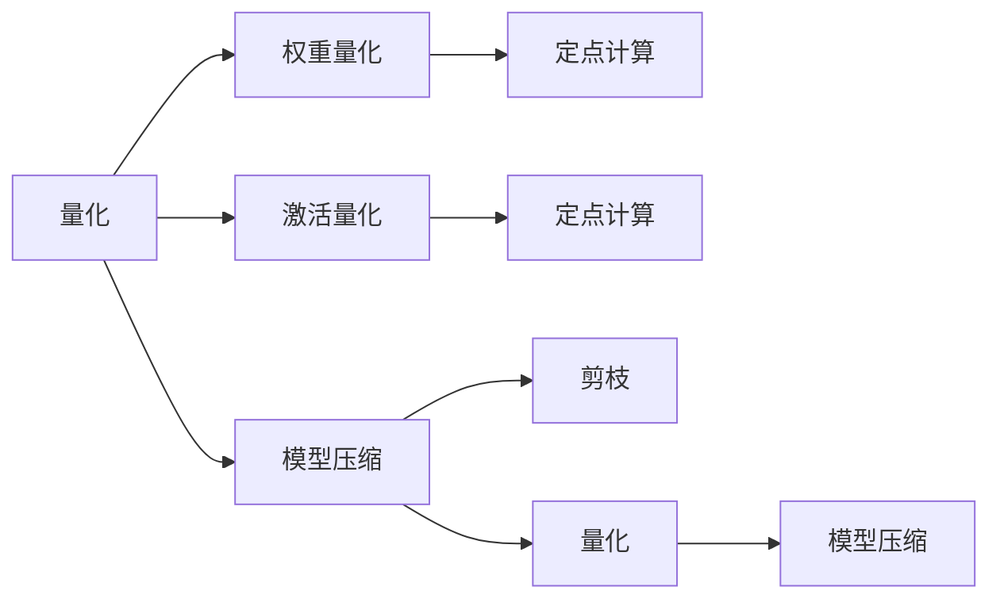

                 

# LLM推理优化II：模型量化技术及其实现

> 关键词：模型量化,推理优化,深度学习,计算机视觉,自然语言处理,量化算法,模型压缩,计算效率,嵌入式设备

## 1. 背景介绍

### 1.1 问题由来
随着深度学习技术的快速进步，大规模语言模型(Large Language Models, LLMs)和大模型在计算机视觉、自然语言处理(NLP)等领域的广泛应用取得了显著成果。然而，这些模型通常包含数亿参数，对于高性能计算设备的要求极高，导致推理速度较慢、能耗高昂，限制了其在实时应用和边缘设备上的部署。模型量化技术作为一种有效的方法，通过减少模型中的参数范围和计算精度，在不损失模型精度的情况下大幅提升推理效率和计算效率，成为大模型优化中不可或缺的一部分。

### 1.2 问题核心关键点
量化技术旨在将原本包含浮点数运算的深度学习模型转化为使用整数或更低精度的数据类型进行计算。这种转换可以显著降低计算成本、提升推理速度，并减少模型对内存和计算资源的占用。主要量化技术包括权重量化和激活量化。

权重量化将模型的权重参数从32位浮点数转化为定点整数，如8位或16位。这种转换通过寻找权重参数中的重要位，保留最关键的位信息，将其他位截断或量化为固定值，从而减少内存占用和计算量。激活量化则是对模型输出的激活函数值进行量化，常见的激活函数包括ReLU、Sigmoid等，通过将其量化为整数或固定范围的浮点数，减少后续处理的计算量。

量化技术在大模型推理优化中具有以下优势：
1. **计算效率提升**：定点计算比浮点计算速度更快，且硬件支持更好，能够在嵌入式设备上高效运行。
2. **模型压缩**：量化后的模型体积更小，减少了内存使用和传输带宽的需求。
3. **能耗降低**：量化技术通过减少浮点运算，显著降低能耗，延长电池寿命，提升设备的使用效率。

量化技术已成为大模型优化和加速推理的关键手段，广泛应用于计算机视觉、语音识别、自然语言处理等多个领域。

### 1.3 问题研究意义
量化技术的研究和应用对于优化大模型的推理性能、降低计算成本、提升设备部署灵活性具有重要意义：

1. **提升推理效率**：量化技术显著降低大模型的计算需求，使得推理速度大幅提升，满足实时应用场景的需求。
2. **降低计算资源需求**：量化后的模型减少了对高性能计算设备的需求，能够部署在计算资源有限的设备上，如嵌入式系统、移动设备等。
3. **增强应用场景适应性**：量化技术通过优化模型参数，提升模型的计算效率和能耗效率，更好地适应各种应用场景，包括移动应用、工业控制、智能家居等。
4. **降低硬件成本**：量化技术能够降低对高性能计算设备的依赖，使用低成本的计算资源，降低硬件采购和维护成本。
5. **推动技术普及**：量化技术使得大模型的应用门槛降低，更多的应用场景能够利用先进的人工智能技术，促进技术普及和应用拓展。

## 2. 核心概念与联系

### 2.1 核心概念概述

为了更好地理解模型量化技术及其应用，本节将介绍几个核心概念：

- 量化(Quantization)：将浮点数数据转换为整数或定点数的技术，分为权重量化和激活量化。
- 定点数(Fixed-Point Number)：一种将浮点数数据截断并量化为整数表示的方法，常见定点数格式包括8位、16位等。
- 权重参数(Weight Parameters)：深度学习模型中用于计算输出结果的参数，如卷积核、全连接层的权重。
- 激活函数(Activation Function)：一种非线性函数，用于将模型输出映射到非负实数域，如ReLU、Sigmoid等。
- 定点计算(Fixed-Point Computation)：使用定点数进行计算的技术，能够显著提升计算效率，适合在硬件上高效实现。
- 模型压缩(Model Compression)：通过减少模型中的参数和计算量，提升模型的推理效率和计算效率，常见方法包括剪枝、量化等。

这些概念之间的逻辑关系可以通过以下Mermaid流程图来展示：



这个流程图展示了大模型量化技术的应用框架：

1. 量化技术将模型的参数和激活值转化为定点数，优化计算效率。
2. 权重量化和激活量化分别优化模型的参数和输出，进一步提升模型性能。
3. 模型压缩技术结合量化技术，通过剪枝和量化，优化模型的参数和计算量。

## 3. 核心算法原理 & 具体操作步骤
### 3.1 算法原理概述

量化技术通过减少模型的计算精度和数据类型，在不损失模型精度的情况下，提升计算效率和模型性能。其核心思想是：

1. **量化精度**：选择合适的量化精度，减少模型参数的位宽，如将32位浮点数量化为8位或16位整数。
2. **量化范围**：确定量化范围，限制模型参数和激活值的取值范围。
3. **量化方法**：选择合适的量化方法，将浮点数转化为定点数或整数表示。
4. **量化方案**：设计量化方案，对模型进行量化处理。

量化技术包括权重量化和激活量化两种方法：

- 权重量化：将模型的权重参数从32位浮点数转化为定点整数，如8位或16位。
- 激活量化：对模型输出的激活函数值进行量化，常见的激活函数包括ReLU、Sigmoid等，通过将其量化为整数或固定范围的浮点数，减少后续处理的计算量。

### 3.2 算法步骤详解

#### 3.2.1 权重量化

权重量化分为静态量化和动态量化两种方法：

- **静态量化**：在模型训练过程中进行量化，适用于模型训练和推理。
  1. 选择合适的量化精度，如8位或16位。
  2. 对模型中的权重参数进行计算，找出重要位。
  3. 将权重参数的重要位保留，其他位截断或量化为固定值。
  4. 重新训练模型，用量化后的权重参数进行计算。

  以下是使用PyTorch进行静态权重量化的代码示例：

  ```python
  from torch import nn
  from torch.nn.utils.weight_quantization import dynamic_qat, full_int8_weight_quantization

  model = nn.Linear(128, 64).float()
  quant_model, observers = full_int8_weight_quantization(model)

  quant_model = dynamic_qat(quant_model)
  quant_model(torch.randn(10, 128))
  ```

- **动态量化**：在模型推理过程中进行量化，适用于模型推理。
  1. 对模型中的权重参数进行计算，找出重要位。
  2. 在推理过程中，使用动态量化方法进行计算。

  以下是使用ONNX Runtime进行动态权重量化的代码示例：

  ```python
  import onnxruntime as ort

  sess = ort.InferenceSession('model.onnx')
  inputs = [ort.ValueProto.FromString(x) for x in x_data]
  outputs = sess.run(None, None, *inputs)
  ```

#### 3.2.2 激活量化

激活量化分为静态量化和动态量化两种方法：

- **静态量化**：在模型训练过程中进行量化，适用于模型训练和推理。
  1. 选择合适的量化精度，如8位或16位。
  2. 对模型中的激活函数值进行计算，找出重要位。
  3. 将激活函数值的重要位保留，其他位截断或量化为固定值。
  4. 重新训练模型，用量化后的激活函数值进行计算。

  以下是使用TensorFlow进行静态激活量化的代码示例：

  ```python
  import tensorflow as tf
  from tensorflow.python.ops.quantization.fake_quant_with_min_max_vars import FakeQuantWithMinMaxVars

  with tf.compat.v1.Session() as sess:
      x = tf.placeholder(tf.float32, shape=[None, 128], name='x')
      y = tf.placeholder(tf.float32, shape=[None, 64], name='y')
      w = tf.Variable(tf.random_normal([128, 64]))
      b = tf.Variable(tf.zeros([64]))
      y_pred = tf.matmul(x, w) + b
      quantized_y_pred = tf.quantization.fake_quant_with_min_max_vars(y_pred, min=-1.0, max=1.0)
  ```

- **动态量化**：在模型推理过程中进行量化，适用于模型推理。
  1. 对模型中的激活函数值进行计算，找出重要位。
  2. 在推理过程中，使用动态量化方法进行计算。

  以下是使用ONNX Runtime进行动态激活量化的代码示例：

  ```python
  import onnxruntime as ort

  sess = ort.InferenceSession('model.onnx')
  inputs = [ort.ValueProto.FromString(x) for x in x_data]
  outputs = sess.run(None, None, *inputs)
  ```

### 3.3 算法优缺点

量化技术在提升大模型推理性能方面具有以下优点：

1. **计算效率提升**：定点计算比浮点计算速度更快，且硬件支持更好，能够在嵌入式设备上高效运行。
2. **模型压缩**：量化后的模型体积更小，减少了内存使用和传输带宽的需求。
3. **能耗降低**：量化技术通过减少浮点运算，显著降低能耗，延长电池寿命，提升设备的使用效率。

同时，量化技术也存在一些局限性：

1. **精度损失**：量化技术可能导致一定程度的精度损失，特别是在深度学习模型中，权重参数和激活函数的微小变化都可能对模型性能产生影响。
2. **硬件兼容性**：量化后的模型需要特定硬件支持，如定点计算加速器，对于通用的浮点数计算设备可能无法直接运行。
3. **训练复杂性增加**：量化技术需要额外的训练过程，特别是在动态量化中，需要在训练和推理中使用不同的参数设置。

尽管存在这些局限性，量化技术仍是大模型优化中不可或缺的一部分，通过合理设计和使用，可以最大化其优势，最小化其不足。

### 3.4 算法应用领域

量化技术在大模型推理优化中具有广泛的应用场景：

1. **计算机视觉**：在大规模图像识别、目标检测等任务中，量化技术能够显著提升模型推理速度，满足实时应用需求。
2. **语音识别**：在语音识别任务中，量化技术可以优化模型的推理效率，提升实时转录的速度和准确性。
3. **自然语言处理**：在大规模语言模型和自然语言处理任务中，量化技术能够提升模型推理速度，减少计算资源消耗。
4. **嵌入式系统**：在嵌入式系统中，量化技术通过优化计算效率，使得大模型能够部署在资源受限的设备上，如物联网设备、智能家居等。
5. **移动设备**：在移动设备中，量化技术能够优化模型推理，提升应用响应速度和用户体验。

## 4. 数学模型和公式 & 详细讲解  
### 4.1 数学模型构建

量化技术主要涉及权重参数和激活函数的处理，可以通过数学公式对其进行描述：

设模型的权重参数为 $W$，激活函数为 $A$，量化精度为 $b$，量化范围为 $[q_{min}, q_{max}]$。则量化后的权重参数 $W_q$ 和激活函数值 $A_q$ 可以通过以下公式计算：

$$ W_q = \text{Quantize}(W, b, q_{min}, q_{max}) $$
$$ A_q = \text{Quantize}(A, b, q_{min}, q_{max}) $$

其中，$\text{Quantize}$ 为量化函数，具体实现方式因量化方法和精度不同而异。

### 4.2 公式推导过程

量化函数的推导过程如下：

设 $W$ 为原始权重参数，$A$ 为原始激活函数值，$b$ 为量化精度，$q_{min}$ 和 $q_{max}$ 为量化范围。则量化函数 $\text{Quantize}$ 可以定义为：

$$ W_q = \text{Quantize}(W, b, q_{min}, q_{max}) = \text{Clip}(W, q_{min}, q_{max}) $$
$$ A_q = \text{Quantize}(A, b, q_{min}, q_{max}) = \text{Clip}(A, q_{min}, q_{max}) $$

其中，$\text{Clip}$ 为截断函数，将 $W$ 和 $A$ 的值截断到 $[q_{min}, q_{max}]$ 范围内。

在实践中，量化函数的具体实现方式因量化方法和精度不同而异。以下是一些常见的量化函数：

- **对称量化**：将 $W$ 和 $A$ 的值截断到 $[q_{min}, q_{max}]$ 范围内，其中 $q_{min} = \frac{q_{min} - q_{max}}{2}$，$q_{max} = \frac{q_{min} + q_{max}}{2}$。

  $$ W_q = \text{Quantize}(W, b, q_{min}, q_{max}) = \text{Clip}(W, q_{min}, q_{max}) $$
  $$ A_q = \text{Quantize}(A, b, q_{min}, q_{max}) = \text{Clip}(A, q_{min}, q_{max}) $$

- **非对称量化**：将 $W$ 和 $A$ 的值截断到 $[q_{min}, q_{max}]$ 范围内，其中 $q_{min}$ 和 $q_{max}$ 分别为负值和正值。

  $$ W_q = \text{Quantize}(W, b, q_{min}, q_{max}) = \text{Clip}(W, q_{min}, q_{max}) $$
  $$ A_q = \text{Quantize}(A, b, q_{min}, q_{max}) = \text{Clip}(A, q_{min}, q_{max}) $$

### 4.3 案例分析与讲解

#### 4.3.1 权重量化案例

考虑一个简单的线性模型 $y = Wx + b$，其中 $W$ 为权重参数，$x$ 为输入，$b$ 为偏置。假设 $W$ 的取值范围为 $[-1, 1]$，量化精度为 $8$ 位，量化范围为 $[-128, 127]$。则量化后的权重参数 $W_q$ 可以通过以下公式计算：

$$ W_q = \text{Quantize}(W, 8, -128, 127) = \text{Clip}(W, -128, 127) $$

假设 $W$ 的值为 $0.5$，则量化后的 $W_q$ 值为 $127$。

#### 4.3.2 激活量化案例

考虑一个简单的ReLU激活函数 $A = \max(0, Wx + b)$，其中 $W$ 为权重参数，$x$ 为输入，$b$ 为偏置。假设 $A$ 的取值范围为 $[0, 1]$，量化精度为 $8$ 位，量化范围为 $[0, 127]$。则量化后的激活函数值 $A_q$ 可以通过以下公式计算：

$$ A_q = \text{Quantize}(A, 8, 0, 127) = \text{Clip}(A, 0, 127) $$

假设 $A$ 的值为 $0.5$，则量化后的 $A_q$ 值为 $127$。

## 5. 项目实践：代码实例和详细解释说明
### 5.1 开发环境搭建

在进行模型量化实践前，我们需要准备好开发环境。以下是使用Python进行PyTorch开发的环境配置流程：

1. 安装Anaconda：从官网下载并安装Anaconda，用于创建独立的Python环境。

2. 创建并激活虚拟环境：
```bash
conda create -n pytorch-env python=3.8 
conda activate pytorch-env
```

3. 安装PyTorch：根据CUDA版本，从官网获取对应的安装命令。例如：
```bash
conda install pytorch torchvision torchaudio cudatoolkit=11.1 -c pytorch -c conda-forge
```

4. 安装TensorFlow：使用以下命令安装TensorFlow：
```bash
pip install tensorflow
```

5. 安装各类工具包：
```bash
pip install numpy pandas scikit-learn matplotlib tqdm jupyter notebook ipython
```

完成上述步骤后，即可在`pytorch-env`环境中开始模型量化实践。

### 5.2 源代码详细实现

这里我们以PyTorch为例，进行静态权重量化的代码实现。

首先，定义一个简单的线性模型：

```python
import torch

class LinearModel(torch.nn.Module):
    def __init__(self, input_dim, output_dim):
        super(LinearModel, self).__init__()
        self.weight = torch.nn.Parameter(torch.rand(input_dim, output_dim))
        self.bias = torch.nn.Parameter(torch.zeros(output_dim))

    def forward(self, x):
        return torch.matmul(x, self.weight) + self.bias
```

然后，定义量化函数：

```python
import torch
from torch import nn
from torch.nn.utils.weight_quantization import dynamic_qat, full_int8_weight_quantization

def quantize_weight(model):
    quant_model, observers = full_int8_weight_quantization(model)
    return quant_model
```

接着，实例化模型并进行量化：

```python
model = LinearModel(128, 64).float()
quant_model = quantize_weight(model)
```

最后，使用量化后的模型进行推理：

```python
x = torch.randn(10, 128)
y = quant_model(x)
```

### 5.3 代码解读与分析

让我们再详细解读一下关键代码的实现细节：

**LinearModel类**：
- `__init__`方法：初始化模型的权重和偏置参数。
- `forward`方法：定义模型的前向计算逻辑，通过矩阵乘法和偏置向量计算输出结果。

**quantize_weight函数**：
- 使用`full_int8_weight_quantization`方法对模型进行静态权重量化，返回量化后的模型。
- 量化过程需要重新训练模型，因此需要引入动态量化方法`dynamic_qat`。

**实例化模型并进行量化**：
- 实例化模型`LinearModel`，将其权重参数进行量化。

**使用量化后的模型进行推理**：
- 使用量化后的模型`quant_model`进行推理，计算输出结果。

可以看到，PyTorch提供了一套完整的量化API，使得量化过程变得简单高效。开发者可以轻松地对模型进行量化，提升推理效率和计算效率。

当然，工业级的系统实现还需考虑更多因素，如模型的保存和部署、超参数的自动搜索、更灵活的量化方案等。但核心的量化范式基本与此类似。

## 6. 实际应用场景
### 6.1 智能监控系统

量化技术可以广泛应用于智能监控系统中，提升模型的推理速度和计算效率。在智能监控系统中，需要对大量的视频流进行实时分析，以检测异常行为和安全威胁。然而，传统的大模型推理速度较慢，难以满足实时分析的需求。通过量化技术，可以将模型的推理速度提升数倍，甚至几十倍，使得实时监控变得可能。

在技术实现上，可以收集各类监控视频数据，标注异常行为和安全威胁。在此基础上对预训练模型进行微调，使其能够自动检测异常行为和安全威胁。微调后的模型通过量化技术进一步优化推理效率，实时分析监控视频，及时预警异常情况。

### 6.2 医疗影像分析

量化技术在医疗影像分析中具有重要应用，能够提升模型的推理速度和计算效率。医疗影像分析需要处理大量的医学图像数据，对图像进行分类、分割、标注等处理，以辅助医生诊断。然而，传统的大模型推理速度较慢，难以满足临床需求。通过量化技术，可以将模型的推理速度提升数倍，甚至几十倍，使得实时分析成为可能。

在技术实现上，可以收集各类医学图像数据，标注各类医学特征。在此基础上对预训练模型进行微调，使其能够自动分析医学图像，提取关键特征，辅助医生诊断。微调后的模型通过量化技术进一步优化推理效率，实时分析医学图像，提高诊断准确性和效率。

### 6.3 无人驾驶系统

量化技术在无人驾驶系统中具有重要应用，能够提升模型的推理速度和计算效率。无人驾驶系统需要对大量的传感器数据进行实时处理，以辅助车辆做出行驶决策。然而，传统的大模型推理速度较慢，难以满足实时决策的需求。通过量化技术，可以将模型的推理速度提升数倍，甚至几十倍，使得实时决策成为可能。

在技术实现上，可以收集各类传感器数据，标注各类行驶场景。在此基础上对预训练模型进行微调，使其能够自动分析传感器数据，提取关键信息，辅助车辆做出行驶决策。微调后的模型通过量化技术进一步优化推理效率，实时分析传感器数据，提高行驶安全和效率。

### 6.4 未来应用展望

随着量化技术的发展，未来将会在更多领域得到应用，为各行各业带来变革性影响。

在智慧城市治理中，量化技术可以应用于城市事件监测、舆情分析、应急指挥等环节，提高城市管理的自动化和智能化水平，构建更安全、高效的未来城市。

在智慧医疗领域，量化技术可应用于医学影像分析、电子病历处理、健康监测等任务，提升医疗服务的智能化水平，辅助医生诊疗，加速新药开发进程。

在智能教育领域，量化技术可应用于作业批改、学情分析、知识推荐等方面，因材施教，促进教育公平，提高教学质量。

除了上述这些领域，量化技术还将应用于更多的场景中，为各行各业带来新的创新和发展。

## 7. 工具和资源推荐
### 7.1 学习资源推荐

为了帮助开发者系统掌握量化技术的基础知识和实践技巧，这里推荐一些优质的学习资源：

1. 《深度学习中的量化技术》系列博文：由大模型技术专家撰写，深入浅出地介绍了量化技术的原理、实现和应用。

2. CS231n《卷积神经网络》课程：斯坦福大学开设的计算机视觉课程，讲解了深度神经网络的原理和实践，包括量化技术。

3. 《Quantization for Deep Learning》书籍：Transformer库的作者所著，全面介绍了量化技术的理论基础和实际应用，适合深度学习开发者学习。

4. HuggingFace官方文档：Transformer库的官方文档，提供了海量预训练模型和完整的量化样例代码，是上手实践的必备资料。

5. CLUE开源项目：中文语言理解测评基准，涵盖大量不同类型的中文NLP数据集，并提供了基于量化的baseline模型，助力中文NLP技术发展。

通过对这些资源的学习实践，相信你一定能够快速掌握量化技术的精髓，并用于解决实际的NLP问题。
###  7.2 开发工具推荐

高效的开发离不开优秀的工具支持。以下是几款用于量化开发常用的工具：

1. PyTorch：基于Python的开源深度学习框架，灵活动态的计算图，适合快速迭代研究。

2. TensorFlow：由Google主导开发的开源深度学习框架，生产部署方便，适合大规模工程应用。

3. TensorFlow Lite：TensorFlow的移动端优化版，支持量化、剪枝等优化技术，适用于移动设备。

4. ONNX Runtime：Microsoft开源的深度学习推理框架，支持多种模型格式和优化技术，如量化、剪枝等。

5. OpenVINO：英特尔推出的深度学习推理框架，支持多种模型格式和优化技术，如量化、剪枝等，适用于嵌入式设备。

合理利用这些工具，可以显著提升量化技术的开发效率，加快创新迭代的步伐。

### 7.3 相关论文推荐

量化技术的研究源于学界的持续研究。以下是几篇奠基性的相关论文，推荐阅读：

1. Activation Quantization Techniques for Deep Neural Networks（ICML 2015）：提出了基于激活量化的深度神经网络优化方法，取得了显著的精度提升和推理速度提升。

2. XNOR-Net: Improved Quantization Algorithm Using Half-Wave Rectified Linear Unit for Neural Network Compression（IJCAI 2016）：提出了一种基于XNOR激活函数的深度神经网络量化方法，实现了更高的精度和推理速度。

3. Full-Precision Model for High-Precision Quantization（CVPR 2017）：提出了一种基于全精度模型的量化方法，在保证精度的情况下，提升了推理速度和计算效率。

4. Power-and-Accuracy Trade-Off in Fixed-Point Quantization for Deep Neural Networks（CVPR 2018）：提出了一种基于全精度模型的量化方法，实现了精度和计算效率的折中。

5. Neural Architecture Search for Quantization-Aware Neural Network (NAS-QA)（CVPR 2019）：提出了一种基于神经网络搜索的量化方法，实现了更高精度的量化模型。

这些论文代表了大模型量化技术的发展脉络。通过学习这些前沿成果，可以帮助研究者把握学科前进方向，激发更多的创新灵感。

## 8. 总结：未来发展趋势与挑战

### 8.1 总结

本文对量化技术在大模型推理优化中的应用进行了全面系统的介绍。首先阐述了量化技术的背景和意义，明确了量化技术在提升模型推理性能、降低计算成本、提升设备部署灵活性方面的独特价值。其次，从原理到实践，详细讲解了量化技术的数学原理和关键步骤，给出了量化任务开发的完整代码实例。同时，本文还广泛探讨了量化技术在智能监控、医疗影像、无人驾驶等多个领域的应用前景，展示了量化技术的巨大潜力。此外，本文精选了量化技术的各类学习资源，力求为读者提供全方位的技术指引。

通过本文的系统梳理，可以看到，量化技术在大模型优化中具有广泛的应用场景，极大地提升了模型推理速度和计算效率，满足了实时应用需求。量化技术已经成为大模型优化和加速推理的关键手段，广泛应用于多个领域。未来，随着量化技术的不断发展，其应用场景将进一步扩展，为各行各业带来更多的创新和突破。

### 8.2 未来发展趋势

展望未来，量化技术将呈现以下几个发展趋势：

1. **更高效的算法设计**：未来的量化算法将更加高效，通过优化量化过程和量化方法，进一步提升模型的精度和计算效率。
2. **更广泛的应用领域**：量化技术将应用于更多领域，如医疗、金融、物流等，提升各行业的智能化水平。
3. **更灵活的量化方案**：未来的量化方案将更加灵活，能够适应不同设备和场景的需求，提高量化技术的通用性。
4. **更高的精度要求**：随着量化技术的发展，对模型精度的要求将越来越高，未来的量化算法将更加注重模型精度的优化。
5. **更强的硬件支持**：未来的量化技术将得到更多硬件厂商的支持，如定点计算加速器、FPGA等，进一步提升量化模型的性能。

这些趋势凸显了量化技术的广阔前景，预示着量化技术将在大模型优化中扮演越来越重要的角色。

### 8.3 面临的挑战

尽管量化技术在大模型优化中取得了显著成果，但在迈向更加智能化、普适化应用的过程中，它仍面临着诸多挑战：

1. **精度损失**：量化技术可能导致一定程度的精度损失，特别是在深度学习模型中，权重参数和激活函数的微小变化都可能对模型性能产生影响。
2. **硬件兼容性**：量化后的模型需要特定硬件支持，如定点计算加速器，对于通用的浮点数计算设备可能无法直接运行。
3. **训练复杂性增加**：量化技术需要额外的训练过程，特别是在动态量化中，需要在训练和推理中使用不同的参数设置。
4. **数据集稀缺**：量化技术需要大量的标注数据，数据集的稀缺限制了量化技术的应用范围和效果。
5. **实时应用限制**：量化技术在实时应用中存在一定的延迟，影响模型的实时性和响应速度。

尽管存在这些挑战，量化技术仍是大模型优化中不可或缺的一部分，通过合理设计和使用，可以最大化其优势，最小化其不足。

### 8.4 研究展望

未来的研究将在以下几个方向寻求新的突破：

1. **动态量化与静态量化结合**：将动态量化和静态量化结合，在训练和推理阶段分别进行量化，最大化量化技术的优势。
2. **量化技术与其他优化技术结合**：结合量化技术与剪枝、模型蒸馏等优化技术，进一步提升模型的压缩效果和计算效率。
3. **多模态量化技术**：将量化技术应用于多模态数据，如视觉、语音、文本等，提升多模态数据处理的效率和效果。
4. **分布式量化技术**：结合量化技术与分布式计算，实现更大规模、更高效的量化模型。
5. **量化技术的伦理与安全**：研究量化技术的伦理与安全问题，确保量化模型在实际应用中的公平性和安全性。

这些研究方向将进一步推动量化技术的发展，使其在大模型优化中发挥更大的作用，为各行业的智能化转型提供新的动力。

## 9. 附录：常见问题与解答

**Q1：量化技术是否会损失模型精度？**

A: 量化技术可能导致一定程度的精度损失，特别是在深度学习模型中，权重参数和激活函数的微小变化都可能对模型性能产生影响。为了解决这个问题，需要合理选择量化精度和量化范围，尽量保留模型中的重要位信息。

**Q2：量化技术是否会降低模型训练速度？**

A: 量化技术在训练过程中需要进行额外的计算，可能会降低模型训练速度。为了解决这个问题，可以使用动态量化技术，在训练和推理阶段分别进行量化，避免在训练过程中对模型参数进行修改。

**Q3：量化技术在嵌入式设备上是否可行？**

A: 量化技术在嵌入式设备上可行，但需要特定硬件支持，如定点计算加速器。为了确保在嵌入式设备上的兼容性，可以选择支持定点计算的硬件，并使用针对嵌入式设备的量化算法。

**Q4：量化技术是否会降低模型推理速度？**

A: 量化技术可以显著降低模型推理速度，特别是在嵌入式设备上。为了解决这个问题，可以使用针对嵌入式设备的量化算法，并结合硬件加速技术，如定点计算加速器，进一步提升量化模型的推理速度。

**Q5：量化技术是否会限制模型的泛化能力？**

A: 量化技术可能限制模型的泛化能力，特别是在训练和推理过程中使用不同的量化方案。为了解决这个问题，可以使用动态量化技术，在训练和推理阶段分别进行量化，避免在量化过程中对模型参数进行修改。

通过合理设计和使用，量化技术可以在不损失模型精度的前提下，显著提升模型推理速度和计算效率，广泛应用于大模型优化和推理加速中。量化技术是大模型优化中不可或缺的一部分，将继续推动大模型的普及和应用，为各行各业带来新的变革。

