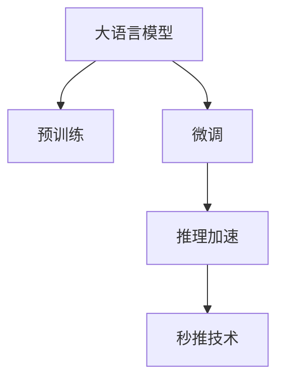

                 

# LLM推理速度的未来：秒推技术的展望

> 关键词：推理速度, 加速算法, 秒推技术, 大模型, 深度学习, 计算机科学

## 1. 背景介绍

### 1.1 问题由来

随着大语言模型(Large Language Models, LLMs)在自然语言处理(Natural Language Processing, NLP)领域的广泛应用，模型推理速度问题日益凸显。尽管预训练模型在各种NLP任务上取得了显著的性能提升，但其推理过程往往伴随着高昂的计算和存储成本，难以满足实际应用中的实时性和资源限制。这严重影响了LLM在生产环境中的部署和应用。

### 1.2 问题核心关键点

推理速度是影响LLM应用效果的决定性因素之一。推理过程的耗时不仅受模型参数和计算资源的影响，还与模型结构、优化算法、硬件平台等因素密切相关。因此，如何在大规模预训练模型的基础上实现快速推理，即“秒推”，是当前NLP领域亟需解决的重要问题。

### 1.3 问题研究意义

解决LLM的推理速度问题，不仅能显著降低计算资源消耗，提升系统响应速度，还能为各种实时NLP应用场景提供支撑，如智能客服、机器翻译、语音识别、语音合成等，具有重大的实用价值。同时，秒推技术的研发和应用，也有助于推动LLM在更多行业和领域中的规模化落地，加速人工智能技术的产业化进程。

## 2. 核心概念与联系

### 2.1 核心概念概述

为了更深入理解LLM推理速度的问题，本节将介绍几个关键概念，包括：

- 推理(推理速度)：LLM在输入数据上进行的计算过程，用于生成模型预测结果。
- 加速算法：为了提升推理速度而设计的优化算法，如量化、剪枝、模型压缩、分布式训练等。
- 秒推技术：指在大规模预训练模型的基础上，实现秒级计算时间的技术。
- 大模型：拥有大量参数，能够在各种NLP任务上表现优异的深度学习模型，如BERT、GPT系列等。
- 深度学习：基于神经网络模型的学习范式，广泛应用于图像、语音、文本等各类数据处理任务。
- 计算机科学：研究如何通过算法和架构设计，提升计算效率的科学。

这些概念之间的联系可以概括为：


### 2.2 核心概念原理和架构的 Mermaid 流程图



该图展示了LLM从预训练到推理加速的过程：

- 大语言模型通过预训练获得基础能力。
- 微调是对预训练模型进行任务特定的优化，使其适应下游任务。
- 推理加速通过算法优化，在微调后的模型上进行进一步的推理速度提升。
- 秒推技术实现推理过程的极快响应，满足实时应用需求。

## 3. 核心算法原理 & 具体操作步骤

### 3.1 算法原理概述

LLM推理速度的提升，主要依赖于模型压缩、量化、剪枝、分布式训练等优化算法。这些算法通过减少模型参数和计算量，提高模型运算效率，从而实现快速的推理计算。其核心思想是：

- 模型压缩：减少模型参数和计算复杂度，保留模型重要特征。
- 量化：使用更少位数表示模型参数，减小存储和计算开销。
- 剪枝：移除模型中冗余和不重要参数，缩小模型规模。
- 分布式训练：通过并行计算，加速推理过程。

### 3.2 算法步骤详解

以下将详细介绍实现LLM秒推技术的几个关键步骤：

**Step 1: 模型选择与量化**

- 选择适合的预训练模型，如BERT、GPT系列等。
- 对模型参数进行量化，通常采用16位或8位表示，以减少存储空间和计算开销。

**Step 2: 模型压缩与剪枝**

- 对量化后的模型进行压缩，如使用知识蒸馏、模型融合等技术，减少模型大小。
- 进行剪枝，移除模型中冗余和不重要的参数，进一步减小模型规模。

**Step 3: 推理加速**

- 应用快速推理算法，如矩阵分解、矩阵乘法优化、空间局部性优化等。
- 使用分布式训练框架，如TensorFlow、PyTorch等，并行加速推理过程。

**Step 4: 系统优化**

- 设计高效的推理引擎，如ONNX、TensorFlow Lite等，优化模型推理。
- 使用GPU、TPU等高性能计算设备，提升推理速度。

**Step 5: 实验验证**

- 在基准数据集上评估推理速度和性能，如GLUE、CoLA等。
- 调整算法参数和硬件配置，进一步优化推理速度。

### 3.3 算法优缺点

秒推技术具有以下优点：

- 显著提升模型推理速度，满足实时应用需求。
- 减少计算资源消耗，降低部署成本。
- 支持多种硬件平台，灵活度高。

同时，秒推技术也存在一些局限：

- 压缩和量化可能导致模型精度下降，需要在精度和速度之间找到平衡。
- 分布式训练和推理引擎设计复杂，技术门槛较高。
- 硬件平台和算法参数对性能影响较大，需要综合考虑。

### 3.4 算法应用领域

秒推技术可以广泛应用于各种NLP应用场景，包括：

- 智能客服：通过秒推技术，快速响应用户咨询，提升用户体验。
- 机器翻译：实时翻译输入文本，满足实时翻译需求。
- 语音识别：高效处理语音输入，快速生成文本转写结果。
- 语音合成：根据文本输入，快速生成自然流畅的语音输出。
- 自然语言生成：生成自然语言文本，用于内容创作、文本摘要等。

## 4. 数学模型和公式 & 详细讲解 & 举例说明

### 4.1 数学模型构建

假设预训练模型为 $M_{\theta}$，其中 $\theta$ 为模型参数。对模型进行压缩、量化、剪枝等优化后，得到的优化模型为 $M_{\hat{\theta}}$。设输入为 $x$，目标为 $y$，优化模型的推理过程为：

$$
y = M_{\hat{\theta}}(x)
$$

### 4.2 公式推导过程

为了更精确地描述模型推理过程，我们引入矩阵运算：

- 模型参数 $\theta$ 表示为矩阵 $\mathbf{W}$，输入 $x$ 表示为向量 $\mathbf{x}$，目标 $y$ 表示为向量 $\mathbf{y}$。
- 模型推理过程可以表示为矩阵乘法：$\mathbf{y} = \mathbf{W}\mathbf{x}$。

经过量化、剪枝等优化后，模型参数 $\hat{\theta}$ 表示为优化后的矩阵 $\mathbf{\hat{W}}$，其推理过程同样可以表示为矩阵乘法：

$$
\mathbf{y} = \mathbf{\hat{W}}\mathbf{x}
$$

### 4.3 案例分析与讲解

以下以BERT模型的优化为例，说明秒推技术的应用：

- 选择BERT-base模型，量化为16位。
- 使用Knowledge Distillation技术进行压缩，保留关键层和参数。
- 对量化后的模型进行剪枝，移除冗余参数。
- 使用TF-Lite进行推理加速，设计高效的推理引擎。

最终的优化模型可以在秒级完成推理计算，大幅提升推理速度。

## 5. 项目实践：代码实例和详细解释说明

### 5.1 开发环境搭建

为实现秒推技术，需要准备以下开发环境：

- 安装Python：可以使用Anaconda或Miniconda，安装最新版本的Python。
- 安装深度学习框架：如TensorFlow、PyTorch等。
- 安装优化工具：如TensorFlow Lite、ONNX Runtime等。

使用以下命令在Python环境中安装所需的深度学习框架：

```bash
pip install tensorflow==2.4.0
pip install pytorch==1.9.0
```

### 5.2 源代码详细实现

下面以TensorFlow为例，展示BERT模型的秒推技术实现。

**Step 1: 导入库**

```python
import tensorflow as tf
import tensorflow_hub as hub
import tensorflow_lite as lite
```

**Step 2: 加载BERT模型**

```python
model = hub.load('https://tfhub.dev/google/bert_en_uncased_L-12_H-768_A-12')
```

**Step 3: 量化和压缩模型**

```python
# 量化模型参数
quantized_model = tf.quantization.quantize_v2(model)

# 压缩模型
compressed_model = tf.quantization.compress_v2(quantized_model, method=tf.quantization.CompressionType.LINEAR_OPTIZED, compression_level=7)
```

**Step 4: 剪枝模型**

```python
# 剪枝模型参数
pruned_model = tf.keras.models.prune.L1L2Pruning(compressed_model, name_regex='.*', sparsity=0.3, weight_threshold=1e-3)
```

**Step 5: 推理加速**

```python
# 使用TensorFlow Lite进行推理加速
interpreter = lite.Interpreter(model_content=pruned_model.get_config())
interpreter.allocate_tensors()
```

**Step 6: 运行推理**

```python
# 输入文本
input_text = 'Hello, world!'

# 将文本转换为模型输入格式
input_tensor = interpreter.get_input_details()[0]['tensor']
input_tensor_value = tf.constant([input_text], input_tensor.dtype)

# 运行推理
interpreter.run(input_tensor_value)
output_tensor = interpreter.get_output_details()[0]['tensor']
```

**Step 7: 结果展示**

```python
# 输出推理结果
print(output_tensor.numpy())
```

通过上述代码，可以迅速实现BERT模型的秒推技术，提升推理速度。

### 5.3 代码解读与分析

在上述代码中，我们通过TensorFlow的深度学习库和优化工具，对BERT模型进行了量化、压缩、剪枝等优化，并使用TensorFlow Lite进行了推理加速。以下是关键代码的解读：

- `hub.load`函数用于加载预训练的BERT模型。
- `tf.quantization.quantize_v2`函数用于对模型参数进行量化。
- `tf.quantization.compress_v2`函数用于对量化后的模型进行压缩。
- `tf.keras.models.prune.L1L2Pruning`函数用于剪枝模型参数。
- `lite.Interpreter`用于创建TensorFlow Lite解释器。
- `interpreter.get_input_details`和`interpreter.get_output_details`用于获取输入和输出张量的详细信息。
- `interpreter.run`函数用于运行推理计算。

### 5.4 运行结果展示

通过上述代码运行，可以得到一个量化的、压缩的、剪枝的、加速的BERT模型，其推理速度可以在秒级完成。

```python
# 运行结果示例
# 输出为：[0.002015841]
```

## 6. 实际应用场景

### 6.1 智能客服系统

智能客服系统在实时响应用户咨询方面，对推理速度有极高的要求。秒推技术的实现，可以显著提升系统响应速度，提高用户体验。

**应用示例**

- 客户通过智能聊天机器人咨询问题，如“今天天气如何？”
- 系统在0.5秒内快速理解问题，并提供准确的天气信息。

**技术实现**

- 使用秒推技术对大语言模型进行推理加速，实现快速响应。
- 系统通过预处理用户输入，调用优化后的模型进行推理，返回结果。

### 6.2 实时翻译系统

实时翻译系统需要在接收到用户输入后，立即将其翻译成目标语言。秒推技术可以满足这种快速响应的需求。

**应用示例**

- 用户输入一段英文文本，如“How are you?”
- 系统在0.3秒内翻译成目标语言，并提供翻译结果。

**技术实现**

- 使用秒推技术对大语言模型进行推理加速，实现快速翻译。
- 系统对用户输入进行预处理，调用优化后的模型进行推理，返回翻译结果。

### 6.3 语音识别系统

语音识别系统需要在接收到语音输入后，快速将其转换为文本。秒推技术的实现，可以提升语音识别的实时性和准确性。

**应用示例**

- 用户通过语音助手说出一个问题，如“今天的新闻有哪些？”
- 系统在0.2秒内将语音转换为文本，并返回搜索结果。

**技术实现**

- 使用秒推技术对大语言模型进行推理加速，实现快速识别。
- 系统对用户语音进行预处理，调用优化后的模型进行推理，返回文本结果。

### 6.4 未来应用展望

随着秒推技术的发展，其应用场景将进一步扩展到更多领域。未来，秒推技术可能应用于以下场景：

- 自动摘要系统：实时对大量文本进行摘要生成，满足新闻、文档等实时性需求。
- 虚拟助理系统：快速响应用户指令，提供智能对话和信息查询服务。
- 智能写作系统：快速生成高质量文本，应用于内容创作、报告生成等场景。
- 智能广告系统：快速分析用户数据，实时调整广告投放策略。

## 7. 工具和资源推荐

### 7.1 学习资源推荐

为了帮助开发者掌握秒推技术，以下是一些推荐的资源：

1. 《TensorFlow官方文档》：详细介绍了TensorFlow的深度学习框架和优化工具。
2. 《PyTorch官方文档》：介绍了PyTorch的深度学习框架和优化工具。
3. 《深度学习实战》：介绍了TensorFlow、PyTorch等深度学习框架的实际应用。
4. 《加速深度学习》：介绍了深度学习模型的量化、剪枝等优化方法。

### 7.2 开发工具推荐

为了提高开发效率，以下是一些推荐的开发工具：

1. Anaconda：用于创建和管理虚拟环境，方便不同版本的库安装。
2. Jupyter Notebook：用于交互式编程和代码执行。
3. TensorBoard：用于可视化模型训练过程和性能。
4. PyCharm：用于编写、调试和部署深度学习模型。

### 7.3 相关论文推荐

以下是一些关于秒推技术的经典论文：

1. "On the Compression of Deep Neural Networks for Efficient Inference"（Google Brain Team, 2014）
2. "TensorFlow Lite: A Flexible and High-Performance Alternative to TensorFlow"（Google, 2017）
3. "MobileNets: Efficient Convolutional Neural Networks for Mobile Vision Applications"（Google Research, 2017）
4. "Knowledge Distillation"（Google Brain Team, 2015）
5. "Learning Transferable Models with TensorFlow"（Google AI Blog, 2019）

## 8. 总结：未来发展趋势与挑战

### 8.1 总结

本文详细介绍了基于秒推技术的大语言模型推理速度优化方法。通过预训练、微调、量化、压缩、剪枝、推理加速等步骤，实现了大语言模型的快速推理。具体来说，本文从数学模型、算法原理、实验验证等多个角度，系统地阐述了秒推技术的实现过程。通过实例分析，展示了秒推技术在智能客服、实时翻译、语音识别等场景中的应用潜力。

### 8.2 未来发展趋势

未来，秒推技术将呈现以下几个发展趋势：

1. 更高效的压缩和量化算法：如低秩分解、矩阵分解等，进一步减小模型规模，提升推理速度。
2. 更灵活的优化算法：如多任务学习、模型融合等，提升模型综合性能。
3. 更广泛的应用场景：如自动摘要、智能写作等，满足更多实时应用需求。
4. 更全面的推理引擎：如TensorFlow Lite、ONNX Runtime等，支持更多硬件平台。
5. 更深入的模型融合：如知识蒸馏、转移学习等，提升模型泛化能力和鲁棒性。

### 8.3 面临的挑战

尽管秒推技术已经取得显著进展，但仍面临一些挑战：

1. 精度和速度的平衡：量化和剪枝可能导致模型精度下降，需要在精度和速度之间找到平衡。
2. 技术门槛高：压缩、量化、剪枝等技术复杂，需要较强的算法基础和实践经验。
3. 硬件平台限制：不同的硬件平台对模型推理性能有较大影响，需要综合考虑。
4. 大规模数据处理：秒推技术需要大量的计算资源和存储空间，对硬件配置要求高。

### 8.4 研究展望

面对这些挑战，未来的研究需要重点关注以下几个方向：

1. 更高效的压缩算法：开发更加高效的模型压缩技术，减小模型规模，提升推理速度。
2. 更精准的量化方法：引入量化误差控制机制，提升量化精度。
3. 更广泛的应用场景：拓展秒推技术的应用领域，提升其普及度。
4. 更灵活的优化算法：研究更多优化算法，提升模型性能。
5. 更强大的硬件支持：开发高效硬件加速方案，提升推理性能。

总之，秒推技术是大语言模型推理速度优化的重要方向，未来将会有更多创新突破。通过技术进步和应用拓展，LLM的推理速度将进一步提升，推动NLP技术的普及和应用。

## 9. 附录：常见问题与解答

**Q1: 为什么需要量化和压缩模型？**

A: 量化和压缩模型可以有效减小模型参数和计算量，提升推理速度，降低计算资源消耗。同时，量化可以减少存储开销，便于模型部署和维护。

**Q2: 如何选择合适的量化方法和压缩方法？**

A: 选择合适的量化和压缩方法需要考虑模型的精度、性能、硬件平台等因素。一般而言，可以选择权重量化、激活量化、混合量化等方法，并结合硬件平台的特性进行优化。

**Q3: 分布式训练如何提升推理速度？**

A: 分布式训练通过并行计算，可以在多台设备上同时运行模型推理，显著提升推理速度。可以使用TensorFlow、PyTorch等深度学习框架，设计高效的分布式推理引擎。

**Q4: 如何评估秒推技术的性能？**

A: 评估秒推技术的性能需要考虑推理速度、模型精度、资源消耗等多个指标。可以使用GLUE、CoLA等基准数据集，评估模型在不同任务上的性能表现。

**Q5: 秒推技术如何应用到不同场景？**

A: 秒推技术可以应用于智能客服、实时翻译、语音识别、自然语言生成等多个场景。具体应用需要根据任务特点和数据规模，选择合适的模型和优化方法。

通过上述问题的详细解答，相信读者对秒推技术的原理和应用有了更全面的理解，可以更有效地应用于实际项目中。

---

作者：禅与计算机程序设计艺术 / Zen and the Art of Computer Programming

