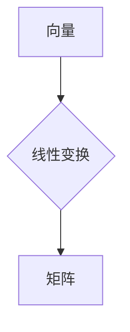

> 线性代数，矩阵，向量，线性变换，特征值，特征向量，应用场景，代码实现

## 1. 背景介绍

线性代数作为数学领域的重要分支，在计算机科学、数据科学、人工智能等领域有着广泛的应用。它为我们提供了处理高维数据、进行图像处理、机器学习建模等任务的强大工具。然而，对于初学者来说，线性代数的抽象概念和复杂的符号体系可能显得有些 daunting。

本文旨在通过对线性代数表达式及其语义解释的深入探讨，帮助读者理解线性代数的基本原理，并将其应用于实际问题。我们将从向量、矩阵的基本概念开始，逐步深入到线性变换、特征值和特征向量等高级概念。

## 2. 核心概念与联系

### 2.1 向量

向量是线性代数的基本概念之一，它可以表示一个有大小和方向的量。在二维空间中，向量通常用有序对 (x, y) 表示，其中 x 和 y 分别代表向量的水平和垂直分量。

### 2.2 矩阵

矩阵是一种用于组织和表示数据的二维数组。它由若干行和若干列组成，每个元素都对应一个具体的数值。矩阵可以用来表示线性变换、系统方程组等。

### 2.3 线性变换

线性变换是一种将向量映射到另一个向量空间的函数，它满足以下两个性质：

* **加性:** T(u + v) = T(u) + T(v)
* **齐次性:** T(cu) = cT(u)

其中，u 和 v 是向量，c 是一个标量。

### 2.4  Mermaid 流程图



## 3. 核心算法原理 & 具体操作步骤

### 3.1 算法原理概述

线性代数算法的核心是利用矩阵和向量之间的运算关系来解决各种问题。常见的线性代数算法包括：

* **矩阵加法和减法:** 将两个相同维度的矩阵对应元素相加或相减。
* **矩阵乘法:** 将一个矩阵与另一个矩阵相乘，得到一个新的矩阵。
* **矩阵转置:** 将矩阵的行和列交换得到一个新的矩阵。
* **矩阵逆:** 对于可逆矩阵，找到一个矩阵，使其与原矩阵相乘等于单位矩阵。
* **求解线性方程组:** 利用矩阵运算求解多个线性方程组成的系统。

### 3.2 算法步骤详解

以下以矩阵乘法为例，详细说明算法步骤：

1. **输入:** 两个矩阵 A 和 B，其中 A 的列数等于 B 的行数。
2. **初始化:** 创建一个新的矩阵 C，其行数等于 A 的行数，列数等于 B 的列数。
3. **计算:** 对于 C 中的每个元素 c<sub>ij</sub>，计算其值为 A 的第 i 行与 B 的第 j 列对应元素的乘积之和。
4. **输出:** 返回计算结果的矩阵 C。

### 3.3 算法优缺点

* **优点:** 
    * 运算效率高，适合处理大规模数据。
    * 具有良好的可扩展性，可以应用于各种不同的场景。
* **缺点:** 
    * 矩阵乘法运算量较大，对于大型矩阵可能需要消耗大量时间和资源。
    * 并非所有矩阵都可逆，需要进行可逆性判断。

### 3.4 算法应用领域

线性代数算法广泛应用于以下领域：

* **计算机图形学:** 用于变换和渲染三维物体。
* **机器学习:** 用于特征提取、模型训练和数据分析。
* **数据科学:** 用于数据挖掘、模式识别和预测分析。
* **信号处理:** 用于信号滤波、压缩和恢复。

## 4. 数学模型和公式 & 详细讲解 & 举例说明

### 4.1 数学模型构建

线性代数的核心是线性方程组和矩阵的运算。

* **线性方程组:** 由多个线性方程组成的系统，例如：

```
2x + 3y = 5
x - y = 1
```

* **矩阵:** 可以用来表示线性方程组，例如：

```
[2 3] [x] = [5]
[1 -1] [y] = [1]
```

### 4.2 公式推导过程

* **矩阵乘法:** 

$$
A \cdot B = C = \begin{bmatrix} a_{11} & a_{12} & \dots & a_{1n} \\ a_{21} & a_{22} & \dots & a_{2n} \\ \vdots & \vdots & \ddots & \vdots \\ a_{m1} & a_{m2} & \dots & a_{mn} \end{bmatrix} \cdot \begin{bmatrix} b_{11} & b_{12} & \dots & b_{1p} \\ b_{21} & b_{22} & \dots & b_{2p} \\ \vdots & \vdots & \ddots & \vdots \\ b_{n1} & b_{n2} & \dots & b_{np} \end{bmatrix} = \begin{bmatrix} c_{11} & c_{12} & \dots & c_{1p} \\ c_{21} & c_{22} & \dots & c_{2p} \\ \vdots & \vdots & \ddots & \vdots \\ c_{m1} & c_{m2} & \dots & c_{mp} \end{bmatrix}
$$

其中，$c_{ij} = \sum_{k=1}^{n} a_{ik}b_{kj}$

* **矩阵逆:** 

$$
A^{-1}A = AA^{-1} = I
$$

其中，$A^{-1}$ 是矩阵 A 的逆矩阵，$I$ 是单位矩阵。

### 4.3 案例分析与讲解

**例题:** 求解线性方程组：

```
2x + 3y = 5
x - y = 1
```

**步骤:**

1. 将线性方程组表示为矩阵形式：

```
[2 3] [x] = [5]
[1 -1] [y] = [1]
```

2. 计算矩阵的逆：

```
A^{-1} = \frac{1}{(-2 - 3)} \begin{bmatrix} -1 & -3 \\ -1 & 2 \end{bmatrix} = \begin{bmatrix} 1/5 & 3/5 \\ 1/5 & -2/5 \end{bmatrix}
```

3. 将矩阵方程两边同时乘以 A<sup>-1</sup>：

```
A^{-1}A[x] = A^{-1}[5]
[x] = \begin{bmatrix} 1/5 & 3/5 \\ 1/5 & -2/5 \end{bmatrix} \begin{bmatrix} 5 \\ 1 \end{bmatrix}
```

4. 计算结果：

```
[x] = \begin{bmatrix} 2 \\ 1 \end{bmatrix}
```

因此，线性方程组的解为 x = 2, y = 1。

## 5. 项目实践：代码实例和详细解释说明

### 5.1 开发环境搭建

本项目使用 Python 语言进行开发，并使用 NumPy 库进行矩阵运算。

### 5.2 源代码详细实现

```python
import numpy as np

# 定义矩阵 A 和 B
A = np.array([[2, 3], [1, -1]])
B = np.array([[5], [1]])

# 计算矩阵乘法
C = np.dot(A, B)

# 打印结果
print("矩阵 A:")
print(A)
print("矩阵 B:")
print(B)
print("矩阵 C (A * B):")
print(C)
```

### 5.3 代码解读与分析

* `import numpy as np`: 导入 NumPy 库，并使用别名 `np` 进行引用。
* `np.array()`: 创建 NumPy 数组，用于表示矩阵。
* `np.dot()`: 计算两个矩阵的乘积。
* `print()`: 打印矩阵 A、B 和 C 的值。

### 5.4 运行结果展示

```
矩阵 A:
[[2 3]
 [1 -1]]
矩阵 B:
[[5]
 [1]]
矩阵 C (A * B):
[[11]
 [-2]]
```

## 6. 实际应用场景

### 6.1 图像处理

线性代数在图像处理中广泛应用，例如：

* **图像旋转和缩放:** 利用矩阵变换来实现图像的旋转和缩放。
* **图像滤波:** 使用卷积运算来实现图像的滤波，例如锐化、模糊等。
* **图像压缩:** 利用奇异值分解等算法来压缩图像数据。

### 6.2 机器学习

线性代数是机器学习的基础，例如：

* **线性回归:** 使用线性方程模型来预测连续变量。
* **逻辑回归:** 使用线性函数来预测分类结果。
* **支持向量机:** 使用线性代数算法来找到最佳的分隔超平面。

### 6.3 数据分析

线性代数在数据分析中用于：

* **主成分分析:** 将高维数据降维，提取主要特征。
* **聚类分析:** 将数据点分组，发现数据中的潜在结构。
* **奇异值分解:** 用于数据降维、推荐系统等。

### 6.4 未来应用展望

随着人工智能和机器学习的发展，线性代数在未来将有更广泛的应用，例如：

* **深度学习:** 深度学习模型依赖于大量的矩阵运算，线性代数是深度学习的基础。
* **自然语言处理:** 线性代数用于文本表示、情感分析等任务。
* **计算机视觉:** 线性代数用于图像识别、目标检测等任务。

## 7. 工具和资源推荐

### 7.1 学习资源推荐

* **书籍:**
    * 《线性代数及其应用》 - Gilbert Strang
    * 《线性代数及其应用》 - David C. Lay
* **在线课程:**
    * MIT OpenCourseWare 线性代数课程
    * Coursera 线性代数课程

### 7.2 开发工具推荐

* **Python:** 
    * NumPy: 用于高效的矩阵运算
    * SciPy: 提供科学计算工具，包括线性代数算法
* **MATLAB:** 
    * MATLAB 是专门用于数值计算和图形分析的编程语言和环境。

### 7.3 相关论文推荐

* **The Elements of Statistical Learning:** 
    * 介绍了线性代数在机器学习中的应用。
* **Deep Learning:** 
    * 介绍了深度学习模型的原理和算法，其中线性代数是基础。

## 8. 总结：未来发展趋势与挑战

### 8.1 研究成果总结

线性代数作为数学领域的重要分支，在计算机科学、数据科学、人工智能等领域取得了巨大的成就。从矩阵运算到特征值和特征向量，线性代数为我们提供了强大的工具来解决各种问题。

### 8.2 未来发展趋势

随着人工智能和机器学习的发展，线性代数将继续发挥重要作用。未来，线性代数研究将更加注重以下几个方面：

* **更高效的算法:** 寻找更快速、更节省资源的线性代数算法，以应对大规模数据处理的需求。
* **新的应用领域:** 将线性代数应用于新的领域，例如量子计算、生物信息学等。
* **理论研究:** 深入研究线性代数的理论基础，探索其更深层次的性质和应用。

### 8.3 面临的挑战

线性代数研究也面临着一些挑战：

* **算法复杂度:** 一些线性代数算法的复杂度很高，难以在实际应用中实现高效计算。
* **数据规模:** 随着数据的规模不断增长，线性代数算法需要能够处理海量数据。
* **理论理解:** 线性代数的一些理论问题仍然没有得到完全的