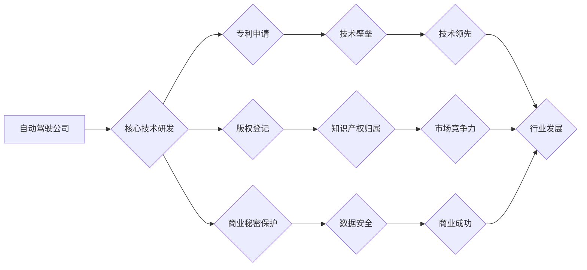

> 自动驾驶, 知识产权,  专利,  版权,  商业秘密,  数据安全,  法律法规,  技术保护

## 1. 背景介绍

自动驾驶技术作为未来交通运输的重要发展方向，其核心技术涵盖了人工智能、机器学习、传感器融合、路径规划等多个领域。自动驾驶公司的研发投入巨大，技术积累深厚，知识产权（Intellectual Property，IP）保护成为其核心竞争力。然而，自动驾驶技术本身的复杂性和开放性，也使得知识产权保护面临着诸多挑战。

自动驾驶公司需要建立完善的知识产权保护策略，以有效地保护其核心技术和商业利益。

## 2. 核心概念与联系

**2.1 知识产权类型**

* **专利:**  保护发明创造的独创性，包括实用新型专利、发明专利和外观设计专利。自动驾驶公司可以申请专利保护其算法、传感器技术、控制系统等核心技术。
* **版权:**  保护文学、艺术、科学作品的表达形式，包括软件代码、地图数据、训练数据集等。自动驾驶公司可以申请版权保护其软件代码和地图数据等作品。
* **商业秘密:**  指企业在经营活动中掌握的 confidential information，例如算法模型、数据分析方法、客户信息等。自动驾驶公司需要采取措施保护其商业秘密，防止泄露。

**2.2 知识产权保护策略**

* **专利申请:**  积极申请专利保护核心技术，建立技术壁垒。
* **版权登记:**  对软件代码和地图数据等作品进行版权登记，明确知识产权归属。
* **商业秘密保护:**  制定严格的保密协议，限制员工和合作伙伴访问敏感信息，采取技术措施保护数据安全。
* **法律诉讼:**  对侵权行为采取法律诉讼，维护知识产权权益。

**2.3 知识产权保护与自动驾驶技术发展**

知识产权保护对于自动驾驶技术的发展至关重要。

* **激励创新:**  知识产权保护可以激励企业和个人进行技术创新，推动自动驾驶技术进步。
* **促进合作:**  知识产权许可可以促进企业之间进行技术合作，加速自动驾驶技术的普及。
* **维护市场秩序:**  知识产权保护可以维护市场秩序，防止技术盗窃和不正当竞争。

**Mermaid 流程图**



## 3. 核心算法原理 & 具体操作步骤

**3.1 算法原理概述**

自动驾驶的核心算法包括感知、决策和控制三个模块。

* **感知模块:**  利用传感器数据（如摄像头、雷达、激光雷达）构建周围环境的感知模型，识别道路、车辆、行人等物体。
* **决策模块:**  根据感知到的环境信息，预测未来场景，并做出驾驶决策，例如转向、加速、制动等。
* **控制模块:**  将决策转化为车辆的实际控制指令，实现车辆的自动驾驶。

**3.2 算法步骤详解**

1. **数据采集:**  利用传感器收集车辆周围环境的数据。
2. **数据预处理:**  对采集到的数据进行清洗、去噪、特征提取等处理，以便后续算法的应用。
3. **模型训练:**  利用训练数据训练感知、决策和控制模型，例如使用深度学习算法训练图像识别模型、强化学习算法训练决策模型等。
4. **模型评估:**  评估模型的性能，例如识别精度、决策准确率等，并进行模型优化。
5. **模型部署:**  将训练好的模型部署到车辆上，实现自动驾驶功能。

**3.3 算法优缺点**

* **优点:**  自动驾驶算法可以实现更高的驾驶精度、更安全的驾驶行为，并解放驾驶员的双手，提高驾驶效率。
* **缺点:**  自动驾驶算法需要大量的训练数据，训练成本高；算法的鲁棒性、安全性还有待提高，需要不断进行改进和完善。

**3.4 算法应用领域**

自动驾驶算法广泛应用于自动驾驶汽车、无人机、机器人等领域。

## 4. 数学模型和公式 & 详细讲解 & 举例说明

**4.1 数学模型构建**

自动驾驶算法的数学模型通常基于概率论、统计学、控制论等数学理论。例如，感知模块的图像识别模型可以基于卷积神经网络（Convolutional Neural Network，CNN）构建，决策模块的路径规划算法可以基于动态规划（Dynamic Programming，DP）或强化学习（Reinforcement Learning，RL）构建。

**4.2 公式推导过程**

例如，CNN模型的损失函数可以定义为交叉熵损失函数，其公式如下：

$$
L = -\sum_{i=1}^{N} y_i \log(\hat{y}_i)
$$

其中，$N$ 是样本数量，$y_i$ 是真实标签，$\hat{y}_i$ 是模型预测的概率。

**4.3 案例分析与讲解**

例如，在路径规划算法中，可以使用动态规划算法求解最优路径。动态规划算法将问题分解成若干子问题，并通过递推的方式求解子问题的解，最终得到全局最优解。

## 5. 项目实践：代码实例和详细解释说明

**5.1 开发环境搭建**

自动驾驶项目通常需要使用Python语言和相关的库，例如TensorFlow、PyTorch、OpenCV等。

**5.2 源代码详细实现**

以下是一个简单的自动驾驶感知模块的代码示例，使用OpenCV库进行图像处理：

```python
import cv2

# 读取图像
image = cv2.imread("image.jpg")

# 转换为灰度图像
gray = cv2.cvtColor(image, cv2.COLOR_BGR2GRAY)

# 使用Canny边缘检测算法检测边缘
edges = cv2.Canny(gray, 100, 200)

# 显示图像
cv2.imshow("Edges", edges)
cv2.waitKey(0)
cv2.destroyAllWindows()
```

**5.3 代码解读与分析**

这段代码首先读取图像，然后将其转换为灰度图像，并使用Canny边缘检测算法检测图像中的边缘。最后，将检测到的边缘图像显示出来。

**5.4 运行结果展示**

运行这段代码后，将显示出图像中的边缘信息。

## 6. 实际应用场景

自动驾驶技术在交通运输、物流、城市管理等领域都有着广泛的应用场景。

* **自动驾驶汽车:**  实现车辆的自动驾驶，提高驾驶安全性、效率和舒适性。
* **无人配送:**  利用无人驾驶汽车进行货物配送，提高配送效率和降低成本。
* **智能交通管理:**  利用自动驾驶技术进行交通流量管理、拥堵缓解等。

**6.4 未来应用展望**

未来，自动驾驶技术将更加智能化、安全化、普及化。

## 7. 工具和资源推荐

**7.1 学习资源推荐**

* **书籍:**  《自动驾驶汽车》
* **在线课程:**  Coursera、edX等平台上的自动驾驶课程
* **开源项目:**  Autoware、Apollo等自动驾驶开源项目

**7.2 开发工具推荐**

* **编程语言:**  Python
* **深度学习框架:**  TensorFlow、PyTorch
* **传感器数据处理工具:**  ROS

**7.3 相关论文推荐**

* **论文:**  "End to End Learning for Self-Driving Cars"

## 8. 总结：未来发展趋势与挑战

**8.1 研究成果总结**

自动驾驶技术取得了显著的进展，但仍面临着诸多挑战。

**8.2 未来发展趋势**

* **人工智能技术进步:**  人工智能技术将进一步推动自动驾驶技术的进步，例如更强大的感知能力、更智能的决策能力。
* **传感器技术发展:**  传感器技术的进步将提高自动驾驶系统的感知精度和可靠性。
* **法规政策完善:**  政府部门将制定更加完善的自动驾驶法规政策，为自动驾驶技术的普及创造良好的环境。

**8.3 面临的挑战**

* **安全性:**  自动驾驶系统的安全性仍然是一个重要的挑战，需要不断进行改进和完善。
* **可靠性:**  自动驾驶系统需要在各种复杂环境下都能可靠地工作。
* **伦理问题:**  自动驾驶技术涉及到伦理问题，例如在紧急情况下如何做出决策。

**8.4 研究展望**

未来，自动驾驶技术将继续朝着更智能、更安全、更可靠的方向发展，并将在交通运输、物流、城市管理等领域发挥越来越重要的作用。

## 9. 附录：常见问题与解答

**9.1 自动驾驶技术是否安全？**

自动驾驶技术仍然处于发展阶段，安全性是一个重要的挑战。自动驾驶系统需要在各种复杂环境下都能可靠地工作，并能够应对突发事件。

**9.2 自动驾驶汽车会取代人类驾驶员吗？**

自动驾驶技术将改变交通运输模式，但不会完全取代人类驾驶员。未来，人类驾驶员和自动驾驶系统将共同协作，实现更加安全、高效的交通运输。

**9.3 自动驾驶技术何时能够普及？**

自动驾驶技术的普及需要政府部门制定完善的法律法规、企业进行技术研发和产业化，以及公众对自动驾驶技术的接受度。预计在未来几年内，自动驾驶技术将逐步普及。


作者：禅与计算机程序设计艺术 / Zen and the Art of Computer Programming 
<end_of_turn>