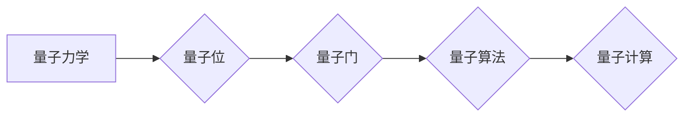

> 量子计算，量子位，叠加态，纠缠态，量子算法，量子计算机，量子力学

## 1. 背景介绍

随着传统计算机技术的发展逐渐接近物理极限，人们开始探索新的计算 paradigms。量子计算作为一种全新的计算模式，利用量子力学的原理，拥有超越经典计算机的强大计算能力，被认为是未来计算领域的重要发展方向。

量子计算的核心在于利用量子力学的特性，例如叠加态和纠缠态，来实现信息处理。经典计算机的比特只能处于0或1的状态，而量子计算机的量子位（qubit）可以同时处于0和1的叠加态，从而拥有更大的信息存储和处理能力。此外，量子位之间还可以通过纠缠态相互关联，实现比经典计算机更强大的计算能力。

## 2. 核心概念与联系

### 2.1 量子力学基础

量子力学是描述微观世界行为的物理学理论，其核心概念包括：

* **量子化:** 物理量，如能量和动量，只能取离散的值，而不是连续的值。
* **波粒二象性:** 微观粒子既具有波的性质，又具有粒子的性质。
* **叠加态:** 量子系统可以同时处于多个状态的叠加态。
* **纠缠态:** 两个或多个量子系统可以相互关联，即使相隔很远，测量一个系统的状态也会影响另一个系统的状态。

### 2.2 量子计算模型

量子计算模型基于量子力学的原理，利用量子位和量子门来实现计算。

* **量子位 (Qubit):** 量子计算的基本单位，可以处于0、1或0和1的叠加态。
* **量子门 (Quantum Gate):** 操作量子位，改变其状态的逻辑操作。
* **量子算法 (Quantum Algorithm):** 利用量子门和量子位序列实现特定计算任务的算法。

**Mermaid 流程图:**



## 3. 核心算法原理 & 具体操作步骤

### 3.1 算法原理概述

量子算法利用量子叠加和纠缠等量子力学特性，实现比经典算法更快的计算速度。

例如，著名的 Shor 算法可以高效地分解大整数，这对于破解现有的加密算法具有重要意义。

### 3.2 算法步骤详解

量子算法的具体步骤取决于具体的算法，但一般包括以下几个步骤：

1. 将输入数据编码为量子态。
2. 利用量子门对量子态进行操作，实现算法的逻辑运算。
3. 将量子态测量为经典态，得到计算结果。

### 3.3 算法优缺点

**优点:**

* 计算速度更快，可以解决某些经典算法难以解决的问题。
* 具有潜在的应用价值，例如在密码学、材料科学、药物研发等领域。

**缺点:**

* 量子计算机的构建和控制非常复杂，成本高昂。
* 量子算法的开发难度较大，需要深入了解量子力学和计算机科学。
* 量子计算机的稳定性较差，容易受到环境干扰。

### 3.4 算法应用领域

* **密码学:** 量子算法可以破解现有的加密算法，但也可能为新的量子密码学提供基础。
* **材料科学:** 量子模拟可以帮助研究人员设计新的材料，例如更轻、更坚固的材料。
* **药物研发:** 量子模拟可以帮助研究人员设计新的药物，并预测药物的活性。
* **金融建模:** 量子算法可以帮助金融机构进行风险管理和投资决策。

## 4. 数学模型和公式 & 详细讲解 & 举例说明

### 4.1 数学模型构建

量子计算的数学模型基于线性代数和矩阵论。

* **量子态:** 量子态可以用一个复数向量来表示，其中每个元素代表量子位的状态。
* **量子门:** 量子门可以用矩阵来表示，矩阵的乘法对应于对量子态的逻辑操作。

### 4.2 公式推导过程

例如，Hadamard 门是一个常用的量子门，其矩阵表示为：

$$
H = \frac{1}{\sqrt{2}} \begin{pmatrix} 1 & 1 \\ 1 & -1 \end{pmatrix}
$$

应用 Hadamard 门于一个量子位，可以将该量子位从 |0⟩ 状态变换到 |+⟩ 状态，即：

$$
H |0⟩ = \frac{1}{\sqrt{2}} (|0⟩ + |1⟩)
$$

### 4.3 案例分析与讲解

通过对量子门和量子态的数学描述，我们可以构建量子算法，并分析其计算过程。例如，Shor 算法利用量子叠加和量子纠缠，可以高效地分解大整数。

## 5. 项目实践：代码实例和详细解释说明

### 5.1 开发环境搭建

量子计算的开发环境通常需要安装量子计算软件库和模拟器。例如，可以使用 Qiskit 或 Cirq 等软件库，并使用 IBM Quantum Experience 等云平台提供的模拟器进行开发。

### 5.2 源代码详细实现

以下是一个简单的量子算法示例，使用 Qiskit 库实现：

```python
from qiskit import QuantumCircuit, Aer, execute

# 创建一个量子电路
qc = QuantumCircuit(1)

# 应用 Hadamard 门
qc.h(0)

# 测量量子位
qc.measure(0, 0)

# 模拟运行电路
simulator = Aer.get_backend('qasm_simulator')
job = execute(qc, simulator, shots=1024)
result = job.result()
counts = result.get_counts(qc)

# 打印测量结果
print(counts)
```

### 5.3 代码解读与分析

这段代码首先创建了一个量子电路，包含一个量子位。然后，应用 Hadamard 门将量子位置于叠加态。最后，测量量子位并打印测量结果。

### 5.4 运行结果展示

运行这段代码后，会得到一个包含测量结果的字典。由于量子计算的随机性，测量结果可能会有所不同，但通常会接近 50% 的概率测量到 0 和 1。

## 6. 实际应用场景

### 6.1 密码学

量子计算可以破解现有的加密算法，例如 RSA 算法。因此，需要开发新的量子密码学算法来保证信息安全。

### 6.2 材料科学

量子模拟可以帮助研究人员设计新的材料，例如更轻、更坚固的材料。

### 6.3 药物研发

量子模拟可以帮助研究人员设计新的药物，并预测药物的活性。

### 6.4 未来应用展望

量子计算在未来可能应用于更多领域，例如人工智能、金融建模、天气预报等。

## 7. 工具和资源推荐

### 7.1 学习资源推荐

* **Qiskit:** https://qiskit.org/
* **Cirq:** https://quantumai.google/cirq
* **IBM Quantum Experience:** https://quantum-computing.ibm.com/

### 7.2 开发工具推荐

* **Qiskit Aqua:** https://qiskit.org/aqua/
* **Cirq:** https://quantumai.google/cirq

### 7.3 相关论文推荐

* **Shor's Algorithm:** https://arxiv.org/abs/quant-ph/9702046
* **Grover's Algorithm:** https://arxiv.org/abs/quant-ph/9605043

## 8. 总结：未来发展趋势与挑战

### 8.1 研究成果总结

量子计算是一个新兴的领域，近年来取得了显著进展。量子算法的开发、量子计算机的构建和控制等方面都取得了突破。

### 8.2 未来发展趋势

未来量子计算的发展趋势包括：

* **量子计算机的规模和性能提升:** 构建更大、更稳定的量子计算机。
* **量子算法的开发:** 开发更多高效的量子算法，解决更复杂的问题。
* **量子计算的应用扩展:** 将量子计算应用于更多领域，例如人工智能、金融建模、药物研发等。

### 8.3 面临的挑战

量子计算还面临着许多挑战，例如：

* **量子计算机的构建和控制:** 量子计算机的构建和控制非常复杂，成本高昂。
* **量子算法的开发:** 量子算法的开发难度较大，需要深入了解量子力学和计算机科学。
* **量子计算机的稳定性:** 量子计算机的稳定性较差，容易受到环境干扰。

### 8.4 研究展望

尽管面临挑战，但量子计算仍然是一个充满希望的领域。随着研究的深入和技术的进步，量子计算有望在未来改变我们的世界。

## 9. 附录：常见问题与解答

### 9.1 量子计算机和经典计算机的区别是什么？

量子计算机利用量子力学的原理，可以同时处于多个状态，而经典计算机只能处于一个状态。这使得量子计算机拥有比经典计算机更大的计算能力。

### 9.2 量子算法有什么特点？

量子算法利用量子叠加和纠缠等量子力学特性，可以实现比经典算法更快的计算速度。

### 9.3 量子计算的应用领域有哪些？

量子计算的应用领域包括密码学、材料科学、药物研发、金融建模等。

### 9.4 量子计算的未来发展趋势是什么？

未来量子计算的发展趋势包括：量子计算机的规模和性能提升、量子算法的开发、量子计算的应用扩展等。


作者：禅与计算机程序设计艺术 / Zen and the Art of Computer Programming 
<end_of_turn>