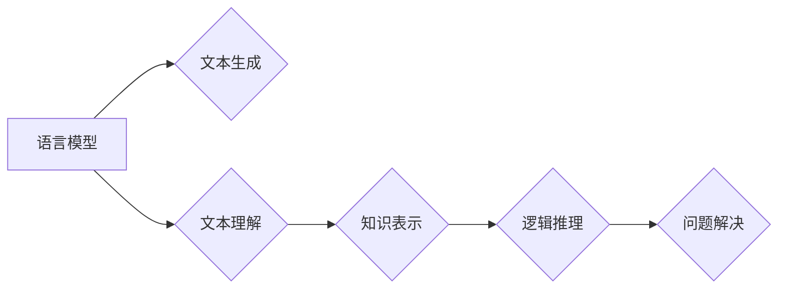

> 大模型，语言模型，推理能力，逻辑推理，知识表示，可解释性，安全问题

## 1. 背景介绍

近年来，深度学习技术取得了令人瞩目的成就，尤其是在自然语言处理领域。大型语言模型（LLM）的出现，例如GPT-3、LaMDA和BERT，展现了强大的文本生成、翻译、问答和代码生成能力。这些模型通过海量文本数据进行训练，学习了语言的复杂模式和结构，从而能够生成逼真、流畅的文本。然而，尽管LLM在许多任务上表现出色，但它们在推理能力方面仍然存在显著的局限性。

传统的AI系统通常依赖于明确的规则和逻辑推理来解决问题。而LLM则更像一个强大的文本预测器，其推理能力主要基于对训练数据中模式的学习和泛化。这意味着LLM在面对复杂、多步骤推理问题时，往往会表现出偏差、错误或缺乏逻辑一致性。

## 2. 核心概念与联系

**2.1 语言模型与推理**

语言模型的核心任务是预测下一个词，基于给定的上下文信息。然而，推理则需要理解上下文关系、推断隐含信息、进行逻辑判断和解决问题。

**2.2 知识表示与推理**

知识表示是指将世界知识以结构化的形式表示出来，例如知识图谱、逻辑规则等。知识表示可以帮助模型更好地理解语义关系，从而提升推理能力。

**2.3  逻辑推理与机器学习**

逻辑推理是基于逻辑规则和演绎推理进行知识推导。机器学习则通过数据训练模型，学习模式和规律。将逻辑推理与机器学习相结合，可以构建更强大的推理系统。

**2.4  可解释性与安全问题**

LLM的决策过程通常是黑盒式的，难以解释其推理过程。这导致了可解释性问题，也带来了安全问题，例如模型可能被恶意利用进行欺骗或攻击。

**Mermaid 流程图**



## 3. 核心算法原理 & 具体操作步骤

### 3.1  算法原理概述

目前，许多研究致力于提升LLM的推理能力，主要有以下几种方法：

* **强化学习：**通过奖励机制训练模型，使其能够在推理任务中获得更高的准确率。
* **知识图谱嵌入：**将知识图谱中的知识表示为向量，并将其融入到语言模型中，提升模型对知识的理解和推理能力。
* **逻辑推理模块：**将逻辑推理模块与语言模型相结合，利用逻辑规则进行推理，增强模型的逻辑推理能力。
* **自监督学习：**通过设计特殊的预训练任务，例如文本蕴含、逻辑推理等，训练模型提升其推理能力。

### 3.2  算法步骤详解

以强化学习为例，其步骤如下：

1. **环境设定：**定义推理任务的环境，包括状态、动作、奖励等。
2. **模型训练：**使用强化学习算法，例如DQN或PPO，训练模型在环境中进行推理，并根据奖励信号更新模型参数。
3. **推理过程：**在推理过程中，模型根据输入信息，选择最优动作，并根据环境反馈进行状态更新。
4. **结果评估：**评估模型在推理任务上的性能，例如准确率、F1-score等。

### 3.3  算法优缺点

**优点：**

* 可以有效提升模型的推理能力。
* 可以学习到更复杂的推理策略。

**缺点：**

* 训练过程复杂，需要大量的计算资源和训练数据。
* 模型的解释性较差，难以理解其推理过程。

### 3.4  算法应用领域

* **自然语言推理：**例如文本蕴含、问答系统、对话系统等。
* **知识图谱推理：**例如知识问答、关系抽取、推理链构建等。
* **决策支持系统：**例如医疗诊断、金融风险评估等。

## 4. 数学模型和公式 & 详细讲解 & 举例说明

### 4.1  数学模型构建

假设我们有一个语言模型，其输出概率分布为P(y|x)，其中x为输入文本，y为输出文本。我们可以使用交叉熵损失函数来训练模型，其公式如下：

$$
L = -\sum_{i=1}^{n} y_i \log P(y_i|x)
$$

其中，n为输出文本的长度，y_i为真实标签，P(y_i|x)为模型预测的概率。

### 4.2  公式推导过程

交叉熵损失函数的目的是最小化模型预测概率与真实标签之间的差异。其推导过程如下：

1. **信息熵：**信息熵度量了随机变量的不确定性。对于一个离散随机变量X，其信息熵定义为：

$$
H(X) = -\sum_{x \in X} p(x) \log p(x)
$$

2. **交叉熵：**交叉熵度量了两个概率分布之间的差异。对于两个概率分布P和Q，其交叉熵定义为：

$$
H(P,Q) = -\sum_{x \in X} p(x) \log q(x)
$$

3. **损失函数：**在机器学习中，我们通常使用交叉熵作为损失函数，其目的是最小化模型预测概率与真实标签之间的差异。

### 4.3  案例分析与讲解

例如，在文本分类任务中，我们希望模型能够将文本分类为不同的类别。我们可以使用交叉熵损失函数来训练模型，其目标是将模型预测的概率分布与真实标签分布之间的差异最小化。

## 5. 项目实践：代码实例和详细解释说明

### 5.1  开发环境搭建

* Python 3.7+
* TensorFlow 2.0+
* PyTorch 1.0+

### 5.2  源代码详细实现

```python
import tensorflow as tf

# 定义模型结构
model = tf.keras.Sequential([
    tf.keras.layers.Embedding(input_dim=vocab_size, output_dim=embedding_dim),
    tf.keras.layers.LSTM(units=hidden_size),
    tf.keras.layers.Dense(units=num_classes, activation='softmax')
])

# 编译模型
model.compile(optimizer='adam',
              loss='sparse_categorical_crossentropy',
              metrics=['accuracy'])

# 训练模型
model.fit(x_train, y_train, epochs=10)

# 评估模型
loss, accuracy = model.evaluate(x_test, y_test)
print('Loss:', loss)
print('Accuracy:', accuracy)
```

### 5.3  代码解读与分析

* **Embedding层：**将单词映射到低维向量空间。
* **LSTM层：**捕捉文本序列中的长短时依赖关系。
* **Dense层：**输出预测概率分布。
* **Adam优化器：**用于更新模型参数。
* **Sparse categorical crossentropy损失函数：**用于分类任务。

### 5.4  运行结果展示

训练完成后，我们可以使用模型对测试数据进行预测，并评估模型的性能。

## 6. 实际应用场景

* **问答系统：**LLM可以用于构建问答系统，回答用户的问题。
* **对话系统：**LLM可以用于构建对话系统，与用户进行自然语言交互。
* **文本生成：**LLM可以用于生成各种类型的文本，例如文章、故事、诗歌等。
* **机器翻译：**LLM可以用于机器翻译，将文本从一种语言翻译成另一种语言。

### 6.4  未来应用展望

* **个性化教育：**根据学生的学习情况，提供个性化的学习内容和辅导。
* **医疗诊断：**辅助医生进行疾病诊断，提高诊断准确率。
* **法律服务：**自动分析法律文件，提供法律建议。

## 7. 工具和资源推荐

### 7.1  学习资源推荐

* **书籍：**
    * 《深度学习》
    * 《自然语言处理》
* **在线课程：**
    * Coursera
    * edX
* **博客和论坛：**
    * Towards Data Science
    * Reddit

### 7.2  开发工具推荐

* **TensorFlow:** 开源深度学习框架。
* **PyTorch:** 开源深度学习框架。
* **Hugging Face Transformers:** 提供预训练语言模型和工具。

### 7.3  相关论文推荐

* **BERT: Pre-training of Deep Bidirectional Transformers for Language Understanding**
* **GPT-3: Language Models are Few-Shot Learners**
* **XLNet: Generalized Autoregressive Pretraining for Language Understanding**

## 8. 总结：未来发展趋势与挑战

### 8.1  研究成果总结

近年来，LLM取得了显著的进展，在许多任务上表现出色。然而，它们在推理能力方面仍然存在局限性。

### 8.2  未来发展趋势

* **增强推理能力：**研究更有效的算法和方法，提升LLM的推理能力。
* **提高可解释性：**研究可解释的LLM模型，使其推理过程更加透明。
* **增强安全性：**研究防止LLM被恶意利用的方法，确保其安全可靠。

### 8.3  面临的挑战

* **数据规模和质量：**训练强大的LLM需要海量高质量的数据。
* **计算资源：**训练和部署LLM需要大量的计算资源。
* **伦理问题：**LLM的应用可能带来伦理问题，例如偏见、虚假信息等。

### 8.4  研究展望

未来，LLM将继续朝着更强大、更智能的方向发展。研究人员将继续探索新的算法、模型和应用场景，推动LLM技术的发展。

## 9. 附录：常见问题与解答

* **Q：LLM如何理解文本的语义？**
* **A：**LLM通过学习文本中的词语关系和上下文信息来理解文本的语义。

* **Q：LLM如何进行推理？**
* **A：**LLM目前主要通过学习模式和规律进行推理，但其推理能力仍然有限。

* **Q：LLM有哪些应用场景？**
* **A：**LLM可以应用于问答系统、对话系统、文本生成、机器翻译等多个领域。


作者：禅与计算机程序设计艺术 / Zen and the Art of Computer Programming 
<end_of_turn>