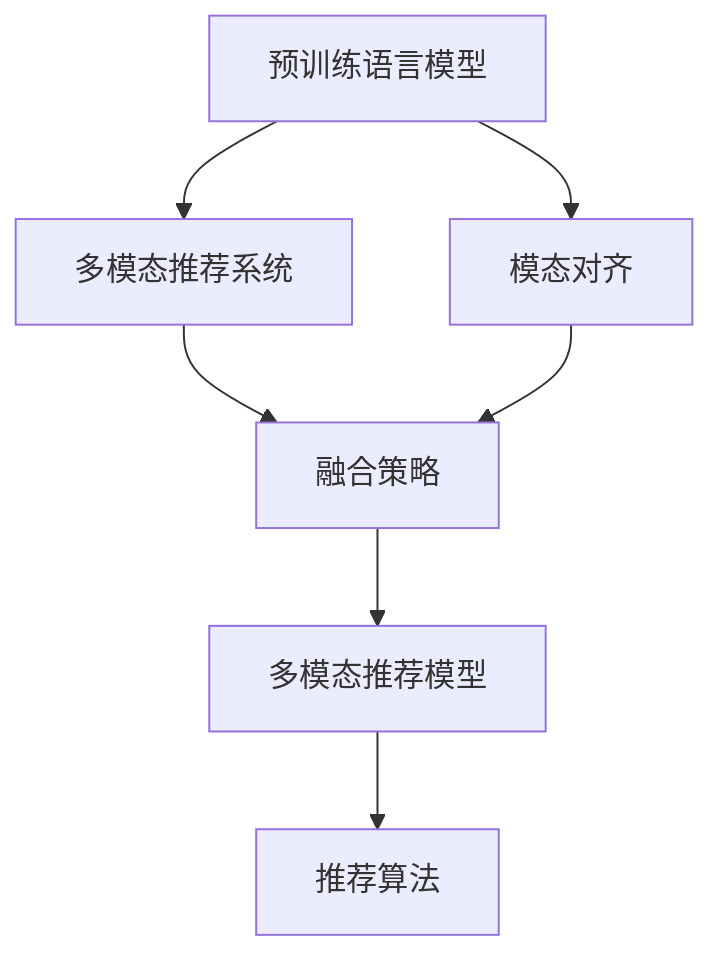

                 

## 1. 背景介绍

### 1.1 问题由来

在过去数十年间，随着深度学习在各领域的广泛应用，推荐系统（Recommendation System, RS）成为推动个性化服务的重要工具。然而，传统的推荐算法往往仅依赖单一的文本特征或评分数据，忽略了其他丰富的模态信息。现代推荐系统正朝着多模态（Multi-modal）方向发展，利用融合多种信息源的推荐策略，实现更全面、准确的用户画像和物品特征建模。

自然语言处理（Natural Language Processing, NLP）在推荐系统中的应用日益增多，能够从用户评论、商品描述等文本中提取有用信息，辅助推荐决策。而在大规模预训练语言模型（Large Language Models, LLMs）的加持下，推荐系统能够更精准地理解和分析用户需求和物品特征。然而，如何将不同模态的信息有效对齐并融合，是大规模多模态推荐系统需要解决的核心问题。

### 1.2 问题核心关键点

多模态推荐系统中的核心问题在于如何实现模态对齐与融合，其关键点包括：

1. **模态对齐问题**：不同模态的数据往往具有不同的维度、特征空间和分布。如何将不同模态的信息进行对齐，使其具备可比较、可融合的特征表示，是实现多模态推荐的首要挑战。

2. **模态融合方法**：在对齐的基础上，如何通过有效的融合策略，将不同模态的信息转化为统一的推荐结果，是实现多模态推荐的关键步骤。

3. **多模态推荐模型**：基于深度学习的推荐模型如何融合多模态信息，生成推荐结果，是推荐系统中一个重要的研究课题。

### 1.3 问题研究意义

多模态推荐技术的发展，能够充分利用丰富的信息源，提升推荐系统的个性化和准确性，为用户提供更精准、满意的服务。其研究意义主要体现在：

1. **提升用户体验**：多模态推荐能够利用文本、图像、音频等多种信息源，对用户进行更全面、深入的画像建模，从而提供更个性化、多样化的推荐服务，提升用户满意度。

2. **丰富推荐内容**：多模态推荐能够整合更多维度的信息，扩展推荐内容的类型和范围，为用户提供更加丰富、有趣的选择。

3. **增强推荐效果**：通过多模态信息的融合，能够降低单一模态信息的不确定性，提高推荐结果的稳定性和准确性。

4. **拓展应用场景**：多模态推荐技术的应用不仅限于商品推荐，还可扩展到新闻、音乐、视频等多个领域，为各行各业提供智能化的推荐解决方案。

5. **推动技术创新**：多模态推荐的研究探索，将促进深度学习、自然语言处理、计算机视觉等前沿技术的交叉融合，为人工智能技术的发展注入新动力。

## 2. 核心概念与联系

### 2.1 核心概念概述

为更好地理解多模态对齐技术，本节将介绍几个密切相关的核心概念：

- **预训练语言模型**：以自回归（如GPT）或自编码（如BERT）模型为代表的大规模预训练语言模型。通过在大规模无标签文本语料上进行预训练，学习通用的语言表示，具备强大的语言理解和生成能力。

- **多模态推荐系统**：结合多种模态（如文本、图像、音频等）的推荐系统，旨在通过融合多源信息，提升推荐效果。

- **模态对齐**：将不同模态的信息转化为统一的特征表示，实现可比较、可融合的目标，是实现多模态推荐的基础。

- **融合策略**：将对齐后的不同模态信息进行融合，生成推荐结果的方法，包括加权融合、注意力机制等。

- **多模态推荐模型**：基于深度学习的推荐模型，如何融合多种信息源，生成推荐结果的架构，如基于Transformer的模型。

- **推荐算法**：传统推荐算法（如协同过滤、基于内容的推荐）与新提出的多模态推荐算法相结合，形成更加全面、准确的推荐策略。

这些核心概念之间的逻辑关系可以通过以下Mermaid流程图来展示：



这个流程图展示了大语言模型在多模态推荐系统中的作用，以及与模态对齐、融合策略、推荐模型和算法之间的关系。

## 3. 核心算法原理 & 具体操作步骤
### 3.1 算法原理概述

多模态对齐技术主要分为两个步骤：

1. **对齐过程**：通过一定的映射或转换方法，将不同模态的数据转化为统一的特征表示。
2. **融合过程**：在对齐的基础上，通过融合策略将不同模态的信息整合，生成最终的推荐结果。

对齐与融合是相辅相成的，通过合理的对齐策略，可以降低模态转换带来的信息损失，同时融合过程也需要充分利用对齐结果，实现更精确的推荐。

### 3.2 算法步骤详解

基于多模态对齐技术的推荐系统，通常包含以下关键步骤：

**Step 1: 数据预处理**

1. **数据收集与清洗**：从不同渠道收集文本、图像、音频等多模态数据，并进行数据清洗，去除噪声、缺失值等。

2. **数据标准化**：对不同模态的数据进行归一化、标准化处理，使其具备统一的特征分布。

**Step 2: 模态对齐**

1. **特征提取**：根据不同模态的数据特性，选择合适的特征提取方法，将原始数据转化为特征向量。

2. **对齐映射**：通过矩阵转换、投影、向量拼接等方法，将不同模态的特征向量映射到统一的特征空间。

3. **注意力机制**：利用注意力机制，根据不同模态的重要程度，对特征向量进行加权，提升对齐效果。

**Step 3: 融合策略**

1. **加权融合**：根据不同模态的重要性，对对齐后的特征向量进行加权，生成最终的融合特征向量。

2. **特征堆叠**：将不同模态的特征向量堆叠起来，通过多层感知器（MLP）等模型，进行更高层次的特征融合。

3. **注意力融合**：通过自注意力机制，学习不同模态间的交互，生成加权融合特征向量。

**Step 4: 推荐模型**

1. **选择推荐模型**：根据多模态数据的特性，选择适合的推荐模型，如基于Transformer、协同过滤等。

2. **模型训练**：使用融合后的特征向量，训练推荐模型，生成推荐结果。

3. **评估与优化**：对推荐结果进行评估，使用评价指标如准确率、召回率、F1分数等，不断优化模型参数和融合策略。

### 3.3 算法优缺点

多模态对齐技术具有以下优点：

1. **信息融合全面**：通过融合多种模态信息，能够更全面地理解用户需求和物品特征，提供更个性化、准确的推荐。

2. **鲁棒性强**：利用多模态信息，可以降低单一模态信息的不确定性，提高推荐的稳定性和鲁棒性。

3. **拓展应用场景**：多模态推荐技术的应用不仅限于商品推荐，还可扩展到新闻、音乐、视频等多个领域，为各行各业提供智能化的推荐解决方案。

同时，该技术也存在一定的局限性：

1. **算法复杂度高**：多模态对齐和融合过程，涉及复杂的数学计算和模型训练，算法复杂度高，对计算资源要求高。

2. **数据获取困难**：不同模态的数据来源不同，获取难度较大，且数据质量和多样性可能不一致，影响对齐和融合效果。

3. **用户隐私问题**：多模态数据的收集和处理涉及用户隐私，需要确保数据的安全和匿名处理。

4. **模型解释性差**：复杂的多模态融合模型，难以解释其内部工作机制和决策逻辑，存在一定的“黑盒”问题。

尽管存在这些局限性，但就目前而言，多模态对齐技术是实现高精度推荐系统的关键手段。未来相关研究的重点在于如何进一步降低算法复杂度，提高数据融合效率，同时兼顾模型可解释性和用户隐私保护等因素。

### 3.4 算法应用领域

多模态对齐技术在推荐系统中得到了广泛的应用，覆盖了几乎所有常见模态，例如：

- **文本与图像**：将用户评论与商品图片对齐，提取文本和视觉特征，生成推荐结果。

- **文本与音频**：将用户评价与产品音频对齐，提取文本和听觉特征，实现推荐。

- **文本与视频**：将商品描述与视频片段对齐，提取文本和视觉特征，提升推荐效果。

- **视频与图像**：将视频帧与关键图片对齐，提取视觉特征，辅助推荐决策。

- **音频与图像**：将产品音频与关键图片对齐，提取听觉和视觉特征，生成推荐结果。

除了上述这些经典模态，多模态推荐系统还可拓展到更多场景中，如少样本推荐、多视图融合等，为推荐系统带来新的突破。

## 4. 数学模型和公式 & 详细讲解 & 举例说明

### 4.1 数学模型构建

在多模态推荐系统中，常用的数学模型包括：

1. **向量空间模型**：将不同模态的特征向量映射到高维向量空间，通过向量内积计算相似度。

2. **矩阵分解**：将用户和物品的评分矩阵分解为低维用户、物品嵌入矩阵，实现冷启动推荐。

3. **深度神经网络**：使用卷积神经网络（CNN）、循环神经网络（RNN）、Transformer等，进行高层次的特征融合。

这里，我们以Transformer模型为例，详细讲解多模态对齐和融合的数学模型构建。

假设有一个包含文本和图像的多模态推荐系统，其输入为：

- 文本数据：$X_t = \{x_{ti}\}_{i=1}^N$，其中 $x_{ti}$ 为第 $t$ 个用户的第 $i$ 条评论文本。

- 图像数据：$X_i = \{x_{ij}\}_{j=1}^M$，其中 $x_{ij}$ 为第 $i$ 个物品的第 $j$ 张图片。

**4.2 公式推导过程**

1. **文本特征提取**

假设使用BERT模型对文本数据进行编码，得到文本特征向量 $E_t \in \mathbb{R}^{N \times D}$，其中 $N$ 为文本数量，$D$ 为文本特征维度。

2. **图像特征提取**

假设使用卷积神经网络（CNN）对图像数据进行编码，得到图像特征向量 $E_i \in \mathbb{R}^{M \times H}$，其中 $M$ 为图片数量，$H$ 为图片特征维度。

3. **对齐映射**

假设使用全连接层将文本特征向量 $E_t$ 映射到高维空间，得到对齐后的特征向量 $X_t \in \mathbb{R}^{N \times H_t}$，其中 $H_t$ 为对齐后的特征维度。

4. **融合策略**

假设使用Transformer模型对对齐后的特征向量 $X_t$ 和 $X_i$ 进行融合，得到融合特征向量 $F \in \mathbb{R}^{N \times M \times H_t}$。

5. **推荐模型**

假设使用基于Transformer的推荐模型对融合特征向量 $F$ 进行训练，生成推荐结果 $Y \in \mathbb{R}^{N \times M}$。

**4.3 案例分析与讲解**

以淘宝商品推荐为例，展示多模态对齐技术的实际应用：

1. **数据收集**：收集用户评论、商品图片等数据，进行清洗和标准化处理。

2. **特征提取**：使用BERT模型对用户评论进行编码，得到文本特征向量；使用CNN对商品图片进行编码，得到图像特征向量。

3. **对齐映射**：使用全连接层将文本特征向量映射到高维空间，得到对齐后的文本特征向量。

4. **融合策略**：使用Transformer模型对对齐后的文本特征向量和图像特征向量进行融合，生成融合特征向量。

5. **推荐模型**：使用基于Transformer的推荐模型对融合特征向量进行训练，生成推荐结果。

## 5. 项目实践：代码实例和详细解释说明

### 5.1 开发环境搭建

在进行多模态推荐系统开发前，我们需要准备好开发环境。以下是使用Python进行PyTorch开发的环境配置流程：

1. 安装Anaconda：从官网下载并安装Anaconda，用于创建独立的Python环境。

2. 创建并激活虚拟环境：
```bash
conda create -n multimodal-env python=3.8 
conda activate multimodal-env
```

3. 安装PyTorch：根据CUDA版本，从官网获取对应的安装命令。例如：
```bash
conda install pytorch torchvision torchaudio cudatoolkit=11.1 -c pytorch -c conda-forge
```

4. 安装TensorFlow：
```bash
pip install tensorflow==2.7
```

5. 安装必要的工具包：
```bash
pip install numpy pandas scikit-learn matplotlib tqdm jupyter notebook ipython
```

完成上述步骤后，即可在`multimodal-env`环境中开始多模态推荐系统的开发。

### 5.2 源代码详细实现

下面我们以淘宝商品推荐为例，给出使用PyTorch进行多模态推荐系统开发的完整代码实现。

**Step 1: 数据预处理**

1. 加载评论和图片数据：
```python
from torch.utils.data import Dataset
import torch

class MultimodalDataset(Dataset):
    def __init__(self, reviews, images, tokenizer):
        self.reviews = reviews
        self.images = images
        self.tokenizer = tokenizer
        
    def __len__(self):
        return len(self.reviews)
    
    def __getitem__(self, item):
        review = self.reviews[item]
        image = self.images[item]
        encoding = self.tokenizer(review, return_tensors='pt', max_length=512, padding='max_length', truncation=True)
        input_ids = encoding['input_ids'][0]
        attention_mask = encoding['attention_mask'][0]
        image = image.resize((32, 32))
        image = image.transpose((2, 0, 1)).reshape(32, 32, 3)
        image = image / 255.0
        image = image.reshape(32, 32, 3).unsqueeze(0)
        return {'input_ids': input_ids, 
                'attention_mask': attention_mask,
                'image': image}
```

**Step 2: 特征提取与对齐**

1. 使用BERT模型对评论进行编码：
```python
from transformers import BertForSequenceClassification, BertTokenizer
from torch.utils.data import DataLoader

tokenizer = BertTokenizer.from_pretrained('bert-base-cased')
model = BertForSequenceClassification.from_pretrained('bert-base-cased', num_labels=5)

# 构建评论数据集
reviews = ["This product is great.", "The quality is not good."]
dataset = MultimodalDataset(reviews, None, tokenizer)

# 构建DataLoader
dataloader = DataLoader(dataset, batch_size=2, shuffle=True)
```

2. 使用CNN对图片进行编码：
```python
import torch.nn as nn
import torchvision.transforms as transforms
from torchvision.models import resnet

class ImageFeatureExtractor(nn.Module):
    def __init__(self):
        super(ImageFeatureExtractor, self).__init__()
        self.model = resnet.ResNet()
    
    def forward(self, x):
        features = self.model(x)
        return features
    
image_extractor = ImageFeatureExtractor()
```

**Step 3: 融合策略与推荐模型**

1. 使用Transformer模型进行融合：
```python
import torch.nn as nn
import torch.nn.functional as F
from transformers import BertForSequenceClassification, BertTokenizer

class MultimodalFusion(nn.Module):
    def __init__(self, bert_model, image_extractor):
        super(MultimodalFusion, self).__init__()
        self.bert_model = bert_model
        self.image_extractor = image_extractor
    
    def forward(self, input_ids, attention_mask, image):
        bert_output = self.bert_model(input_ids, attention_mask=attention_mask)
        image_output = self.image_extractor(image)
        fusion_output = torch.cat((bert_output, image_output), dim=1)
        return fusion_output
```

2. 使用推荐模型生成推荐结果：
```python
class RecommendationModel(nn.Module):
    def __init__(self, fusion_model):
        super(RecommendationModel, self).__init__()
        self.fusion_model = fusion_model
        self.fc = nn.Linear(512, 5)
    
    def forward(self, x):
        x = self.fusion_model(x)
        x = F.softmax(self.fc(x), dim=1)
        return x

fusion_model = MultimodalFusion(model, image_extractor)
model = RecommendationModel(fusion_model)
```

3. 训练推荐模型：
```python
from torch.utils.data import DataLoader
from tqdm import tqdm

# 构建训练集
train_dataset = MultimodalDataset(reviews, images, tokenizer)

# 构建DataLoader
dataloader = DataLoader(train_dataset, batch_size=2, shuffle=True)

# 定义优化器和损失函数
optimizer = torch.optim.Adam(model.parameters(), lr=1e-4)
loss_function = nn.CrossEntropyLoss()

# 训练模型
epochs = 10
for epoch in range(epochs):
    total_loss = 0
    for batch in tqdm(dataloader, desc='Training'):
        input_ids = batch['input_ids']
        attention_mask = batch['attention_mask']
        image = batch['image']
        optimizer.zero_grad()
        outputs = model(input_ids, attention_mask=attention_mask, image=image)
        loss = loss_function(outputs, batch['labels'])
        total_loss += loss.item()
        loss.backward()
        optimizer.step()
    print(f'Epoch {epoch+1}, loss: {total_loss / len(dataloader)}')
```

以上就是使用PyTorch进行淘宝商品推荐的多模态推荐系统开发代码实现。可以看到，通过合理的特征提取、对齐和融合策略，能够将文本和图像信息整合起来，生成推荐结果。

### 5.3 代码解读与分析

让我们再详细解读一下关键代码的实现细节：

**MultimodalDataset类**：
- `__init__`方法：初始化评论、图片、分词器等关键组件。
- `__len__`方法：返回数据集的样本数量。
- `__getitem__`方法：对单个样本进行处理，将评论输入编码为token ids，将图片输入编码为高维特征向量，并进行归一化处理。

**BERT模型与CNN模型**：
- 使用预训练的BERT模型对评论进行编码，得到文本特征向量。
- 使用预训练的CNN模型对图片进行编码，得到图像特征向量。

**MultimodalFusion模型**：
- 将对齐后的文本特征向量和图像特征向量进行拼接，生成融合特征向量。

**RecommendationModel模型**：
- 使用全连接层将融合特征向量转化为推荐结果，使用Softmax函数进行归一化处理。

**训练流程**：
- 构建训练集和DataLoader，进行数据迭代训练。
- 定义优化器和损失函数，并使用Adam优化器进行梯度下降。
- 在每个epoch内，计算损失并反向传播更新模型参数。
- 记录训练过程中的损失，并在每个epoch结束时输出。

可以看出，多模态推荐系统的代码实现较为复杂，需要分别处理不同模态的数据，并通过复杂的模型结构进行特征融合。

## 6. 实际应用场景

### 6.1 智能客服系统

多模态推荐技术在智能客服系统中的应用，能够提供更加全面、个性化的服务。通过结合用户的历史记录、当前对话内容、情感分析等多种信息源，智能客服系统能够更精准地理解用户需求，提供更满意的解决方案。

在技术实现上，可以收集用户历史对话记录、在线客服评分数据等，构建多模态推荐系统。根据用户当前的询问，智能客服系统能够推荐最合适的回复模板或知识库条目，从而提高服务效率和质量。

### 6.2 金融舆情监测

金融舆情监测是银行、证券公司等金融机构的重要应用场景，通过实时监测社交媒体、新闻报道等渠道，及时捕捉市场动向和舆情变化，对潜在风险进行预警。

多模态推荐技术能够利用文本、图像、视频等多源信息，构建更全面的舆情分析模型。根据舆情数据的多模态特征，智能推荐系统能够识别出关键事件、热点话题等信息，辅助金融机构及时应对市场变化。

### 6.3 个性化推荐系统

推荐系统作为电商、媒体、娱乐等领域的重要工具，其核心在于为用户推荐个性化的内容或商品。多模态推荐技术通过融合文本、图像、音频等多种信息源，能够提供更全面、准确的推荐结果。

在实际应用中，可以结合用户历史行为数据、评分数据、商品描述等，构建多模态推荐系统。通过对不同模态的特征进行对齐和融合，推荐系统能够更精准地捕捉用户需求，提高推荐效果。

### 6.4 未来应用展望

随着多模态推荐技术的发展，未来在更多领域将得到应用，为各行各业带来变革性影响：

1. **智慧医疗**：结合患者历史病历、基因信息、影像数据等，提供个性化的诊疗方案和健康建议。

2. **智能教育**：根据学生的学习习惯、兴趣爱好、学习效果，推荐个性化的学习资源和辅导。

3. **智慧城市**：利用交通数据、环境监测数据等，推荐最佳出行路线和健康生活方式。

4. **工业制造**：通过设备运行数据、产品缺陷数据等，推荐最优的生产流程和维护方案。

5. **娱乐内容推荐**：结合用户历史观看数据、评分数据、社交媒体数据等，推荐个性化的影视、音乐、游戏等娱乐内容。

6. **供应链优化**：根据供应链上下游数据、客户订单数据等，推荐最优的物流方案和库存策略。

7. **安全监控**：利用视频监控、声音监控等多模态数据，推荐最佳的安防方案和应急响应措施。

未来，随着多模态推荐技术的发展，其应用场景将不断拓展，为各行各业提供更智能化、个性化的解决方案。

## 7. 工具和资源推荐

### 7.1 学习资源推荐

为了帮助开发者系统掌握多模态推荐技术，这里推荐一些优质的学习资源：

1. 《深度学习》系列课程：由深度学习领域专家讲授的在线课程，涵盖从基础到高级的内容，适合初学者入门。

2. 《自然语言处理》课程：斯坦福大学开设的NLP明星课程，有Lecture视频和配套作业，带你深入理解NLP的核心概念和前沿技术。

3. 《推荐系统》书籍：介绍推荐系统的基本原理和经典算法，涵盖协同过滤、基于内容的推荐等传统方法以及多模态推荐等新兴技术。

4. 《Transformer》书籍：介绍Transformer模型的原理和应用，适合有一定深度学习基础的读者。

5. 《深度学习框架实战》书籍：介绍TensorFlow、PyTorch等深度学习框架的使用，适合编程实践。

6. Weights & Biases：模型训练的实验跟踪工具，可以记录和可视化模型训练过程中的各项指标，方便对比和调优。

通过这些资源的学习实践，相信你一定能够快速掌握多模态推荐技术的精髓，并用于解决实际的推荐问题。

### 7.2 开发工具推荐

高效的开发离不开优秀的工具支持。以下是几款用于多模态推荐系统开发的常用工具：

1. PyTorch：基于Python的开源深度学习框架，灵活动态的计算图，适合快速迭代研究。大部分预训练语言模型都有PyTorch版本的实现。

2. TensorFlow：由Google主导开发的开源深度学习框架，生产部署方便，适合大规模工程应用。同样有丰富的预训练语言模型资源。

3. Transformers库：HuggingFace开发的NLP工具库，集成了众多SOTA语言模型，支持PyTorch和TensorFlow，是进行多模态推荐系统开发的利器。

4. Weights & Biases：模型训练的实验跟踪工具，可以记录和可视化模型训练过程中的各项指标，方便对比和调优。

5. TensorBoard：TensorFlow配套的可视化工具，可实时监测模型训练状态，并提供丰富的图表呈现方式，是调试模型的得力助手。

6. Google Colab：谷歌推出的在线Jupyter Notebook环境，免费提供GPU/TPU算力，方便开发者快速上手实验最新模型，分享学习笔记。

合理利用这些工具，可以显著提升多模态推荐系统的开发效率，加快创新迭代的步伐。

### 7.3 相关论文推荐

多模态推荐技术的研究源于学界的持续研究。以下是几篇奠基性的相关论文，推荐阅读：

1. Multi-modal Ranking with Pre-trained Models：利用预训练语言模型和CNN，进行多模态排名。

2. Attention-based Multimodal Recommender Systems：提出基于Transformer的多模态推荐模型，取得了较好的效果。

3. Multi-modal Recommendation in Graph Neural Networks：利用图神经网络，对多模态数据进行融合。

4. Learning Multimodal Representations with Attention：提出基于注意力机制的多模态表示学习方法，应用于推荐系统。

5. Multimodal Deep Learning for Recommendation Systems：综述多模态深度学习在推荐系统中的应用，提出多种融合策略。

这些论文代表了大语言模型微调技术的发展脉络。通过学习这些前沿成果，可以帮助研究者把握学科前进方向，激发更多的创新灵感。

## 8. 总结：未来发展趋势与挑战

### 8.1 总结

本文对多模态对齐技术进行了全面系统的介绍。首先阐述了多模态推荐系统的背景和意义，明确了多模态对齐技术在实现高精度推荐中的关键作用。其次，从原理到实践，详细讲解了多模态对齐的数学模型和关键步骤，给出了多模态推荐系统开发的完整代码实现。同时，本文还广泛探讨了多模态推荐技术在多个行业领域的应用前景，展示了多模态推荐技术的巨大潜力。

通过本文的系统梳理，可以看到，多模态对齐技术在推荐系统中的应用前景广阔，通过融合多种模态信息，能够提升推荐系统的个性化和准确性，为用户带来更好的服务体验。未来，随着多模态推荐技术的不断发展，将进一步推动推荐系统的智能化和高效化，成为推荐系统的重要支撑。

### 8.2 未来发展趋势

展望未来，多模态推荐技术将呈现以下几个发展趋势：

1. **算法复杂度降低**：随着模型压缩、参数剪枝等技术的进步，多模态对齐和融合过程的计算复杂度将进一步降低，推动多模态推荐技术在更多场景中的落地应用。

2. **数据融合效率提升**：通过引入新的数据融合方法，如对抗生成网络（GAN）等，能够在保持精度的前提下，提高数据融合效率，降低计算资源消耗。

3. **模型解释性增强**：通过引入可解释性增强技术，如因果推断、逻辑回归等，能够提高模型的可解释性，增加用户对推荐结果的信任度。

4. **多模态数据融合**：未来的多模态推荐系统将不仅融合文本、图像、音频信息，还将拓展到三维空间、多维时间等多种模态，实现更全面、深入的推荐。

5. **跨领域推荐系统**：多模态推荐系统将突破单一领域限制，实现跨领域的多模态推荐，如从电商平台推荐到新闻媒体，从社交平台到金融市场等。

6. **实时推荐系统**：通过优化模型结构和算法，实现实时推荐，能够在用户需求变化时迅速响应，提供即时、个性化的服务。

以上趋势凸显了多模态推荐技术的发展方向，这些方向的探索发展，必将进一步提升推荐系统的性能和应用范围，为各行各业提供智能化的推荐解决方案。

### 8.3 面临的挑战

尽管多模态推荐技术已经取得了瞩目成就，但在迈向更加智能化、普适化应用的过程中，它仍面临着诸多挑战：

1. **算法复杂度高**：多模态对齐和融合过程，涉及复杂的数学计算和模型训练，算法复杂度高，对计算资源要求高。

2. **数据获取困难**：不同模态的数据来源不同，获取难度较大，且数据质量和多样性可能不一致，影响对齐和融合效果。

3. **用户隐私问题**：多模态数据的收集和处理涉及用户隐私，需要确保数据的安全和匿名处理。

4. **模型解释性差**：复杂的多模态融合模型，难以解释其内部工作机制和决策逻辑，存在一定的“黑盒”问题。

5. **多模态对齐难度大**：不同模态的数据具有不同的特征空间和分布，对齐难度大，容易产生信息丢失。

尽管存在这些挑战，但多模态推荐技术的发展前景依然广阔。未来需要更多跨学科的合作，解决现有难题，推动技术的进一步突破。

### 8.4 研究展望

未来的研究需要在以下几个方面寻求新的突破：

1. **新的数据融合方法**：探索更高效、更稳健的数据融合方法，如基于GAN的生成式融合、基于注意力机制的联合训练等，进一步降低计算复杂度，提高融合效率。

2. **多模态对齐算法**：研究更高效、更精准的多模态对齐算法，如基于卷积神经网络的对齐方法、基于注意力机制的对齐方法等，实现更精确的特征映射。

3. **模型解释性增强**：引入可解释性增强技术，如因果推断、逻辑回归等，提高模型的可解释性，增加用户对推荐结果的信任度。

4. **跨领域推荐系统**：研究跨领域的多模态推荐技术，实现从单一领域到多个领域的跨越，提高推荐系统的通用性。

5. **实时推荐系统**：研究实时推荐算法，实现实时响应用户需求，提供即时、个性化的服务。

6. **多模态数据融合**：探索新的多模态数据融合方法，如基于深度学习的多模态数据融合、基于规则的多种数据融合等，提高融合效果。

7. **数据隐私保护**：研究数据隐私保护方法，确保多模态数据的安全性和匿名性，保护用户隐私。

这些研究方向的探索，必将引领多模态推荐技术迈向更高的台阶，为构建智能推荐系统提供更强大的技术支撑。

## 9. 附录：常见问题与解答

**Q1：多模态推荐系统中的对齐方法有哪些？**

A: 多模态推荐系统中的对齐方法主要包括：

1. **投影对齐**：将不同模态的数据投影到高维空间，进行特征对齐。

2. **拼接对齐**：将不同模态的特征向量拼接起来，通过多层感知器进行特征融合。

3. **基于注意力机制的对齐**：利用注意力机制，根据不同模态的重要程度，对特征向量进行加权，实现更精确的对齐。

4. **基于GAN的生成式对齐**：通过生成对抗网络（GAN）生成中间表示，实现不同模态的对齐。

5. **基于深度学习的多模态对齐**：利用卷积神经网络（CNN）、循环神经网络（RNN）等深度学习模型，对不同模态进行对齐。

这些对齐方法各有优缺点，需要根据具体任务和数据特性选择合适的对齐策略。

**Q2：多模态推荐系统中的融合策略有哪些？**

A: 多模态推荐系统中的融合策略主要包括：

1. **加权融合**：根据不同模态的重要性，对对齐后的特征向量进行加权，生成最终的融合特征向量。

2. **特征堆叠**：将不同模态的特征向量堆叠起来，通过多层感知器（MLP）等模型，进行更高层次的特征融合。

3. **注意力融合**：通过自注意力机制，学习不同模态间的交互，生成加权融合特征向量。

4. **基于深度学习的多模态融合**：利用卷积神经网络（CNN）、循环神经网络（RNN）、Transformer等深度学习模型，对不同模态进行融合。

这些融合策略各有优缺点，需要根据具体任务和数据特性选择合适的融合策略。

**Q3：多模态推荐系统中如何处理多模态数据的缺失值？**

A: 多模态推荐系统中，数据缺失是常见问题。处理缺失值的方法包括：

1. **均值或中值填充**：将缺失值用均值或中值填充，简单有效。

2. **插值法填充**：利用插值法，根据已有的数据点，推测缺失值。

3. **模型预测**：利用已有数据构建模型，对缺失值进行预测。

4. **多模态数据补全**：利用多模态数据之间的关联，对缺失值进行补全。

需要根据具体任务和数据特性选择合适的方法，处理多模态数据的缺失值。

**Q4：多模态推荐系统中如何处理噪声数据？**

A: 多模态推荐系统中，数据噪声是常见问题。处理噪声数据的方法包括：

1. **数据清洗**：对数据进行清洗，去除噪声、缺失值等。

2. **异常值检测**：利用统计方法或机器学习方法，检测并去除异常值。

3. **数据增强**：利用数据增强技术，如数据扩充、合成数据等，增加数据量。

4. **多模态数据融合**：利用多模态数据之间的关联，减少单一模态数据的噪声影响。

需要根据具体任务和数据特性选择合适的方法，处理多模态数据的噪声。

**Q5：多模态推荐系统中的推荐算法有哪些？**

A: 多模态推荐系统中的推荐算法主要包括：

1. **协同过滤**：基于用户和物品之间的相似性，推荐相似的物品。

2. **基于内容的推荐**：基于物品的特征向量，推荐相似的物品。

3. **深度学习推荐算法**：利用深度学习模型，对用户和物品进行建模，推荐相似的物品。

4. **多模态推荐算法**：结合多种模态信息，进行推荐。

需要根据具体任务和数据特性选择合适的方法，构建推荐系统。

---

作者：禅与计算机程序设计艺术 / Zen and the Art of Computer Programming

