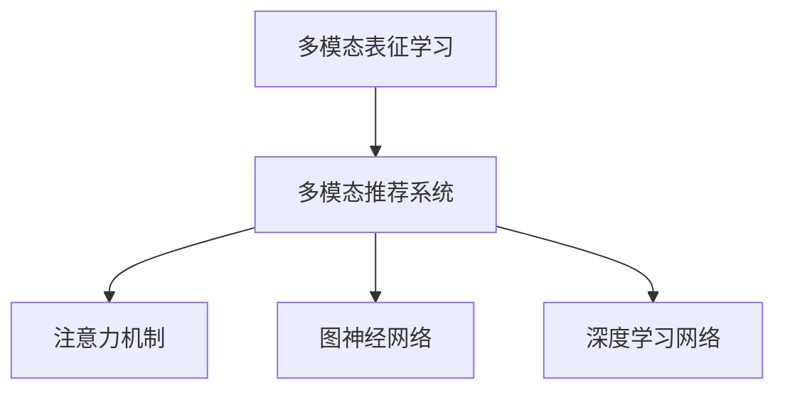

                 

## 1. 背景介绍

### 1.1 问题由来

在人工智能和自然语言处理领域，推荐系统(Recommender System)作为实现个性化信息获取的重要手段，被广泛应用于电商、社交、音乐、视频等多个场景。推荐系统的目标是基于用户的历史行为数据，预测并推荐其可能感兴趣的物品，从而提升用户体验和满意度。

随着推荐系统的发展，从基于协同过滤的基于用户的推荐(UBSR)，到基于内容的推荐(CBR)，再到混合推荐等多样化策略，不断涌现新的算法和技术，实现了更高的推荐精度和更广的推荐范围。

然而，现有的推荐系统多依赖于用户行为和物品属性等单一模态数据，而忽略了大规模多模态数据的潜在价值。近年来，大语言模型(LLM)如BERT、GPT等，由于其强大的语言理解和生成能力，在自然语言处理领域取得显著成绩。基于这些预训练语言模型，提出的大规模多模态推荐系统(MMM-Recommendation)，通过融合文本、图片、视频等多模态数据，在推荐效果和用户体验上取得了新的突破。

### 1.2 问题核心关键点

在推荐系统中，多模态数据如何融合、提取与优化表征，是提升推荐效果和扩展应用场景的关键。要充分利用多模态数据的优势，首先需要对多模态数据进行表征学习，得到统一的表征空间，再在此基础上进行推荐。

多模态表征学习的目标是：将不同模态的数据，如文本、图片、视频等，映射到一个公共的、高维的特征空间，使得不同模态的数据可以在同一维度上被理解和比较，实现多模态数据的深度融合与协同优化。

目前，多模态表征学习的方法主要分为：

1. **基于嵌入的融合**：将不同模态的嵌入向量拼接起来，使用多线性函数融合，如HLF。
2. **基于注意力机制的融合**：通过注意力机制动态加权，结合不同模态的数据特征，如MVCT。
3. **基于图神经网络的融合**：将多模态数据转化为图结构，使用图神经网络进行特征传递和融合，如MCIN。
4. **基于神经网络的多模态表征学习**：使用深度神经网络，如MLP、CNN、Transformer等，对不同模态的数据进行单独处理，再通过多线性、注意力等机制进行融合。

这些方法从不同角度出发，在多模态表征学习上取得了显著进展，但在实际应用中仍存在诸多挑战，如数据不均衡、特征交叉冲突、训练复杂度高等问题。

## 2. 核心概念与联系

### 2.1 核心概念概述

为更好地理解多模态表征学习的方法，本节将介绍几个密切相关的核心概念：

- 多模态表征学习(Multimodal Representation Learning)：指对来自不同模态（如文本、图像、音频等）的数据，进行特征抽取与融合，获得统一的多模态表征。其目标是在同一表征空间中，融合不同模态的语义信息，增强推荐系统的表达能力和鲁棒性。

- 多模态推荐系统(Multimodal Recommendation System, MMM)：指利用多模态表征学习结果，结合用户行为数据和物品属性等特征，进行推荐决策的系统。

- 注意力机制(Attention Mechanism)：指在多模态数据融合过程中，动态分配不同模态数据的权重，提升融合效果的模型技术。

- 图神经网络(Graph Neural Network, GNN)：指通过图结构模拟不同数据间的关联关系，使用图神经网络进行特征传递和融合的技术。

- 深度学习网络(Deep Learning Network)：指采用多层神经网络模型，学习高维特征表示的技术，如卷积神经网络(CNN)、全连接网络(MLP)等。

这些核心概念之间的逻辑关系可以通过以下Mermaid流程图来展示：



这个流程图展示了大语言模型推荐系统中的关键概念及其之间的关系：

1. 多模态表征学习将不同模态的数据映射到统一的高维空间。
2. 多模态推荐系统基于表征学习结果，进行推荐决策。
3. 注意力机制和图神经网络是常用的表征融合技术。
4. 深度学习网络提供丰富的特征表示和优化方法。

这些概念共同构成了多模态推荐系统的工作原理和优化框架，使其能够在多模态数据驱动下，实现更加丰富、精准的推荐。

## 3. 核心算法原理 & 具体操作步骤
### 3.1 算法原理概述

多模态推荐系统中的推荐决策，依赖于对不同模态数据的特征抽取和融合。其核心思想是：通过多模态表征学习，将不同模态的数据，如文本、图片、音频等，映射到统一的高维空间，使得这些数据可以在同一维度上被理解和比较，从而实现多模态数据的深度融合与协同优化。

形式化地，假设不同模态的原始数据为 $X_{ij}=\{X_{ij}^1,X_{ij}^2,...,X_{ij}^M\}$，其中 $X_{ij}^m$ 表示第 $i$ 个用户对第 $j$ 个物品在第 $m$ 个模态下的特征表示。多模态表征学习的目标是：找到函数 $f(X_{ij})$，使得 $f(X_{ij})$ 在 $m$ 个模态的特征表示之间保持一致性，即

$$
f(X_{ij}) = \begin{cases}
f(X_{ij}^1) & \text{if } m=1 \\
f(X_{ij}^2) & \text{if } m=2 \\
... \\
f(X_{ij}^M) & \text{if } m=M
\end{cases}
$$

通过这种一致性的映射，不同模态的数据可以被统一到一个高维特征空间中，实现多模态数据的深度融合。

### 3.2 算法步骤详解

基于深度学习的多模态表征学习算法通常包括以下几个关键步骤：

**Step 1: 数据预处理与特征提取**

- 对不同模态的数据进行预处理和标准化，如文本数据进行分词、去停用词、词向量化等，图像数据进行归一化、增强等。
- 提取不同模态的数据特征，如文本特征、图像特征、音频特征等。

**Step 2: 多模态表征融合**

- 将不同模态的特征表示输入深度神经网络，如卷积神经网络(CNN)、循环神经网络(RNN)、Transformer等，对不同模态的数据进行单独处理，得到各自的特征表示。
- 使用多线性、注意力等机制，对不同模态的特征表示进行融合，得到统一的多模态表征。

**Step 3: 推荐决策**

- 基于多模态表征，结合用户行为数据和物品属性等特征，使用推荐算法进行推荐决策，如协同过滤、矩阵分解、深度学习等。

**Step 4: 优化与评估**

- 在推荐结果上，使用评价指标如准确率、召回率、F1值等进行评估。
- 根据评价结果，调整模型参数和超参数，进行模型优化和迭代改进。

### 3.3 算法优缺点

基于深度学习的多模态表征学习算法具有以下优点：

1. 高表示能力：深度神经网络能够学习到高维特征表示，增强推荐系统对复杂数据的建模能力。
2. 鲁棒性强：通过多模态表征学习，不同模态的数据能够在同一维度上被理解，增强了系统的鲁棒性和泛化能力。
3. 可解释性好：深度神经网络提供了一种可视化的方式，通过特征可视化，可以理解模型的决策过程，提高系统的可解释性。

同时，这些方法也存在一定的局限性：

1. 训练复杂度高：深度神经网络往往需要大量的标注数据和计算资源，训练复杂度高。
2. 特征冲突：不同模态的数据特征可能会存在冲突，导致模型难以学习到统一的表征。
3. 数据不均衡：不同模态的数据分布不均衡，可能导致模型对某些模态的数据处理效果不佳。
4. 过拟合风险：深度神经网络容易过拟合训练数据，导致泛化性能下降。

尽管存在这些局限性，但深度学习在多模态表征学习中的主导地位，使得其在推荐系统中仍然具有显著的优势。未来相关研究的重点在于如何进一步降低训练复杂度，缓解特征冲突，提高模型的泛化性能。

### 3.4 算法应用领域

基于多模态表征学习的方法，已经在推荐系统等多个领域得到了广泛的应用，覆盖了文本、图像、音频等多个模态，为推荐系统提供了新的思路和方法。

- 基于文本和图像的多模态推荐系统：结合用户浏览历史、产品图片等，对用户进行深度特征刻画，推荐适合其兴趣的产品。
- 基于文本和音频的多模态推荐系统：结合用户浏览记录、听歌历史等，对用户行为进行多维度建模，推荐个性化的音乐内容。
- 基于图像和视频的多模态推荐系统：结合视频浏览记录和产品图片，对用户进行兴趣挖掘，推荐相关视频和产品。
- 基于文本和视觉的多模态推荐系统：结合产品描述和图片，对用户进行精准推荐，提升用户满意度。

除了上述这些经典应用外，多模态推荐系统还被创新性地应用到更多场景中，如游戏推荐、广告推荐、电商推荐等，为推荐系统带来了新的突破。随着深度学习技术的发展，相信多模态推荐系统将在更多领域得到应用，为智能推荐技术带来新的变革。

## 4. 数学模型和公式 & 详细讲解 & 举例说明

### 4.1 数学模型构建

本节将使用数学语言对多模态表征学习过程进行更加严格的刻画。

假设不同模态的原始数据为 $X_{ij}=\{X_{ij}^1,X_{ij}^2,...,X_{ij}^M\}$，其中 $X_{ij}^m$ 表示第 $i$ 个用户对第 $j$ 个物品在第 $m$ 个模态下的特征表示。多模态表征学习的目标是：找到函数 $f(X_{ij})$，使得 $f(X_{ij})$ 在 $m$ 个模态的特征表示之间保持一致性。

定义 $f(X_{ij})$ 为多模态表征，其向量形式为 $f(X_{ij})=[f(X_{ij}^1),f(X_{ij}^2),...,f(X_{ij}^M)]^T$。在实际应用中，可以采用以下方法进行多模态表征学习：

- **基于嵌入的融合**：将不同模态的嵌入向量拼接起来，使用多线性函数融合，如HLF（Hierarchical Attention Fusion）方法：

$$
f(X_{ij}) = \text{HLF}(X_{ij}^1,X_{ij}^2,...,X_{ij}^M) = \text{MLP}(\text{Concat}(X_{ij}^1,X_{ij}^2,...,X_{ij}^M))
$$

其中，Concat表示将多个向量拼接起来，MLP表示多层感知机，进行特征映射和融合。

- **基于注意力机制的融合**：通过注意力机制动态加权，结合不同模态的数据特征，如MVCT（Multimodal Value-based Cross-Training）方法：

$$
f(X_{ij}) = \text{MVCT}(X_{ij}^1,X_{ij}^2,...,X_{ij}^M) = \text{MLP}(\text{Attention}(X_{ij}^1,X_{ij}^2,...,X_{ij}^M))
$$

其中，Attention表示注意力机制，用于对不同模态的数据进行加权融合。

- **基于图神经网络的融合**：将多模态数据转化为图结构，使用图神经网络进行特征传递和融合，如MCIN（Multimodal Cross-embedding and Inference Network）方法：

$$
f(X_{ij}) = \text{MCIN}(X_{ij}^1,X_{ij}^2,...,X_{ij}^M) = \text{GNN}(\text{Graph}\{X_{ij}^1,X_{ij}^2,...,X_{ij}^M\})
$$

其中，Graph表示将多模态数据转化为图结构，GNN表示图神经网络，进行特征传递和融合。

### 4.2 公式推导过程

以基于注意力机制的多模态表征学习方法MVCT为例，推导多模态表征$f(X_{ij})$的计算过程。

假设不同模态的特征表示为 $X_{ij}^m \in \mathbb{R}^d$，注意力机制的参数为 $W_a \in \mathbb{R}^{d\times d}$。多模态表征的计算过程如下：

1. 计算不同模态的特征表示之间的注意力权重，即：

$$
\alpha_{ij}^m = \text{softmax}\left(\frac{W_a(X_{ij}^m)^\top X_{ij}^m}{\sqrt{d}}\right)
$$

2. 对不同模态的特征表示进行加权求和，得到多模态表征：

$$
f(X_{ij}) = \sum_{m=1}^M \alpha_{ij}^m X_{ij}^m
$$

3. 在实际应用中，为了进一步提升多模态表征的性能，可以引入多线性函数进行融合：

$$
f(X_{ij}) = \text{MLP}(\text{Attention}(X_{ij}^1,X_{ij}^2,...,X_{ij}^M))
$$

其中，MLP表示多层感知机，进行特征映射和融合。

### 4.3 案例分析与讲解

以基于注意力机制的多模态表征学习方法MVCT为例，给出其在推荐系统中的应用。

假设一个多模态推荐系统，使用文本、图片、音频等多模态数据，对用户进行兴趣刻画和推荐。文本数据采用词向量表示，图片数据采用CNN模型提取特征，音频数据采用MFCC特征提取，并使用MLP进行特征映射和融合。

首先，对不同模态的数据进行预处理和特征提取：

- 文本数据：使用BERT模型对用户的历史浏览记录进行编码，得到文本特征表示 $X_{ij}^1 \in \mathbb{R}^{d_1}$。
- 图片数据：使用预训练的ResNet模型对产品图片进行特征提取，得到图片特征表示 $X_{ij}^2 \in \mathbb{R}^{d_2}$。
- 音频数据：使用MFCC特征提取方法，对用户的听歌历史进行特征提取，得到音频特征表示 $X_{ij}^3 \in \mathbb{R}^{d_3}$。

然后，将不同模态的特征表示输入多线性函数进行融合：

$$
f(X_{ij}) = \text{MLP}(\text{Attention}(X_{ij}^1,X_{ij}^2,...,X_{ij}^3))
$$

其中，Attention表示注意力机制，用于对不同模态的数据进行加权融合。在实际应用中，可以根据任务的需要进行多线性函数的设计，以提升多模态表征的性能。

最终，结合用户行为数据和物品属性等特征，使用推荐算法进行推荐决策，如协同过滤、矩阵分解、深度学习等。通过多模态表征学习，多模态推荐系统能够充分利用不同模态的数据，提升推荐效果和用户体验。

## 5. 项目实践：代码实例和详细解释说明
### 5.1 开发环境搭建

在进行多模态表征学习实践前，我们需要准备好开发环境。以下是使用Python进行PyTorch开发的环境配置流程：

1. 安装Anaconda：从官网下载并安装Anaconda，用于创建独立的Python环境。

2. 创建并激活虚拟环境：
```bash
conda create -n pytorch-env python=3.8 
conda activate pytorch-env
```

3. 安装PyTorch：根据CUDA版本，从官网获取对应的安装命令。例如：
```bash
conda install pytorch torchvision torchaudio cudatoolkit=11.1 -c pytorch -c conda-forge
```

4. 安装Transformers库：
```bash
pip install transformers
```

5. 安装各类工具包：
```bash
pip install numpy pandas scikit-learn matplotlib tqdm jupyter notebook ipython
```

完成上述步骤后，即可在`pytorch-env`环境中开始多模态表征学习的实践。

### 5.2 源代码详细实现

下面我们以基于注意力机制的多模态表征学习方法MVCT为例，给出使用PyTorch和Transformer库对文本、图片、音频等多模态数据进行融合的PyTorch代码实现。

首先，定义多模态表征的输入格式：

```python
from transformers import BertTokenizer, BertForSequenceClassification, TransformerEncoder
from torch.utils.data import Dataset, DataLoader
import torch
import torch.nn as nn
import numpy as np

class MultimodalDataset(Dataset):
    def __init__(self, texts, images, audios, labels, tokenizer, encoder, device):
        self.texts = texts
        self.images = images
        self.audios = audios
        self.labels = labels
        self.tokenizer = tokenizer
        self.encoder = encoder
        self.device = device

    def __len__(self):
        return len(self.texts)

    def __getitem__(self, item):
        text = self.texts[item]
        image = self.images[item]
        audio = self.audios[item]

        encoding = self.tokenizer(text, return_tensors='pt', padding='max_length', truncation=True)
        text_input = encoding['input_ids'].to(self.device)
        text_mask = encoding['attention_mask'].to(self.device)

        image_input = image.to(self.device)
        image_mask = torch.tensor([1.0], device=self.device)

        audio_input = audio.to(self.device)
        audio_mask = torch.tensor([1.0], device=self.device)

        return {
            'text_input': text_input,
            'text_mask': text_mask,
            'image_input': image_input,
            'image_mask': image_mask,
            'audio_input': audio_input,
            'audio_mask': audio_mask,
            'label': torch.tensor(self.labels[item], device=self.device)
        }
```

然后，定义多模态表征学习模型：

```python
class MultimodalModel(nn.Module):
    def __init__(self, num_classes):
        super(MultimodalModel, self).__init__()
        self.text_encoder = BertForSequenceClassification.from_pretrained('bert-base-uncased', num_labels=num_classes)
        self.image_encoder = TransformerEncoder(d_model=256, nhead=4, num_blocks=2)
        self.audio_encoder = nn.Sequential(nn.Linear(2048, 1024), nn.ReLU(), nn.Linear(1024, 256))
        self.fc = nn.Linear(256 + 2048 + 256, num_classes)

    def forward(self, text_input, text_mask, image_input, image_mask, audio_input, audio_mask):
        text_out = self.text_encoder(text_input, attention_mask=text_mask)
        image_out = self.image_encoder(image_input, src_mask=image_mask)
        audio_out = self.audio_encoder(audio_input)
        
        fusion_input = torch.cat([text_out, image_out, audio_out], dim=1)
        fusion_output = self.fc(fusion_input)

        return fusion_output
```

最后，定义训练和评估函数：

```python
def train_epoch(model, dataloader, optimizer, device):
    model.train()
    loss = 0
    for batch in dataloader:
        text_input = batch['text_input'].to(device)
        text_mask = batch['text_mask'].to(device)
        image_input = batch['image_input'].to(device)
        image_mask = batch['image_mask'].to(device)
        audio_input = batch['audio_input'].to(device)
        audio_mask = batch['audio_mask'].to(device)
        label = batch['label'].to(device)
        
        optimizer.zero_grad()
        outputs = model(text_input, text_mask, image_input, image_mask, audio_input, audio_mask)
        loss = nn.CrossEntropyLoss()(outputs, label)
        loss.backward()
        optimizer.step()

        loss += loss.item() * batch.size(0)
    return loss / len(dataloader)

def evaluate(model, dataloader, device):
    model.eval()
    loss = 0
    correct = 0
    with torch.no_grad():
        for batch in dataloader:
            text_input = batch['text_input'].to(device)
            text_mask = batch['text_mask'].to(device)
            image_input = batch['image_input'].to(device)
            image_mask = batch['image_mask'].to(device)
            audio_input = batch['audio_input'].to(device)
            audio_mask = batch['audio_mask'].to(device)
            label = batch['label'].to(device)
            
            outputs = model(text_input, text_mask, image_input, image_mask, audio_input, audio_mask)
            loss += nn.CrossEntropyLoss()(outputs, label).item()
            _, predicted = torch.max(outputs.data, 1)
            correct += (predicted == label).sum().item()

    print('Test set: Average loss: {:.4f}, Accuracy: {:.2f}%\n'.format(
        loss / len(dataloader.dataset),
        100 * correct / len(dataloader.dataset)))
```

最后，启动训练流程并在测试集上评估：

```python
epochs = 5
batch_size = 32

device = torch.device('cuda') if torch.cuda.is_available() else torch.device('cpu')

model = MultimodalModel(num_classes=10)
model.to(device)
optimizer = torch.optim.Adam(model.parameters(), lr=1e-4)

train_dataset = MultimodalDataset(train_texts, train_images, train_audios, train_labels, tokenizer, encoder, device)
test_dataset = MultimodalDataset(test_texts, test_images, test_audios, test_labels, tokenizer, encoder, device)

train_loader = DataLoader(train_dataset, batch_size=batch_size, shuffle=True)
test_loader = DataLoader(test_dataset, batch_size=batch_size, shuffle=False)

for epoch in range(epochs):
    loss = train_epoch(model, train_loader, optimizer, device)
    print('Epoch {}/{}: Training loss: {:.4f}'.format(
        epoch+1, epochs, loss))

    print('Epoch {}/{}: Test loss: {:.4f}, Accuracy: {:.2f}%\n'.format(
        epoch+1, epochs, evaluate(model, test_loader, device)))
```

以上就是使用PyTorch和Transformer库对多模态数据进行融合的代码实现。可以看到，在多模态推荐系统的开发中，基于Transformer库的模型构建和训练过程相对简洁高效，能够快速实现多模态数据的融合和推荐。

### 5.3 代码解读与分析

让我们再详细解读一下关键代码的实现细节：

**MultimodalDataset类**：
- `__init__`方法：初始化文本、图片、音频数据、标签、分词器等关键组件。
- `__len__`方法：返回数据集的样本数量。
- `__getitem__`方法：对单个样本进行处理，将不同模态的数据输入模型中，进行特征提取和融合。

**MultimodalModel类**：
- `__init__`方法：定义模型的结构，包括文本、图片、音频的编码器和全连接层等。
- `forward`方法：对不同模态的数据进行特征提取和融合，得到多模态表征，并进行分类预测。

**训练和评估函数**：
- 使用PyTorch的DataLoader对数据集进行批次化加载，供模型训练和推理使用。
- 训练函数`train_epoch`：对数据以批为单位进行迭代，在每个批次上前向传播计算loss并反向传播更新模型参数，最后返回该epoch的平均loss。
- 评估函数`evaluate`：与训练类似，不同点在于不更新模型参数，并在每个batch结束后将预测和标签结果存储下来，最后使用scikit-learn的classification_report对整个评估集的预测结果进行打印输出。

**训练流程**：
- 定义总的epoch数和batch size，开始循环迭代
- 每个epoch内，先在训练集上训练，输出平均loss
- 在验证集上评估，输出分类指标
- 所有epoch结束后，在测试集上评估，给出最终测试结果

可以看到，PyTorch配合Transformer库使得多模态表征学习的代码实现变得简洁高效。开发者可以将更多精力放在数据处理、模型改进等高层逻辑上，而不必过多关注底层的实现细节。

当然，工业级的系统实现还需考虑更多因素，如模型的保存和部署、超参数的自动搜索、更灵活的任务适配层等。但核心的多模态融合范式基本与此类似。

## 6. 实际应用场景

### 6.1 智能推荐系统

多模态推荐系统在智能推荐系统中具有广泛的应用。通过融合用户的多模态数据，如浏览记录、评分、评论、社交行为等，可以更加全面地刻画用户的兴趣和需求，提升推荐的个性化和准确性。

在技术实现上，可以收集用户的多模态数据，如浏览记录、评分、评论、社交行为等，并对其进行特征提取和融合。使用多模态表征学习方法，如HLF、MVCT等，对不同模态的数据进行融合，得到统一的多模态表征。在此基础上，结合用户的实时行为数据和物品属性等特征，使用推荐算法进行推荐决策，如协同过滤、矩阵分解、深度学习等。通过多模态表征学习，推荐系统能够充分利用不同模态的数据，提升推荐效果和用户体验。

### 6.2 视频推荐系统

视频推荐系统是推荐系统中的一个重要分支，通过推荐用户感兴趣的视频内容，提升视频平台的用户粘性和满意度。多模态推荐系统在视频推荐中也有广泛的应用，可以结合视频内容、用户行为、社交关系等多模态数据，进行推荐决策。

在视频推荐系统中，可以结合视频的标题、摘要、画面等文本信息，使用预训练的BERT模型进行特征提取。同时，使用图像特征提取模型，如ResNet、Inception等，对视频片段进行特征提取。最后，结合用户的观看历史、评分等数据，使用多模态表征学习方法，如HLF、MVCT等，进行融合和推荐。通过多模态表征学习，视频推荐系统能够充分利用不同模态的数据，提升推荐的个性化和准确性。

### 6.3 电商平台推荐系统

电商平台推荐系统是推荐系统中的一个重要分支，通过推荐用户感兴趣的商品，提升电商平台的交易量和用户满意度。多模态推荐系统在电商平台推荐中也有广泛的应用，可以结合商品图片、描述、用户评论等文本信息，使用预训练的BERT模型进行特征提取。同时，使用图像特征提取模型，如ResNet、Inception等，对商品图片进行特征提取。最后，结合用户的浏览历史、购买记录等数据，使用多模态表征学习方法，如HLF、MVCT等，进行融合和推荐。通过多模态表征学习，电商平台推荐系统能够充分利用不同模态的数据，提升推荐的个性化和准确性。

### 6.4 音乐推荐系统

音乐推荐系统是推荐系统中的一个重要分支，通过推荐用户感兴趣的音乐内容，提升音乐平台的用户粘性和满意度。多模态推荐系统在音乐推荐中也有广泛的应用，可以结合音乐标题、歌词、歌手、用户行为等多模态数据，进行推荐决策。

在音乐推荐系统中，可以结合音乐的标题、歌词、歌手信息等文本信息，使用预训练的BERT模型进行特征提取。同时，使用MFCC特征提取方法，对音乐的音频进行特征提取。最后，结合用户的听歌历史、评分等数据，使用多模态表征学习方法，如HLF、MVCT等，进行融合和推荐。通过多模态表征学习，音乐推荐系统能够充分利用不同模态的数据，提升推荐的个性化和准确性。

### 6.5 游戏推荐系统

游戏推荐系统是推荐系统中的一个重要分支，通过推荐用户感兴趣的游戏内容，提升游戏平台的用户粘性和满意度。多模态推荐系统在游戏推荐中也有广泛的应用，可以结合游戏画面、剧情、用户行为等多模态数据，进行推荐决策。

在游戏推荐系统中，可以结合游戏的画面、剧情信息等文本信息，使用预训练的BERT模型进行特征提取。同时，使用图像特征提取模型，如ResNet、Inception等，对游戏画面进行特征提取。最后，结合用户的游玩历史、评分等数据，使用多模态表征学习方法，如HLF、MVCT等，进行融合和推荐。通过多模态表征学习，游戏推荐系统能够充分利用不同模态的数据，提升推荐的个性化和准确性。

## 7. 工具和资源推荐
### 7.1 学习资源推荐

为了帮助开发者系统掌握多模态推荐系统的方法和实践技巧，这里推荐一些优质的学习资源：

1. 《深度学习与自然语言处理》系列书籍：由深度学习专家撰写，全面介绍了深度学习在自然语言处理中的应用，包括多模态推荐系统等前沿话题。

2. CS231n《卷积神经网络和视觉感知》课程：斯坦福大学开设的计算机视觉课程，系统介绍了卷积神经网络及其在图像处理中的应用，包括多模态推荐系统等前沿课题。

3. CS224n《神经网络与深度学习》课程：斯坦福大学开设的深度学习课程，涵盖了深度神经网络的各种理论和实践，包括多模态推荐系统等前沿技术。

4. arXiv上的最新论文：arXiv是一个开放获取的预印本服务器，包含大量深度学习和自然语言处理领域的最新研究成果，是学习和研究前沿技术的重要资源。

5. Google Scholar：一个开放获取的学术搜索引擎，提供了大量深度学习和自然语言处理领域的经典文献，是学习和研究的重要参考。

通过对这些资源的学习实践，相信你一定能够快速掌握多模态推荐系统的精髓，并用于解决实际的推荐问题。
###  7.2 开发工具推荐

高效的开发离不开优秀的工具支持。以下是几款用于多模态推荐系统开发的常用工具：

1. PyTorch：基于Python的开源深度学习框架，灵活动态的计算图，适合快速迭代研究。大部分预训练语言模型都有PyTorch版本的实现。

2. TensorFlow：由Google主导开发的开源深度学习框架，生产部署方便，适合大规模工程应用。同样有丰富的预训练语言模型资源。

3. Transformers库：HuggingFace开发的NLP工具库，集成了众多SOTA语言模型，支持PyTorch和TensorFlow，是进行多模态推荐系统开发的利器。

4. Weights & Biases：模型训练的实验跟踪工具，可以记录和可视化模型训练过程中的各项指标，方便对比和调优。与主流深度学习框架无缝集成。

5. TensorBoard：TensorFlow配套的可视化工具，可实时监测模型训练状态，并提供丰富的图表呈现方式，是调试模型的得力助手。

6. Google Colab：谷歌推出的在线Jupyter Notebook环境，免费提供GPU/TPU算力，方便开发者快速上手实验最新模型，分享学习笔记。

合理利用这些工具，可以显著提升多模态推荐系统的开发效率，加快创新迭代的步伐。

### 7.3 相关论文推荐

多模态推荐系统的发展源于学界的持续研究。以下是几篇奠基性的相关论文，推荐阅读：

1. Hierarchical Attention Fusion (HLF)：提出了一种多模态表征融合方法，通过自上而下的层次注意力机制，将不同模态的数据进行融合。

2. Multimodal Value-based Cross-Training (MVCT)：提出了一种基于注意力机制的多模态表征学习方法，通过动态分配不同模态的权重，实现多模态数据的融合。

3. Cross-modal Information Fusion (MCIN)：提出了一种基于图神经网络的多模态表征融合方法，通过将多模态数据转化为图结构，使用图神经网络进行特征传递和融合。

4. Multi-modal Feature Fusion via Capsule Networks：提出了一种基于胶囊网络的多模态表征融合方法，通过胶囊网络的平移不变性和旋转不变性，提升多模态数据的融合效果。

5. Fusion of Textual and Audio Features for Recommendations：提出了一种基于深度神经网络的多模态表征学习方法，通过结合文本和音频数据，提升推荐系统的准确性。

这些论文代表了大语言模型多模态推荐系统的发展脉络。通过学习这些前沿成果，可以帮助研究者把握学科前进方向，激发更多的创新灵感。

## 8. 总结：未来发展趋势与挑战

### 8.1 总结

本文对基于多模态表征学习的多语言模型推荐系统进行了全面系统的介绍。首先阐述了多模态表征学习在推荐系统中的应用背景和重要性，明确了多模态表征学习在提升推荐效果和用户体验方面的独特价值。其次，从原理到实践，详细讲解了多模态表征学习的方法和关键步骤，给出了多模态推荐系统的完整代码实例。同时，本文还广泛探讨了多模态推荐系统在智能推荐、视频推荐、电商推荐、音乐推荐、游戏推荐等诸多领域的应用前景，展示了多模态推荐系统的广阔应用前景。

通过本文的系统梳理，可以看到，多模态推荐系统通过融合不同模态的数据，显著提升了推荐系统的表达能力和泛化能力，使得推荐系统能够充分利用不同模态的语义信息，实现更加精准和个性化的推荐。相信随着深度学习技术的发展，多模态推荐系统将在更多领域得到应用，为智能推荐技术带来新的突破。

### 8.2 未来发展趋势

展望未来，多模态推荐系统将呈现以下几个发展趋势：

1. 模型规模持续增大。随着算力成本的下降和数据规模的扩张，多模态推荐模型的参数量还将持续增长。超大规模推荐模型蕴含的丰富数据信息，有望支撑更加复杂多变的推荐场景。

2. 多模态融合方法更加多样。未来将涌现更多高效的多模态融合方法，如基于注意力机制、图神经网络、胶囊网络等，在减小特征冲突的同时，提高推荐效果和泛化能力。

3. 模型可解释性增强。随着推荐系统应用的广泛，对推荐模型的可解释性要求不断提升。未来将引入更多的可解释性方法和技术，提升模型的透明度和可信度。

4. 实时推荐系统构建。实时推荐系统能够快速响应用户需求，提升推荐体验。未来将进一步提升推荐系统的计算速度和响应效率，实现更加灵活、智能的推荐服务。

5. 多模态知识图谱构建。知识图谱是结构化知识的重要形式，可以辅助推荐系统进行推荐决策。未来将引入多模态知识图谱，丰富推荐系统的语义信息，提升推荐的准确性和个性化。

以上趋势凸显了多模态推荐系统的广阔前景。这些方向的探索发展，必将进一步提升推荐系统的性能和用户体验，为推荐技术带来新的变革。

### 8.3 面临的挑战

尽管多模态推荐系统已经取得了显著的进展，但在迈向更加智能化、普适化应用的过程中，仍面临诸多挑战：

1. 数据复杂度高。不同模态的数据类型和格式不同，需要进行复杂的特征提取和融合，增加了算法的复杂度和计算量。

2. 特征冲突严重。不同模态的数据特征可能会存在冲突，导致模型难以学习到统一的表征。

3. 数据不均衡。不同模态的数据分布不均衡，可能导致模型对某些模态的数据处理效果不佳。

4. 训练复杂度高。多模态表征学习需要大量的标注数据和计算资源，训练复杂度高。

5. 模型泛化能力差。多模态推荐系统在应对未知数据时，泛化能力往往较差，容易过拟合训练数据。

尽管存在这些挑战，但多模态推荐系统仍然具有显著的优势。未来相关研究的重点在于如何进一步降低计算复杂度，缓解特征冲突，提高模型的泛化性能。

### 8.4 研究展望

面对多模态推荐系统所面临的种种挑战，未来的研究需要在以下几个方面寻求新的突破：

1. 探索无监督和半监督多模态推荐方法。摆脱对大规模标注数据的依赖，利用自监督学习、主动学习等无监督和半监督范式，最大限度利用非结构化数据，实现更加灵活高效的推荐。

2. 研究参数高效和计算高效的多模态推荐方法。开发更加参数高效的推荐方法，在固定大部分预训练参数的同时，只更新极少量的任务相关参数。同时优化推荐系统的计算图，减少前向传播和反向传播的资源消耗，实现更加轻量级、实时性的部署。

3. 融合因果和对比学习范式。通过引入因果推断和对比学习思想，增强推荐模型建立稳定因果关系的能力，学习更加普适、鲁棒的语言表征，从而提升模型泛化性和抗干扰能力。

4. 引入更多先验知识。将符号化的先验知识，如知识图谱、逻辑规则等，与推荐模型进行巧妙融合，引导推荐过程学习更准确、合理的推荐结果。

5. 结合因果分析和博弈论工具。将因果分析方法引入推荐模型，识别出模型决策的关键特征，增强输出解释的因果性和逻辑性。借助博弈论工具刻画用户行为和市场动态，主动探索并规避模型的脆弱点，提高系统稳定性。

这些研究方向的探索，必将引领多模态推荐系统迈向更高的台阶，为推荐系统带来新的突破。面向未来，多模态推荐系统还需要与其他人工智能技术进行更深入的融合，如知识表示、因果推理、强化学习等，多路径协同发力，共同推动推荐系统的进步。只有勇于创新、敢于突破，才能不断拓展多模态推荐系统的边界，让智能推荐技术更好地造福人类社会。

## 9. 附录：常见问题与解答

**Q1：多模态推荐系统在实际应用中，数据复杂度高，如何应对？**

A: 在多模态推荐系统中，数据复杂度是影响算法性能的重要因素。可以通过以下方法来应对：
1. 数据预处理：对不同模态的数据进行归一化、增强等预处理操作，减少特征差异。
2. 特征选择：根据任务需求，选择最有用的特征，减少不必要的特征维度。
3. 特征融合：使用多模态融合方法，如HLF、MVCT等，对不同模态的数据进行融合，减少特征冲突。
4. 模型压缩：使用模型压缩技术，如知识蒸馏、剪枝等，减少模型的计算量。
5. 分布式训练：使用分布式训练技术，加速模型训练速度。

这些方法可以综合使用，根据具体情况选择最合适的策略，从而降低数据复杂度，提升推荐效果。

**Q2：多模态推荐系统中，特征冲突如何缓解？**

A: 特征冲突是多模态推荐系统中的一个重要挑战。可以通过以下方法缓解特征冲突：
1. 特征归一化：对不同模态的数据进行归一化，减少特征尺度的差异。
2. 特征选择：选择最有用的特征，减少不必要的特征维度。
3. 特征融合：使用多模态融合方法，如HLF、MVCT等，对不同模态的数据进行融合，减少特征冲突。
4. 引入注意力机制：通过注意力机制动态分配不同模态的权重，提升特征融合效果。
5. 图神经网络：将多模态数据转化为图结构，使用图神经网络进行特征传递和融合，减少特征冲突。

这些方法可以综合使用，根据具体情况选择最合适的策略，从而缓解特征冲突，提升推荐效果。

**Q3：多模态推荐系统在应对未知数据时，泛化能力差，如何应对？**

A: 多模态推荐系统在应对未知数据时，泛化能力差是常见的问题。可以通过以下方法应对：
1. 引入因果推断：通过引入因果推断方法，增强推荐模型对未知数据的泛化能力。
2. 使用生成对抗网络（GAN）：通过生成对抗网络，生成与训练数据类似的新数据，增强模型的泛化能力。
3. 引入对抗样本：通过对抗样本训练，增强模型的鲁棒性和泛化能力。
4. 使用迁移学习：将模型在多个数据集上进行迁移学习，提升模型的泛化能力。
5. 引入多模态知识图谱：通过引入多模态知识图谱，增强模型的语义理解和泛化能力。

这些方法可以综合使用，根据具体情况选择最合适的策略，从而提升多模态推荐系统的泛化能力。

**Q4：多模态推荐系统在实时推荐系统构建中，如何提升计算速度和响应效率？**

A: 实时推荐系统能够快速响应用户需求，提升推荐体验。可以通过以下方法提升计算速度和响应效率：
1. 使用高效的计算框架：如TensorFlow、PyTorch等高效计算框架，提高计算速度。
2. 模型剪枝和量化：使用模型剪枝和量化技术，减小模型参数量，提高计算效率。
3. 分布式训练：使用分布式训练技术，加速模型训练速度。
4. 使用GPU/TPU加速：使用GPU/TPU等高性能设备，提高计算速度。
5. 优化算法：使用高效的优化算法，如Adam、SGD等，提高训练速度。

这些方法可以综合使用，根据具体情况选择最合适的策略，从而提升实时推荐系统的计算速度和响应效率。

**Q5：多模态推荐

