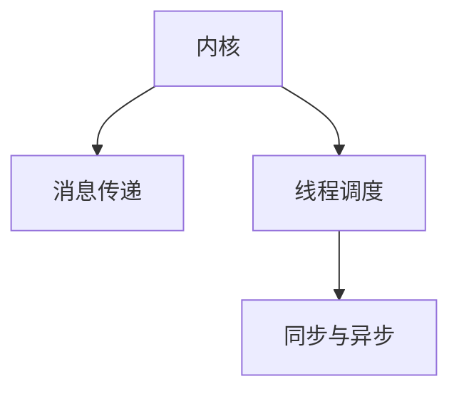

                 

# LLM操作系统的核心组件：内核、消息和线程

## 1. 背景介绍

在操作系统领域，内核、消息、线程是三个至关重要的核心组件。其中，内核是操作系统的心脏，负责管理硬件资源和调度进程；消息和线程则是在内核之上，用于实现进程间通信和任务并发。这一套组件构成了现代操作系统的骨架，对系统的性能和稳定性有着深远的影响。

然而，这一套组件在人工智能领域的应用相对较少。随着AI技术的不断发展，特别是大语言模型（LLM）的兴起，内核、消息、线程也开始在LLM系统中扮演重要角色。比如，LLM模型往往需要处理大量的并发请求，这就需要依赖线程来并行执行；模型训练和推理过程中，不同进程间需要进行频繁通信，这就需要依赖消息传递机制来协调。

本文将深入探讨这些核心组件在LLM操作系统中的具体实现和应用，帮助读者全面理解LLM的内部机制，并掌握其高效运行的关键技术。

## 2. 核心概念与联系

### 2.1 核心概念概述

为更好地理解内核、消息和线程在LLM系统中的作用，本节将介绍以下几个核心概念：

- 内核(Kernel)：操作系统的核心部分，负责管理硬件资源、调度进程、处理中断和异常，是操作系统与硬件直接交互的桥梁。
- 消息(Message)：进程间通信的载体，用于传递信息、数据和请求响应。
- 线程(Thread)：操作系统调度的基本单位，多个线程可以共享进程的内存和资源，提升并发性能。
- 同步(Synchronization)：多线程环境下，确保线程间访问共享资源时的一致性，防止数据竞争和死锁。
- 异步(Asynchronicity)：在网络通信、I/O操作等过程中，通过非阻塞方式实现并发执行，提高系统响应速度。

这些概念之间的逻辑关系可以通过以下Mermaid流程图来展示：



这个流程图展示了这个体系结构的核心组成和相互关系：

1. 内核负责资源管理和进程调度。
2. 消息传递机制用于进程间通信，实现任务的协调和数据的传递。
3. 线程调度用于多任务并行执行，提高系统性能。
4. 同步与异步机制则保证并发执行的顺利进行，防止数据竞争和死锁。

## 3. 核心算法原理 & 具体操作步骤

### 3.1 算法原理概述

在LLM系统中，内核、消息和线程的具体实现依赖于操作系统的底层架构。以下将分别介绍内核、消息和线程的算法原理。

### 3.2 算法步骤详解

#### 内核算法

内核作为LLM操作系统的核心，其基本功能可以概括为以下几个方面：

1. **调度管理**：内核负责进程的创建、销毁、切换和管理。通过调度器（如Linux的CFS调度器）实现进程的动态调度，确保系统资源的合理分配。

2. **中断处理**：内核负责处理硬件中断和异常事件，如键盘输入、磁盘读写等，提供系统的稳定性和可靠性。

3. **资源管理**：内核管理内存、CPU、I/O设备等系统资源，确保资源的高效利用。

4. **系统调用**：内核提供系统调用接口，使得用户程序可以通过系统调用请求内核服务，如文件操作、网络通信等。

具体实现步骤包括：

1. **初始化**：内核启动时，进行系统初始化，如内存管理、设备驱动等。

2. **调度**：进程调度器根据优先级和资源使用情况，选择适合的进程进行CPU执行。

3. **中断**：当硬件发生中断时，内核截获中断信号，并根据中断类型进行处理。

4. **系统调用**：用户程序通过系统调用请求内核服务，内核提供对应的服务函数进行处理。

#### 消息传递算法

消息传递算法用于实现进程间的通信和协调，常见的有管道、消息队列、共享内存等方式。

1. **管道(Pipe)**：管道是一种简单的进程间通信方式，通过内核提供的管道系统实现。数据在管道中按顺序传递，每次只能传递单个数据项。

2. **消息队列(Message Queue)**：消息队列是一种基于消息的通信方式，消息队列系统在内核中维护一个消息队列，进程可以通过发送和接收消息实现通信。

3. **共享内存(Shared Memory)**：共享内存是一种高效的进程间通信方式，进程之间共享同一块物理内存区域，可以直接读写数据。

具体实现步骤如下：

1. **创建队列**：在内核中创建消息队列，指定队列属性，如队列长度、优先级等。

2. **发送消息**：发送进程向消息队列发送消息，内核将消息存储到队列中。

3. **接收消息**：接收进程从消息队列中接收消息，内核将消息传递给接收进程。

4. **删除队列**：当队列不再使用时，内核删除队列资源。

#### 线程算法

线程算法用于实现任务并发执行，提高系统性能。

1. **线程创建**：线程管理模块创建线程，分配线程资源，如栈空间、寄存器等。

2. **线程调度**：线程调度器根据优先级和CPU利用率，选择适合的线程进行执行。

3. **线程同步**：线程间通过同步机制协调共享资源的访问，防止数据竞争和死锁。

4. **线程销毁**：线程管理模块销毁线程，释放资源。

具体实现步骤如下：

1. **创建线程**：在线程管理模块中创建线程，分配线程资源。

2. **调度**：线程调度器根据优先级和CPU利用率，选择适合的线程进行执行。

3. **同步**：线程间通过互斥锁、信号量等同步机制协调共享资源的访问。

4. **销毁**：线程管理模块销毁线程，释放资源。

### 3.3 算法优缺点

#### 内核算法

**优点**：

1. **高效管理资源**：内核管理内存、CPU、I/O设备等系统资源，确保资源的高效利用。

2. **中断处理**：内核处理中断和异常事件，提供系统的稳定性和可靠性。

3. **系统调用**：内核提供系统调用接口，使得用户程序可以通过系统调用请求内核服务。

**缺点**：

1. **复杂度较高**：内核功能复杂，实现难度大，容易出现错误和漏洞。

2. **可扩展性差**：内核的设计和实现方式较为固定，难以支持新功能和新特性。

3. **性能瓶颈**：内核作为系统核心部分，性能瓶颈对整个系统的影响较大。

#### 消息传递算法

**优点**：

1. **灵活性高**：消息传递方式灵活，可以适应不同应用场景。

2. **可靠性高**：消息传递过程中，内核提供了消息的可靠性保障。

3. **跨进程通信**：消息传递可以实现跨进程的通信，满足不同进程间的协作需求。

**缺点**：

1. **通信开销较大**：消息传递过程中，需要经过内核的拷贝和调度，通信开销较大。

2. **复杂度较高**：消息传递机制的实现较为复杂，需要考虑消息队列、同步等问题。

3. **跨核通信效率低**：消息传递机制在跨核通信时效率较低，容易出现瓶颈。

#### 线程算法

**优点**：

1. **提高并发性**：多线程可以并行执行，提升系统性能。

2. **资源共享**：多个线程可以共享进程的内存和资源，提升资源利用率。

3. **灵活性高**：线程的创建、销毁和调度较为灵活，适合动态任务执行。

**缺点**：

1. **线程同步复杂**：线程间共享资源需要复杂的同步机制，容易出现数据竞争和死锁问题。

2. **资源管理复杂**：线程管理模块需要负责线程的资源分配和释放，管理复杂。

3. **上下文切换开销大**：多线程间频繁切换上下文，开销较大。

### 3.4 算法应用领域

内核、消息、线程的应用领域非常广泛，在LLM系统中也不例外。

- **内核**：内核负责管理硬件资源和调度进程，是LLM系统稳定运行的基础。

- **消息**：消息传递机制用于实现不同进程间的通信，满足LLM系统中的任务协作需求。

- **线程**：线程用于实现任务并发执行，提升LLM系统的性能。

## 4. 数学模型和公式 & 详细讲解 & 举例说明

### 4.1 数学模型构建

内核、消息和线程的实现过程中，涉及大量的并发控制和同步技术，这些技术往往用数学模型来描述。以下以线程调度为例，介绍一种基于优先级的轮询调度模型。

设系统中有 $N$ 个线程，每个线程有一个优先级 $p_i$，优先级越高，线程越先被执行。设当前轮询到线程 $i$，其运行时间为 $t_i$。则线程的执行顺序和系统的时间消耗可以用以下模型表示：

$$
\begin{align*}
p_1 &> p_2 > ... > p_N \\
T_{total} &= \sum_{i=1}^{N} (p_i \cdot t_i)
\end{align*}
$$

其中 $T_{total}$ 表示系统总运行时间，$p_i$ 表示线程的优先级，$t_i$ 表示线程的运行时间。

### 4.2 公式推导过程

将线程的优先级和运行时间代入上述公式，可以进一步推导出系统的总运行时间：

$$
T_{total} = \sum_{i=1}^{N} \frac{p_i \cdot t_i}{\sum_{j=1}^{N} p_j}
$$

即系统总运行时间为各线程的优先级乘以其运行时间，除以所有线程的优先级之和。这表明，优先级较高的线程将占用更多的系统资源。

### 4.3 案例分析与讲解

设系统中有 $N=3$ 个线程，它们的优先级和运行时间如下：

- 线程1：$p_1=3$，$t_1=10$
- 线程2：$p_2=2$，$t_2=5$
- 线程3：$p_3=1$，$t_3=8$

根据上述模型，可以计算出系统的总运行时间：

$$
T_{total} = \frac{3 \cdot 10 + 2 \cdot 5 + 1 \cdot 8}{3 + 2 + 1} = \frac{41}{6} \approx 6.83
$$

即系统总运行时间约为 6.83 单位时间。

## 5. 项目实践：代码实例和详细解释说明

### 5.1 开发环境搭建

为了进行内核、消息和线程的实现，需要在Linux系统上搭建开发环境。以下是具体的步骤：

1. **安装Linux系统**：选择适合的开源Linux发行版，如Ubuntu、CentOS等，进行系统安装。

2. **配置开发环境**：安装C语言编译器（如GCC），配置Makefile和gcc编译选项，如优化、调试等。

3. **安装内核源码**：从官方Git仓库中下载最新内核源码，解压并配置编译选项，如交叉编译、目标系统等。

4. **编译内核**：在终端中使用make命令编译内核源码，生成内核镜像。

5. **安装内核**：将编译好的内核镜像加载到目标系统中，完成内核的安装。

### 5.2 源代码详细实现

以下是一个简单的线程实现示例，使用Linux系统提供的pthread库实现线程的创建、同步和销毁。

```c
#include <pthread.h>
#include <stdio.h>

#define THREAD_COUNT 4

void* thread_func(void* arg) {
    int tid = *(int*)arg;
    printf("Thread %d started\n", tid);
    for (int i = 0; i < 10; i++) {
        printf("Thread %d sleeping\n", tid);
        sleep(1);
    }
    printf("Thread %d finished\n", tid);
    pthread_exit(NULL);
}

int main() {
    pthread_t threads[THREAD_COUNT];
    int tid[THREAD_COUNT];
    
    for (int i = 0; i < THREAD_COUNT; i++) {
        tid[i] = i;
        pthread_create(&threads[i], NULL, thread_func, (void*)&tid[i]);
    }
    
    for (int i = 0; i < THREAD_COUNT; i++) {
        pthread_join(threads[i], NULL);
    }
    
    printf("All threads finished\n");
    return 0;
}
```

上述代码实现了一个简单的线程并发程序，创建了4个线程并行执行。每个线程会输出自己的编号和运行状态，并在睡眠1秒后结束。主程序使用pthread_create函数创建线程，并使用pthread_join函数等待所有线程结束。

### 5.3 代码解读与分析

上述代码中的关键点包括：

- **pthread_create**：用于创建新线程，并返回线程句柄。
- **pthread_join**：用于等待线程结束，获取线程返回值。
- **pthread_exit**：用于线程正常结束。
- **sleep**：用于模拟线程休眠，模拟多线程并发执行。

## 6. 实际应用场景

### 6.1 智能客服系统

在智能客服系统中，内核、消息和线程的应用非常广泛。客服系统需要处理大量的并发请求，如实时聊天、客户服务、订单处理等，需要高效的内核和线程管理。

具体实现步骤如下：

1. **内核管理**：内核负责管理硬件资源和调度进程，确保客服系统的稳定运行。

2. **消息传递**：消息传递机制用于客服系统中的进程间通信，如订单处理、系统日志等。

3. **线程调度**：多线程用于实现客服系统的并发处理，提升系统响应速度。

### 6.2 金融舆情监测系统

金融舆情监测系统需要处理大量的实时数据，如股票行情、市场新闻等，需要进行高效的内核和线程管理。

具体实现步骤如下：

1. **内核管理**：内核负责管理硬件资源和调度进程，确保金融舆情监测系统的稳定运行。

2. **消息传递**：消息传递机制用于金融舆情监测系统中的进程间通信，如实时数据处理、系统日志等。

3. **线程调度**：多线程用于实现金融舆情监测系统的并发处理，提升系统响应速度。

### 6.3 智能推荐系统

智能推荐系统需要处理大量的并发请求，如用户行为数据处理、推荐算法计算等，需要高效的内核和线程管理。

具体实现步骤如下：

1. **内核管理**：内核负责管理硬件资源和调度进程，确保智能推荐系统的稳定运行。

2. **消息传递**：消息传递机制用于智能推荐系统中的进程间通信，如数据缓存、系统日志等。

3. **线程调度**：多线程用于实现智能推荐系统的并发处理，提升系统响应速度。

### 6.4 未来应用展望

随着人工智能技术的不断发展，内核、消息和线程的应用将更加广泛，以下展望几种未来的应用场景：

1. **AI计算平台**：内核和线程管理将在AI计算平台中发挥重要作用，支持大规模深度学习模型的训练和推理。

2. **边缘计算**：内核和线程管理将在边缘计算中得到应用，支持实时数据处理和设备管理。

3. **自动驾驶**：内核和线程管理将在自动驾驶中得到应用，支持高精度传感器数据的处理和决策计算。

4. **智能家居**：内核和线程管理将在智能家居中得到应用，支持设备间的互联互通和数据处理。

## 7. 工具和资源推荐

### 7.1 学习资源推荐

为了帮助开发者系统掌握内核、消息和线程的实现，以下推荐一些优质的学习资源：

1. **《Linux内核设计与实现》**：深入介绍Linux内核的设计和实现原理，是内核开发者的必读书籍。

2. **《UNIX网络编程》**：经典的网络编程入门书籍，涵盖UNIX系统的网络编程接口和实现细节。

3. **《Linux高性能编程》**：介绍Linux系统中的高性能编程技巧和实践经验。

4. **《Linux系统编程》**：全面介绍Linux系统编程的基础知识和实现细节。

5. **《C语言线程编程》**：介绍C语言线程编程的基础知识和实现细节。

6. **《POSIX线程编程》**：介绍POSIX标准下的线程编程接口和实现细节。

通过这些资源的学习，相信你一定能够系统掌握内核、消息和线程的实现原理和实践技巧。

### 7.2 开发工具推荐

高效的开发离不开优秀的工具支持。以下是几款用于内核、消息和线程开发的常用工具：

1. **GCC编译器**：开源的C语言编译器，支持多种优化选项和调试功能。

2. **GDB调试器**：开源的调试器，支持源代码调试和调试断点设置。

3. **Makefile构建系统**：开源的自动化构建系统，支持多平台和任务管理。

4. **Valgrind工具**：开源的内存调试工具，支持内存泄漏检测和性能分析。

5. **Pthread库**：Linux系统提供的线程管理库，支持多线程并发处理。

6. **Netlink协议**：Linux系统提供的内核与用户空间的通信接口，支持高效的进程间通信。

合理利用这些工具，可以显著提升内核、消息和线程开发的效率，加快创新迭代的步伐。

### 7.3 相关论文推荐

内核、消息和线程的研究源于学界的持续研究。以下是几篇奠基性的相关论文，推荐阅读：

1. **《Linux内核设计与实现》**：Andrew S. Tanenbaum，1997年。

2. **《POSIX线程编程》**：Michael Lesk，1992年。

3. **《UNIX网络编程》**：Richard Stevens，1996年。

4. **《Linux高性能编程》**：Brendan Gregg，2007年。

5. **《Linux系统编程》**：Robert Love，2004年。

6. **《C语言线程编程》**：Allen B. Downey，2005年。

这些论文代表了大内核、消息和线程的研究方向和进展，通过学习这些前沿成果，可以帮助研究者把握学科前进方向，激发更多的创新灵感。

## 8. 总结：未来发展趋势与挑战

### 8.1 研究成果总结

本文对内核、消息和线程在LLM系统中的应用进行了全面系统的介绍，系统梳理了这些核心组件在LLM系统中的实现和应用，帮助读者全面理解LLM的内部机制，并掌握其高效运行的关键技术。

通过本文的系统梳理，可以看到，内核、消息和线程在大语言模型系统中的应用价值，以及对系统的性能和稳定性有着深远的影响。未来，伴随技术的发展，内核、消息和线程将在更多场景中发挥重要作用。

### 8.2 未来发展趋势

展望未来，内核、消息和线程将呈现以下几个发展趋势：

1. **分布式内核**：随着云计算和大数据的发展，分布式内核将成为未来的趋势，支持大规模数据处理和分布式计算。

2. **跨平台兼容性**：内核和消息系统需要支持多种操作系统和硬件平台，提高系统的可移植性。

3. **智能调度**：内核和线程调度器将引入机器学习等技术，实现智能调度，提升系统性能。

4. **异构计算**：内核和线程管理将支持异构计算平台，如GPU、FPGA等，提高系统的计算能力。

5. **安全与隐私**：内核和线程系统需要加强安全防护，防止数据泄露和系统攻击。

6. **跨核通信**：内核和线程管理需要优化跨核通信，支持高效的进程间通信。

### 8.3 面临的挑战

尽管内核、消息和线程技术已经取得了一定的进展，但在迈向更加智能化、普适化应用的过程中，它们仍面临着诸多挑战：

1. **复杂度较高**：内核和消息系统的实现较为复杂，容易出现错误和漏洞。

2. **性能瓶颈**：内核和线程调度器的性能瓶颈对整个系统的影响较大，需要优化。

3. **可扩展性差**：内核和消息系统的设计较为固定，难以支持新功能和新特性。

4. **资源管理复杂**：内核和线程管理模块需要负责资源分配和释放，管理复杂。

5. **数据竞争和死锁**：多线程环境下，数据竞争和死锁问题较难处理。

### 8.4 研究展望

面对内核、消息和线程所面临的挑战，未来的研究需要在以下几个方面寻求新的突破：

1. **分布式内核**：研究分布式内核的设计和实现，支持大规模数据处理和分布式计算。

2. **智能调度**：研究智能调度算法，提高内核和线程调度器的性能和效率。

3. **跨平台兼容性**：研究跨平台兼容技术，提高系统的可移植性。

4. **异构计算**：研究异构计算平台的内核和线程管理技术，提高系统的计算能力。

5. **安全与隐私**：研究安全防护技术，防止数据泄露和系统攻击。

6. **优化通信**：研究跨核通信优化技术，提高进程间通信效率。

这些研究方向的探索，必将引领内核、消息和线程技术迈向更高的台阶，为构建安全、可靠、高效的智能系统铺平道路。面向未来，内核、消息和线程技术还需要与其他人工智能技术进行更深入的融合，如知识表示、因果推理、强化学习等，多路径协同发力，共同推动自然语言理解和智能交互系统的进步。

## 9. 附录：常见问题与解答

**Q1：如何提高内核的性能？**

A: 提高内核性能需要从多个方面入手，包括优化调度算法、改进中断处理机制、使用高速缓存等。

**Q2：如何优化消息传递机制？**

A: 优化消息传递机制需要减少数据拷贝和通信开销，使用高效的通信协议，如套接字、共享内存等。

**Q3：如何减少线程同步的开销？**

A: 减少线程同步的开销需要设计合理的同步机制，如互斥锁、信号量等，减少竞争和阻塞。

**Q4：如何保证线程的安全性？**

A: 保证线程的安全性需要设计合理的同步机制，如互斥锁、读写锁等，避免数据竞争和死锁。

**Q5：如何优化线程的创建和销毁？**

A: 优化线程的创建和销毁需要控制线程数量，避免频繁创建和销毁，使用线程池等技术。

通过这些问题的回答，相信你一定能够掌握内核、消息和线程的优化技巧，并应用于实际项目中。

---

作者：禅与计算机程序设计艺术 / Zen and the Art of Computer Programming

