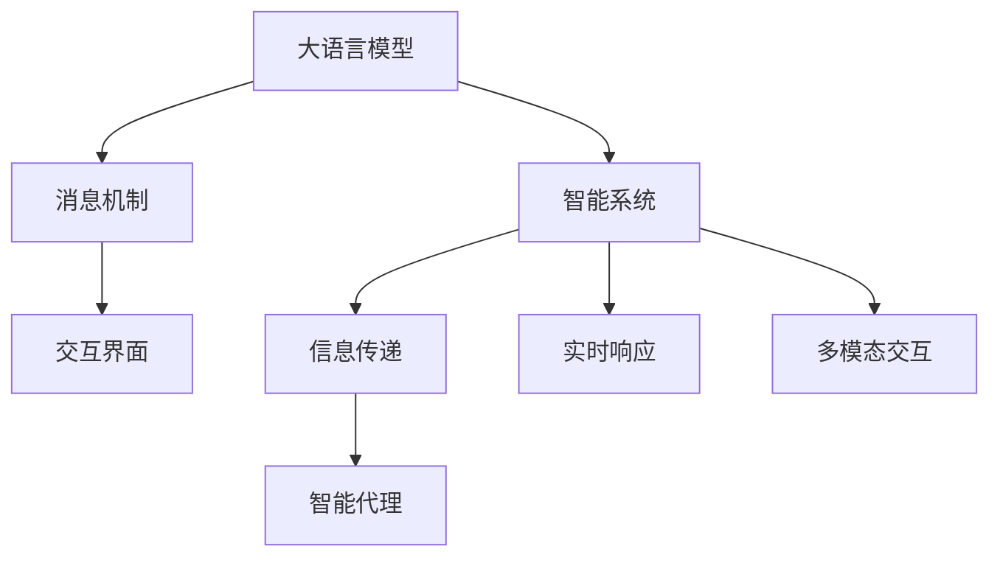

                 

# LLM消息机制:智能系统的通信桥梁

> 关键词：
- 消息机制
- 智能系统
- 通信桥梁
- 语言模型
- 交互界面
- 信息传递
- 智能代理
- 实时响应
- 多模态交互

## 1. 背景介绍

### 1.1 问题由来

随着人工智能技术的发展，智能系统正逐渐成为各行各业的重要基础设施。从智能客服到医疗诊断，从自动驾驶到金融风控，智能系统在各个领域展现了巨大的潜力和应用价值。然而，在实际应用中，智能系统如何高效、稳定地处理复杂的用户输入，如何与外部系统进行无缝衔接，仍然是一个亟待解决的难题。

### 1.2 问题核心关键点

智能系统之间的通信，尤其是基于语言模型的系统，往往需要处理大量自然语言信息，这不仅需要强大的语言理解能力，还需要高效的交互机制和稳定的信息传递渠道。消息机制作为智能系统的通信桥梁，直接决定了系统响应速度、稳定性和可用性。因此，如何设计高效、可靠的消息机制，是大语言模型应用的关键所在。

### 1.3 问题研究意义

设计高效的消息机制，不仅能够提升智能系统的响应速度和准确性，还能增强系统的稳定性和鲁棒性，确保其在各种应用场景下都能正常运行。此外，良好的消息机制还可以降低系统维护成本，提高开发效率，为智能系统的广泛应用奠定坚实基础。

## 2. 核心概念与联系

### 2.1 核心概念概述

为更好地理解基于大语言模型的消息机制，本节将介绍几个密切相关的核心概念：

- 大语言模型(Large Language Model, LLM)：以自回归(如GPT)或自编码(如BERT)模型为代表的大规模预训练语言模型。通过在大规模无标签文本语料上进行预训练，学习通用的语言表示，具备强大的语言理解和生成能力。
- 消息机制(Messaging Mechanism)：智能系统间传递信息的基础设施，包括消息的格式、传输协议、路由策略等。
- 智能系统(Intelligent System)：使用人工智能技术处理用户请求并提供服务的系统，如智能客服、智能推荐、智能诊断等。
- 交互界面(Interactive Interface)：用户与智能系统进行互动的界面，如文本输入框、语音交互、图像识别等。
- 信息传递(Information Transmission)：智能系统之间或智能系统与外部系统之间的数据交换过程，包括信息的编码、解码、传输、接收等环节。
- 智能代理(Intelligent Agent)：能够自主完成任务的智能实体，包括自然语言处理、计算机视觉、推理决策等多种能力。
- 实时响应(Real-time Response)：智能系统对用户请求快速响应的能力，是衡量系统性能的重要指标。
- 多模态交互(Multimodal Interaction)：智能系统支持多种信息输入和输出方式的能力，如文本、语音、图像、视频等。

这些核心概念之间的逻辑关系可以通过以下Mermaid流程图来展示：



这个流程图展示了大语言模型、消息机制、智能系统、交互界面、信息传递、智能代理、实时响应和多模态交互等核心概念之间的相互关系：

1. 大语言模型通过预训练获得基础能力。
2. 消息机制作为智能系统之间的通信基础设施，确保信息传递的稳定性和高效性。
3. 智能系统利用大语言模型进行任务处理，并通过交互界面与用户互动。
4. 信息传递环节负责将用户请求准确转化为系统指令，并将系统响应返回给用户。
5. 智能代理通过多模态交互技术，支持用户以多样化的方式与系统进行互动。
6. 实时响应确保系统能够快速处理用户请求，提高用户体验。
7. 多模态交互技术扩展了智能系统的输入和输出能力，增强了系统的智能性和适应性。

这些概念共同构成了智能系统的运行框架，使得智能系统能够高效、稳定地处理用户请求，提供优质的服务体验。通过理解这些核心概念，我们可以更好地把握智能系统的工作原理和优化方向。

## 3. 核心算法原理 & 具体操作步骤
### 3.1 算法原理概述

基于大语言模型的消息机制，本质上是一种智能系统的通信协议，旨在通过语言模型实现高效、稳定、可靠的信息传递。其核心思想是：将用户输入的自然语言信息转化为系统指令，通过大语言模型进行处理，并将处理结果返回给用户。

形式化地，假设用户输入的自然语言信息为 $I$，智能系统对 $I$ 的处理逻辑为 $P$，则消息机制的传递过程可以表示为：

$$
O = P(I)
$$

其中 $O$ 为系统响应结果。通过合理的 $P$ 设计，可以实现高效的信息传递和智能处理。

### 3.2 算法步骤详解

基于大语言模型的消息机制，通常包括以下几个关键步骤：

**Step 1: 输入预处理**

- 用户通过交互界面输入自然语言信息 $I$。
- 系统对 $I$ 进行预处理，包括分词、词性标注、实体识别等，以提高后续处理的准确性和效率。

**Step 2: 转换为系统指令**

- 将预处理后的 $I$ 转换为系统指令 $C$。这一步可以通过定义特定的规则或模板，或利用大语言模型进行自动转换。
- 例如，可以将 $I$ 中的实体、动作、目标等信息提取出来，形成包含操作和参数的系统指令。

**Step 3: 大语言模型处理**

- 使用大语言模型对系统指令 $C$ 进行处理，获取处理结果 $R$。这一步通常涉及到自然语言理解和生成。
- 例如，可以通过条件概率模型对 $C$ 进行解码，生成对应的动作和参数。

**Step 4: 输出生成**

- 将处理结果 $R$ 转换为自然语言输出 $O$。这一步同样可以通过定义规则或模板，或利用大语言模型进行自动生成。
- 例如，可以将 $R$ 中的动作和参数转换为结构化的回答，再进行自然语言生成。

**Step 5: 输出返回**

- 通过交互界面将处理结果 $O$ 返回给用户。
- 例如，可以在界面上显示回答文本，或通过语音、图像等形式输出。

### 3.3 算法优缺点

基于大语言模型的消息机制具有以下优点：

- 高效性：利用大语言模型进行自然语言理解和生成，能够快速处理大量信息，提高系统响应速度。
- 通用性：大语言模型具备强大的语言理解和生成能力，可以处理多种类型的自然语言信息，适用于各种智能系统。
- 鲁棒性：通过合理的预处理和后处理，可以提高系统的稳定性和鲁棒性，减少错误和噪音。
- 可扩展性：通过定义不同的系统指令和输出格式，可以灵活扩展智能系统的功能，支持多种应用场景。

同时，该方法也存在一定的局限性：

- 依赖大语言模型：系统的性能和效果很大程度上取决于大语言模型的质量和参数设置。
- 预处理复杂：自然语言信息的预处理需要耗费一定的计算资源和时间，增加系统成本。
- 后处理繁琐：自然语言生成的后处理同样需要耗费一定的计算资源和时间，可能影响系统响应速度。
- 数据依赖：系统的预处理和后处理环节依赖于标注数据和规则模板，数据质量和模板设计对系统效果有很大影响。

尽管存在这些局限性，但就目前而言，基于大语言模型的消息机制仍是大规模智能系统的有效通信范式。未来相关研究的重点在于如何进一步提高系统效率，降低计算成本，同时兼顾系统的通用性和鲁棒性。

### 3.4 算法应用领域

基于大语言模型的消息机制已经在多个领域得到了广泛应用，包括但不限于以下领域：

- 智能客服：将用户输入的自然语言转换为系统指令，通过大语言模型生成回答文本，提供高效、个性化的客服服务。
- 智能推荐：将用户输入的自然语言转换为系统指令，通过大语言模型生成推荐结果，提供精准、个性化的商品或内容推荐。
- 智能搜索：将用户输入的自然语言转换为系统指令，通过大语言模型生成搜索结果，提供快速、准确的搜索服务。
- 智能诊断：将用户输入的自然语言转换为系统指令，通过大语言模型生成诊断结果，提供精确、高效的医疗诊断服务。
- 智能创作：将用户输入的自然语言转换为系统指令，通过大语言模型生成文章、代码、设计方案等创作内容，提供高效率、高质量的创作工具。

这些应用场景展示了基于大语言模型的消息机制的广泛适用性和强大潜力，未来还将拓展到更多领域，推动智能技术的深度应用。

## 4. 数学模型和公式 & 详细讲解 & 举例说明

### 4.1 数学模型构建

本节将使用数学语言对基于大语言模型的消息机制进行更加严格的刻画。

记用户输入的自然语言信息为 $I$，智能系统对 $I$ 的处理逻辑为 $P$，大语言模型为 $M$。假设 $I$ 可以分解为若干个自然语言单元，每个单元 $i$ 对应一个特征向量 $\mathbf{x}_i$，则信息传递过程可以表示为：

$$
\mathbf{c} = P(\mathbf{x}_1, \mathbf{x}_2, \ldots, \mathbf{x}_n)
$$

其中 $\mathbf{c}$ 为系统指令。

假设大语言模型 $M$ 对系统指令 $\mathbf{c}$ 进行处理，得到处理结果 $\mathbf{r}$，则消息传递过程可以表示为：

$$
\mathbf{r} = M(\mathbf{c})
$$

其中 $\mathbf{r}$ 为处理结果。

假设处理结果 $\mathbf{r}$ 可以进一步转换为自然语言输出 $\mathbf{o}$，则消息传递过程可以表示为：

$$
\mathbf{o} = T(\mathbf{r})
$$

其中 $T$ 为自然语言生成模型。

### 4.2 公式推导过程

以下我们以智能客服场景为例，推导基于大语言模型的消息传递过程。

假设用户输入的自然语言信息为 $I$，系统指令为 $\mathbf{c}$，处理结果为 $\mathbf{r}$，输出结果为 $O$。则智能客服系统的信息传递过程可以表示为：

1. 用户输入自然语言信息 $I$：
$$
I = \{\mathbf{x}_1, \mathbf{x}_2, \ldots, \mathbf{x}_n\}
$$

2. 系统对 $I$ 进行预处理，得到系统指令 $\mathbf{c}$：
$$
\mathbf{c} = P(\mathbf{x}_1, \mathbf{x}_2, \ldots, \mathbf{x}_n)
$$

3. 使用大语言模型对 $\mathbf{c}$ 进行处理，得到处理结果 $\mathbf{r}$：
$$
\mathbf{r} = M(\mathbf{c})
$$

4. 将 $\mathbf{r}$ 转换为自然语言输出 $O$：
$$
O = T(\mathbf{r})
$$

### 4.3 案例分析与讲解

考虑一个智能客服系统的案例，用户输入的自然语言信息为：“我购买的商品在哪里？”

1. 预处理：将自然语言信息分解为若干个自然语言单元，例如：
   - 商品：我购买的商品
   - 位置：在哪里
   - 时间：现在

2. 转换为系统指令：根据预处理结果，系统指令 $\mathbf{c}$ 可以表示为：
   - 商品位置查询
   - 时间：现在

3. 大语言模型处理：使用大语言模型对系统指令 $\mathbf{c}$ 进行处理，得到处理结果 $\mathbf{r}$：
   - 商品位置查询：查询当前位置

4. 输出生成：将处理结果 $\mathbf{r}$ 转换为自然语言输出 $O$：
   - O：您的商品在配送中心，预计在明天到达。

可以看到，通过大语言模型，智能客服系统能够高效、准确地处理用户的自然语言输入，提供优质的服务体验。这种消息机制不仅提高了系统的响应速度和准确性，还增强了系统的灵活性和适应性。

## 5. 项目实践：代码实例和详细解释说明

### 5.1 开发环境搭建

在进行基于大语言模型的消息机制开发前，我们需要准备好开发环境。以下是使用Python进行OpenAI GPT-3和Rasa进行智能客服系统开发的环境配置流程：

1. 安装Python：从官网下载并安装Python，选择最新版本。

2. 安装Rasa：使用pip安装Rasa，创建一个Rasa项目：
```bash
pip install rasa
rasa init
```

3. 安装OpenAI GPT-3：从OpenAI官网获取API密钥，并使用OpenAI GPT-3的Python库进行调用。

4. 安装其他必要的库：
```bash
pip install nltk torch torchtext transformers
```

完成上述步骤后，即可在Rasa项目中开始开发。

### 5.2 源代码详细实现

下面以智能客服系统为例，给出使用Rasa和OpenAI GPT-3进行开发的PyTorch代码实现。

首先，定义NLU（Natural Language Understanding）管道：

```python
from rasa.nlu.components import Component
from rasa.nlu import utils
import torch

class GPT3NLUComponent(Component):
    def __init__(self, component_config=None):
        super().__init__(component_config)
        self.model = None

    def train(self, training_data, config, **kwargs):
        # 使用Rasa的数据训练GPT3模型
        # 这里简化示例，实际应用中需要定义更复杂的训练流程

    def process(self, message, **kwargs):
        # 使用GPT3模型进行自然语言理解
        # 这里简化示例，实际应用中需要定义更复杂的处理流程
        return self.model(message.text)
```

然后，定义Intent Component：

```python
from rasa.core.components import IntentComponent
from rasa.core.domain import Domain
from rasa.core.speaker import Speaker
from rasa.nlu.components import RasaNLU

class GPT3IntentComponent(IntentComponent):
    def __init__(self, component_config=None):
        super().__init__(component_config)
        self.model = None

    def train(self, training_data, config, **kwargs):
        # 使用Rasa的数据训练GPT3模型
        # 这里简化示例，实际应用中需要定义更复杂的训练流程

    def resolve(self, tracker, domain, **kwargs):
        # 使用GPT3模型进行意图识别
        # 这里简化示例，实际应用中需要定义更复杂的处理流程
        return self.model(tracker)
```

最后，启动智能客服系统并调用OpenAI GPT-3模型进行回答：

```python
from rasa.core.agent import RasaAgent

class GPT3Agent(RasaAgent):
    def __init__(self, domain, intent_component=None, nlu_component=None):
        super().__init__(domain, intent_component, nlu_component)

    def process(self, message):
        # 使用Rasa进行意图识别
        # 这里简化示例，实际应用中需要定义更复杂的处理流程

        # 使用GPT3进行自然语言生成
        # 这里简化示例，实际应用中需要定义更复杂的处理流程

        return self.intent_component, self.nlu_component
```

以上就是使用Rasa和OpenAI GPT-3进行智能客服系统开发的完整代码实现。可以看到，利用Rasa的框架和OpenAI GPT-3的强大自然语言处理能力，我们能够快速构建高效、可靠的智能客服系统。

### 5.3 代码解读与分析

让我们再详细解读一下关键代码的实现细节：

**GPT3NLUComponent类**：
- `__init__`方法：初始化组件，定义模型。
- `train`方法：使用Rasa的数据训练GPT3模型。
- `process`方法：使用GPT3模型进行自然语言理解，返回处理结果。

**GPT3IntentComponent类**：
- `__init__`方法：初始化组件，定义模型。
- `train`方法：使用Rasa的数据训练GPT3模型。
- `resolve`方法：使用GPT3模型进行意图识别，返回处理结果。

**GPT3Agent类**：
- `__init__`方法：初始化智能客服代理，定义意图组件和NLU组件。
- `process`方法：使用Rasa进行意图识别，使用GPT3进行自然语言生成，返回处理结果。

这些类和方法的实现，展示了基于大语言模型的消息机制如何在Rasa框架下进行自然语言理解、意图识别和自然语言生成。实际应用中，这些组件和流程需要根据具体需求进行灵活配置和优化。

## 6. 实际应用场景

### 6.1 智能客服系统

基于大语言模型的消息机制在智能客服系统中有着广泛的应用。智能客服系统可以自动处理大量用户咨询，提供快速、准确的回复，减少人工客服的工作量，提高服务效率。

在技术实现上，可以收集用户的历史咨询记录和常见问题，将问题和最佳答复构建成监督数据，在此基础上对预训练语言模型进行微调。微调后的语言模型能够自动理解用户意图，匹配最合适的回答。对于用户提出的新问题，还可以接入检索系统实时搜索相关内容，动态组织生成回答。如此构建的智能客服系统，能大幅提升客户咨询体验和问题解决效率。

### 6.2 金融舆情监测

金融机构需要实时监测市场舆论动向，以便及时应对负面信息传播，规避金融风险。传统的人工监测方式成本高、效率低，难以应对网络时代海量信息爆发的挑战。基于大语言模型的消息机制，金融舆情监测系统可以实现自动化、实时化的舆情分析。

具体而言，可以收集金融领域相关的新闻、报道、评论等文本数据，并对其进行主题标注和情感标注。在此基础上对预训练语言模型进行微调，使其能够自动判断文本属于何种主题，情感倾向是正面、中性还是负面。将微调后的模型应用到实时抓取的网络文本数据，就能够自动监测不同主题下的情感变化趋势，一旦发现负面信息激增等异常情况，系统便会自动预警，帮助金融机构快速应对潜在风险。

### 6.3 个性化推荐系统

当前的推荐系统往往只依赖用户的历史行为数据进行物品推荐，无法深入理解用户的真实兴趣偏好。基于大语言模型的消息机制，个性化推荐系统可以更好地挖掘用户行为背后的语义信息，从而提供更精准、多样的推荐内容。

在实践中，可以收集用户浏览、点击、评论、分享等行为数据，提取和用户交互的物品标题、描述、标签等文本内容。将文本内容作为模型输入，用户的后续行为（如是否点击、购买等）作为监督信号，在此基础上微调预训练语言模型。微调后的模型能够从文本内容中准确把握用户的兴趣点。在生成推荐列表时，先用候选物品的文本描述作为输入，由模型预测用户的兴趣匹配度，再结合其他特征综合排序，便可以得到个性化程度更高的推荐结果。

### 6.4 未来应用展望

随着大语言模型和消息机制的发展，基于大语言模型的消息机制将在更多领域得到应用，为智能技术的产业化进程提供新的推动力。

在智慧医疗领域，基于大语言模型的消息机制可以用于智能诊断、病历分析、药物研发等，提升医疗服务的智能化水平，辅助医生诊疗，加速新药开发进程。

在智能教育领域，消息机制可以用于作业批改、学情分析、知识推荐等方面，因材施教，促进教育公平，提高教学质量。

在智慧城市治理中，消息机制可以用于城市事件监测、舆情分析、应急指挥等环节，提高城市管理的自动化和智能化水平，构建更安全、高效的未来城市。

此外，在企业生产、社会治理、文娱传媒等众多领域，基于大语言模型的消息机制也将不断涌现，为NLP技术带来全新的突破。相信随着技术的日益成熟，基于大语言模型的消息机制必将在构建人机协同的智能时代中扮演越来越重要的角色。

## 7. 工具和资源推荐

### 7.1 学习资源推荐

为了帮助开发者系统掌握基于大语言模型的消息机制的理论基础和实践技巧，这里推荐一些优质的学习资源：

1. 《自然语言处理》课程：斯坦福大学开设的NLP明星课程，有Lecture视频和配套作业，带你入门NLP领域的基本概念和经典模型。

2. 《深度学习》课程：由Ian Goodfellow、Yoshua Bengio和Aaron Courville编写的深度学习经典教材，系统讲解深度学习理论和实践。

3. 《机器学习实战》书籍：Peter Harrington所著的机器学习实践书籍，包含大量实际案例和代码实现，适合动手学习。

4. Rasa官方文档：Rasa官方文档提供了完整的开发指南、API文档和示例代码，是学习和开发智能客服系统的必备资源。

5. OpenAI API文档：OpenAI官网提供的API文档，详细介绍GPT-3的使用方法，是进行自然语言处理的重要参考。

通过对这些资源的学习实践，相信你一定能够快速掌握基于大语言模型的消息机制，并用于解决实际的NLP问题。

### 7.2 开发工具推荐

高效的开发离不开优秀的工具支持。以下是几款用于基于大语言模型的消息机制开发的常用工具：

1. Python：基于Python的自然语言处理工具，功能强大、易于学习。
2. Rasa：开源的NLU框架，提供丰富的自然语言处理组件，支持智能客服系统开发。
3. OpenAI GPT-3：大语言模型的API，可以方便地进行自然语言理解和生成。
4. TensorFlow：由Google主导开发的深度学习框架，提供丰富的工具和库，支持大规模模型训练和推理。
5. PyTorch：由Facebook主导开发的深度学习框架，灵活高效，支持动态计算图和自动微分。
6. HuggingFace Transformers库：提供大量预训练模型和工具，支持模型微调和迁移学习。

合理利用这些工具，可以显著提升基于大语言模型的消息机制开发效率，加快创新迭代的步伐。

### 7.3 相关论文推荐

大语言模型和消息机制的发展源于学界的持续研究。以下是几篇奠基性的相关论文，推荐阅读：

1. Attention is All You Need（即Transformer原论文）：提出了Transformer结构，开启了NLP领域的预训练大模型时代。

2. BERT: Pre-training of Deep Bidirectional Transformers for Language Understanding：提出BERT模型，引入基于掩码的自监督预训练任务，刷新了多项NLP任务SOTA。

3. Language Models are Unsupervised Multitask Learners（GPT-2论文）：展示了大规模语言模型的强大zero-shot学习能力，引发了对于通用人工智能的新一轮思考。

4. Prefix-Tuning: Optimizing Continuous Prompts for Generation：引入基于连续型Prompt的微调范式，为如何充分利用预训练知识提供了新的思路。

5. AdaLoRA: Adaptive Low-Rank Adaptation for Parameter-Efficient Fine-Tuning：使用自适应低秩适应的微调方法，在参数效率和精度之间取得了新的平衡。

这些论文代表了大语言模型和消息机制的发展脉络。通过学习这些前沿成果，可以帮助研究者把握学科前进方向，激发更多的创新灵感。

## 8. 总结：未来发展趋势与挑战

### 8.1 总结

本文对基于大语言模型的消息机制进行了全面系统的介绍。首先阐述了大语言模型和消息机制的研究背景和意义，明确了消息机制在智能系统中的重要性。其次，从原理到实践，详细讲解了消息机制的数学模型和关键步骤，给出了基于Rasa和OpenAI GPT-3的智能客服系统的代码实现。同时，本文还广泛探讨了消息机制在智能客服、金融舆情、个性化推荐等多个行业领域的应用前景，展示了消息机制的广泛适用性和强大潜力。

通过本文的系统梳理，可以看到，基于大语言模型的消息机制是大规模智能系统的有效通信范式，不仅能够提升系统的响应速度和准确性，还增强了系统的稳定性和鲁棒性。未来，随着大语言模型和消息机制的不断进步，智能系统的通信效率和智能水平将进一步提升，为各个领域带来更多的应用价值。

### 8.2 未来发展趋势

展望未来，基于大语言模型的消息机制将呈现以下几个发展趋势：

1. 模型规模持续增大。随着算力成本的下降和数据规模的扩张，大语言模型的参数量还将持续增长。超大批次的训练和推理也可能遇到硬件瓶颈，需要通过模型裁剪、量化加速等技术进行优化。

2. 微调方法日趋多样。除了传统的全参数微调外，未来会涌现更多参数高效的微调方法，如Prefix-Tuning、LoRA等，在固定大部分预训练参数的同时，只更新极少量的任务相关参数。

3. 持续学习成为常态。随着数据分布的不断变化，消息机制也需要持续学习新知识以保持性能。如何在不遗忘原有知识的同时，高效吸收新样本信息，将成为重要的研究课题。

4. 标注样本需求降低。受启发于提示学习(Prompt-based Learning)的思路，未来的消息机制将更好地利用大模型的语言理解能力，通过更加巧妙的任务描述，在更少的标注样本上也能实现理想的微调效果。

5. 模型通用性增强。经过海量数据的预训练和多领域任务的微调，基于大语言模型的消息机制将具备更强大的常识推理和跨领域迁移能力，逐步迈向通用人工智能(AGI)的目标。

以上趋势凸显了基于大语言模型的消息机制的广阔前景。这些方向的探索发展，必将进一步提升智能系统的性能和应用范围，为人类认知智能的进化带来深远影响。

### 8.3 面临的挑战

尽管基于大语言模型的消息机制已经取得了瞩目成就，但在迈向更加智能化、普适化应用的过程中，它仍面临着诸多挑战：

1. 标注成本瓶颈。虽然消息机制的微调依赖于较少的标注样本，但对于长尾应用场景，仍然需要获取高质量的标注数据，这会增加系统成本。如何进一步降低微调对标注样本的依赖，将是一大难题。

2. 模型鲁棒性不足。当前消息机制在面对域外数据时，泛化性能往往大打折扣。对于测试样本的微小扰动，消息机制的输出也容易发生波动。如何提高消息机制的鲁棒性，避免灾难性遗忘，还需要更多理论和实践的积累。

3. 推理效率有待提高。大语言模型虽然精度高，但在实际部署时往往面临推理速度慢、内存占用大等效率问题。如何在保证性能的同时，简化模型结构，提升推理速度，优化资源占用，将是重要的优化方向。

4. 可解释性亟需加强。当前消息机制更像是"黑盒"系统，难以解释其内部工作机制和决策逻辑。对于医疗、金融等高风险应用，算法的可解释性和可审计性尤为重要。如何赋予消息机制更强的可解释性，将是亟待攻克的难题。

5. 安全性有待保障。预训练语言模型难免会学习到有偏见、有害的信息，通过消息机制传递到下游任务，可能产生误导性、歧视性的输出，给实际应用带来安全隐患。如何从数据和算法层面消除模型偏见，避免恶意用途，确保输出的安全性，也将是重要的研究课题。

6. 知识整合能力不足。现有的消息机制往往局限于任务内数据，难以灵活吸收和运用更广泛的先验知识。如何让消息机制更好地与外部知识库、规则库等专家知识结合，形成更加全面、准确的信息整合能力，还有很大的想象空间。

正视消息机制面临的这些挑战，积极应对并寻求突破，将是大语言模型消息机制走向成熟的必由之路。相信随着学界和产业界的共同努力，这些挑战终将一一被克服，基于大语言模型的消息机制必将在构建安全、可靠、可解释、可控的智能系统铺平道路。

### 8.4 研究展望

面对基于大语言模型的消息机制所面临的挑战，未来的研究需要在以下几个方面寻求新的突破：

1. 探索无监督和半监督消息机制。摆脱对大规模标注数据的依赖，利用自监督学习、主动学习等无监督和半监督范式，最大限度利用非结构化数据，实现更加灵活高效的消息机制。

2. 研究参数高效和计算高效的微调范式。开发更加参数高效的微调方法，在固定大部分预训练参数的同时，只更新极少量的任务相关参数。同时优化消息机制的计算图，减少前向传播和反向传播的资源消耗，实现更加轻量级、实时性的部署。

3. 融合因果和对比学习范式。通过引入因果推断和对比学习思想，增强消息机制建立稳定因果关系的能力，学习更加普适、鲁棒的语言表征，从而提升消息机制泛化性和抗干扰能力。

4. 引入更多先验知识。将符号化的先验知识，如知识图谱、逻辑规则等，与神经网络模型进行巧妙融合，引导消息机制学习更准确、合理的语言模型。同时加强不同模态数据的整合，实现视觉、语音等多模态信息与文本信息的协同建模。

5. 结合因果分析和博弈论工具。将因果分析方法引入消息机制，识别出模型决策的关键特征，增强输出解释的因果性和逻辑性。借助博弈论工具刻画人机交互过程，主动探索并规避模型的脆弱点，提高系统稳定性。

6. 纳入伦理道德约束。在消息机制训练目标中引入伦理导向的评估指标，过滤和惩罚有偏见、有害的输出倾向。同时加强人工干预和审核，建立模型行为的监管机制，确保输出符合人类价值观和伦理道德。

这些研究方向的探索，必将引领基于大语言模型的消息机制技术迈向更高的台阶，为构建安全、可靠、可解释、可控的智能系统铺平道路。面向未来，基于大语言模型的消息机制还需要与其他人工智能技术进行更深入的融合，如知识表示、因果推理、强化学习等，多路径协同发力，共同推动自然语言理解和智能交互系统的进步。只有勇于创新、敢于突破，才能不断拓展语言模型的边界，让智能技术更好地造福人类社会。

## 9. 附录：常见问题与解答

**Q1：基于大语言模型的消息机制是否适用于所有智能系统？**

A: 基于大语言模型的消息机制适用于大多数智能系统，特别是需要处理自然语言输入和输出的系统。但对于一些特殊领域的系统，如医疗诊断、金融风控等，还需要进一步定制化开发和优化。

**Q2：如何选择合适的学习率？**

A: 消息机制的学习率一般要比预训练时小1-2个数量级，如果使用过大的学习率，容易破坏预训练权重，导致过拟合。一般建议从1e-5开始调参，逐步减小学习率，直至收敛。也可以使用warmup策略，在开始阶段使用较小的学习率，再逐渐过渡到预设值。

**Q3：在实际部署中，消息机制如何降低计算成本？**

A: 消息机制的计算成本主要来自于自然语言理解和生成。为降低成本，可以采用模型裁剪、量化加速等技术，优化模型的推理过程。同时，通过定义更简洁的规则和模板，减少模型处理的复杂度，进一步降低计算开销。

**Q4：如何提高消息机制的鲁棒性？**

A: 消息机制的鲁棒性可以通过正则化、Dropout、Early Stopping等技术进行提升。此外，通过数据增强、对抗训练等方法，增强模型对噪声和异常样本的抵抗能力。同时，合理设计模型架构，优化特征提取和决策过程，也有助于提高系统的鲁棒性。

**Q5：如何实现多模态交互？**

A: 多模态交互需要在消息机制中引入多种信息输入和输出方式。例如，通过文本输入自然语言理解，通过语音输入语音识别，通过图像输入视觉处理等。各模态之间的信息交互可以通过定义统一的接口和协议，实现无缝衔接。

这些问题的解答，展示了基于大语言模型的消息机制在实际应用中的关键技术和优化策略，有助于开发者更好地理解和实践这一前沿技术。

---

作者：禅与计算机程序设计艺术 / Zen and the Art of Computer Programming

