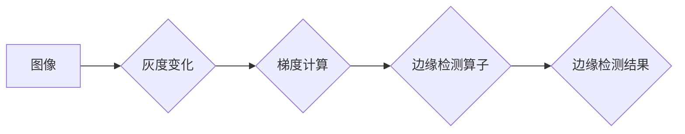

> 边缘检测，图像处理，Sobel算子，Prewitt算子，Canny算子，图像边缘，OpenCV

## 1. 背景介绍

在计算机视觉领域，边缘检测是图像处理中一项基础且重要的操作。边缘检测的目标是识别图像中像素值变化显著的区域，这些区域通常对应图像的轮廓、边界或物体边缘。边缘检测结果可以用于后续图像分析、识别和理解任务，例如目标检测、图像分割、特征提取等。

传统的边缘检测方法主要依赖于图像的灰度变化来识别边缘。这些方法通常通过计算图像像素点邻域的灰度梯度来判断是否存在边缘。随着计算机视觉技术的不断发展，出现了许多新的边缘检测算法，这些算法在精度、效率和鲁棒性方面都有所提升。

## 2. 核心概念与联系

**2.1 核心概念**

* **图像梯度:** 图像梯度表示图像像素点灰度变化的强度和方向。它可以用来衡量图像中像素值的变化速率。
* **边缘:** 边缘是指图像中像素值变化显著的区域，通常对应图像的轮廓、边界或物体边缘。
* **边缘检测算子:** 边缘检测算子是一种用来计算图像梯度和识别边缘的数学运算。常见的边缘检测算子包括Sobel算子、Prewitt算子、Canny算子等。

**2.2 核心概念联系**

图像梯度是边缘检测的基础。通过计算图像像素点的灰度梯度，我们可以判断是否存在边缘。边缘检测算子通过对图像进行卷积运算，计算图像像素点的梯度信息，并根据梯度值的大小和方向来识别边缘。



## 3. 核心算法原理 & 具体操作步骤

### 3.1 算法原理概述

边缘检测算法的基本原理是利用图像灰度变化的特性来识别边缘。这些算法通常通过计算图像像素点邻域的灰度梯度来判断是否存在边缘。

* **梯度方向:** 梯度方向表示图像灰度变化的方向。
* **梯度幅值:** 梯度幅值表示图像灰度变化的强度。

当图像像素点邻域的灰度变化较大时，梯度幅值较大，则该像素点可能位于边缘。

### 3.2 算法步骤详解

1. **灰度化:** 将彩色图像转换为灰度图像。
2. **计算梯度:** 使用Sobel算子、Prewitt算子或其他边缘检测算子计算图像的梯度幅值和方向。
3. **非极大值抑制:** 对梯度方向进行非极大值抑制，保留边缘方向上的像素点，抑制其他方向的像素点。
4. **双阈值法:** 使用两个阈值来确定边缘点。像素点梯度幅值大于高阈值则为强边缘点，小于低阈值则为非边缘点。像素点梯度幅值介于两个阈值之间则为弱边缘点，需要与强边缘点相连才能被保留。
5. **边缘跟踪:** 从强边缘点开始，跟踪边缘点，连接弱边缘点，形成完整的边缘轮廓。

### 3.3 算法优缺点

* **Sobel算子:**
    * 优点: 计算简单，效率高。
    * 缺点: 对噪声敏感，边缘检测结果不够精确。
* **Prewitt算子:**
    * 优点: 对噪声比Sobel算子更鲁棒。
    * 缺点: 计算效率略低。
* **Canny算子:**
    * 优点: 精度高，对噪声鲁棒性强。
    * 缺点: 计算复杂，效率较低。

### 3.4 算法应用领域

边缘检测算法广泛应用于计算机视觉领域，例如：

* **目标检测:** 边缘检测可以用来提取目标的轮廓，帮助识别目标。
* **图像分割:** 边缘检测可以用来分割图像，将图像划分为不同的区域。
* **特征提取:** 边缘检测可以用来提取图像的特征，例如角点、线段等。
* **三维重建:** 边缘检测可以用来重建三维物体模型。

## 4. 数学模型和公式 & 详细讲解 & 举例说明

### 4.1 数学模型构建

边缘检测算法通常基于图像梯度计算。图像梯度可以用以下公式表示：

$$
G = \sqrt{G_x^2 + G_y^2}
$$

其中：

* $G$ 是图像梯度幅值。
* $G_x$ 是图像在水平方向的梯度。
* $G_y$ 是图像在垂直方向的梯度。

### 4.2 公式推导过程

Sobel算子是一种常用的边缘检测算子，它通过对图像进行卷积运算来计算图像梯度。Sobel算子的水平方向和垂直方向的卷积核分别为：

$$
K_x = \begin{bmatrix} -1 & 0 & 1 \\ -2 & 0 & 2 \\ -1 & 0 & 1 \end{bmatrix}
$$

$$
K_y = \begin{bmatrix} -1 & -2 & -1 \\ 0 & 0 & 0 \\ 1 & 2 & 1 \end{bmatrix}
$$

通过将这些卷积核与图像进行卷积运算，可以得到图像在水平方向和垂直方向的梯度。

### 4.3 案例分析与讲解

假设有一个图像像素点 $(x, y)$，其灰度值为 $I(x, y)$。Sobel算子在该像素点处的水平方向梯度 $G_x$ 可以通过以下公式计算：

$$
G_x(x, y) = I(x-1, y-1) * (-1) + I(x, y-1) * 0 + I(x+1, y-1) * 1 + I(x-1, y) * (-2) + I(x, y) * 0 + I(x+1, y) * 2 + I(x-1, y+1) * (-1) + I(x, y+1) * 0 + I(x+1, y+1) * 1
$$

类似地，可以计算图像在垂直方向的梯度 $G_y$。然后，根据公式 $G = \sqrt{G_x^2 + G_y^2}$ 计算图像梯度幅值。

## 5. 项目实践：代码实例和详细解释说明

### 5.1 开发环境搭建

本项目使用Python语言和OpenCV库进行开发。需要安装Python和OpenCV库。

### 5.2 源代码详细实现

```python
import cv2
import numpy as np

# 读取图像
image = cv2.imread('image.jpg', cv2.IMREAD_GRAYSCALE)

# 使用Sobel算子计算图像梯度
sobelx = cv2.Sobel(image, cv2.CV_64F, 1, 0, ksize=5)
sobely = cv2.Sobel(image, cv2.CV_64F, 0, 1, ksize=5)

# 计算图像梯度幅值
abs_grad_x = cv2.convertScaleAbs(sobelx)
abs_grad_y = cv2.convertScaleAbs(sobely)
grad = cv2.addWeighted(abs_grad_x, 0.5, abs_grad_y, 0.5, 0)

# 显示图像
cv2.imshow('Original Image', image)
cv2.imshow('Gradient Magnitude', grad)
cv2.waitKey(0)
cv2.destroyAllWindows()
```

### 5.3 代码解读与分析

1. **读取图像:** 使用`cv2.imread()`函数读取图像，并将其转换为灰度图像。
2. **计算图像梯度:** 使用`cv2.Sobel()`函数计算图像梯度，`ksize`参数指定卷积核的大小。
3. **计算图像梯度幅值:** 使用`cv2.convertScaleAbs()`函数将梯度值转换为非负值，然后使用`cv2.addWeighted()`函数将水平方向和垂直方向的梯度幅值加权平均，得到图像的梯度幅值。
4. **显示图像:** 使用`cv2.imshow()`函数显示图像，`cv2.waitKey()`函数等待用户按键，`cv2.destroyAllWindows()`函数关闭所有窗口。

### 5.4 运行结果展示

运行代码后，将显示原始图像和梯度幅值图像。梯度幅值图像中，边缘区域的像素值较高，而内部区域的像素值较低。

## 6. 实际应用场景

### 6.1 图像分割

边缘检测可以用来分割图像，将图像划分为不同的区域。例如，可以利用边缘检测来分割图像中的前景和背景，或者分割图像中的不同物体。

### 6.2 目标检测

边缘检测可以用来提取目标的轮廓，帮助识别目标。例如，可以利用边缘检测来识别图像中的车辆、行人或其他物体。

### 6.3 特征提取

边缘检测可以用来提取图像的特征，例如角点、线段等。这些特征可以用来描述图像的内容，并用于后续的图像识别和理解任务。

### 6.4 未来应用展望

随着计算机视觉技术的不断发展，边缘检测算法将有更广泛的应用场景。例如，边缘检测可以应用于自动驾驶、医疗影像分析、机器人视觉等领域。

## 7. 工具和资源推荐

### 7.1 学习资源推荐

* **OpenCV官方文档:** https://docs.opencv.org/
* **Python图像处理教程:** https://www.pyimagesearch.com/

### 7.2 开发工具推荐

* **OpenCV:** https://opencv.org/
* **Python:** https://www.python.org/

### 7.3 相关论文推荐

* **Canny Edge Detector:** https://ieeexplore.ieee.org/document/1013734
* **Sobel Operator:** https://en.wikipedia.org/wiki/Sobel_operator

## 8. 总结：未来发展趋势与挑战

### 8.1 研究成果总结

边缘检测算法在计算机视觉领域取得了显著的成果，能够有效地识别图像中的边缘信息。

### 8.2 未来发展趋势

未来边缘检测算法的发展趋势包括：

* **提高算法精度:** 研究更精确的边缘检测算法，能够更好地识别图像中的细小边缘和复杂边缘。
* **增强算法鲁棒性:** 研究更鲁棒的边缘检测算法，能够更好地应对图像噪声、模糊和光照变化等问题。
* **降低算法复杂度:** 研究更快速、更高效的边缘检测算法，能够满足实时图像处理的需求。

### 8.3 面临的挑战

边缘检测算法仍然面临一些挑战，例如：

* **复杂边缘的识别:** 复杂边缘，例如弯曲边缘、交织边缘等，仍然难以被精确识别。
* **噪声和模糊的处理:** 图像噪声和模糊会影响边缘检测的精度，需要开发更有效的噪声和模糊处理方法。
* **实时性要求:** 一些应用场景需要实时进行边缘检测，需要开发更快速、更高效的算法。

### 8.4 研究展望

未来，边缘检测算法的研究将继续深入，探索更精确、更鲁棒、更快速、更有效的边缘检测方法，为计算机视觉领域的发展做出更大的贡献。

## 9. 附录：常见问题与解答

### 9.1 为什么边缘检测结果会有虚假边缘？

虚假边缘通常是由图像噪声、模糊或光照变化等因素引起的。

### 9.2 如何选择合适的边缘检测算子？

选择合适的边缘检测算子取决于图像的特点和应用场景。

* **Sobel算子:** 计算简单，效率高，但对噪声敏感。
* **Prewitt算子:** 对噪声比Sobel算子更鲁棒。
* **Canny算子:** 精度高，对噪声