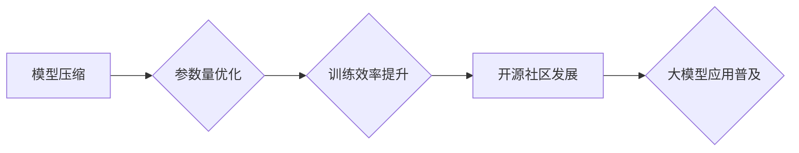

> 大模型、降价、应用推动力、成本效益、开源、可访问性、创新

## 1. 背景介绍

近年来，大模型（Large Language Models，LLMs）在自然语言处理、计算机视觉、代码生成等领域取得了令人瞩目的成就。这些模型拥有庞大的参数量和强大的学习能力，能够处理复杂的任务并生成高质量的输出。然而，大模型的训练和部署成本极高，限制了其在实际应用中的普及。

随着云计算技术的进步和硬件成本的下降，大模型的训练成本有所降低，但仍然是一个不容忽视的因素。因此，大模型的降价势必将成为推动其应用的关键驱动力。

## 2. 核心概念与联系

大模型的降价涉及多个方面，包括模型压缩、参数量优化、训练效率提升、开源社区发展等。这些因素相互关联，共同推动大模型应用的普及。

**Mermaid 流程图：**



## 3. 核心算法原理 & 具体操作步骤

### 3.1  算法原理概述

大模型降价的核心算法主要包括模型压缩、量化、知识蒸馏等技术。

* **模型压缩:** 通过移除冗余参数、剪枝、低秩分解等方法，减少模型规模，从而降低存储和计算成本。
* **量化:** 将模型参数从高精度浮点数转换为低精度整数，减少内存占用和计算量。
* **知识蒸馏:** 将大型模型的知识迁移到小型模型中，实现性能与规模的平衡。

### 3.2  算法步骤详解

**模型压缩:**

1. **识别冗余参数:** 使用正则化、梯度消失等方法识别模型中不重要的参数。
2. **参数剪枝:** 删除识别出的冗余参数，减少模型规模。
3. **低秩分解:** 将模型参数分解成低秩矩阵，减少参数数量。

**量化:**

1. **选择量化方法:** 常用的量化方法包括均匀量化、非均匀量化、动态量化等。
2. **量化参数:** 将模型参数转换为低精度整数。
3. **调整模型结构:** 针对量化后的模型，可能需要调整模型结构和训练方法。

**知识蒸馏:**

1. **选择教师模型和学生模型:** 教师模型为大型模型，学生模型为小型模型。
2. **训练学生模型:** 使用教师模型的输出作为监督信号，训练学生模型。
3. **优化学生模型:** 通过调整学习率、损失函数等参数，优化学生模型的性能。

### 3.3  算法优缺点

**模型压缩:**

* **优点:** 降低模型规模，减少存储和计算成本。
* **缺点:** 可能导致模型性能下降。

**量化:**

* **优点:** 显著降低内存占用和计算量。
* **缺点:** 可能导致模型精度下降。

**知识蒸馏:**

* **优点:** 能够将大型模型的知识迁移到小型模型中，实现性能与规模的平衡。
* **缺点:** 需要训练两个模型，训练时间较长。

### 3.4  算法应用领域

大模型降价算法广泛应用于以下领域:

* **移动设备:** 将大模型部署在移动设备上，实现语音识别、图像识别等功能。
* **嵌入式系统:** 将大模型部署在嵌入式系统上，实现边缘计算和智能控制。
* **云计算:** 提供更经济高效的大模型服务，降低云计算成本。

## 4. 数学模型和公式 & 详细讲解 & 举例说明

### 4.1  数学模型构建

模型压缩可以采用矩阵分解的方法，将模型参数分解成低秩矩阵。假设模型参数矩阵为W，其秩为r，则可以将其分解为：

$$W = U \Sigma V^T$$

其中，U和V为左右奇异矩阵，Σ为奇异值矩阵。通过选择较小的r值，可以有效减少模型参数数量。

### 4.2  公式推导过程

模型压缩的损失函数通常包含模型精度损失和模型规模损失两部分。

$$Loss = \alpha \cdot Loss_{Accuracy} + (1-\alpha) \cdot Loss_{Size}$$

其中，α为权重系数，控制模型精度和模型规模的平衡。

### 4.3  案例分析与讲解

例如，在图像分类任务中，可以使用深度卷积神经网络（CNN）作为模型。通过对CNN的权重矩阵进行低秩分解，可以有效减少模型参数数量，从而降低模型的存储和计算成本。

## 5. 项目实践：代码实例和详细解释说明

### 5.1  开发环境搭建

* 操作系统：Ubuntu 20.04
* Python 版本：3.8
* 深度学习框架：TensorFlow 2.x

### 5.2  源代码详细实现

```python
import tensorflow as tf

# 定义模型
model = tf.keras.models.Sequential([
    tf.keras.layers.Conv2D(32, (3, 3), activation='relu', input_shape=(28, 28, 1)),
    tf.keras.layers.MaxPooling2D((2, 2)),
    tf.keras.layers.Flatten(),
    tf.keras.layers.Dense(10, activation='softmax')
])

# 训练模型
model.compile(optimizer='adam',
              loss='sparse_categorical_crossentropy',
              metrics=['accuracy'])
model.fit(x_train, y_train, epochs=10)

# 模型压缩
# 使用模型剪枝方法压缩模型
pruned_model = tf.keras.utils.prune_model(model,
                                        pruning_method='global_average_pooling',
                                        amount=0.5)

# 重新训练压缩模型
pruned_model.compile(optimizer='adam',
                    loss='sparse_categorical_crossentropy',
                    metrics=['accuracy'])
pruned_model.fit(x_train, y_train, epochs=10)
```

### 5.3  代码解读与分析

* 代码首先定义了一个简单的CNN模型。
* 然后使用`tf.keras.utils.prune_model()`函数对模型进行剪枝压缩，将模型参数数量减少一半。
* 最后重新训练压缩模型，并评估其性能。

### 5.4  运行结果展示

通过运行代码，可以观察到压缩模型的性能与原始模型的性能之间的差异。

## 6. 实际应用场景

### 6.1  移动设备应用

将大模型压缩到移动设备上，可以实现语音识别、图像识别、机器翻译等功能，提升用户体验。

### 6.2  嵌入式系统应用

将大模型部署在嵌入式系统上，可以实现边缘计算和智能控制，例如智能家居、工业自动化等。

### 6.3  云计算应用

提供更经济高效的大模型服务，降低云计算成本，促进大模型的普及应用。

### 6.4  未来应用展望

随着大模型降价技术的不断发展，大模型将在更多领域得到应用，例如：

* **个性化推荐:** 提供更精准的商品、内容推荐。
* **医疗诊断:** 辅助医生进行疾病诊断和治疗方案制定。
* **教育培训:** 提供个性化学习方案和智能辅导。

## 7. 工具和资源推荐

### 7.1  学习资源推荐

* **论文:**
    * "EfficientNet: Rethinking Model Scaling for Convolutional Neural Networks"
    * "MobileNetV3: Searching for MobileNetV3 Architecture"
    * "Knowledge Distillation"
* **博客:**
    * TensorFlow Blog
    * PyTorch Blog

### 7.2  开发工具推荐

* **TensorFlow:** 开源深度学习框架，支持模型压缩、量化等技术。
* **PyTorch:** 开源深度学习框架，支持模型压缩、量化等技术。
* **HuggingFace Transformers:** 提供预训练的大模型和工具，支持模型压缩、量化等技术。

### 7.3  相关论文推荐

* "Pruning Filters for Efficient ConvNets"
* "Quantization-aware Training: A Methodology for Quantized Neural Networks"
* "Distilling the Knowledge in a Neural Network"

## 8. 总结：未来发展趋势与挑战

### 8.1  研究成果总结

大模型降价技术取得了显著进展，模型压缩、量化、知识蒸馏等技术不断成熟，有效降低了大模型的训练和部署成本。

### 8.2  未来发展趋势

* **模型效率提升:** 研究更有效的模型压缩和量化方法，进一步降低模型规模和计算量。
* **硬件加速:** 利用专用硬件加速大模型训练和推理，提升效率和性能。
* **联邦学习:** 研究联邦学习技术，实现数据隐私保护的同时，协同训练大模型。

### 8.3  面临的挑战

* **模型精度损失:** 模型压缩和量化可能会导致模型精度下降，需要寻找更有效的技术来平衡精度和效率。
* **可解释性:** 大模型的决策过程难以解释，需要研究更可解释的模型架构和训练方法。
* **公平性:** 大模型可能存在偏见和歧视，需要研究公平性评估和缓解方法。

### 8.4  研究展望

未来，大模型降价技术将继续发展，推动大模型在更多领域得到应用。研究人员将继续探索更有效的模型压缩、量化、知识蒸馏等技术，以及更安全、更公平、更可解释的大模型架构和训练方法。

## 9. 附录：常见问题与解答

**Q1: 模型压缩会影响模型性能吗？**

A1: 模型压缩可能会导致模型性能下降，但可以通过选择合适的压缩方法和参数来尽量减少性能损失。

**Q2: 量化技术有哪些？**

A2: 常用的量化方法包括均匀量化、非均匀量化、动态量化等。

**Q3: 知识蒸馏的原理是什么？**

A3: 知识蒸馏是将大型模型的知识迁移到小型模型中，通过训练小型模型来模仿大型模型的输出。

**Q4: 如何选择合适的模型压缩方法？**

A4: 选择合适的模型压缩方法需要根据具体的应用场景和模型架构进行选择。

**Q5: 大模型降价技术有哪些应用场景？**

A5: 大模型降价技术广泛应用于移动设备、嵌入式系统、云计算等领域。


作者：禅与计算机程序设计艺术 / Zen and the Art of Computer Programming 
<end_of_turn>