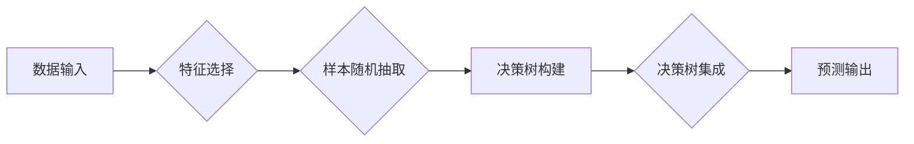

> 随机森林、机器学习、分类、回归、决策树、集成学习、过拟合、特征选择

## 1. 背景介绍

在机器学习领域，分类和回归任务是两个重要的研究方向。传统的机器学习算法，例如线性回归、逻辑回归等，在某些情况下表现良好，但对于复杂的数据集，其性能往往有限。随着数据规模和复杂度的不断增加，需要更强大的机器学习算法来应对挑战。

随机森林作为一种集成学习算法，在近年来得到了广泛的应用。它通过构建多个决策树并进行投票或平均来预测结果，从而提高模型的准确性和鲁棒性。随机森林算法具有以下优点：

* **高准确率:** 随机森林通常能够获得比单个决策树更高的准确率。
* **鲁棒性:** 随机森林对噪声数据和异常值具有较强的鲁棒性。
* **可解释性:** 虽然随机森林是一个复杂的算法，但可以通过分析决策树的结构和特征重要性来理解模型的决策过程。
* **并行化:** 随机森林算法可以并行化训练，从而提高训练速度。

## 2. 核心概念与联系

随机森林算法的核心思想是通过构建多个决策树并进行集成来提高模型的性能。每个决策树都是从随机选择的样本和特征上训练的，这使得每个决策树都具有不同的视角和特性。最终的预测结果是通过对所有决策树的预测结果进行投票或平均来获得的。

**Mermaid 流程图:**



## 3. 核心算法原理 & 具体操作步骤

### 3.1  算法原理概述

随机森林算法的基本步骤如下：

1. 从原始数据集中随机抽取一个样本集，并重复该步骤多次，每次抽取的样本集称为 bootstrap 集。
2. 对于每个 bootstrap 集，随机选择一部分特征进行决策树的构建。
3. 构建决策树：根据选择的特征和样本集，构建一个决策树。
4. 重复步骤 1-3，构建多个决策树，形成一个随机森林。
5. 预测：对于新的数据样本，将它输入到每个决策树中，并根据每个决策树的预测结果进行投票或平均，得到最终的预测结果。

### 3.2  算法步骤详解

1. **数据预处理:** 首先需要对原始数据进行预处理，例如缺失值处理、特征缩放等。
2. **特征选择:** 随机选择一部分特征进行决策树的构建。
3. **样本抽取:** 从原始数据集中随机抽取一个样本集，并重复该步骤多次，每次抽取的样本集称为 bootstrap 集。
4. **决策树构建:** 对于每个 bootstrap 集，根据选择的特征和样本集，构建一个决策树。决策树的构建过程通常使用 ID3 算法或 C4.5 算法。
5. **决策树集成:** 构建多个决策树，形成一个随机森林。
6. **预测:** 对于新的数据样本，将它输入到每个决策树中，并根据每个决策树的预测结果进行投票或平均，得到最终的预测结果。

### 3.3  算法优缺点

**优点:**

* 高准确率
* 鲁棒性
* 可解释性
* 并行化

**缺点:**

* 训练时间较长
* 对于高维数据，可能会出现过拟合问题

### 3.4  算法应用领域

随机森林算法广泛应用于以下领域:

* **图像识别:** 人脸识别、物体检测
* **自然语言处理:** 文本分类、情感分析
* **金融领域:** 欺诈检测、信用评分
* **医疗领域:** 疾病诊断、药物发现

## 4. 数学模型和公式 & 详细讲解 & 举例说明

### 4.1  数学模型构建

随机森林算法的数学模型可以概括为以下公式:

$$
\hat{y} = \frac{1}{N} \sum_{i=1}^{N} f_i(x)
$$

其中:

* $\hat{y}$ 是预测结果
* $N$ 是随机森林中决策树的数量
* $f_i(x)$ 是第 $i$ 个决策树对输入数据 $x$ 的预测结果

### 4.2  公式推导过程

随机森林算法的预测结果是通过对所有决策树的预测结果进行平均来获得的。每个决策树 $f_i(x)$ 都是通过训练一个决策树模型来获得的，决策树模型的构建过程通常使用 ID3 算法或 C4.5 算法。

### 4.3  案例分析与讲解

假设我们有一个包含 10 个样本的数据集，每个样本都有 2 个特征。我们构建一个包含 5 个决策树的随机森林。对于新的数据样本，我们将它输入到每个决策树中，并根据每个决策树的预测结果进行平均，得到最终的预测结果。

## 5. 项目实践：代码实例和详细解释说明

### 5.1  开发环境搭建

本项目使用 Python 语言进行开发，需要安装以下库:

* scikit-learn: 机器学习库
* pandas: 数据处理库
* matplotlib: 数据可视化库

### 5.2  源代码详细实现

```python
from sklearn.ensemble import RandomForestClassifier
from sklearn.model_selection import train_test_split
from sklearn.datasets import load_iris
import pandas as pd
import matplotlib.pyplot as plt

# 加载 iris 数据集
iris = load_iris()
X = iris.data
y = iris.target

# 将数据划分为训练集和测试集
X_train, X_test, y_train, y_test = train_test_split(X, y, test_size=0.2, random_state=42)

# 创建随机森林分类器
rf_classifier = RandomForestClassifier(n_estimators=100, random_state=42)

# 训练模型
rf_classifier.fit(X_train, y_train)

# 预测测试集结果
y_pred = rf_classifier.predict(X_test)

# 计算准确率
accuracy = rf_classifier.score(X_test, y_test)
print(f"准确率: {accuracy}")

# 可视化决策边界
from sklearn.datasets import make_classification
from sklearn.ensemble import RandomForestClassifier
from sklearn.model_selection import train_test_split
import matplotlib.pyplot as plt
import numpy as np

X, y = make_classification(n_samples=1000, n_features=2, random_state=42)
X_train, X_test, y_train, y_test = train_test_split(X, y, test_size=0.2, random_state=42)

rf_classifier = RandomForestClassifier(n_estimators=100, random_state=42)
rf_classifier.fit(X_train, y_train)

# 预测测试集结果
y_pred = rf_classifier.predict(X_test)

# 可视化决策边界
plt.scatter(X[:, 0], X[:, 1], c=y, cmap=plt.cm.Paired)
xx, yy = np.meshgrid(np.linspace(X[:, 0].min(), X[:, 0].max(), 100),
                     np.linspace(X[:, 1].min(), X[:, 1].max(), 100))
Z = rf_classifier.predict(np.c_[xx.ravel(), yy.ravel()])
Z = Z.reshape(xx.shape)
plt.contourf(xx, yy, Z, cmap=plt.cm.Paired, alpha=0.8)
plt.xlabel('Feature 1')
plt.ylabel('Feature 2')
plt.title('Random Forest Decision Boundary')
plt.show()
```

### 5.3  代码解读与分析

* **数据加载和预处理:** 使用 scikit-learn 库加载 iris 数据集，并将其划分为训练集和测试集。
* **模型构建:** 创建一个 RandomForestClassifier 对象，设置决策树数量为 100，随机种子为 42。
* **模型训练:** 使用训练集训练模型。
* **模型预测:** 使用测试集预测结果。
* **模型评估:** 计算模型的准确率。
* **可视化决策边界:** 使用 matplotlib 库可视化决策边界。

### 5.4  运行结果展示

运行代码后，会输出模型的准确率，并生成一个可视化决策边界的图。

## 6. 实际应用场景

随机森林算法在许多实际应用场景中都取得了很好的效果，例如:

* **医疗诊断:** 随机森林可以用于预测疾病的风险，辅助医生进行诊断。
* **金融风险评估:** 随机森林可以用于评估客户的信用风险，帮助银行进行贷款审批。
* **图像识别:** 随机森林可以用于识别图像中的物体，例如人脸识别、车辆识别等。

### 6.4  未来应用展望

随着机器学习技术的不断发展，随机森林算法的应用场景将会更加广泛。例如:

* **个性化推荐:** 随机森林可以用于个性化推荐产品或服务。
* **欺诈检测:** 随机森林可以用于检测网络欺诈行为。
* **自然语言处理:** 随机森林可以用于更复杂的自然语言处理任务，例如机器翻译、文本摘要等。

## 7. 工具和资源推荐

### 7.1  学习资源推荐

* **书籍:**
    * The Elements of Statistical Learning
    * Introduction to Machine Learning
* **在线课程:**
    * Coursera: Machine Learning
    * edX: Introduction to Machine Learning

### 7.2  开发工具推荐

* **Python:** 
    * scikit-learn: 机器学习库
    * pandas: 数据处理库
    * matplotlib: 数据可视化库

### 7.3  相关论文推荐

* Breiman, L. (2001). Random forests. Machine learning, 45(1), 5-32.
* Liaw, A., & Wiener, M. (2002). Classification and regression by randomForest. R News, 2(3), 18-22.

## 8. 总结：未来发展趋势与挑战

### 8.1  研究成果总结

随机森林算法是一种高效、鲁棒的机器学习算法，在许多领域取得了成功应用。其核心思想是通过集成多个决策树来提高模型的性能，并通过随机特征选择和样本抽取来避免过拟合。

### 8.2  未来发展趋势

未来，随机森林算法的研究方向将集中在以下几个方面:

* **提升算法效率:** 探索更有效的随机森林算法，例如并行随机森林、可解释随机森林等。
* **扩展算法应用:** 将随机森林算法应用于更复杂的机器学习任务，例如深度学习、强化学习等。
* **提高算法可解释性:** 研究更有效的随机森林算法可解释性方法，帮助用户更好地理解模型的决策过程。

### 8.3  面临的挑战

随机森林算法也面临一些挑战:

* **训练时间:** 随机森林算法的训练时间相对较长，尤其是在处理大规模数据集时。
* **参数调优:** 随机森林算法的性能受参数的影响较大，需要进行仔细的调优。
* **可解释性:** 尽管随机森林算法的可解释性比深度学习算法好，但仍然难以完全解释模型的决策过程。

### 8.4  研究展望

尽管面临一些挑战，但随机森林算法仍然是一个非常有潜力的机器学习算法。随着研究的深入，相信随机森林算法将会在更多领域得到应用，并取得更令人瞩目的成果。

## 9. 附录：常见问题与解答

**问题 1:** 随机森林算法的训练时间较长，如何提高训练效率？

**解答:** 可以使用并行化技术来提高训练效率，例如使用多核CPU或GPU进行训练。

**问题 2:** 随机森林算法的