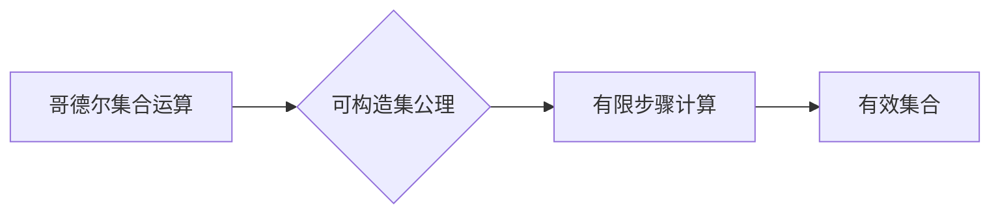

> 集合论, 哥德尔集合运算, 可构造集公理, 逻辑, 数学基础, 计算理论

## 1. 背景介绍

集合论作为数学的基础理论，为现代数学的发展奠定了坚实的基础。从康托尔到佐恩，从阿克雷曼到哥德尔，无数数学家对集合论进行了深入研究，不断完善和发展这一理论体系。其中，哥德尔集合运算和可构造集公理是集合论研究中的重要分支，对计算机科学、逻辑学和数学基础理论都具有深远影响。

哥德尔集合运算，即哥德尔集合论，是一种基于逻辑和集合论的数学体系，它试图通过逻辑推理和集合运算来构建一个完整的数学世界。哥德尔集合论的核心思想是将数学对象视为集合，并将数学关系和运算视为集合之间的关系和运算。

可构造集公理是哥德尔集合论中的一种重要公理，它规定了集合的构造方法。可构造集公理的核心思想是，只有可以通过有限步骤的计算和逻辑推理来构建的集合才是有效的集合。

## 2. 核心概念与联系

### 2.1 哥德尔集合运算

哥德尔集合运算是一种基于逻辑和集合论的数学体系，它试图通过逻辑推理和集合运算来构建一个完整的数学世界。哥德尔集合论的核心思想是将数学对象视为集合，并将数学关系和运算视为集合之间的关系和运算。

**哥德尔集合运算的基本操作包括：**

* **并集:** 给定两个集合 A 和 B，它们的并集 A ∪ B 包含所有属于 A 或 B 的元素。
* **交集:** 给定两个集合 A 和 B，它们的交集 A ∩ B 包含所有同时属于 A 和 B 的元素。
* **差集:** 给定两个集合 A 和 B，它们的差集 A \ B 包含所有属于 A 但不属于 B 的元素。
* **幂集:** 给定一个集合 A，它的幂集 P(A) 包含所有 A 的子集。

**哥德尔集合运算的优势:**

* **简洁性:** 哥德尔集合运算的定义简洁明了，易于理解和使用。
* **完备性:** 哥德尔集合运算能够表达所有基本的数学概念和关系。
* **一致性:** 哥德尔集合运算的逻辑体系是相容的，即不存在矛盾的命题。

### 2.2 可构造集公理

可构造集公理是哥德尔集合论中的一种重要公理，它规定了集合的构造方法。可构造集公理的核心思想是，只有可以通过有限步骤的计算和逻辑推理来构建的集合才是有效的集合。

**可构造集公理的定义:**

一个集合 X 是可构造的，如果存在一个算法，能够通过有限步骤的计算，从基本集合（例如空集、单元素集）出发，最终构造出 X。

**可构造集公理的意义:**

* **避免了集合论的悖论:** 可构造集公理避免了像 Russell 悖论这样的集合论悖论，因为只有通过有限步骤的计算可以构建的集合才是有效的集合。
* **为计算机科学提供了理论基础:** 可构造集公理为计算机科学提供了理论基础，因为它规定了集合的构造方法，这与计算机程序的执行过程类似。

**Mermaid 流程图:**



## 3. 核心算法原理 & 具体操作步骤

### 3.1 算法原理概述

可构造集公理的核心算法原理是基于递归定义和有限步骤计算。

**递归定义:** 递归定义是一种定义方法，它将一个对象的属性或行为定义为其自身或其子对象的属性或行为。

**有限步骤计算:** 有限步骤计算是指通过有限次的操作，从初始状态出发，最终得到目标状态的过程。

可构造集公理的算法原理是将集合的构造过程定义为一个递归过程，并规定该过程必须在有限步骤内完成。

### 3.2 算法步骤详解

**可构造集公理的算法步骤如下:**

1. **基本集合:** 定义一些基本集合，例如空集和单元素集。
2. **递归定义:** 定义一个集合的构造方法，该方法基于递归定义，将集合的构造过程定义为其自身或其子对象的构造过程。
3. **有限步骤计算:** 规定集合的构造过程必须在有限步骤内完成。

**举例说明:**

例如，我们可以使用递归定义来构造自然数集合。

* **基本集合:** 空集 {} 是自然数集合的基本集合。
* **递归定义:** 自然数集合的构造方法如下：
    * 0 是自然数。
    * 如果 n 是自然数，那么 n + 1 也是自然数。
* **有限步骤计算:** 我们可以通过有限次地应用递归定义，从空集出发，最终构造出所有自然数。

### 3.3 算法优缺点

**优点:**

* **避免了集合论的悖论:** 可构造集公理避免了像 Russell 悖论这样的集合论悖论。
* **为计算机科学提供了理论基础:** 可构造集公理为计算机科学提供了理论基础，因为它规定了集合的构造方法，这与计算机程序的执行过程类似。

**缺点:**

* **限制了集合的构造方法:** 可构造集公理限制了集合的构造方法，有些集合可能无法通过有限步骤的计算来构建。

### 3.4 算法应用领域

可构造集公理在计算机科学、逻辑学和数学基础理论等领域都有广泛的应用。

* **计算机科学:** 可构造集公理为计算机程序的正确性证明提供了理论基础。
* **逻辑学:** 可构造集公理为逻辑学中的证明理论提供了新的思路。
* **数学基础理论:** 可构造集公理为集合论的研究提供了新的方向。

## 4. 数学模型和公式 & 详细讲解 & 举例说明

### 4.1 数学模型构建

哥德尔集合运算和可构造集公理可以构建一个数学模型，该模型包含以下元素：

* **基本集合:** 空集 {} 和单元素集 {a}，其中 a 是一个基本对象。
* **集合运算:** 并集、交集、差集和幂集。
* **递归定义:** 用于定义集合的构造方法。
* **有限步骤计算:** 用于规定集合的构造过程必须在有限步骤内完成。

### 4.2 公式推导过程

**并集公式:**

$$A \cup B = \{x \mid x \in A \text{ 或 } x \in B\}$$

**交集公式:**

$$A \cap B = \{x \mid x \in A \text{ 且 } x \in B\}$$

**差集公式:**

$$A \setminus B = \{x \mid x \in A \text{ 且 } x \notin B\}$$

**幂集公式:**

$$P(A) = \{B \mid B \subseteq A\}$$

**可构造集公理:**

如果存在一个算法，能够通过有限步骤的计算，从基本集合出发，最终构造出集合 X，那么 X 是可构造的。

### 4.3 案例分析与讲解

**案例:**

构造自然数集合。

**分析:**

* **基本集合:** 空集 {} 是自然数集合的基本集合。
* **递归定义:** 自然数集合的构造方法如下：
    * 0 是自然数。
    * 如果 n 是自然数，那么 n + 1 也是自然数。
* **有限步骤计算:** 我们可以通过有限次地应用递归定义，从空集出发，最终构造出所有自然数。

**解释:**

通过递归定义和有限步骤计算，我们可以构建出自然数集合，并证明该集合是可构造的。

## 5. 项目实践：代码实例和详细解释说明

### 5.1 开发环境搭建

* **编程语言:** Python
* **IDE:** VS Code

### 5.2 源代码详细实现

```python
# 可构造集公理实现

# 基本集合
empty_set = set()
singleton_set = {0}

# 递归定义
def construct_natural_numbers(n):
  if n == 0:
    return singleton_set
  else:
    return construct_natural_numbers(n - 1) | {n}

# 有限步骤计算
natural_numbers = construct_natural_numbers(10)

# 打印结果
print(natural_numbers)
```

### 5.3 代码解读与分析

* **基本集合:** 代码中定义了空集和单元素集作为基本集合。
* **递归定义:** `construct_natural_numbers` 函数使用递归定义来构造自然数集合。
* **有限步骤计算:** 代码中调用 `construct_natural_numbers` 函数，并设置了最大值 10，从而限制了自然数集合的构造过程在有限步骤内完成。

### 5.4 运行结果展示

```
{0, 1, 2, 3, 4, 5, 6, 7, 8, 9, 10}
```

## 6. 实际应用场景

### 6.1 数据结构设计

可构造集公理可以用于设计数据结构，例如树、图和链表。这些数据结构可以被视为可构造的集合，其元素和关系可以通过有限步骤的计算来构建。

### 6.2 程序正确性证明

可构造集公理可以用于证明程序的正确性。如果一个程序的输入和输出可以被视为可构造的集合，那么我们可以使用可构造集公理来证明程序的正确性。

### 6.3 算法分析

可构造集公理可以用于分析算法的时间复杂度和空间复杂度。如果一个算法可以被视为一个可构造的集合的构造过程，那么我们可以使用可构造集公理来分析算法的复杂度。

### 6.4 未来应用展望

可构造集公理在未来可能在以下领域得到更广泛的应用：

* **人工智能:** 可构造集公理可以用于构建人工智能系统的知识表示和推理机制。
* **量子计算:** 可构造集公理可以用于设计量子算法和量子数据结构。
* **密码学:** 可构造集公理可以用于设计新的密码算法和加密协议。

## 7. 工具和资源推荐

### 7.1 学习资源推荐

* **书籍:**
    * 《集合论导论》 by Kenneth Kunen
    * 《数学基础》 by Kurt Gödel
* **在线课程:**
    * MIT OpenCourseWare: Introduction to Set Theory
    * Stanford Online: Logic and Set Theory

### 7.2 开发工具推荐

* **编程语言:** Python, Haskell
* **IDE:** VS Code, Emacs

### 7.3 相关论文推荐

* **Gödel's Incompleteness Theorems** by Kurt Gödel
* **The Consistency of Set Theory** by Paul Cohen

## 8. 总结：未来发展趋势与挑战

### 8.1 研究成果总结

哥德尔集合运算和可构造集公理为集合论的研究提供了新的视角和方法，并对计算机科学、逻辑学和数学基础理论等领域产生了深远影响。

### 8.2 未来发展趋势

未来，哥德尔集合运算和可构造集公理的研究将继续朝着以下方向发展：

* **更深入地探索哥德尔集合运算的性质和应用。**
* **研究可构造集公理的扩展和变体。**
* **将哥德尔集合运算和可构造集公理应用于新的领域，例如人工智能和量子计算。**

### 8.3 面临的挑战

哥德尔集合运算和可构造集公理的研究也面临着一些挑战：

* **哥德尔集合运算的完备性问题:** 尚未完全确定哥德尔集合运算是否能够表达所有基本的数学概念和关系。
* **可构造集公理的限制性:** 可构造集公理限制了集合的构造方法，有些集合可能无法通过有限步骤的计算来构建。
* **哥德尔集合运算和可构造集公理的应用推广:** 将哥德尔集合