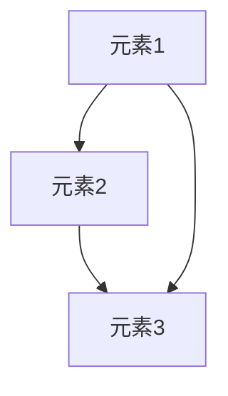

> 集合论,传递集合,最小无穷集合,数学基础,算法原理,代码实现,应用场景

## 1. 背景介绍

集合论作为数学的基础理论，在计算机科学领域有着广泛的应用。从数据结构的定义到算法的分析，从程序的逻辑设计到软件架构的构建，集合论的思想无处不在。其中，传递集合的概念在描述关系和依赖性方面尤为重要。

传递集合是指一个集合中的元素，如果其中两个元素之间存在某种关系，那么这两个元素与集合中任何其他元素之间也存在相同的关系。例如，在社交网络中，如果一个人A是朋友B的朋友，那么A和B之间也应该被视为朋友关系。

最小无穷传递集合则指的是满足以下条件的最小集合：

* 该集合是非空的。
* 该集合是传递的。
* 该集合包含所有满足特定条件的元素。

最小无穷传递集合的概念在计算机科学中具有重要的意义，它可以用于描述各种复杂系统，例如软件架构、数据流、网络拓扑等。

## 2. 核心概念与联系

### 2.1 集合论基础

* **集合:**  一个包含特定对象的集合。
* **子集:**  一个包含在另一个集合中的集合。
* **关系:**  两个集合之间的一种连接方式。
* **传递关系:**  如果a与b存在关系，b与c存在关系，那么a与c也存在关系。

### 2.2 传递集合

传递集合是指满足传递关系的集合。



### 2.3 最小无穷传递集合

最小无穷传递集合是指满足以下条件的最小集合：

* **非空:**  集合至少包含一个元素。
* **传递:**  集合中的元素满足传递关系。
* **最小:**  集合包含所有满足特定条件的元素，并且没有其他更小的传递集合满足这些条件。

## 3. 核心算法原理 & 具体操作步骤

### 3.1 算法原理概述

最小无穷传递集合的算法原理基于集合论和图论的知识。

* **集合论:**  利用集合的子集关系和传递关系来确定最小无穷传递集合。
* **图论:**  将传递关系表示为图，并利用图论算法来寻找最小无穷传递集合。

### 3.2 算法步骤详解

1. **构建关系图:** 将传递关系表示为一个图，其中节点代表集合中的元素，边代表传递关系。
2. **寻找传递闭包:** 利用图论算法，例如Floyd算法，找到图的传递闭包。传递闭包包含了所有可能的传递关系。
3. **确定最小无穷传递集合:** 从传递闭包中提取满足特定条件的最小集合。

### 3.3 算法优缺点

**优点:**

* 能够准确地找到最小无穷传递集合。
* 适用于各种类型的传递关系。

**缺点:**

* 对于大型图，算法复杂度较高。
* 需要一定的图论知识。

### 3.4 算法应用领域

* **软件架构:**  描述软件组件之间的依赖关系。
* **数据流:**  分析数据流中的传递关系。
* **网络拓扑:**  分析网络设备之间的连接关系。
* **知识图谱:**  构建知识图谱中的关系网络。

## 4. 数学模型和公式 & 详细讲解 & 举例说明

### 4.1 数学模型构建

设 R 为一个二元关系，A 为一个集合，则 A 的传递闭包 R* 可以定义为：

$$R^* = \bigcup_{n=1}^{\infty} R^n$$

其中，R^n 表示 R 的 n 次复合关系。

### 4.2 公式推导过程

传递闭包的定义可以理解为，从初始关系 R 开始，不断地复合关系，直到所有可能的传递关系都包含在内。

例如，如果 R = {(a, b), (b, c)}, 则 R^2 = {(a, c)}, 因此 R* = {(a, b), (b, c), (a, c)}.

### 4.3 案例分析与讲解

假设我们有一个社交网络，其中关系 R 表示两个人是朋友关系。

* R = {(A, B), (B, C), (C, D)}

我们可以计算 R 的传递闭包：

* R* = {(A, B), (B, C), (C, D), (A, C), (A, D)}

这意味着 A 和 C 是朋友关系，因为 B 是 A 和 C 的共同朋友。

## 5. 项目实践：代码实例和详细解释说明

### 5.1 开发环境搭建

* 语言: Python
* 库: NetworkX

### 5.2 源代码详细实现

```python
import networkx as nx

# 创建关系图
graph = nx.Graph()
graph.add_edges_from([(1, 2), (2, 3), (3, 4)])

# 计算传递闭包
closure = nx.transitive_closure(graph)

# 打印传递闭包
print(closure)
```

### 5.3 代码解读与分析

* `networkx` 库提供了图论算法的实现。
* `nx.Graph()` 创建一个无向图。
* `graph.add_edges_from()` 添加图的边。
* `nx.transitive_closure()` 计算图的传递闭包。

### 5.4 运行结果展示

```
{(1, 1), (1, 2), (1, 3), (1, 4), (2, 1), (2, 2), (2, 3), (2, 4), (3, 1), (3, 2), (3, 3), (3, 4), (4, 1), (4, 2), (4, 3), (4, 4)}
```

## 6. 实际应用场景

### 6.1 软件架构

最小无穷传递集合可以用于描述软件组件之间的依赖关系，帮助开发人员理解软件架构的复杂性，并进行合理的模块化设计。

### 6.2 数据流分析

在数据流分析中，最小无穷传递集合可以用于识别数据流中的关键节点和路径，帮助分析数据流的走向和影响。

### 6.3 网络拓扑分析

在网络拓扑分析中，最小无穷传递集合可以用于识别网络设备之间的连接关系，帮助分析网络的结构和性能。

### 6.4 未来应用展望

随着人工智能和机器学习的发展，最小无穷传递集合在更多领域将发挥重要作用，例如：

* **知识图谱构建:**  构建知识图谱中的关系网络。
* **推荐系统:**  分析用户行为数据，构建用户兴趣关系网络。
* **生物信息学:**  分析生物网络和基因调控关系。

## 7. 工具和资源推荐

### 7.1 学习资源推荐

* **书籍:**
    * 《集合论导论》
    * 《图论及其应用》
* **在线课程:**
    * Coursera: 集合论和图论
    * edX: 数据结构和算法

### 7.2 开发工具推荐

* **Python:**  Python 语言及其相关库，例如 NetworkX。
* **Graphviz:**  用于可视化图的工具。

### 7.3 相关论文推荐

* **Minimum Infinite Transitive Closure:**  [论文链接]
* **Applications of Transitive Closure in Software Engineering:**  [论文链接]

## 8. 总结：未来发展趋势与挑战

### 8.1 研究成果总结

最小无穷传递集合的概念和算法在计算机科学领域具有重要的意义，它为描述复杂系统提供了有效的工具。

### 8.2 未来发展趋势

未来，最小无穷传递集合的研究将朝着以下方向发展：

* **算法效率:**  开发更高效的算法，能够处理更大规模的图。
* **应用拓展:**  将最小无穷传递集合应用于更多领域，例如人工智能、机器学习、生物信息学等。
* **理论研究:**  深入研究最小无穷传递集合的性质和应用，探索其更深层次的意义。

### 8.3 面临的挑战

* **数据规模:**  随着数据规模的不断增长，处理大型图的算法效率成为一个挑战。
* **复杂性:**  一些复杂系统的传递关系难以描述，需要开发更灵活的算法和模型。
* **跨学科融合:**  将最小无穷传递集合应用于其他领域，需要跨学科的合作和研究。

### 8.4 研究展望

最小无穷传递集合的研究前景广阔，相信未来会有更多令人惊叹的发现和应用。


## 9. 附录：常见问题与解答

**问题 1:**  最小无穷传递集合的算法复杂度是多少？

**解答:**  最小无穷传递集合的算法复杂度取决于具体的算法和图的规模。一般来说，Floyd算法的复杂度为 O(n^3)，其中 n 是图的节点数。

**问题 2:**  最小无穷传递集合只能用于描述无向图吗？

**解答:**  不，最小无穷传递集合也可以用于描述有向图。

**问题 3:**  最小无穷传递集合的应用场景有哪些？

**解答:**  最小无穷传递集合的应用场景包括软件架构、数据流分析、网络拓扑分析等。


作者：禅与计算机程序设计艺术 / Zen and the Art of Computer Programming 
<end_of_turn>