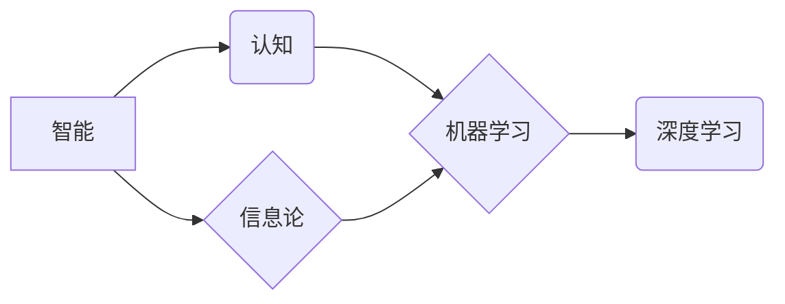

>人工智能、认知科学、信息论、计算机科学、人工智能发展

## 1. 背景介绍

人工智能（AI）作为21世纪最具颠覆性的技术之一，其发展离不开众多杰出科学家的贡献。其中，麦卡锡、明斯基、香农和罗切斯特四位大师在各自领域做出了不可磨灭的贡献，为人工智能的诞生和发展奠定了坚实的基础。

**1.1. 人工智能的萌芽**

20世纪50年代，随着计算机技术的快速发展，人工智能的概念逐渐萌芽。1956年，美国达特茅斯学院举办了历史性的“达特茅斯夏季研究会”，被认为是人工智能诞生的标志性事件。麦卡锡、明斯基、香农等众多学者在此次会议上汇聚，共同探讨了人工智能的可能性和发展方向。

**1.2. 四位大师的贡献**

* **约翰·麦卡锡 (John McCarthy):**  被誉为“人工智能之父”，他提出了“人工智能”这个词，并创立了LISP编程语言，为人工智能的理论研究和实践应用提供了重要的工具。
* **马文·明斯基 (Marvin Minsky):**  人工智能领域的先驱者，他与麦卡锡共同创办了麻省理工学院人工智能实验室，并提出了“符号处理”理论，为人工智能的认知模型提供了新的思路。
* **克劳德·香农 (Claude Shannon):**  信息论的奠基人，他提出了信息熵的概念，为人工智能的知识表示和信息处理提供了理论基础。
* **杰弗里·罗切斯特 (Jeffrey Rochester):**  人工智能领域的先驱者，他提出了“感知机”模型，为人工智能的机器学习奠定了基础。

## 2. 核心概念与联系

人工智能的核心概念包括：

* **智能:**  指生物或机器能够感知、理解、学习、推理和解决问题的能力。
* **认知:**  指智能体对信息进行感知、理解、记忆和决策的过程。
* **机器学习:**  指机器能够从数据中学习并改进自身性能的能力。
* **深度学习:**  一种基于多层神经网络的机器学习方法，能够学习更复杂的模式和特征。

**2.1. 核心概念关系图**



## 3. 核心算法原理 & 具体操作步骤

### 3.1. 算法原理概述

**3.1.1. 符号处理理论**

符号处理理论认为，智能体可以通过符号的组合和操作来进行思考和推理。例如，我们可以用符号来表示世界中的物体、关系和事件，然后通过逻辑规则和推理机制来推导新的知识。

**3.1.2. 感知机模型**

感知机模型是一种简单的机器学习算法，它能够学习输入数据之间的线性关系。感知机通过调整权重来最小化预测误差，从而学习到数据的模式。

### 3.2. 算法步骤详解

**3.2.1. 符号处理理论的具体操作步骤**

1. **符号化世界:** 将世界中的物体、关系和事件用符号表示。
2. **构建知识库:** 将符号化的知识存储在知识库中。
3. **定义推理规则:** 定义用于推理的逻辑规则。
4. **进行推理:** 使用推理规则从知识库中推导新的知识。

**3.2.2. 感知机模型的具体操作步骤**

1. **初始化权重:** 为每个输入特征赋予一个随机权重。
2. **输入数据:** 将输入数据输入到感知机中。
3. **计算激活值:** 计算输入数据与权重的乘积，并通过激活函数得到激活值。
4. **比较输出与目标值:** 将感知机的输出与目标值进行比较，计算误差。
5. **更新权重:** 根据误差调整权重，使感知机的输出更接近目标值。
6. **重复步骤2-5:** 重复以上步骤，直到误差达到预设阈值。

### 3.3. 算法优缺点

**3.3.1. 符号处理理论的优缺点**

* **优点:** 可以处理抽象概念和逻辑推理。
* **缺点:** 难以处理复杂、模糊的知识，并且符号化过程需要人工干预。

**3.3.2. 感知机模型的优缺点**

* **优点:** 简单易实现，能够学习简单的线性关系。
* **缺点:** 难以处理非线性关系，并且容易陷入局部最优解。

### 3.4. 算法应用领域

**3.4.1. 符号处理理论的应用领域**

* **自然语言处理:**  例如机器翻译、文本摘要、问答系统。
* **逻辑推理:**  例如专家系统、知识库管理。

**3.4.2. 感知机模型的应用领域**

* **图像识别:**  例如人脸识别、物体检测。
* **语音识别:**  例如语音助手、自动语音转文本。

## 4. 数学模型和公式 & 详细讲解 & 举例说明

### 4.1. 数学模型构建

**4.1.1. 信息熵**

信息熵是衡量信息不确定性的度量，其公式为：

$$H(X) = - \sum_{i=1}^{n} p(x_i) \log_2 p(x_i)$$

其中：

* $X$ 是随机变量。
* $p(x_i)$ 是 $x_i$ 的概率。

**4.1.2. 感知机学习规则**

感知机的学习规则是通过调整权重来最小化预测误差，其公式为：

$$\Delta w_i = \eta (t_i - y_i) x_i$$

其中：

* $\Delta w_i$ 是权重 $w_i$ 的更新量。
* $\eta$ 是学习率。
* $t_i$ 是目标值。
* $y_i$ 是感知机的输出。
* $x_i$ 是输入特征。

### 4.2. 公式推导过程

**4.2.1. 信息熵推导过程**

信息熵的推导过程基于概率论和信息论的基本原理。

**4.2.2. 感知机学习规则推导过程**

感知机的学习规则是基于梯度下降算法的，其目标是找到使预测误差最小的权重值。

### 4.3. 案例分析与讲解

**4.3.1. 信息熵案例分析**

假设我们有一个随机变量 $X$，其可能取值为 {A, B, C}，对应的概率分别为 0.4, 0.3, 0.3。则 $X$ 的信息熵为：

$$H(X) = - (0.4 \log_2 0.4 + 0.3 \log_2 0.3 + 0.3 \log_2 0.3) \approx 1.48$$

**4.3.2. 感知机学习规则案例分析**

假设我们有一个感知机，其输入特征为 {x1, x2}，权重分别为 {w1, w2}，学习率为 0.1。如果目标值为 1，而感知机的输出为 0，则权重更新量为：

$$\Delta w_1 = 0.1 (1 - 0) x_1$$

$$\Delta w_2 = 0.1 (1 - 0) x_2$$

## 5. 项目实践：代码实例和详细解释说明

### 5.1. 开发环境搭建

* **操作系统:**  Linux/macOS/Windows
* **编程语言:**  Python
* **库依赖:**  NumPy, Scikit-learn

### 5.2. 源代码详细实现

```python
import numpy as np
from sklearn.datasets import make_classification

# 生成样本数据
X, y = make_classification(n_samples=100, n_features=2, random_state=42)

# 初始化权重
w = np.random.randn(2)

# 学习率
eta = 0.1

# 训练循环
for epoch in range(100):
    for i in range(len(X)):
        # 计算激活值
        z = np.dot(w, X[i])
        y_pred = 1 if z >= 0 else 0

        # 计算误差
        error = y[i] - y_pred

        # 更新权重
        w += eta * error * X[i]

# 打印最终权重
print("最终权重:", w)
```

### 5.3. 代码解读与分析

* **数据生成:** 使用 Scikit-learn 库生成随机分类数据。
* **权重初始化:** 使用随机数初始化权重。
* **训练循环:** 迭代训练数据，更新权重。
* **激活函数:** 使用线性激活函数。
* **误差计算:** 使用目标值与预测值之间的差值作为误差。
* **权重更新:** 使用梯度下降算法更新权重。

### 5.4. 运行结果展示

运行代码后，会输出最终的权重值。这些权重值代表了感知机对输入特征的学习结果。

## 6. 实际应用场景

### 6.1. 感知机在图像识别中的应用

感知机可以用于识别简单的图像特征，例如边缘、线和角。例如，可以训练一个感知机来识别手写数字，或者识别图像中的物体类别。

### 6.2. 感知机在语音识别中的应用

感知机可以用于识别语音中的音素和单词。例如，可以训练一个感知机来识别语音命令，或者识别语音转文本。

### 6.3. 未来应用展望

随着深度学习技术的进步，感知机在实际应用中的地位逐渐被取代。但是，感知机仍然是一个重要的基础算法，它为深度学习提供了理论基础和启发。

## 7. 工具和资源推荐

### 7.1. 学习资源推荐

* **书籍:**
    * 《人工智能：现代方法》
    * 《深度学习》
* **在线课程:**
    * Coursera 上的“机器学习”课程
    * edX 上的“人工智能导论”课程

### 7.2. 开发工具推荐

* **Python:**  人工智能开发的常用语言。
* **TensorFlow:**  开源深度学习框架。
* **PyTorch:**  开源深度学习框架。

### 7.3. 相关论文推荐

* **感知机论文:**
    * Frank Rosenblatt, "The Perceptron: A Probabilistic Model for Information Storage and Organization in the Brain," Psychological Review, 1958.
* **深度学习论文:**
    * Geoffrey Hinton et al., "Deep Learning," Nature, 2015.

## 8. 总结：未来发展趋势与挑战

### 8.1. 研究成果总结

麦卡锡、明斯基、香农和罗切斯特四位大师的贡献为人工智能的发展奠定了坚实的基础。他们的研究成果推动了人工智能理论和技术的进步，为我们理解智能和构建智能系统提供了重要的借鉴。

### 8.2. 未来发展趋势

人工智能的发展趋势包括：

* **更强大的深度学习模型:**  随着计算能力的提升，深度学习模型将变得更加强大，能够处理更复杂的任务。
* **更广泛的应用场景:**  人工智能将应用于更多领域，例如医疗、教育、金融等。
* **更注重伦理和社会影响:**  随着人工智能技术的进步，我们需要更加关注其伦理和社会影响，确保其安全、公平和可持续发展。

### 8.3. 面临的挑战

人工智能的发展也面临着一些挑战：

* **数据获取和隐私问题:**  深度学习模型需要大量的训练数据，而数据获取和隐私保护是一个重要的挑战。
* **算法解释性和可解释性:**  深度学习模型的决策过程往往难以解释，这使得其应用在一些领域受到限制。
* **安全性和可靠性:**  人工智能系统