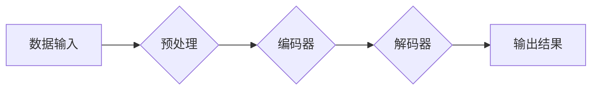

> AI大模型，深度学习，自然语言处理，计算机视觉，数据吞吐量，并行计算，Transformer模型

## 1. 背景介绍

人工智能（AI）技术近年来发展迅速，特别是深度学习的兴起，推动了AI技术的突破性进展。其中，AI大模型作为深度学习领域的重要分支，凭借其强大的学习能力和泛化能力，在自然语言处理、计算机视觉、语音识别等领域取得了令人瞩目的成就。

AI大模型是指参数规模庞大、训练数据海量的人工智能模型。这些模型通过学习海量数据，能够掌握复杂的模式和规律，从而实现对各种复杂任务的处理。与传统机器学习模型相比，AI大模型具有以下特点：

* **参数规模巨大:** AI大模型的参数数量通常在数十亿甚至数万亿级别，这使得它们能够学习更复杂的模式和关系。
* **训练数据量庞大:** AI大模型的训练需要海量的数据，通常包含文本、图像、音频等多种类型的数据。
* **计算资源需求高:** 训练AI大模型需要大量的计算资源，通常需要使用分布式计算平台。

## 2. 核心概念与联系

AI大模型的核心概念包括深度学习、神经网络、Transformer模型等。

**2.1 深度学习**

深度学习是一种机器学习的子领域，它利用多层神经网络来模拟人类大脑的学习过程。深度学习模型能够自动从数据中学习特征，无需人工特征工程。

**2.2 神经网络**

神经网络是一种模仿人脑神经元结构的计算模型。神经网络由多个层组成，每层包含多个神经元。神经元之间通过连接进行信息传递，每个连接都有一个权重。通过训练，神经网络可以调整连接权重，从而学习数据中的模式和规律。

**2.3 Transformer模型**

Transformer模型是一种新型的神经网络架构，它主要用于处理序列数据，例如文本和语音。Transformer模型的特点是其使用了注意力机制，能够有效地捕捉序列数据中的长距离依赖关系。

**2.4 Mermaid 流程图**



## 3. 核心算法原理 & 具体操作步骤

**3.1 算法原理概述**

AI大模型的训练主要基于深度学习算法，其中最常用的算法是反向传播算法。反向传播算法通过计算模型输出与真实值的误差，并根据误差反向传播，调整模型参数，从而不断优化模型的性能。

**3.2 算法步骤详解**

1. **数据预处理:** 将原始数据进行清洗、转换和格式化，使其适合模型训练。
2. **模型构建:** 根据任务需求选择合适的模型架构，并初始化模型参数。
3. **模型训练:** 使用训练数据对模型进行训练，通过反向传播算法不断调整模型参数，降低模型误差。
4. **模型评估:** 使用测试数据评估模型的性能，并根据评估结果进行模型调优。
5. **模型部署:** 将训练好的模型部署到实际应用场景中，用于处理新的数据。

**3.3 算法优缺点**

**优点:**

* 能够学习复杂的模式和关系。
* 泛化能力强，能够应用于多种任务。
* 性能优异，在许多领域取得了突破性进展。

**缺点:**

* 训练数据量大，计算资源需求高。
* 训练时间长，需要大量的计算资源和时间。
* 模型解释性差，难以理解模型的决策过程。

**3.4 算法应用领域**

AI大模型在许多领域都有广泛的应用，例如：

* **自然语言处理:** 文本分类、情感分析、机器翻译、对话系统等。
* **计算机视觉:** 图像识别、物体检测、图像分割、视频分析等。
* **语音识别:** 语音转文本、语音合成、语音助手等。
* **推荐系统:** 商品推荐、内容推荐、用户画像等。

## 4. 数学模型和公式 & 详细讲解 & 举例说明

**4.1 数学模型构建**

AI大模型的数学模型通常基于神经网络，其核心是激活函数和损失函数。

* **激活函数:** 用于引入非线性，使神经网络能够学习复杂的模式。常见的激活函数包括ReLU、Sigmoid、Tanh等。
* **损失函数:** 用于衡量模型预测结果与真实值的差异。常见的损失函数包括交叉熵损失、均方误差损失等。

**4.2 公式推导过程**

反向传播算法的核心是通过链式法则计算梯度，并根据梯度更新模型参数。

假设模型的输出为y，真实值是t，损失函数为L(y,t)。则模型参数的更新规则为：

```latex
\theta = \theta - \alpha \frac{\partial L(y,t)}{\partial \theta}
```

其中，$\theta$是模型参数，$\alpha$是学习率。

**4.3 案例分析与讲解**

以图像分类为例，假设模型输出一个包含10个类别的概率分布，真实类别为第5类。则损失函数可以选用交叉熵损失，其公式为：

```latex
L(y,t) = - \sum_{i=1}^{10} t_i \log(y_i)
```

其中，$t_i$是真实类别对应的one-hot编码，$y_i$是模型预测的第i类概率。

通过反向传播算法，可以计算出每个参数的梯度，并根据梯度更新参数，从而提高模型的分类准确率。

## 5. 项目实践：代码实例和详细解释说明

**5.1 开发环境搭建**

使用Python语言和深度学习框架TensorFlow或PyTorch搭建开发环境。

**5.2 源代码详细实现**

```python
import tensorflow as tf

# 定义模型架构
model = tf.keras.models.Sequential([
    tf.keras.layers.Conv2D(32, (3, 3), activation='relu', input_shape=(28, 28, 1)),
    tf.keras.layers.MaxPooling2D((2, 2)),
    tf.keras.layers.Conv2D(64, (3, 3), activation='relu'),
    tf.keras.layers.MaxPooling2D((2, 2)),
    tf.keras.layers.Flatten(),
    tf.keras.layers.Dense(10, activation='softmax')
])

# 编译模型
model.compile(optimizer='adam',
              loss='sparse_categorical_crossentropy',
              metrics=['accuracy'])

# 训练模型
model.fit(x_train, y_train, epochs=5)

# 评估模型
loss, accuracy = model.evaluate(x_test, y_test)
print('Test loss:', loss)
print('Test accuracy:', accuracy)
```

**5.3 代码解读与分析**

这段代码定义了一个简单的卷积神经网络模型，用于手写数字识别任务。

* `tf.keras.models.Sequential`定义了一个顺序模型，层级结构清晰。
* `tf.keras.layers.Conv2D`定义了卷积层，用于提取图像特征。
* `tf.keras.layers.MaxPooling2D`定义了最大池化层，用于降维和提高模型鲁棒性。
* `tf.keras.layers.Flatten`将多维特征转换为一维向量。
* `tf.keras.layers.Dense`定义了全连接层，用于分类。
* `model.compile`配置了优化器、损失函数和评价指标。
* `model.fit`训练模型，使用训练数据进行迭代训练。
* `model.evaluate`评估模型，使用测试数据计算损失和准确率。

**5.4 运行结果展示**

训练完成后，模型可以用于预测新的手写数字图像。

## 6. 实际应用场景

AI大模型在许多实际应用场景中发挥着重要作用，例如：

* **智能客服:** AI大模型可以理解用户自然语言，并提供智能回复，提高客服效率。
* **个性化推荐:** AI大模型可以根据用户的历史行为和偏好，推荐个性化的商品、内容和服务。
* **医疗诊断:** AI大模型可以辅助医生进行疾病诊断，提高诊断准确率。
* **金融风险控制:** AI大模型可以识别金融风险，帮助金融机构进行风险管理。

**6.4 未来应用展望**

随着AI技术的不断发展，AI大模型的应用场景将更加广泛，例如：

* **自动驾驶:** AI大模型可以帮助自动驾驶汽车感知周围环境，并做出决策。
* **机器人交互:** AI大模型可以使机器人能够更好地理解和响应人类指令。
* **科学研究:** AI大模型可以帮助科学家分析大规模数据，发现新的科学规律。

## 7. 工具和资源推荐

**7.1 学习资源推荐**

* **书籍:**
    * 《深度学习》
    * 《动手学深度学习》
* **在线课程:**
    * Coursera深度学习课程
    * fast.ai深度学习课程

**7.2 开发工具推荐**

* **TensorFlow:** 开源深度学习框架
* **PyTorch:** 开源深度学习框架
* **Jupyter Notebook:** 用于深度学习开发的交互式笔记本

**7.3 相关论文推荐**

* 《Attention Is All You Need》
* 《BERT: Pre-training of Deep Bidirectional Transformers for Language Understanding》
* 《GPT-3: Language Models are Few-Shot Learners》

## 8. 总结：未来发展趋势与挑战

**8.1 研究成果总结**

近年来，AI大模型取得了显著的进展，在许多领域取得了突破性成果。

**8.2 未来发展趋势**

* **模型规模继续扩大:** 模型参数规模将继续增长，从而提升模型的性能。
* **模型效率提升:** 研究人员将致力于开发更有效的训练和推理算法，降低模型的计算成本。
* **模型解释性增强:** 研究人员将致力于开发更易于理解的AI模型，提高模型的透明度和可信度。

**8.3 面临的挑战**

* **数据获取和隐私保护:** AI大模型需要海量数据进行训练，如何获取高质量数据并保护用户隐私是一个挑战。
* **模型可解释性和公平性:** AI模型的决策过程往往难以理解，如何确保模型的公平性和可解释性是一个重要问题。
* **模型安全性和鲁棒性:** AI模型可能受到攻击和操纵，如何确保模型的安全性和鲁棒性是一个关键挑战。

**8.4 研究展望**

未来，AI大模型的研究将继续朝着更强大、更安全、更可解释的方向发展。


## 9. 附录：常见问题与解答

**9.1 如何选择合适的AI大模型？**

选择合适的AI大模型需要根据具体的应用场景和需求进行考虑。需要考虑模型的规模、性能、训练数据量、计算资源等因素。

**9.2 如何训练AI大模型？**

训练AI大模型需要使用深度学习框架，例如TensorFlow或PyTorch。需要准备海量数据，并使用合适的优化算法和损失函数进行训练。

**9.3 如何评估AI大模型的性能？**

评估AI大模型的性能可以使用各种指标，例如准确率、召回率、F1-score等。需要根据具体的应用场景选择合适的评价指标。


作者：禅与计算机程序设计艺术 / Zen and the Art of Computer Programming 
<end_of_turn>