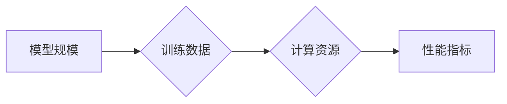

> AI 大模型, 规模定律, 训练数据, 模型参数, 计算资源, 性能提升, 泛化能力, 效率优化, 伦理问题

## 1. 背景介绍

近年来，人工智能（AI）领域取得了令人瞩目的进展，其中，大规模人工智能模型（Large-scale AI Models，简称LAIM）的出现和发展可谓是推动这一进步的引擎之一。从 AlphaGo 击败世界围棋冠军到 GPT-3 创作出逼真的诗歌和代码，LAIM 的强大能力已经得到广泛认可。

然而，LAIM 的训练和部署也面临着巨大的挑战。其中，规模定律（Scaling Law）是研究者们关注的焦点之一。规模定律揭示了模型规模与性能之间的关系，它表明，在一定条件下，模型规模的增加能够显著提升模型的性能，例如准确率、鲁棒性等。

## 2. 核心概念与联系

**2.1 核心概念**

* **模型规模:** 指模型中参数的数量，通常用亿或千亿来表示。
* **训练数据:** 用于训练模型的数据集，其规模和质量直接影响模型的性能。
* **计算资源:** 用于训练模型的计算能力，包括 CPU、GPU 和 TPU 等。
* **性能指标:** 用于评估模型性能的指标，例如准确率、召回率、F1-score 等。

**2.2 核心概念联系**

LAIM 的规模定律表明，模型规模、训练数据、计算资源和性能指标之间存在着密切的联系。

* **模型规模与性能:** 模型规模的增加通常会导致性能的提升，但这种提升并非无限的，存在一个拐点。
* **训练数据与性能:** 训练数据的规模和质量直接影响模型的性能，更大的数据集和更高的数据质量通常会导致更好的性能。
* **计算资源与训练效率:** 计算资源的增加可以加速模型的训练速度，从而缩短训练时间。

**2.3 Mermaid 流程图**



## 3. 核心算法原理 & 具体操作步骤

**3.1 算法原理概述**

LAIM 的训练通常基于深度学习算法，例如 Transformer、BERT 和 GPT 等。这些算法利用多层神经网络结构，通过学习数据中的模式和关系来实现对数据的理解和预测。

**3.2 算法步骤详解**

1. **数据预处理:** 将原始数据转换为模型可以理解的格式，例如文本数据需要进行分词、词嵌入等处理。
2. **模型构建:** 根据选择的深度学习算法，构建模型结构，包括神经网络层数、节点数量、激活函数等。
3. **模型训练:** 使用训练数据对模型进行训练，通过调整模型参数来最小化模型预测与真实值之间的误差。
4. **模型评估:** 使用验证数据评估模型的性能，并根据评估结果调整模型参数或结构。
5. **模型部署:** 将训练好的模型部署到实际应用场景中，例如用于文本生成、图像识别、语音识别等。

**3.3 算法优缺点**

* **优点:** 深度学习算法能够学习到复杂的模式和关系，从而实现高精度和鲁棒性。
* **缺点:** 深度学习算法需要大量的训练数据和计算资源，训练时间较长，且容易出现过拟合问题。

**3.4 算法应用领域**

深度学习算法广泛应用于各个领域，例如：

* **自然语言处理:** 文本分类、情感分析、机器翻译、文本生成等。
* **计算机视觉:** 图像识别、物体检测、图像分割、视频分析等。
* **语音识别:** 语音转文本、语音合成、语音助手等。
* **推荐系统:** 商品推荐、内容推荐、用户画像等。

## 4. 数学模型和公式 & 详细讲解 & 举例说明

**4.1 数学模型构建**

LAIM 的规模定律可以用数学模型来描述。一个常见的模型是：

$$
\text{性能} = f(\text{模型规模}, \text{训练数据}, \text{计算资源})
$$

其中，性能可以是准确率、召回率等指标，模型规模是指模型参数的数量，训练数据是指用于训练模型的数据集，计算资源是指用于训练模型的计算能力。

**4.2 公式推导过程**

该模型的推导过程通常基于大量的实验数据和统计分析。研究者们会收集不同规模的模型、不同大小的数据集和不同计算资源下的训练结果，然后通过回归分析等方法来建立模型之间的关系。

**4.3 案例分析与讲解**

例如，一些研究表明，在一定条件下，模型参数数量的增加可以线性提升模型的准确率。这意味着，如果模型参数数量增加一倍，准确率也可能增加一倍。

## 5. 项目实践：代码实例和详细解释说明

**5.1 开发环境搭建**

* 操作系统: Ubuntu 20.04
* Python 版本: 3.8
* 深度学习框架: PyTorch 1.8

**5.2 源代码详细实现**

```python
import torch
import torch.nn as nn

class SimpleModel(nn.Module):
    def __init__(self, input_size, hidden_size, output_size):
        super(SimpleModel, self).__init__()
        self.linear1 = nn.Linear(input_size, hidden_size)
        self.relu = nn.ReLU()
        self.linear2 = nn.Linear(hidden_size, output_size)

    def forward(self, x):
        x = self.linear1(x)
        x = self.relu(x)
        x = self.linear2(x)
        return x

# 实例化模型
model = SimpleModel(input_size=10, hidden_size=50, output_size=2)

# 定义损失函数和优化器
criterion = nn.CrossEntropyLoss()
optimizer = torch.optim.Adam(model.parameters(), lr=0.001)

# 训练模型
for epoch in range(10):
    # 前向传播
    outputs = model(inputs)
    loss = criterion(outputs, targets)

    # 反向传播
    optimizer.zero_grad()
    loss.backward()

    # 更新参数
    optimizer.step()

```

**5.3 代码解读与分析**

这段代码实现了简单的深度学习模型训练过程。

* `SimpleModel` 类定义了一个简单的多层感知机模型，包含两层全连接层和一个ReLU激活函数。
* `criterion` 定义了损失函数，用于衡量模型预测与真实值之间的误差。
* `optimizer` 定义了优化器，用于更新模型参数。
* 训练循环迭代10次，每次迭代包括前向传播、反向传播和参数更新。

**5.4 运行结果展示**

训练完成后，可以评估模型的性能，例如使用验证数据计算准确率。

## 6. 实际应用场景

LAIM 在各个领域都有着广泛的应用场景，例如：

* **自然语言处理:**

    * **机器翻译:** 使用 LAIM 进行机器翻译可以实现更高质量的翻译结果。
    * **文本摘要:** LAIM 可以自动生成文本摘要，节省时间和精力。
    * **对话系统:** LAIM 可以构建更智能的对话系统，例如聊天机器人。

* **计算机视觉:**

    * **图像识别:** LAIM 可以识别图像中的物体、场景和人物。
    * **图像生成:** LAIM 可以生成逼真的图像，例如人脸、风景等。
    * **视频分析:** LAIM 可以分析视频内容，例如识别动作、跟踪物体等。

* **语音识别:**

    * **语音转文本:** LAIM 可以将语音转换为文本，例如语音助手。
    * **语音合成:** LAIM 可以将文本转换为语音，例如语音朗读。

**6.4 未来应用展望**

LAIM 的未来应用前景广阔，例如：

* **个性化教育:** LAIM 可以根据学生的学习情况提供个性化的学习内容和辅导。
* **医疗诊断:** LAIM 可以辅助医生进行疾病诊断，提高诊断准确率。
* **科学研究:** LAIM 可以加速科学研究，例如药物研发、材料设计等。

## 7. 工具和资源推荐

**7.1 学习资源推荐**

* **书籍:**
    * 深度学习 (Deep Learning) - Ian Goodfellow, Yoshua Bengio, Aaron Courville
    * 自然语言处理 (Natural Language Processing) - Jurafsky, Martin
* **在线课程:**
    * Coursera: 深度学习 Specialization
    * Udacity: 自然语言处理 Nanodegree

**7.2 开发工具推荐**

* **深度学习框架:** PyTorch, TensorFlow, Keras
* **数据处理工具:** Pandas, NumPy
* **云计算平台:** AWS, Google Cloud, Azure

**7.3 相关论文推荐**

* Attention Is All You Need (Vaswani et al., 2017)
* BERT: Pre-training of Deep Bidirectional Transformers for Language Understanding (Devlin et al., 2018)
* GPT-3: Language Models are Few-Shot Learners (Brown et al., 2020)

## 8. 总结：未来发展趋势与挑战

**8.1 研究成果总结**

近年来，LAIM 的研究取得了显著进展，模型规模不断扩大，性能不断提升。规模定律的研究为 LAIM 的发展提供了理论指导，也指明了未来研究方向。

**8.2 未来发展趋势**

* **模型规模的进一步扩大:** 随着计算资源的不断发展，模型规模将继续扩大，从而提升模型性能。
* **模型效率的优化:** 研究更高效的训练算法和模型架构，降低训练成本和时间。
* **多模态学习:** 研究能够处理多种数据类型（例如文本、图像、音频）的 LAIM，实现更全面的理解和应用。

**8.3 面临的挑战**

* **数据获取和标注:** LAIM 的训练需要大量的训练数据，数据获取和标注成本高昂。
* **计算资源的限制:** LAIM 的训练需要大量的计算资源，这对于资源有限的机构和个人来说是一个挑战。
* **伦理问题:** LAIM 的应用可能带来一些伦理问题，例如数据隐私、算法偏见等，需要引起重视和解决。

**8.4 研究展望**

未来，LAIM 研究将继续朝着更强大、更智能、更安全的方向发展。


## 9. 附录：常见问题与解答

**9.1 什么是 LAIM？**

LAIM 指的是大型人工智能模型，是指参数数量超过数十亿甚至千亿的深度学习模型。

**9.2 LAIM 的优势是什么？**

LAIM 能够学习到复杂的模式和关系，从而实现高精度和鲁棒性，在各个领域都有着广泛的应用前景。

**9.3 LAIM 的训练需要哪些资源？**

LAIM 的训练需要大量的训练数据、计算资源和时间。

**9.4 LAIM 的应用有哪些？**

LAIM 的应用场景非常广泛，例如自然语言处理、计算机视觉、语音识别等。

**9.5 LAIM 存在哪些挑战？**

LAIM 的训练和应用存在一些挑战，例如数据获取和标注成本高昂、计算资源限制、伦理问题等。


作者：禅与计算机程序设计艺术 / Zen and the Art of Computer Programming 
<end_of_turn>