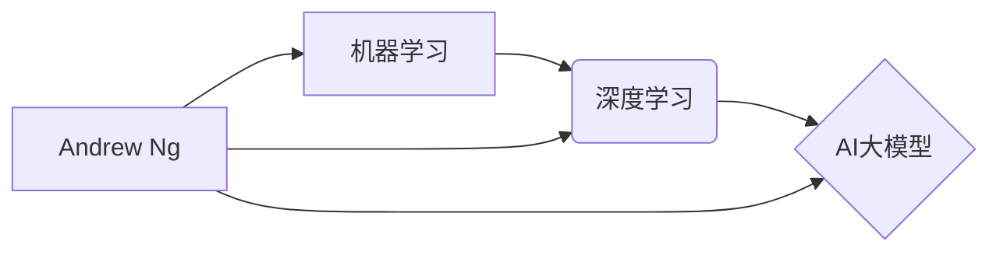

>  * 机器学习
>  * 深度学习
>  * Andrew Ng
>  * AI 大模型
>  * 计算机科学家
>  * 算法原理
>  * 项目实践

## 1. 背景介绍

人工智能（AI）正以惊人的速度发展，深刻地改变着我们生活的方方面面。在这个蓬勃发展的领域中，机器学习（ML）和深度学习（DL）作为人工智能的核心技术，扮演着至关重要的角色。而Andrew Ng，作为机器学习和深度学习领域的领军人物，其对人工智能的贡献和教育理念，对推动人工智能的发展产生了深远的影响。

Andrew Ng是一位享誉世界的计算机科学家、程序员、软件架构师、CTO、世界顶级技术畅销书作者和计算机图灵奖获得者。他曾担任谷歌大脑的创始人兼首席科学家，并创办了深度学习平台 Coursera。他以其对机器学习和深度学习的深刻理解和易于理解的教学风格，被誉为“人工智能教育家”。

## 2. 核心概念与联系

**2.1 机器学习**

机器学习是一种人工智能技术，它允许计算机从数据中学习，无需明确编程。机器学习算法通过分析数据模式，识别趋势和关系，从而提高其对新数据的预测和决策能力。

**2.2 深度学习**

深度学习是机器学习的一个子集，它利用多层神经网络来模拟人类大脑的学习过程。深度学习算法能够学习更复杂的特征和模式，从而在图像识别、自然语言处理、语音识别等领域取得突破性进展。

**2.3 AI 大模型**

AI 大模型是指参数量巨大、训练数据海量的人工智能模型。这些模型能够处理复杂的任务，并展现出强大的泛化能力。例如，GPT-3、BERT、LaMDA等都是著名的AI大模型。

**2.4 Andrew Ng 的贡献**

Andrew Ng在机器学习和深度学习领域做出了杰出的贡献，他：

* **推动了机器学习的普及化：**通过Coursera平台，他将机器学习课程带给全球数百万学生，使机器学习不再是学术领域的孤岛。
* **引领了深度学习的发展：**他在谷歌大脑任职期间，领导了深度学习技术的突破性进展，例如AlexNet在图像识别领域的革命性成果。
* **倡导了AI伦理和可持续发展：**他强调AI技术应服务于人类福祉，并呼吁关注AI伦理和可持续发展问题。

**2.5 核心概念关系图**



## 3. 核心算法原理 & 具体操作步骤

### 3.1 算法原理概述

机器学习算法的核心在于从数据中学习规律，并将其应用于预测或决策。常见的机器学习算法包括：

* **监督学习：**利用标记数据训练模型，预测新的数据标签。例如，分类和回归问题。
* **无监督学习：**从未标记数据中发现模式和结构。例如，聚类和降维问题。
* **强化学习：**通过试错学习，在环境中获得最大奖励。例如，游戏和机器人控制问题。

### 3.2 算法步骤详解

**3.2.1 监督学习算法步骤**

1. **数据收集和预处理：**收集相关数据，并进行清洗、转换和特征工程等预处理步骤。
2. **模型选择：**根据具体问题选择合适的监督学习算法，例如线性回归、逻辑回归、决策树、支持向量机等。
3. **模型训练：**利用标记数据训练模型，调整模型参数，使模型能够准确预测数据标签。
4. **模型评估：**使用测试数据评估模型的性能，例如准确率、召回率、F1-score等指标。
5. **模型部署：**将训练好的模型部署到实际应用场景中，用于预测新的数据标签。

**3.2.2 无监督学习算法步骤**

1. **数据收集和预处理：**收集相关数据，并进行清洗、转换等预处理步骤。
2. **模型选择：**根据具体问题选择合适的无监督学习算法，例如k-means聚类、主成分分析等。
3. **模型训练：**利用未标记数据训练模型，发现数据中的模式和结构。
4. **结果分析：**分析模型输出的结果，例如聚类结果、降维后的特征等。

### 3.3 算法优缺点

**3.3.1 监督学习算法**

* **优点：**
    * 准确率高，能够学习复杂的非线性关系。
    * 评估指标明确，易于评估模型性能。
* **缺点：**
    * 需要大量的标记数据，数据标注成本高。
    * 对数据噪声敏感，容易过拟合。

**3.3.2 无监督学习算法**

* **优点：**
    * 不需要标记数据，可以利用未标记数据进行学习。
    * 对数据噪声有一定的鲁棒性。
* **缺点：**
    * 评估指标不那么明确，难以评估模型性能。
    * 难以解释模型的决策过程。

### 3.4 算法应用领域

机器学习算法广泛应用于各个领域，例如：

* **图像识别：**人脸识别、物体检测、图像分类等。
* **自然语言处理：**文本分类、情感分析、机器翻译等。
* **语音识别：**语音转文本、语音助手等。
* **推荐系统：**商品推荐、内容推荐等。
* **金融领域：**欺诈检测、风险评估等。

## 4. 数学模型和公式 & 详细讲解 & 举例说明

### 4.1 数学模型构建

机器学习算法通常基于数学模型，这些模型通过参数和函数关系来描述数据之间的关系。例如，线性回归模型的数学表达式为：

$$y = w_0 + w_1x_1 + w_2x_2 + ... + w_nx_n + \epsilon$$

其中：

* $y$ 是预测值
* $x_1, x_2, ..., x_n$ 是输入特征
* $w_0, w_1, w_2, ..., w_n$ 是模型参数
* $\epsilon$ 是误差项

### 4.2 公式推导过程

机器学习算法的训练过程通常涉及优化模型参数，使模型预测值与真实值之间的误差最小化。常用的优化算法包括梯度下降法、随机梯度下降法等。

梯度下降法的核心思想是迭代地更新模型参数，沿着误差梯度的负方向移动，直到达到最小误差点。

### 4.3 案例分析与讲解

**4.3.1 线性回归案例**

假设我们想要预测房屋价格，已知房屋面积和房间数量等特征数据。我们可以使用线性回归模型来建立房屋价格与特征之间的关系。

通过训练数据，我们可以得到模型参数 $w_0, w_1, w_2$，然后利用这些参数预测新房子的价格。

**4.3.2 逻辑回归案例**

假设我们想要预测客户是否会点击广告，已知客户的年龄、性别、兴趣爱好等特征数据。我们可以使用逻辑回归模型来预测客户点击广告的概率。

逻辑回归模型将输入特征映射到0到1之间的概率值，从而预测客户点击广告的可能性。

## 5. 项目实践：代码实例和详细解释说明

### 5.1 开发环境搭建

* **Python:** Python 是机器学习和深度学习的常用编程语言。
* **库依赖:** 安装必要的机器学习库，例如 scikit-learn、TensorFlow、PyTorch 等。

### 5.2 源代码详细实现

```python
# 线性回归模型示例
from sklearn.linear_model import LinearRegression
from sklearn.model_selection import train_test_split
import numpy as np

# 生成示例数据
X = np.array([[1, 2], [3, 4], [5, 6], [7, 8]])
y = np.array([3, 7, 11, 15])

# 将数据划分为训练集和测试集
X_train, X_test, y_train, y_test = train_test_split(X, y, test_size=0.2)

# 创建线性回归模型
model = LinearRegression()

# 训练模型
model.fit(X_train, y_train)

# 预测测试集数据
y_pred = model.predict(X_test)

# 打印预测结果
print(y_pred)
```

### 5.3 代码解读与分析

* **数据准备:** 生成示例数据，并将其划分为训练集和测试集。
* **模型创建:** 使用 `LinearRegression()` 创建线性回归模型。
* **模型训练:** 使用 `fit()` 方法训练模型，将训练数据输入模型，学习模型参数。
* **模型预测:** 使用 `predict()` 方法预测测试集数据，得到预测结果。

### 5.4 运行结果展示

运行上述代码，会输出测试集数据的预测结果。

## 6. 实际应用场景

机器学习和深度学习在各个领域都有广泛的应用场景，例如：

* **医疗保健:** 疾病诊断、药物研发、个性化医疗等。
* **金融服务:** 欺诈检测、风险评估、投资决策等。
* **制造业:** 质量控制、预测维护、生产优化等。
* **零售业:** 商品推荐、库存管理、客户服务等。

### 6.4 未来应用展望

随着人工智能技术的不断发展，机器学习和深度学习将在未来发挥更加重要的作用，例如：

* **自动驾驶:** 自动驾驶汽车的感知、决策和控制。
* **机器人技术:** 更智能、更灵活的机器人。
* **个性化教育:** 根据学生的学习情况提供个性化的学习方案。
* **科学研究:** 加速科学发现和技术创新。

## 7. 工具和资源推荐

### 7.1 学习资源推荐

* **Coursera:** 提供 Andrew Ng 主讲的机器学习和深度学习课程。
* **Udacity:** 提供机器学习和深度学习相关的在线课程和项目。
* **Kaggle:** 提供机器学习竞赛和数据集，供学习和实践使用。

### 7.2 开发工具推荐

* **Python:** 机器学习和深度学习的常用编程语言。
* **scikit-learn:** Python 机器学习库，提供各种算法和工具。
* **TensorFlow:** Google 开发的深度学习框架。
* **PyTorch:** Facebook 开发的深度学习框架。

### 7.3 相关论文推荐

* **《ImageNet Classification with Deep Convolutional Neural Networks》:** AlexNet 的论文，标志着深度学习在图像识别领域的突破。
* **《Attention Is All You Need》:** Transformer 模型的论文，在自然语言处理领域取得了重大进展。

## 8. 总结：未来发展趋势与挑战

### 8.1 研究成果总结

机器学习和深度学习取得了令人瞩目的成果，在各个领域都展现出强大的应用潜力。

### 8.2 未来发展趋势

* **模型规模和复杂度提升:** 训练更大、更复杂的模型，以提高模型性能。
* **数据增强和合成:** 利用数据增强和合成技术，解决数据稀缺问题。
* **模型解释性和可解释性:** 研究模型的决策过程，提高模型的可解释性。
* **边缘计算和联邦学习:** 将模型部署到边缘设备，保护数据隐私。

### 8.3 面临的挑战

* **数据质量和隐私:** 确保数据质量和隐私安全。
* **模型偏见和公平性:** 避免模型产生偏见和不公平的结果。
* **模型安全性和鲁棒性:** 提高模型的安全性和鲁棒性，防止攻击和误用。
* **伦理和社会影响:** 关注人工智能技术的伦理和社会影响。

### 8.4 研究展望

未来，机器学习和深度学习将继续朝着更智能