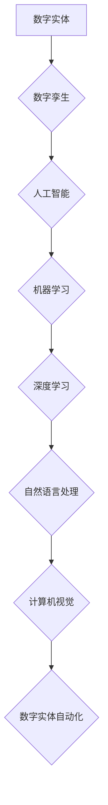

> 数字实体、自动化、人工智能、机器学习、深度学习、自然语言处理、计算机视觉

## 1. 背景介绍

随着人工智能技术的飞速发展，我们正处于一个全新的技术变革时代——AI2.0时代。与前一代人工智能（AI1.0）相比，AI2.0更加智能、更加通用，能够理解和处理更复杂的信息。其中，数字实体自动化的潜力是AI2.0时代最令人兴奋的应用之一。

数字实体是指用代码表示的虚拟对象，它可以模拟现实世界中的实体，例如产品、服务、设备、人员等。数字实体自动化是指利用人工智能技术，自动创建、管理和操作数字实体，从而实现对现实世界实体的自动化控制和管理。

数字实体自动化的应用场景非常广泛，例如：

* **智能制造：** 自动化生产线，实现智能制造。
* **智慧城市：** 智能交通管理、环境监测、公共服务等。
* **金融科技：** 自动化金融交易、风险管理、客户服务等。
* **医疗健康：** 智能诊断、个性化治疗、药物研发等。

## 2. 核心概念与联系

数字实体自动化涉及多个核心概念，包括：

* **数字孪生：** 数字孪生是指与物理实体对应的虚拟模型，它可以实时反映物理实体的状态和行为。
* **人工智能：** 人工智能是指模拟人类智能的计算机系统，它可以学习、推理、决策等。
* **机器学习：** 机器学习是人工智能的一种实现方式，它通过算法从数据中学习，不断提高其性能。
* **深度学习：** 深度学习是机器学习的一种高级形式，它使用多层神经网络来模拟人类大脑的学习过程。
* **自然语言处理：** 自然语言处理是指计算机理解和处理人类语言的技术。
* **计算机视觉：** 计算机视觉是指计算机理解和处理图像的技术。

这些核心概念相互关联，共同构成了数字实体自动化的基础。

**Mermaid 流程图：**



## 3. 核心算法原理 & 具体操作步骤

### 3.1  算法原理概述

数字实体自动化的核心算法主要包括：

* **知识图谱构建算法：** 用于构建数字实体之间的知识关系图谱。
* **机器学习模型训练算法：** 用于训练机器学习模型，使其能够理解和处理数字实体的信息。
* **行为预测算法：** 用于预测数字实体的行为，并根据预测结果进行控制。
* **优化算法：** 用于优化数字实体的运行状态和性能。

### 3.2  算法步骤详解

数字实体自动化的具体操作步骤如下：

1. **数据采集：** 收集与数字实体相关的各种数据，例如传感器数据、文本数据、图像数据等。
2. **数据预处理：** 对采集到的数据进行清洗、转换、格式化等预处理操作。
3. **知识图谱构建：** 利用知识图谱构建算法，构建数字实体之间的知识关系图谱。
4. **机器学习模型训练：** 利用机器学习模型训练算法，训练机器学习模型，使其能够理解和处理数字实体的信息。
5. **行为预测：** 利用行为预测算法，预测数字实体的行为，并根据预测结果进行控制。
6. **优化控制：** 利用优化算法，优化数字实体的运行状态和性能。
7. **监控与评估：** 对数字实体的运行状态进行监控和评估，并根据评估结果进行调整和优化。

### 3.3  算法优缺点

数字实体自动化算法的优点包括：

* **自动化程度高：** 可以自动完成许多重复性任务，提高效率。
* **智能化程度高：** 可以根据数据和知识进行智能决策，提高准确性。
* **可扩展性强：** 可以轻松扩展到新的领域和应用场景。

数字实体自动化算法的缺点包括：

* **数据依赖性强：** 需要大量的数据进行训练和运行。
* **算法复杂度高：** 需要复杂的算法和模型进行实现。
* **安全风险：** 数字实体的自动化控制可能会带来安全风险。

### 3.4  算法应用领域

数字实体自动化算法的应用领域非常广泛，例如：

* **智能制造：** 自动化生产线，实现智能制造。
* **智慧城市：** 智能交通管理、环境监测、公共服务等。
* **金融科技：** 自动化金融交易、风险管理、客户服务等。
* **医疗健康：** 智能诊断、个性化治疗、药物研发等。

## 4. 数学模型和公式 & 详细讲解 & 举例说明

### 4.1  数学模型构建

数字实体自动化的数学模型通常基于概率论、统计学和机器学习等数学基础。

例如，在预测数字实体行为时，可以使用马尔科夫链模型来描述数字实体的状态转移概率。

**马尔科夫链模型：**

$$
P(s_t|s_{t-1}, s_{t-2}, ..., s_0) = P(s_t|s_{t-1})
$$

其中：

* $s_t$ 表示数字实体在时间 $t$ 的状态。
* $P(s_t|s_{t-1})$ 表示数字实体从状态 $s_{t-1}$ 转移到状态 $s_t$ 的概率。

### 4.2  公式推导过程

马尔科夫链模型的推导过程基于马尔科夫假设，即数字实体的未来状态只依赖于其当前状态，而与过去的任何状态无关。

### 4.3  案例分析与讲解

例如，假设一个数字实体代表一个网站的访问量，我们可以使用马尔科夫链模型来预测网站的未来访问量。

如果我们观察到网站的访问量在过去几天内呈上升趋势，那么我们可以根据马尔科夫链模型推断出网站的未来访问量也可能继续上升。

## 5. 项目实践：代码实例和详细解释说明

### 5.1  开发环境搭建

数字实体自动化项目可以使用Python语言进行开发，常用的开发环境包括：

* **Python 3.x:** Python 3.x 是 Python 的最新版本，具有更好的性能和功能。
* **Anaconda:** Anaconda 是一个 Python 数据科学发行版，包含了大量的数据科学工具和库。
* **Jupyter Notebook:** Jupyter Notebook 是一个交互式笔记本环境，方便进行代码编写、调试和演示。

### 5.2  源代码详细实现

以下是一个简单的数字实体自动化代码示例，用于预测数字实体的未来状态：

```python
import numpy as np
from sklearn.linear_model import LogisticRegression

# 数据集
data = np.array([[1, 2], [3, 4], [5, 6], [7, 8]])
labels = np.array([0, 1, 0, 1])

# 训练模型
model = LogisticRegression()
model.fit(data, labels)

# 预测未来状态
new_data = np.array([[9, 10]])
prediction = model.predict(new_data)

# 输出预测结果
print(prediction)
```

### 5.3  代码解读与分析

这段代码首先定义了一个简单的数字实体数据集，然后使用逻辑回归模型训练一个预测模型。

训练完成后，可以使用模型预测新的数字实体的状态。

### 5.4  运行结果展示

运行这段代码后，会输出预测结果，例如：

```
[1]
```

这表示模型预测新的数字实体的状态为 1。

## 6. 实际应用场景

### 6.1  智能制造

数字实体自动化可以应用于智能制造，例如：

* **自动化的生产线：** 数字实体可以模拟生产线上的设备和流程，实现自动化控制和管理。
* **智能库存管理：** 数字实体可以模拟库存中的物品，实现智能库存管理。
* **质量控制：** 数字实体可以模拟产品质量，实现智能质量控制。

### 6.2  智慧城市

数字实体自动化可以应用于智慧城市，例如：

* **智能交通管理：** 数字实体可以模拟交通流量和路况，实现智能交通管理。
* **环境监测：** 数字实体可以模拟环境数据，实现智能环境监测。
* **公共服务：** 数字实体可以模拟公共服务设施，实现智能公共服务。

### 6.3  金融科技

数字实体自动化可以应用于金融科技，例如：

* **自动化金融交易：** 数字实体可以模拟金融市场，实现自动化金融交易。
* **风险管理：** 数字实体可以模拟金融风险，实现智能风险管理。
* **客户服务：** 数字实体可以模拟客户服务人员，实现智能客户服务。

### 6.4  未来应用展望

数字实体自动化的应用前景非常广阔，未来可能会应用于更多领域，例如：

* **医疗健康：** 智能诊断、个性化治疗、药物研发等。
* **教育培训：** 智能教学、个性化学习等。
* **娱乐休闲：** 智能游戏、虚拟现实等。

## 7. 工具和资源推荐

### 7.1  学习资源推荐

* **书籍：**
    * 《人工智能：一种现代方法》
    * 《深度学习》
    * 《机器学习》
* **在线课程：**
    * Coursera
    * edX
    * Udacity

### 7.2  开发工具推荐

* **Python:** Python 是数字实体自动化开发的常用语言。
* **Anaconda:** Anaconda 是 Python 数据科学发行版，包含了大量的数据科学工具和库。
* **Jupyter Notebook:** Jupyter Notebook 是一个交互式笔记本环境，方便进行代码编写、调试和演示。

### 7.3  相关论文推荐

* **《Attention Is All You Need》**
* **《Generative Pre-trained Transformer 3》**
* **《BERT: Pre-training of Deep Bidirectional Transformers for Language Understanding》**

## 8. 总结：未来发展趋势与挑战

### 8.1  研究成果总结

数字实体自动化技术取得了显著的进展，在多个领域取得了成功应用。

### 8.2  未来发展趋势

未来，数字实体自动化技术将朝着以下方向发展：

* **更加智能化：** 利用更先进的机器学习算法和深度学习模型，提高数字实体的智能化程度。
* **更加通用化：** 能够应用于更多领域和场景。
* **更加安全可靠：** 提高数字实体的安全性、可靠性和可解释性。

### 8.3  面临的挑战

数字实体自动化技术也面临着一些挑战：

* **数据获取和处理：** 需要大量的数据进行训练和运行，数据获取和处理是一个难题。
* **算法复杂度：** 数字实体自动化算法的复杂度较高，需要更强大的计算能力。
* **安全风险：** 数字实体的自动化控制可能会带来安全风险，需要加强安全防护。

### 8.4  研究展望

未来，我们需要继续加强对数字实体自动化技术的研发，解决技术难题，推动数字实体自动化技术向更智能、更通用、更安全的方向发展。

## 9. 附录：常见问题与解答

**常见问题：**

* **什么是数字实体？**

数字实体是指用代码表示的虚拟对象，它可以模拟现实世界中的实体，例如产品、服务、设备、人员等。

* **数字实体自动化有什么应用场景？**

数字实体自动化应用场景非常广泛，例如智能制造、智慧城市、金融科技、医疗健康等。

* **数字实体自动化技术有哪些挑战？**

数字实体自动化技术面临着数据获取和处理、算法复杂度、安全风险等挑战。

**作者：禅与计算机程序设计艺术 / Zen and the Art of Computer Programming**


<end_of_turn>