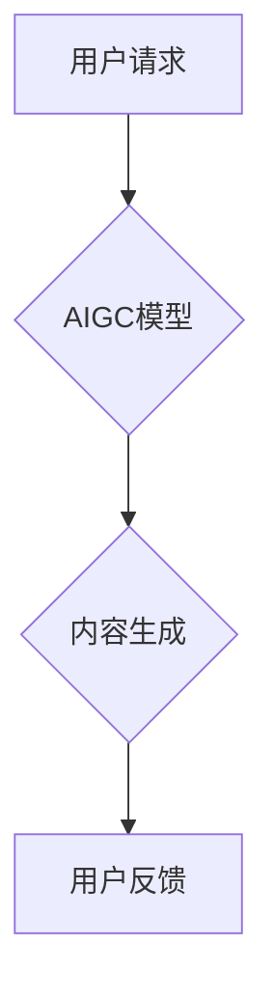

> AIGC,金融科技,银行零售,人工智能,自然语言处理,机器学习,客户体验

## 1. 背景介绍

金融科技（FinTech）的蓬勃发展正在深刻地改变着金融行业的面貌。其中，人工智能（AI）作为FinTech的核心驱动力之一，正在推动着金融服务的创新和转型。近年来，随着人工智能技术的快速发展，特别是生成式人工智能（AIGC）的兴起，其在金融领域的应用场景不断拓展，为银行零售业务带来了新的机遇和挑战。

AIGC是指利用人工智能技术生成文本、图像、音频、视频等各种新内容的模型。与传统的AI技术相比，AIGC更加注重内容的创造性和表达能力，能够生成更具创意和个性化的内容。在金融行业，AIGC可以应用于客户服务、风险管理、产品开发等多个领域，帮助银行提升客户体验、降低运营成本、提高业务效率。

## 2. 核心概念与联系

**2.1 AIGC 的核心概念**

AIGC的核心概念是利用深度学习算法训练模型，使其能够理解和生成人类语言和内容。常见的AIGC模型包括：

* **文本生成模型:** 例如GPT-3、LaMDA等，能够生成高质量的文本内容，如文章、故事、对话等。
* **图像生成模型:** 例如DALL-E 2、Stable Diffusion等，能够根据文本描述生成逼真的图像。
* **音频生成模型:** 例如Jukebox、WaveNet等，能够生成逼真的语音和音乐。

**2.2 AIGC 与金融行业的联系**

AIGC在金融行业具有广泛的应用场景，例如：

* **客户服务:** 利用AIGC构建智能客服机器人，能够24小时在线解答客户疑问，提供个性化服务，提高客户满意度。
* **风险管理:** 利用AIGC分析海量金融数据，识别潜在的风险，提高风险预警和防控能力。
* **产品开发:** 利用AIGC生成个性化的金融产品方案，满足不同客户的需求。
* **营销推广:** 利用AIGC生成创意的营销文案和广告，提高营销效果。

**2.3 AIGC 在银行零售业务中的应用场景**

在银行零售业务中，AIGC可以帮助银行打造更智能、更便捷、更个性化的客户体验。例如：

* **智能理财顾问:** 利用AIGC分析客户的财务状况和风险偏好，提供个性化的理财建议。
* **个性化贷款服务:** 利用AIGC根据客户的信用记录和收入情况，提供个性化的贷款方案。
* **智能客服机器人:** 利用AIGC解答客户关于账户、交易、产品等方面的疑问，提高客户服务效率。

**2.4 AIGC 架构图**



## 3. 核心算法原理 & 具体操作步骤

**3.1 算法原理概述**

AIGC的核心算法原理是深度学习，特别是Transformer模型。Transformer模型能够捕捉文本序列中的长距离依赖关系，从而生成更流畅、更自然的文本内容。

**3.2 算法步骤详解**

AIGC模型的训练过程通常包括以下步骤：

1. **数据预处理:** 收集和清洗文本数据，将其转换为模型可以理解的格式。
2. **模型训练:** 利用深度学习算法训练AIGC模型，使其能够生成高质量的文本内容。
3. **模型评估:** 使用测试数据评估模型的性能，并根据评估结果进行模型调优。
4. **模型部署:** 将训练好的模型部署到生产环境中，用于实际应用。

**3.3 算法优缺点**

**优点:**

* 生成高质量的文本内容
* 能够捕捉文本序列中的长距离依赖关系
* 可用于多种文本生成任务

**缺点:**

* 训练数据量大，训练成本高
* 模型参数量大，部署成本高
* 容易受到训练数据偏差的影响

**3.4 算法应用领域**

AIGC算法广泛应用于以下领域：

* 文本生成
* 机器翻译
* 语音识别
* 图像描述
* 代码生成

## 4. 数学模型和公式 & 详细讲解 & 举例说明

**4.1 数学模型构建**

AIGC模型通常基于Transformer架构，其核心是注意力机制。注意力机制能够帮助模型关注文本序列中重要的信息，从而生成更准确、更相关的文本内容。

**4.2 公式推导过程**

注意力机制的计算公式如下：

$$
Attention(Q, K, V) = softmax(\frac{QK^T}{\sqrt{d_k}})V
$$

其中：

* $Q$：查询矩阵
* $K$：键矩阵
* $V$：值矩阵
* $d_k$：键向量的维度
* $softmax$：softmax函数

**4.3 案例分析与讲解**

例如，在机器翻译任务中，AIGC模型会将源语言文本转换为查询矩阵 $Q$，目标语言词典转换为键矩阵 $K$ 和值矩阵 $V$。通过计算注意力权重，模型能够关注源语言文本中与目标语言词语相关的部分，从而生成更准确的翻译结果。

## 5. 项目实践：代码实例和详细解释说明

**5.1 开发环境搭建**

AIGC模型的开发环境通常需要以下软件：

* Python 3.x
* TensorFlow 或 PyTorch 深度学习框架
* CUDA 和 cuDNN GPU加速库

**5.2 源代码详细实现**

以下是一个使用PyTorch训练文本生成模型的简单代码示例：

```python
import torch
import torch.nn as nn

class TextGenerator(nn.Module):
    def __init__(self, vocab_size, embedding_dim, hidden_dim):
        super(TextGenerator, self).__init__()
        self.embedding = nn.Embedding(vocab_size, embedding_dim)
        self.lstm = nn.LSTM(embedding_dim, hidden_dim)
        self.fc = nn.Linear(hidden_dim, vocab_size)

    def forward(self, x):
        embedded = self.embedding(x)
        output, (hidden, cell) = self.lstm(embedded)
        output = self.fc(output[:, -1, :])
        return output

# ... 模型训练代码 ...
```

**5.3 代码解读与分析**

该代码定义了一个简单的文本生成模型，其结构包括嵌入层、LSTM层和全连接层。嵌入层将单词转换为向量表示，LSTM层捕捉文本序列中的长距离依赖关系，全连接层将LSTM输出映射到词汇表中。

**5.4 运行结果展示**

训练好的模型可以用于生成新的文本内容。例如，可以输入一个单词作为种子，模型会根据训练数据生成后续的单词，从而生成一段完整的文本。

## 6. 实际应用场景

**6.1 智能客服机器人**

AIGC可以用于构建智能客服机器人，帮助银行解答客户常见问题，提供24小时在线服务。例如，客户可以通过聊天机器人查询账户余额、转账、办理贷款等业务。

**6.2 个性化理财建议**

AIGC可以分析客户的财务状况、风险偏好和投资目标，提供个性化的理财建议。例如，AIGC可以根据客户的风险承受能力推荐合适的投资产品，帮助客户实现财富增值。

**6.3 营销推广**

AIGC可以生成创意的营销文案和广告，提高营销效果。例如，AIGC可以根据目标客户群体的特征生成个性化的广告内容，提高广告点击率和转化率。

**6.4 未来应用展望**

随着AIGC技术的不断发展，其在银行零售业务中的应用场景将更加广泛。例如，AIGC可以用于：

* 生成个性化的金融产品方案
* 自动化金融文档处理
* 提升金融风险管理能力
* 提供更智能、更便捷的金融服务

## 7. 工具和资源推荐

**7.1 学习资源推荐**

* **书籍:**
    * 《深度学习》
    * 《自然语言处理》
* **在线课程:**
    * Coursera: 深度学习
    * Udacity: 自然语言处理
* **博客和论坛:**
    * TensorFlow博客
    * PyTorch论坛

**7.2 开发工具推荐**

* **深度学习框架:** TensorFlow, PyTorch
* **自然语言处理库:** NLTK, spaCy
* **云计算平台:** AWS, Azure, GCP

**7.3 相关论文推荐**

* Attention Is All You Need
* BERT: Pre-training of Deep Bidirectional Transformers for Language Understanding

## 8. 总结：未来发展趋势与挑战

**8.1 研究成果总结**

AIGC在金融行业取得了显著的成果，例如智能客服机器人、个性化理财建议等应用场景已经得到广泛应用。

**8.2 未来发展趋势**

未来AIGC技术将朝着以下方向发展：

* 模型规模更大、性能更强
* 应用场景更加广泛
* 更加注重数据安全和隐私保护

**8.3 面临的挑战**

AIGC技术还面临一些挑战，例如：

* 数据获取和标注成本高
* 模型解释性和可信度低
* 伦理和法律问题

**8.4 研究展望**

未来研究将重点关注以下方面：

* 开发更强大的AIGC模型
* 提高模型的解释性和可信度
* 解决AIGC技术带来的伦理和法律问题


## 9. 附录：常见问题与解答

**9.1 如何选择合适的AIGC模型？**

选择合适的AIGC模型需要根据具体的应用场景和需求进行选择。例如，如果需要生成高质量的文本内容，可以选择GPT-3等大型语言模型；如果需要生成图像，可以选择DALL-E 2等图像生成模型。

**9.2 如何训练AIGC模型？**

训练AIGC模型需要大量的文本数据和计算资源。可以使用深度学习框架，例如TensorFlow或PyTorch，进行模型训练。

**9.3 如何评估AIGC模型的性能？**

AIGC模型的性能可以根据不同的指标进行评估，例如准确率、流畅度、多样性等。可以使用测试数据对模型进行评估，并根据评估结果进行模型调优。


作者：禅与计算机程序设计艺术 / Zen and the Art of Computer Programming 
<end_of_turn>