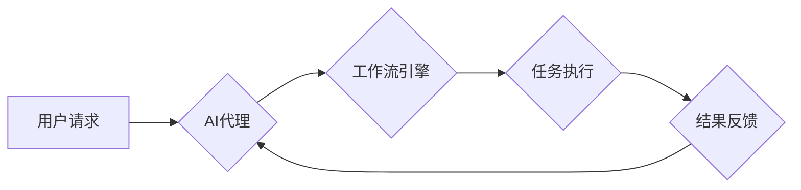

> AI代理，工作流，电子商务，自动化，智能化，客户服务，推荐系统

## 1. 背景介绍

电子商务行业在全球范围内蓬勃发展，其核心是高效便捷的交易流程和优质的客户服务。随着数据量的激增和人工智能技术的快速发展，如何利用AI技术提升电子商务效率和用户体验成为一个重要的研究方向。

AI代理（AI Agent）作为一种智能化的软件系统，能够自主学习、决策和执行任务，在电子商务领域展现出巨大的应用潜力。AI代理工作流（AI Agent WorkFlow）是指利用AI代理技术构建自动化、智能化的业务流程，能够有效解决电子商务中复杂、重复性任务，提升整体运营效率。

## 2. 核心概念与联系

**2.1 AI代理的概念**

AI代理是一种能够感知环境、做出决策并执行行动的智能软件系统。它通常具有以下特征：

* **自主性:** AI代理能够独立完成任务，无需人工干预。
* **智能化:** AI代理能够通过学习和推理，做出最优决策。
* **交互性:** AI代理能够与用户、系统和其他代理进行交互。

**2.2 工作流的概念**

工作流是一种描述业务流程的模型，它定义了任务的顺序、依赖关系和执行规则。工作流管理系统能够自动执行工作流，提高工作效率和协作效率。

**2.3 AI代理工作流的联系**

AI代理工作流将AI代理技术与工作流管理技术相结合，构建了一种智能化的业务流程管理系统。AI代理能够自动执行工作流中的任务，并根据环境变化和用户需求进行决策调整，从而实现自动化、智能化和高效化的业务流程管理。

**2.4 AI代理工作流架构**



**2.5 AI代理工作流的优势**

* **自动化:** 自动化重复性任务，提高效率。
* **智能化:** 基于AI算法，智能决策，提升服务质量。
* **可扩展性:** 灵活配置工作流，适应业务变化。
* **可维护性:** 代码结构清晰，易于维护和升级。

## 3. 核心算法原理 & 具体操作步骤

**3.1 算法原理概述**

AI代理工作流的核心算法主要包括：

* **状态识别:** AI代理通过感知环境信息，识别当前状态。
* **决策推理:** 基于状态识别和知识库，AI代理进行决策推理，选择最佳行动。
* **任务执行:** AI代理执行决策结果，完成任务。
* **反馈学习:** AI代理根据任务执行结果，进行反馈学习，不断优化决策策略。

**3.2 算法步骤详解**

1. **用户请求:** 用户发起请求，例如购买商品、咨询客服等。
2. **状态识别:** AI代理接收用户请求，识别用户状态和需求。
3. **决策推理:** AI代理根据用户状态、知识库和规则引擎，进行决策推理，选择合适的业务流程。
4. **任务执行:** AI代理执行决策结果，例如跳转到商品页面、联系客服等。
5. **结果反馈:** AI代理接收任务执行结果，反馈给用户，并进行学习和优化。

**3.3 算法优缺点**

**优点:**

* 自动化程度高，提高效率。
* 智能化决策，提升服务质量。
* 可扩展性强，适应业务变化。

**缺点:**

* 需要大量的训练数据和规则定义。
* 算法复杂度高，开发难度大。
* 缺乏对复杂场景的处理能力。

**3.4 算法应用领域**

* 电子商务：商品推荐、订单处理、客户服务等。
* 金融服务：风险评估、欺诈检测、理财咨询等。
* 制造业：生产调度、质量控制、设备维护等。

## 4. 数学模型和公式 & 详细讲解 & 举例说明

**4.1 数学模型构建**

AI代理工作流的数学模型可以基于状态机和决策树等模型构建。

* **状态机模型:** 将系统状态和状态转换规则定义为状态机，AI代理根据当前状态选择合适的转换规则，实现状态转移。
* **决策树模型:** 将决策规则和知识库构建为决策树，AI代理根据用户输入和环境信息，沿着决策树路径进行决策。

**4.2 公式推导过程**

例如，在商品推荐场景中，可以使用协同过滤算法进行推荐。协同过滤算法的核心公式为：

$$
r_{ui} = \frac{\sum_{j \in N(u)} \frac{r_{uj} \cdot s_{ij}}{\sum_{k \in N(u)} s_{uk}}}{\sum_{j \in N(u)} \frac{s_{ij}}{\sum_{k \in N(u)} s_{uk}}}
$$

其中：

* $r_{ui}$: 用户 $u$ 对商品 $i$ 的评分。
* $r_{uj}$: 用户 $u$ 对商品 $j$ 的评分。
* $s_{ij}$: 用户 $u$ 和用户 $j$ 的相似度。
* $N(u)$: 用户 $u$ 的邻居用户集合。

**4.3 案例分析与讲解**

假设用户 $A$ 对商品 $1$ 和 $2$ 的评分分别为 $5$ 和 $4$，用户 $B$ 对商品 $1$ 和 $3$ 的评分分别为 $4$ 和 $5$，用户 $A$ 和 $B$ 的相似度为 $0.8$。根据公式，可以计算用户 $A$ 对商品 $3$ 的评分预测值。

## 5. 项目实践：代码实例和详细解释说明

**5.1 开发环境搭建**

* Python 3.x
* TensorFlow 或 PyTorch
* Flask 或 Django

**5.2 源代码详细实现**

```python
# AI代理工作流示例代码

from flask import Flask, request, jsonify

app = Flask(__name__)

# 知识库
knowledge_base = {
    "商品推荐": {
        "用户": ["用户A", "用户B"],
        "商品": ["商品1", "商品2", "商品3"],
        "评分": {
            "用户A": {"商品1": 5, "商品2": 4},
            "用户B": {"商品1": 4, "商品3": 5}
        }
    }
}

# 决策规则
decision_rules = {
    "商品推荐": {
        "条件": "用户评分大于3",
        "动作": "推荐商品"
    }
}

@app.route('/ai_agent', methods=['POST'])
def ai_agent():
    data = request.get_json()
    user_id = data.get('user_id')
    product_id = data.get('product_id')

    # 状态识别
    user_state = knowledge_base["商品推荐"]["用户"].index(user_id)

    # 决策推理
    decision = decision_rules["商品推荐"]["动作"]

    # 任务执行
    if decision == "推荐商品":
        # 根据用户评分和商品信息，推荐商品
        recommended_products = []
        # ...

        return jsonify({'recommended_products': recommended_products})
    else:
        return jsonify({'message': '无法推荐商品'})

if __name__ == '__main__':
    app.run(debug=True)
```

**5.3 代码解读与分析**

* 代码定义了AI代理工作流的基本结构，包括知识库、决策规则、状态识别、决策推理和任务执行。
* 知识库存储了用户、商品和评分信息。
* 决策规则定义了根据用户状态和知识库，选择合适的行动。
* 状态识别根据用户输入识别当前状态。
* 决策推理根据状态识别和决策规则，选择最佳行动。
* 任务执行根据决策结果，执行相应的任务。

**5.4 运行结果展示**

当用户发送POST请求到`/ai_agent`接口，并提供用户ID和商品ID，AI代理将根据知识库和决策规则，推荐相关的商品。

## 6. 实际应用场景

**6.1 商品推荐**

AI代理可以根据用户的浏览历史、购买记录和评分等信息，推荐个性化的商品。

**6.2 订单处理**

AI代理可以自动处理订单，例如确认订单、安排物流、处理退换货等。

**6.3 客户服务**

AI代理可以作为智能客服，回答用户常见问题，提供在线咨询服务。

**6.4 其他应用场景**

* 会员管理
* 促销活动
* 数据分析

**6.5 未来应用展望**

随着人工智能技术的不断发展，AI代理工作流将在电子商务领域得到更广泛的应用，例如：

* 更智能化的个性化推荐
* 更高效的自动化流程
* 更人性化的客户服务

## 7. 工具和资源推荐

**7.1 学习资源推荐**

* **书籍:**
    * 《人工智能：现代方法》
    * 《深度学习》
* **在线课程:**
    * Coursera: 人工智能
    * edX: 深度学习
* **开源项目:**
    * TensorFlow
    * PyTorch

**7.2 开发工具推荐**

* **Python:** 
* **Flask 或 Django:** Web框架
* **TensorFlow 或 PyTorch:** 深度学习框架

**7.3 相关论文推荐**

* **Reinforcement Learning: An Introduction**
* **Deep Learning**

## 8. 总结：未来发展趋势与挑战

**8.1 研究成果总结**

AI代理工作流在电子商务领域取得了显著的成果，例如提高了效率、个性化推荐、智能化客服等。

**8.2 未来发展趋势**

* 更智能化的决策算法
* 更强大的自然语言处理能力
* 更完善的隐私保护机制

**8.3 面临的挑战**

* 算法复杂度高，开发难度大
* 数据安全和隐私保护
* 对复杂场景的处理能力不足

**8.4 研究展望**

未来研究将重点关注以下方面：

* 开发更智能、更鲁棒的决策算法
* 提升AI代理的自然语言理解和交互能力
* 研究AI代理在电子商务中的伦理和社会影响


## 9. 附录：常见问题与解答

**9.1 如何构建AI代理工作流？**

构建AI代理工作流需要以下步骤：

1. 确定业务流程
2. 定义知识库和决策规则
3. 选择合适的AI算法
4. 开发AI代理系统
5. 测试和部署系统

**9.2 AI代理工作流的安全性如何保障？**

AI代理工作流的安全性可以通过以下措施保障：

* 数据加密
* 身份验证和授权
* 访问控制
* 安全审计

**9.3 AI代理工作流的伦理问题如何解决？**

AI代理工作流的伦理问题需要通过以下方式解决：

* 明确AI代理的职责和边界
* 确保AI代理的决策透明和可解释
* 尊重用户隐私和数据安全
* 避免AI代理造成不公平或歧视

作者：禅与计算机程序设计艺术 / Zen and the Art of Computer Programming


<end_of_turn>