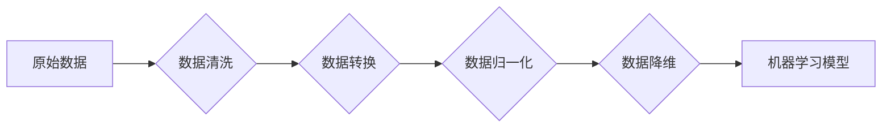

> 数据预处理，机器学习，特征工程，数据清洗，数据转换，数据归一化，数据标准化，异常值处理，数据降维

## 1. 背景介绍

在机器学习领域，数据预处理是构建高质量机器学习模型的基础环节。高质量的数据预处理可以有效地提高模型的准确性、鲁棒性和泛化能力。然而，现实世界中的数据往往是脏乱、不完整、不一致的，需要经过一系列的处理步骤才能用于机器学习算法训练。

数据预处理是一个复杂的过程，涉及到数据清洗、数据转换、数据归一化、数据降维等多个步骤。不同的机器学习算法对数据预处理的要求也不尽相同，因此需要根据具体的算法和应用场景选择合适的预处理方法。

## 2. 核心概念与联系

数据预处理的核心目标是将原始数据转换为机器学习算法可以理解和处理的形式。



**数据清洗:** 

去除数据中的噪声、缺失值、重复值等异常数据，确保数据质量。

**数据转换:** 

将数据转换为适合机器学习算法的格式，例如将类别型数据转换为数值型数据。

**数据归一化:** 

将数据特征的取值范围缩放到一个固定的区间，例如[0,1]或[-1,1]，避免某些特征由于取值范围较大而对模型训练造成影响。

**数据降维:** 

减少数据的维度，保留数据的核心信息，提高模型训练效率。

## 3. 核心算法原理 & 具体操作步骤

### 3.1  算法原理概述

数据预处理算法主要包括以下几种：

* **缺失值处理:** 

   * 剔除含有缺失值的样本
   * 使用均值、中位数、众数等统计方法填充缺失值
   * 使用机器学习算法预测缺失值

* **异常值处理:** 

   * 剔除异常值
   * 使用异常值处理算法对异常值进行修正

* **数据转换:** 

   * 编码类别型数据
   * 转换数据类型

* **数据归一化:** 

   * Min-Max 归一化
   * Z-score 标准化

* **数据降维:** 

   * 主成分分析 (PCA)
   * 线性判别分析 (LDA)
   * t-SNE

### 3.2  算法步骤详解

**缺失值处理:**

1. 识别数据中的缺失值。
2. 选择合适的缺失值处理方法。
3. 填充缺失值。

**异常值处理:**

1. 识别数据中的异常值。
2. 选择合适的异常值处理方法。
3. 处理异常值。

**数据转换:**

1. 识别需要转换的数据类型。
2. 选择合适的转换方法。
3. 转换数据类型。

**数据归一化:**

1. 选择合适的归一化方法。
2. 计算数据特征的最小值和最大值。
3. 将数据特征的取值范围缩放到目标区间。

**数据降维:**

1. 选择合适的降维方法。
2. 计算数据特征之间的相关性。
3. 选择最主要的特征进行降维。

### 3.3  算法优缺点

**缺失值处理:**

* 优点: 可以有效地减少缺失值对模型的影响。
* 缺点: 可能会导致数据信息丢失。

**异常值处理:**

* 优点: 可以有效地去除对模型训练造成干扰的异常值。
* 缺点: 可能会导致数据信息丢失。

**数据转换:**

* 优点: 可以将数据转换为适合机器学习算法的格式。
* 缺点: 可能会导致数据信息丢失。

**数据归一化:**

* 优点: 可以避免某些特征由于取值范围较大而对模型训练造成影响。
* 缺点: 可能会导致数据分布发生改变。

**数据降维:**

* 优点: 可以提高模型训练效率，减少模型复杂度。
* 缺点: 可能会导致数据信息丢失。

### 3.4  算法应用领域

数据预处理算法广泛应用于各个领域，例如：

* **图像识别:** 

   * 数据清洗: 去除图像中的噪声和杂点。
   * 数据转换: 将图像转换为特征向量。
   * 数据归一化: 将图像特征的取值范围缩放到一个固定的区间。

* **自然语言处理:** 

   * 数据清洗: 去除文本中的停用词和标点符号。
   * 数据转换: 将文本转换为词向量。
   * 数据归一化: 将词向量的取值范围缩放到一个固定的区间。

* **金融预测:** 

   * 数据清洗: 去除金融数据中的异常值和缺失值。
   * 数据转换: 将金融数据转换为时间序列数据。
   * 数据归一化: 将金融数据特征的取值范围缩放到一个固定的区间。

## 4. 数学模型和公式 & 详细讲解 & 举例说明

### 4.1  数学模型构建

数据预处理算法通常基于一些数学模型，例如：

* **线性回归模型:** 用于预测缺失值。
* **K-means 聚类算法:** 用于识别异常值。
* **主成分分析 (PCA) 模型:** 用于数据降维。

### 4.2  公式推导过程

**Min-Max 归一化公式:**

$$x_{norm} = \frac{x - x_{min}}{x_{max} - x_{min}}$$

其中:

* $x_{norm}$ 是归一化后的数据值。
* $x$ 是原始数据值。
* $x_{min}$ 是数据特征的最小值。
* $x_{max}$ 是数据特征的最大值。

**Z-score 标准化公式:**

$$x_{std} = \frac{x - \mu}{\sigma}$$

其中:

* $x_{std}$ 是标准化后的数据值。
* $x$ 是原始数据值。
* $\mu$ 是数据特征的均值。
* $\sigma$ 是数据特征的标准差。

### 4.3  案例分析与讲解

**Min-Max 归一化案例:**

假设我们有一个数据特征，其取值范围为[0, 100]，我们希望将其归一化到[0, 1]的区间。

* $x_{min} = 0$
* $x_{max} = 100$

如果原始数据值为50，则归一化后的数据值为:

$$x_{norm} = \frac{50 - 0}{100 - 0} = 0.5$$

**Z-score 标准化案例:**

假设我们有一个数据特征，其均值为50，标准差为10。如果原始数据值为60，则标准化后的数据值为:

$$x_{std} = \frac{60 - 50}{10} = 1$$

## 5. 项目实践：代码实例和详细解释说明

### 5.1  开发环境搭建

* Python 3.x
* NumPy
* Pandas
* Scikit-learn

### 5.2  源代码详细实现

```python
import pandas as pd
from sklearn.preprocessing import MinMaxScaler, StandardScaler

# 加载数据
data = pd.read_csv('data.csv')

# 数据清洗
# ...

# 数据转换
# ...

# 数据归一化
# 使用 Min-Max 归一化
scaler = MinMaxScaler()
data[['feature1', 'feature2']] = scaler.fit_transform(data[['feature1', 'feature2']])

# 使用 Z-score 标准化
scaler = StandardScaler()
data[['feature3', 'feature4']] = scaler.fit_transform(data[['feature3', 'feature4']])

# 数据降维
# ...

# 保存处理后的数据
data.to_csv('processed_data.csv', index=False)
```

### 5.3  代码解读与分析

* 使用 Pandas 库加载数据。
* 使用 Scikit-learn 库中的 MinMaxScaler 和 StandardScaler 类进行数据归一化。
* 使用其他数据预处理算法进行数据清洗、数据转换和数据降维。
* 保存处理后的数据。

### 5.4  运行结果展示

处理后的数据将存储在 `processed_data.csv` 文件中。

## 6. 实际应用场景

数据预处理在机器学习各个领域都有广泛的应用场景，例如：

* **图像识别:** 

   * 将图像预处理为特征向量，用于训练图像识别模型。
* **自然语言处理:** 

   * 将文本预处理为词向量，用于训练自然语言处理模型。
* **金融预测:** 

   * 将金融数据预处理为时间序列数据，用于训练金融预测模型。

### 6.4  未来应用展望

随着机器学习技术的不断发展，数据预处理将变得更加重要。未来，数据预处理算法将更加智能化、自动化，能够更好地处理复杂的数据。

## 7. 工具和资源推荐

### 7.1  学习资源推荐

* **书籍:**

   * 《Python数据科学手册》
   * 《机器学习实战》

* **在线课程:**

   * Coursera: 数据科学
   * edX: 机器学习

### 7.2  开发工具推荐

* **Python:** 

   * Jupyter Notebook
   * Spyder

* **数据处理工具:**

   * Pandas
   * NumPy

### 7.3  相关论文推荐

* **数据预处理综述:**

   * Data Preprocessing Techniques for Machine Learning

## 8. 总结：未来发展趋势与挑战

### 8.1  研究成果总结

数据预处理算法已经取得了显著的成果，能够有效地提高机器学习模型的性能。

### 8.2  未来发展趋势

* **自动化数据预处理:** 

   * 自动识别数据类型、缺失值、异常值等问题，并自动选择合适的预处理方法。
* **个性化数据预处理:** 

   * 根据不同的应用场景和数据特点，定制化数据预处理方案。
* **可解释性数据预处理:** 

   * 明确数据预处理过程中的每个步骤，并解释其对模型的影响。

### 8.3  面临的挑战

* **数据质量问题:** 

   * 现实世界中的数据往往是脏乱、不完整、不一致的，如何有效地处理这些问题仍然是一个挑战。
* **数据量爆炸:** 

   * 数据量不断增长，如何高效地进行数据预处理是一个重要的挑战。
* **算法复杂度:** 

   * 一些数据预处理算法的复杂度较高，需要更高效的算法和计算资源。

### 8.4  研究展望

未来，数据预处理领域的研究将更加注重自动化、个性化和可解释性，并与其他机器学习领域紧密结合，推动机器学习技术的进一步发展。

## 9. 附录：常见问题与解答

* **如何处理缺失值?**

   * 可以使用均值、中位数、众数等统计方法填充缺失值。也可以使用机器学习算法预测缺失值。

* **如何识别异常值?**

   * 可以使用箱线图、Z-score 等方法识别异常值。

* **如何选择合适的归一化方法?**

   * 不同的归一化方法适用于不同的数据类型和应用场景。

* **如何进行数据降维?**

   * 可以使用主成分分析 (PCA) 、线性判别分析 (LDA) 等方法进行数据降维。


作者：禅与计算机程序设计艺术 / Zen and the Art of Computer Programming 
<end_of_turn>