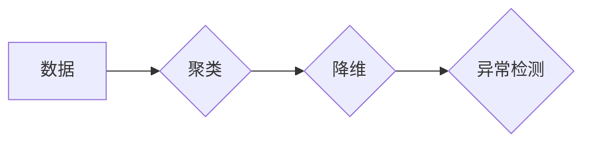

> 无监督学习，聚类算法，降维技术，异常检测，自编码器，K-Means，PCA，t-SNE

## 1. 背景介绍

在人工智能领域，监督学习一直占据着重要的地位。然而，现实世界中，很多问题缺乏明确的标签和标注，这就需要我们探索无监督学习的可能性。无监督学习是指在没有标签数据的情况下，通过挖掘数据本身的内在结构和规律，来进行数据分析、模式识别和知识发现。

无监督学习在各个领域都有着广泛的应用，例如：

* **客户画像分析**: 通过聚类算法将客户群体进行划分，以便更好地进行精准营销。
* **异常检测**: 在金融交易、网络安全等领域，识别异常行为，例如欺诈交易或恶意攻击。
* **数据降维**: 将高维数据降维到低维空间，以便于可视化和分析。
* **推荐系统**: 基于用户行为数据，推荐用户可能感兴趣的内容。

## 2. 核心概念与联系

无监督学习的核心目标是发现数据中的隐藏结构和模式。它主要包括以下几个核心概念：

* **聚类**: 将数据点根据相似性进行分组，每个分组称为一个簇。
* **降维**: 将高维数据映射到低维空间，同时尽量保留数据的原始信息。
* **异常检测**: 识别数据集中与众不同的数据点，这些数据点可能代表着异常行为或错误数据。

这些概念之间存在着密切的联系。例如，降维技术可以帮助我们更好地进行聚类分析，而异常检测可以帮助我们识别聚类结果中的异常点。

**Mermaid 流程图**



## 3. 核心算法原理 & 具体操作步骤

### 3.1  算法原理概述

无监督学习算法有很多种，其中一些最常用的算法包括：

* **K-Means聚类算法**: 是一种基于距离的聚类算法，它将数据点划分为K个簇，每个簇的中心点称为质心。
* **主成分分析(PCA)降维算法**: 是一种线性降维算法，它通过寻找数据中最重要的特征方向来进行降维。
* **t-SNE降维算法**: 是一种非线性降维算法，它可以更好地保留数据的局部结构。
* **自编码器**: 是一种神经网络模型，它可以用于降维和异常检测。

### 3.2  算法步骤详解

**K-Means聚类算法步骤**:

1. 随机选择K个数据点作为初始质心。
2. 将每个数据点分配到距离其最近的质心所在的簇。
3. 计算每个簇的质心。
4. 将数据点重新分配到距离其最近的质心所在的簇。
5. 重复步骤3和步骤4，直到质心不再发生变化。

**PCA降维算法步骤**:

1. 将数据中心化，即每个特征减去其均值。
2. 计算数据的协方差矩阵。
3. 对协方差矩阵进行特征值分解，得到特征向量和特征值。
4. 选择前k个特征向量，其中k是降维后的维度。
5. 将数据投影到选定的特征向量空间，得到降维后的数据。

### 3.3  算法优缺点

**K-Means聚类算法**:

* **优点**: 简单易实现，计算效率高。
* **缺点**: 容易受到初始质心的选择影响，对噪声数据敏感。

**PCA降维算法**:

* **优点**: 可以有效地降低数据维度，保留数据的原始信息。
* **缺点**: 只能处理线性关系的数据，对非线性关系的数据效果较差。

### 3.4  算法应用领域

* **K-Means聚类算法**: 客户画像分析、市场细分、图像分割等。
* **PCA降维算法**: 数据可视化、特征提取、降噪等。

## 4. 数学模型和公式 & 详细讲解 & 举例说明

### 4.1  数学模型构建

**K-Means聚类算法数学模型**:

* **目标函数**: 
$$
J = \sum_{i=1}^{K} \sum_{x \in C_i} ||x - \mu_i||^2
$$
其中，$J$ 是目标函数，$K$ 是簇的数量，$C_i$ 是第 $i$ 个簇，$x$ 是数据点，$\mu_i$ 是第 $i$ 个簇的质心。

* **优化目标**: 找到最优的质心，使得目标函数最小。

**PCA降维算法数学模型**:

* **协方差矩阵**: 
$$
\Sigma = \frac{1}{n-1} \sum_{i=1}^{n} (x_i - \bar{x})(x_i - \bar{x})^T
$$
其中，$\Sigma$ 是协方差矩阵，$n$ 是数据点的数量，$x_i$ 是第 $i$ 个数据点，$\bar{x}$ 是数据的均值向量。

* **特征值分解**: 
$$
\Sigma v_i = \lambda_i v_i
$$
其中，$v_i$ 是第 $i$ 个特征向量，$\lambda_i$ 是对应的特征值。

### 4.2  公式推导过程

**K-Means聚类算法目标函数的推导**:

目标函数 $J$ 的定义是所有数据点到其所属簇质心的平方距离之和。

**PCA降维算法特征值分解的推导**:

协方差矩阵的特征值分解可以用来找到数据中最重要的特征方向。特征值代表着特征方向的重要性，特征向量代表着特征方向。

### 4.3  案例分析与讲解

**K-Means聚类算法案例**:

将客户购买历史数据进行聚类，可以将客户分为不同的消费群体，例如高消费群体、中消费群体和低消费群体。

**PCA降维算法案例**:

将高维图像数据降维到二维或三维空间，以便于可视化和分析。

## 5. 项目实践：代码实例和详细解释说明

### 5.1  开发环境搭建

* Python 3.x
* scikit-learn 库
* matplotlib 库
* numpy 库

### 5.2  源代码详细实现

```python
# K-Means聚类算法示例

from sklearn.cluster import KMeans
import matplotlib.pyplot as plt
import numpy as np

# 生成随机数据
X = np.random.rand(100, 2)

# 使用K-Means算法进行聚类
kmeans = KMeans(n_clusters=3)
kmeans.fit(X)

# 获取聚类结果
labels = kmeans.labels_

# 可视化聚类结果
plt.scatter(X[:, 0], X[:, 1], c=labels)
plt.show()
```

### 5.3  代码解读与分析

* 首先，我们使用 `numpy` 库生成随机数据。
* 然后，我们使用 `scikit-learn` 库中的 `KMeans` 类进行聚类。
* `n_clusters` 参数指定了聚类的数量。
* `fit()` 方法训练模型，并将数据点分配到不同的簇。
* `labels_` 属性返回每个数据点的簇标签。
* 最后，我们使用 `matplotlib` 库可视化聚类结果。

### 5.4  运行结果展示

运行代码后，会生成一个散点图，其中每个数据点用不同的颜色表示，不同的颜色代表不同的簇。

## 6. 实际应用场景

### 6.1  客户画像分析

通过对客户购买历史数据进行聚类分析，可以将客户分为不同的消费群体，例如高消费群体、中消费群体和低消费群体。

### 6.2  异常检测

在金融交易、网络安全等领域，可以使用无监督学习算法来识别异常行为，例如欺诈交易或恶意攻击。

### 6.3  推荐系统

基于用户行为数据，可以使用无监督学习算法来推荐用户可能感兴趣的内容。

### 6.4  未来应用展望

随着人工智能技术的不断发展，无监督学习将在更多领域得到应用，例如：

* **医疗诊断**: 通过分析患者的医疗数据，识别潜在的疾病风险。
* **药物研发**: 通过分析药物的分子结构，预测其疗效和安全性。
* **自然语言处理**: 通过分析文本数据，识别情感、主题和意图。

## 7. 工具和资源推荐

### 7.1  学习资源推荐

* **书籍**:
    * 《Python机器学习》
    * 《深入理解机器学习》
* **在线课程**:
    * Coursera: Machine Learning
    * edX: Artificial Intelligence

### 7.2  开发工具推荐

* **Python**: 
* **scikit-learn**: 机器学习库
* **TensorFlow**: 深度学习框架
* **PyTorch**: 深度学习框架

### 7.3  相关论文推荐

* **K-Means聚类算法**:
    * Lloyd, S. (1982). Least squares quantization in PCM. IEEE Transactions on Information Theory, 28(4), 40-48.
* **PCA降维算法**:
    * Jolliffe, I. T. (2002). Principal component analysis. Springer.

## 8. 总结：未来发展趋势与挑战

### 8.1  研究成果总结

无监督学习在人工智能领域取得了显著的进展，在数据挖掘、模式识别和知识发现等方面发挥着重要作用。

### 8.2  未来发展趋势

* **更强大的算法**: 研究更有效的无监督学习算法，能够更好地处理复杂的数据结构和高维数据。
* **更深入的理论研究**: 深入研究无监督学习的理论基础，更好地理解其工作原理和局限性。
* **更广泛的应用**: 将无监督学习应用到更多领域，例如医疗诊断、药物研发和自然语言处理。

### 8.3  面临的挑战

* **数据质量**: 无监督学习算法对数据质量要求较高，噪声数据和缺失数据会影响算法的性能。
* **算法解释性**: 许多无监督学习算法是黑盒模型，难以解释其决策过程。
* **计算复杂度**: 一些无监督学习算法的计算复杂度很高，难以处理大规模数据。

### 8.4  研究展望

未来，无监督学习将继续是一个重要的研究方向，需要不断探索新的算法、理论和应用场景。


## 9. 附录：常见问题与解答

**Q1: K-Means聚类算法的初始质心如何选择？**

**A1:** K-Means聚类算法的初始质心选择会影响最终的聚类结果。常用的选择方法包括：

* 随机选择K个数据点作为初始质心。
* 使用k-means++算法选择初始质心，可以避免局部最优解。

**Q2: PCA降维算法的维度选择如何确定？**

**A2:** PCA降维算法的维度选择可以通过观察特征值的变化趋势来确定。通常选择前k个特征值，其中k满足以下条件：

* 累计贡献率达到预设阈值。
* 累计解释方差达到预设阈值。

**Q3: 无监督学习算法的评估指标有哪些？**

**A3:** 无监督学习算法的评估指标包括：

* **聚类指标**: 
    * 
    * 
    * 
* **降维指标**: 
    * 
    * 
    * 


作者：禅与计算机程序设计艺术 / Zen and the Art of Computer Programming 
<end_of_turn>