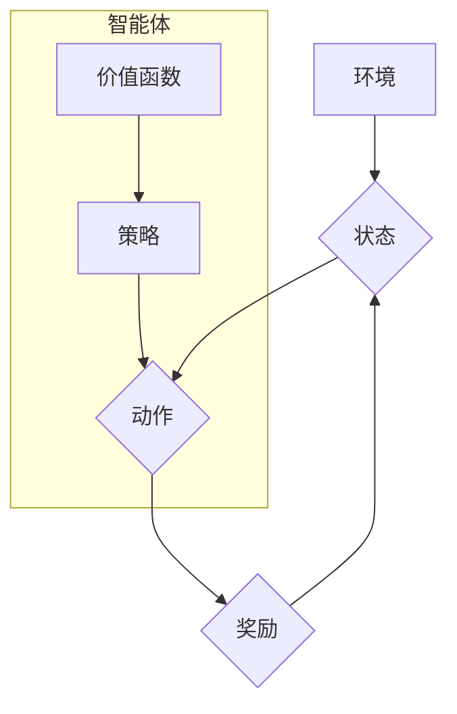

>  策略优化、强化学习、深度学习、Q-learning、Policy Gradient、Actor-Critic、代码实例、Python

## 1. 背景介绍

在人工智能领域，策略优化算法作为强化学习的重要组成部分，在解决复杂决策问题方面展现出强大的潜力。与价值函数方法不同，策略优化算法直接优化策略，即学习一个映射关系，将环境状态映射到最优动作。近年来，随着深度学习技术的飞速发展，策略优化算法与深度神经网络的结合，推动了强化学习在机器人控制、游戏 AI、自动驾驶等领域的应用。

## 2. 核心概念与联系

**2.1 强化学习**

强化学习是一种机器学习方法，其核心在于智能体通过与环境交互，学习一个策略，以最大化累积的奖励。

**2.2 策略优化**

策略优化算法的目标是直接优化策略，即学习一个映射关系，将环境状态映射到最优动作。策略可以表示为一个概率分布，该分布指定在给定状态下采取不同动作的概率。

**2.3 深度强化学习**

深度强化学习将深度神经网络引入强化学习算法，用于学习复杂的策略和价值函数。深度神经网络能够学习高维特征表示，从而提高算法的泛化能力和解决复杂问题的能力。

**2.4 Mermaid 流程图**



## 3. 核心算法原理 & 具体操作步骤

### 3.1 算法原理概述

策略优化算法的核心思想是通过梯度上升法来优化策略参数。策略参数通常由神经网络表示，通过计算策略梯度，更新神经网络权重，从而使策略朝着提高奖励的方向进行调整。

### 3.2 算法步骤详解

1. **初始化策略参数:**  随机初始化策略网络的参数。
2. **环境交互:** 智能体与环境交互，根据当前状态选择动作，并获得奖励和下一个状态。
3. **计算策略梯度:** 计算策略网络输出的概率分布与实际动作的期望奖励之间的梯度。
4. **更新策略参数:** 使用梯度上升法更新策略网络的参数，使策略朝着提高奖励的方向进行调整。
5. **重复步骤2-4:** 重复以上步骤，直到策略收敛或达到预设的训练目标。

### 3.3 算法优缺点

**优点:**

* 直接优化策略，避免了价值函数估计的误差。
* 可以处理连续动作空间的问题。
* 能够学习复杂的策略。

**缺点:**

* 训练过程可能不稳定，容易出现震荡。
* 需要大量的训练数据和计算资源。

### 3.4 算法应用领域

* **机器人控制:**  学习机器人控制策略，使机器人能够完成复杂的任务。
* **游戏 AI:**  训练游戏 AI 策略，使游戏 AI 能够在游戏中取得胜利。
* **自动驾驶:**  学习自动驾驶策略，使车辆能够安全地行驶。
* **金融投资:**  优化投资策略，提高投资收益。

## 4. 数学模型和公式 & 详细讲解 & 举例说明

### 4.1 数学模型构建

假设智能体在环境中采取动作 $a$，获得奖励 $r$，状态转移到 $s'$。策略 $\pi(a|s)$ 表示在状态 $s$ 下采取动作 $a$ 的概率。目标是最大化智能体累积的奖励，即最大化以下期望值：

$$
J(\pi) = E_{\tau \sim \pi} \sum_{t=0}^{\infty} \gamma^t r_t
$$

其中，$\tau$ 是智能体与环境交互的轨迹，$\gamma$ 是折扣因子，控制未来奖励的权重。

### 4.2 公式推导过程

策略梯度算法的目标是通过梯度上升法来优化策略参数，即更新策略网络的参数，使策略朝着提高奖励的方向进行调整。策略梯度的公式如下：

$$
\nabla_{\theta} J(\pi_{\theta}) = E_{\tau \sim \pi_{\theta}} \sum_{t=0}^{\infty} \nabla_{\theta} \log \pi_{\theta}(a_t|s_t) \cdot Q(s_t, a_t)
$$

其中，$\theta$ 是策略网络的参数，$Q(s_t, a_t)$ 是状态-动作值函数，表示在状态 $s_t$ 下采取动作 $a_t$ 的期望累积奖励。

### 4.3 案例分析与讲解

**举例说明:**

假设我们有一个简单的强化学习问题，智能体在一个二维空间中移动，目标是到达一个特定的位置。策略网络是一个简单的多层感知机，输入是当前状态，输出是每个方向移动的概率。

使用策略梯度算法训练策略网络，我们可以观察到策略网络的输出概率随着训练的进行而发生变化。最终，策略网络会学习到一个能够使智能体到达目标位置的策略。

## 5. 项目实践：代码实例和详细解释说明

### 5.1 开发环境搭建

* Python 3.6+
* TensorFlow/PyTorch
* OpenAI Gym

### 5.2 源代码详细实现

```python
import gym
import tensorflow as tf

# 定义策略网络
class PolicyNetwork(tf.keras.Model):
    def __init__(self, state_dim, action_dim):
        super(PolicyNetwork, self).__init__()
        self.dense1 = tf.keras.layers.Dense(64, activation='relu')
        self.dense2 = tf.keras.layers.Dense(action_dim, activation='softmax')

    def call(self, state):
        x = self.dense1(state)
        return self.dense2(x)

# 定义策略优化算法
class PolicyGradient:
    def __init__(self, state_dim, action_dim, learning_rate):
        self.policy_network = PolicyNetwork(state_dim, action_dim)
        self.optimizer = tf.keras.optimizers.Adam(learning_rate)

    def train(self, states, actions, rewards):
        with tf.GradientTape() as tape:
            logits = self.policy_network(states)
            log_probs = tf.math.log(logits[tf.range(len(states)), actions])
            loss = -tf.reduce_mean(log_probs * rewards)
        gradients = tape.gradient(loss, self.policy_network.trainable_variables)
        self.optimizer.apply_gradients(zip(gradients, self.policy_network.trainable_variables))

# 主程序
if __name__ == '__main__':
    env = gym.make('CartPole-v1')
    policy_gradient = PolicyGradient(state_dim=env.observation_space.shape[0],
                                     action_dim=env.action_space.n,
                                     learning_rate=0.01)

    # 训练循环
    for episode in range(1000):
        state = env.reset()
        done = False
        total_reward = 0
        while not done:
            # 选择动作
            action = tf.argmax(policy_gradient.policy_network(tf.expand_dims(state, axis=0))).numpy()
            # 执行动作
            next_state, reward, done, _ = env.step(action)
            # 更新状态
            state = next_state
            # 计算总奖励
            total_reward += reward
        # 训练策略网络
        policy_gradient.train(tf.expand_dims(state, axis=0), tf.constant([action]), tf.constant([total_reward]))
    env.close()
```

### 5.3 代码解读与分析

* **策略网络:** 使用多层感知机构建策略网络，输入是环境状态，输出是每个动作的概率分布。
* **策略优化算法:** 使用策略梯度算法来优化策略网络的参数，目标是最大化累积奖励。
* **训练循环:** 训练循环中，智能体与环境交互，收集状态、动作和奖励数据，然后使用策略梯度算法更新策略网络的参数。

### 5.4 运行结果展示

运行代码后，可以观察到智能体在 CartPole-v1 环境中逐渐学习到控制杆的能力，并能够保持平衡的时间越来越长。

## 6. 实际应用场景

### 6.1 游戏 AI

策略优化算法在游戏 AI 中应用广泛，例如 AlphaGo、AlphaStar 等游戏 AI 系统都使用了策略优化算法来学习游戏策略。

### 6.2 机器人控制

策略优化算法可以用于训练机器人控制策略，使机器人能够完成复杂的任务，例如导航、抓取、组装等。

### 6.3 自动驾驶

策略优化算法可以用于训练自动驾驶策略，使车辆能够安全地行驶，并做出最优的决策。

### 6.4 未来应用展望

随着深度学习技术的不断发展，策略优化算法在未来将有更广泛的应用场景，例如医疗诊断、金融投资、个性化推荐等。

## 7. 工具和资源推荐

### 7.1 学习资源推荐

* **书籍:**
    * Reinforcement Learning: An Introduction by Sutton and Barto
    * Deep Reinforcement Learning Hands-On by Maxim Lapan
* **在线课程:**
    * Deep Reinforcement Learning Specialization by DeepLearning.AI
    * Reinforcement Learning by David Silver

### 7.2 开发工具推荐

* **TensorFlow:** https://www.tensorflow.org/
* **PyTorch:** https://pytorch.org/
* **OpenAI Gym:** https://gym.openai.com/

### 7.3 相关论文推荐

* **Deep Q-Network (DQN):** https://arxiv.org/abs/1312.5602
* **Proximal Policy Optimization (PPO):** https://arxiv.org/abs/1707.06347
* **Trust Region Policy Optimization (TRPO):** https://arxiv.org/abs/1502.05477

## 8. 总结：未来发展趋势与挑战

### 8.1 研究成果总结

策略优化算法在强化学习领域取得了显著的成果，在解决复杂决策问题方面展现出强大的潜力。深度强化学习的结合进一步推动了算法的应用范围和性能提升。

### 8.2 未来发展趋势

* **更有效的算法:** 研究更有效的策略优化算法，提高算法的收敛速度和稳定性。
* **更强大的模型:** 开发更强大的深度神经网络模型，提高算法的泛化能力和解决复杂问题的能力。
* **更广泛的应用:** 将策略优化算法应用于更多领域，例如医疗诊断、金融投资、个性化推荐等。

### 8.3 面临的挑战

* **样本效率:** 策略优化算法通常需要大量的训练数据，提高算法的样本效率是一个重要的挑战。
* **可解释性:** 深度强化学习模型的决策过程难以解释，提高算法的可解释性是一个重要的研究方向。
* **安全性和可靠性:** 在安全性和可靠性要求高的应用场景中，需要确保策略优化算法的安全性。

### 8.4 研究展望

未来，策略优化算法将继续是强化学习领域的重要研究方向，随着算法的不断发展和应用的不断扩展，策略优化算法将在人工智能领域发挥越来越重要的作用。

## 9. 附录：常见问题与解答

**Q1: 策略优化算法和价值函数方法有什么区别？**

**A1:** 策略优化算法直接优化策略，而价值函数方法先估计价值函数，然后根据价值函数来优化策略。

**Q2: 策略梯度算法的梯度计算方法是什么？**

**A2:** 策略梯度算法的梯度计算方法是通过计算策略网络输出的概率分布与实际动作的期望奖励之间的梯度。

**Q3: 策略优化算法有哪些常见的实现方法？**

**A3:** 常见的策略优化算法实现方法包括：策略梯度算法、Proximal Policy Optimization (PPO)、