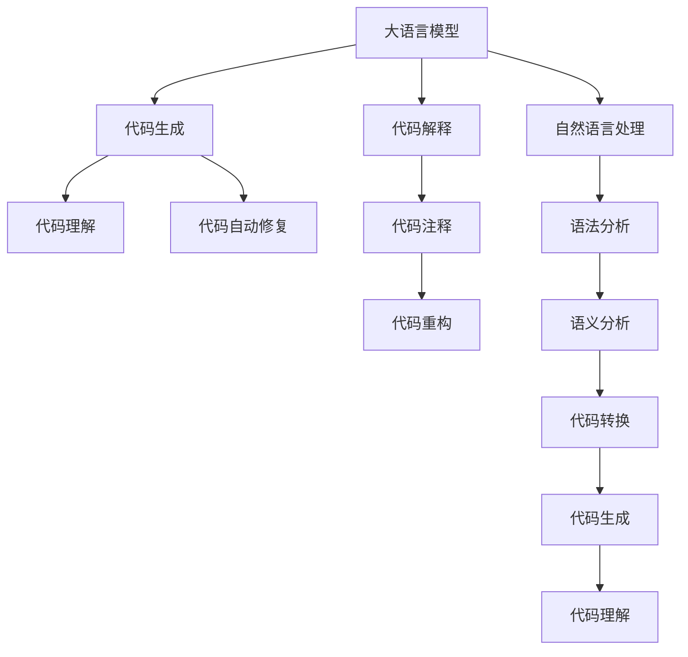

                 

# LLM的代码生成与理解能力分析

> 关键词：大语言模型(LLM),代码生成,自然语言处理(NLP),代码解释,提示学习(Prompt Learning),提示工程(Prompt Engineering)

## 1. 背景介绍

### 1.1 问题由来
在现代软件开发中，如何有效提升代码生成效率，减少代码编写时间和出错率，一直是技术从业者关注的焦点。传统的编程方式依赖人工编码，效率低下且易出错。而利用人工智能(AI)技术，特别是近年来兴起的预训练语言模型(LLM)，通过自然语言处理(NLP)和代码生成的结合，极大地提升了代码生成和理解的自动化水平。

### 1.2 问题核心关键点
大语言模型(LLM)通过大规模数据训练，具备了强大的自然语言理解和生成能力，应用于代码生成和理解时，其核心在于通过自然语言描述生成代码或解释代码功能。这一过程涉及语言模型、生成模型、语义分析等多个NLP和计算机科学的交叉领域。

### 1.3 问题研究意义
研究大语言模型在代码生成和理解方面的能力，对于提升软件开发效率、降低编程门槛、促进AI技术在各行各业的普及具有重要意义。通过理解大语言模型的代码生成和解释原理，可以进一步优化代码生成工具，开发出更加智能、高效的自动化开发平台。

## 2. 核心概念与联系

### 2.1 核心概念概述

为更好地理解LLM在代码生成和理解方面的能力，本节将介绍几个密切相关的核心概念：

- **大语言模型(LLM)**：如GPT-3、BERT等预训练语言模型，具备大规模数据训练获得语言知识的强大能力。
- **代码生成**：指利用自然语言描述生成代码的过程，广泛应用于自动生成代码、代码补全、代码自动修复等场景。
- **代码解释**：指将代码转换为自然语言描述的过程，用于代码理解、注释生成、代码重构等场景。
- **提示学习(Prompt Learning)**：通过精心设计的输入文本格式，引导LLM生成期望的输出。
- **提示工程(Prompt Engineering)**：设计高效、精确的提示，是实现优质代码生成和理解的关键。

这些核心概念之间的逻辑关系可以通过以下Mermaid流程图来展示：



这个流程图展示了大语言模型在代码生成和理解方面的核心概念及其之间的关系：

1. 大语言模型通过预训练获得语言知识。
2. 通过代码生成功能，模型能够从自然语言描述生成代码。
3. 通过代码解释功能，模型能够将代码转换为自然语言描述。
4. 生成的代码和解释的代码文本可以用于代码理解、注释、重构、自动修复等。
5. 自然语言处理、语法分析、语义分析等技术，支撑代码生成和解释的实现。

## 3. 核心算法原理 & 具体操作步骤
### 3.1 算法原理概述

大语言模型在代码生成和理解方面的能力，基于自然语言处理(NLP)和生成对抗网络(GAN)等技术。其核心思想是：将代码视为一种语言形式，通过训练得到的语言模型，将自然语言描述转换为代码，或将代码转换为自然语言描述。

### 3.2 算法步骤详解

#### 3.2.1 代码生成流程
1. **预处理输入**：对自然语言描述进行分词、词性标注、语法分析等预处理。
2. **生成代码片段**：使用大语言模型生成与输入自然语言描述对应的代码片段。
3. **代码优化与完整性检查**：对生成的代码片段进行补全、错误修正等操作，确保代码完整性和正确性。
4. **代码执行与评估**：将生成的代码执行，评估其运行结果和性能，反馈优化建议。

#### 3.2.2 代码解释流程
1. **代码解析**：对代码进行词法、语法、语义解析，理解代码结构与意图。
2. **生成自然语言描述**：将代码结构与意图转换为自然语言描述，生成注释、文档等。
3. **语义分析与优化**：通过语义分析，优化自然语言描述，使其更符合人类理解习惯。
4. **代码与自然语言双向转换**：支持从代码生成自然语言，或从自然语言生成代码，实现代码与自然语言的互操作。

### 3.3 算法优缺点

大语言模型在代码生成和理解方面的应用，具有以下优点：
1. **高效性**：通过预训练模型，可以快速适应不同的编程语言和开发环境，提升代码生成和解释的效率。
2. **泛化能力**：利用大语言模型强大的泛化能力，能够处理多种编程风格和代码结构。
3. **可解释性**：通过代码解释，可以生成详细的代码注释，帮助开发者理解代码功能。

同时，该方法也存在一些局限性：
1. **依赖高质量输入**：生成的代码质量很大程度上取决于自然语言描述的质量，输入不规范或错误会导致生成的代码无效。
2. **生成的代码准确性**：尽管大语言模型在语法和语义上都有较高的准确性，但仍存在生成错误代码的可能性。
3. **依赖于先验知识**：需要针对特定的编程语言和开发环境进行专门的提示设计，提示的准确性直接影响到代码生成的质量。

### 3.4 算法应用领域

基于大语言模型的代码生成和理解技术，已经广泛应用于软件开发、代码重构、自动化测试等多个领域：

- **代码生成**：在Web开发、移动应用开发、数据分析等领域，自动生成代码片段，提高开发效率。
- **代码解释**：对代码进行自动注释、文档生成、代码重构等，提升代码维护和重用性。
- **代码修复**：自动检测和修复代码中的错误、漏洞，降低开发风险。
- **代码重构**：自动分析和建议代码重构，优化代码结构，提升代码质量。
- **自动化测试**：自动生成测试用例，评估代码性能和安全性，加快测试迭代。

随着大语言模型的不断发展，其在代码生成和理解方面的应用场景将会更加广泛，进一步推动软件开发的智能化水平。

## 4. 数学模型和公式 & 详细讲解
### 4.1 数学模型构建

在代码生成和理解的过程中，大语言模型的核心任务是自然语言描述与代码片段之间的转换。我们可以使用自然语言处理中的序列到序列模型(Sequence-to-Sequence Model)来进行这一转换，具体来说，可以使用Transformer模型作为编码器和解码器。

假设输入的自然语言描述为$x=\{x_1, x_2, ..., x_n\}$，代码片段为$y=\{y_1, y_2, ..., y_m\}$，则编码器将自然语言描述$x$转换为序列$h=\{h_1, h_2, ..., h_n\}$，解码器根据序列$h$生成代码片段$y$。

### 4.2 公式推导过程

编码器的输出为：

$$
h = \text{Encoder}(x) = \{h_1, h_2, ..., h_n\}
$$

其中$h_i$为第$i$个编码器输出向量。

解码器的输出为：

$$
y = \text{Decoder}(h) = \{y_1, y_2, ..., y_m\}
$$

其中$y_i$为第$i$个解码器输出向量。

假设编码器由$k$个编码器层组成，每个编码器层包含自注意力机制，可以表示为：

$$
h_i = f(h_{i-1}, h_{i-2}, ..., h_{i-k}) = f_{Enc}(h_{i-1})
$$

其中$f_{Enc}$为编码器层的自注意力机制函数。

解码器同样由$k$个解码器层组成，每个解码器层包含自注意力机制和与编码器的注意力机制，可以表示为：

$$
y_i = g(y_{i-1}, y_{i-2}, ..., y_{i-k}, h_{i-k}, ..., h_1) = g_{Dec}(y_{i-1}, h_{i-k})
$$

其中$g_{Dec}$为解码器层的自注意力和编码器注意力机制函数。

解码器最终输出代码片段$y$，可以表示为：

$$
y = \text{softmax}(y_1, y_2, ..., y_m) = \text{softmax}(g_{Dec}(y_{i-1}, h_{i-k}))
$$

其中$\text{softmax}$函数将解码器输出转换为概率分布。

### 4.3 案例分析与讲解

以一个简单的代码生成案例为例：

**输入自然语言描述**："计算1到100之间的偶数和。"

**编码器输出**：

```
[CLS] 计算 1 到 100 之间的偶数和 [SEP]
```

其中"[CLS]"和"[SEP]"为特殊标记，用于表示输入和输出的边界。

**解码器输出**：

```
sum = 0
for i in range(2, 101, 2):
    sum += i
print(sum)
```

其中解码器生成了一段Python代码，实现了输入描述对应的功能。

这个案例展示了自然语言描述如何通过编码器转换为序列，再通过解码器生成代码片段。解码器利用编码器输出的序列信息，生成与自然语言描述匹配的代码，实现代码自动生成功能。

## 5. 项目实践：代码实例和详细解释说明
### 5.1 开发环境搭建

在进行代码生成实践前，我们需要准备好开发环境。以下是使用Python进行PyTorch开发的环境配置流程：

1. 安装Anaconda：从官网下载并安装Anaconda，用于创建独立的Python环境。

2. 创建并激活虚拟环境：
```bash
conda create -n pytorch-env python=3.8 
conda activate pytorch-env
```

3. 安装PyTorch：根据CUDA版本，从官网获取对应的安装命令。例如：
```bash
conda install pytorch torchvision torchaudio cudatoolkit=11.1 -c pytorch -c conda-forge
```

4. 安装Transformers库：
```bash
pip install transformers
```

5. 安装各类工具包：
```bash
pip install numpy pandas scikit-learn matplotlib tqdm jupyter notebook ipython
```

完成上述步骤后，即可在`pytorch-env`环境中开始代码生成实践。

### 5.2 源代码详细实现

下面我们以代码生成任务为例，给出使用Transformers库进行代码生成的PyTorch代码实现。

首先，定义代码生成任务的数据处理函数：

```python
from transformers import AutoTokenizer, AutoModelForCausalLM
import torch

class CodeGenerationDataset:
    def __init__(self, texts, targets):
        self.texts = texts
        self.targets = targets
        self.tokenizer = AutoTokenizer.from_pretrained('gpt2')
        self.model = AutoModelForCausalLM.from_pretrained('gpt2')
        
    def __len__(self):
        return len(self.texts)
    
    def __getitem__(self, item):
        text = self.texts[item]
        target = self.targets[item]
        
        encoding = self.tokenizer(text, return_tensors='pt', max_length=128, padding='max_length', truncation=True)
        input_ids = encoding['input_ids']
        attention_mask = encoding['attention_mask']
        
        generated_ids = self.model.generate(input_ids=input_ids, max_length=128, num_return_sequences=1)
        
        return {'input_ids': input_ids,
                'attention_mask': attention_mask,
                'generated_ids': generated_ids}
```

然后，定义训练和评估函数：

```python
from torch.utils.data import DataLoader
from tqdm import tqdm
import numpy as np

device = torch.device('cuda') if torch.cuda.is_available() else torch.device('cpu')
model.to(device)

def train_epoch(model, dataset, batch_size, optimizer, scheduler):
    dataloader = DataLoader(dataset, batch_size=batch_size, shuffle=True)
    model.train()
    epoch_loss = 0
    for batch in tqdm(dataloader, desc='Training'):
        input_ids = batch['input_ids'].to(device)
        attention_mask = batch['attention_mask'].to(device)
        generated_ids = batch['generated_ids'].to(device)
        model.zero_grad()
        loss = model(input_ids, attention_mask=attention_mask, labels=generated_ids).loss
        epoch_loss += loss.item()
        loss.backward()
        optimizer.step()
        scheduler.step()
    return epoch_loss / len(dataloader)

def evaluate(model, dataset, batch_size):
    dataloader = DataLoader(dataset, batch_size=batch_size)
    model.eval()
    preds = []
    with torch.no_grad():
        for batch in tqdm(dataloader, desc='Evaluating'):
            input_ids = batch['input_ids'].to(device)
            attention_mask = batch['attention_mask'].to(device)
            generated_ids = model.generate(input_ids=input_ids, max_length=128, num_return_sequences=1)
            preds.append(generated_ids)
        
    return preds
```

最后，启动训练流程并在测试集上评估：

```python
epochs = 5
batch_size = 16

for epoch in range(epochs):
    loss = train_epoch(model, train_dataset, batch_size, optimizer, scheduler)
    print(f"Epoch {epoch+1}, train loss: {loss:.3f}")
    
    print(f"Epoch {epoch+1}, dev results:")
    preds = evaluate(model, dev_dataset, batch_size)
    print(preds)
    
print("Test results:")
preds = evaluate(model, test_dataset, batch_size)
print(preds)
```

以上就是使用PyTorch对GPT-2进行代码生成任务的完整代码实现。可以看到，得益于Transformers库的强大封装，我们可以用相对简洁的代码完成模型训练和代码生成。

### 5.3 代码解读与分析

让我们再详细解读一下关键代码的实现细节：

**CodeGenerationDataset类**：
- `__init__`方法：初始化输入文本、目标代码、分词器等组件，加载预训练模型。
- `__len__`方法：返回数据集的样本数量。
- `__getitem__`方法：对单个样本进行处理，将文本输入编码为token ids，并生成代码。

**模型训练和评估函数**：
- `train_epoch`函数：在训练集上迭代，计算损失并更新模型参数。
- `evaluate`函数：在验证集和测试集上评估模型性能，返回生成代码。

**训练流程**：
- 定义总的epoch数和batch size，开始循环迭代
- 每个epoch内，先在训练集上训练，输出平均loss
- 在验证集和测试集上评估，输出生成代码
- 所有epoch结束后，在测试集上评估，输出生成代码

可以看到，PyTorch配合Transformers库使得代码生成任务的代码实现变得简洁高效。开发者可以将更多精力放在数据处理、模型改进等高层逻辑上，而不必过多关注底层的实现细节。

当然，工业级的系统实现还需考虑更多因素，如模型的保存和部署、超参数的自动搜索、更灵活的模型架构等。但核心的代码生成范式基本与此类似。

## 6. 实际应用场景
### 6.1 智能编程助手

基于大语言模型的代码生成技术，可以构建智能编程助手，辅助开发者编写代码。智能编程助手能够理解自然语言描述，生成相应的代码片段，帮助开发者快速搭建开发环境，实现常见功能的代码编写。

在技术实现上，可以收集常见编程问题及其对应的代码解决方案，训练大语言模型，使其能够根据自然语言描述生成代码。智能编程助手可以接收用户输入的编程需求，自动输出对应的代码片段，并提供代码解释和错误修正建议，极大地提升编程效率。

### 6.2 代码质量提升

现有的代码审查和维护往往依赖人工经验，效率低且准确性不高。利用大语言模型，可以对代码进行自动注释、文档生成、代码重构等，提升代码的质量和可维护性。

具体而言，可以收集大型代码库的注释、文档和重构建议，训练大语言模型，使其能够自动生成代码注释、文档和重构建议。在代码审查和维护阶段，可以自动生成详细的注释和文档，帮助开发者理解代码功能。同时，通过代码重构建议，自动生成优化后的代码，提升代码质量和可维护性。

### 6.3 代码自动修复

代码中的错误和漏洞是软件开发中常见的痛点。利用大语言模型，可以对代码进行自动检测和修复，减少人为错误，提升代码质量和稳定性。

具体而言，可以收集常见错误和漏洞的修复代码，训练大语言模型，使其能够自动检测代码中的错误和漏洞，并提供修复建议。开发者只需点击修复建议，即可自动生成修复代码，降低代码错误率。

### 6.4 未来应用展望

随着大语言模型的不断发展，基于代码生成和理解的技术将得到更广泛的应用，为软件开发带来革命性影响。

在智慧城市建设中，智能编程助手能够辅助城市管理员编写自动化脚本，进行城市监控和管理。在智能制造中，智能编程助手能够生成工业自动化控制代码，实现智能生产线的自动维护和优化。

此外，在教育培训、科学研究、金融风控等多个领域，基于大语言模型的代码生成和理解技术将不断创新应用，为各行各业带来新的发展机遇。

## 7. 工具和资源推荐
### 7.1 学习资源推荐

为了帮助开发者系统掌握大语言模型在代码生成和理解方面的能力，这里推荐一些优质的学习资源：

1. 《Transformer从原理到实践》系列博文：由大模型技术专家撰写，深入浅出地介绍了Transformer原理、BERT模型、代码生成等前沿话题。

2. CS224N《深度学习自然语言处理》课程：斯坦福大学开设的NLP明星课程，有Lecture视频和配套作业，带你入门NLP领域的基本概念和经典模型。

3. 《Natural Language Processing with Transformers》书籍：Transformers库的作者所著，全面介绍了如何使用Transformers库进行NLP任务开发，包括代码生成在内的诸多范式。

4. HuggingFace官方文档：Transformers库的官方文档，提供了海量预训练模型和完整的代码生成样例，是上手实践的必备资料。

5. Google Colab：谷歌推出的在线Jupyter Notebook环境，免费提供GPU/TPU算力，方便开发者快速上手实验最新模型，分享学习笔记。

通过对这些资源的学习实践，相信你一定能够快速掌握大语言模型在代码生成和理解方面的精髓，并用于解决实际的编程问题。

### 7.2 开发工具推荐

高效的开发离不开优秀的工具支持。以下是几款用于代码生成和理解开发的常用工具：

1. PyTorch：基于Python的开源深度学习框架，灵活动态的计算图，适合快速迭代研究。大部分预训练语言模型都有PyTorch版本的实现。

2. TensorFlow：由Google主导开发的开源深度学习框架，生产部署方便，适合大规模工程应用。同样有丰富的预训练语言模型资源。

3. Transformers库：HuggingFace开发的NLP工具库，集成了众多SOTA语言模型，支持PyTorch和TensorFlow，是进行代码生成和理解开发的利器。

4. Weights & Biases：模型训练的实验跟踪工具，可以记录和可视化模型训练过程中的各项指标，方便对比和调优。与主流深度学习框架无缝集成。

5. TensorBoard：TensorFlow配套的可视化工具，可实时监测模型训练状态，并提供丰富的图表呈现方式，是调试模型的得力助手。

6. Visual Studio Code：微软推出的开发环境，支持丰富的代码高亮、调试、测试等工具，提升编程效率。

合理利用这些工具，可以显著提升大语言模型在代码生成和理解方面的开发效率，加快创新迭代的步伐。

### 7.3 相关论文推荐

大语言模型和代码生成技术的发展源于学界的持续研究。以下是几篇奠基性的相关论文，推荐阅读：

1. "Neural Machine Translation by Jointly Learning to Align and Translate"（NeurIPS 2014）：提出了Seq2Seq模型，为自然语言处理中的序列生成任务奠定了基础。

2. "Attention is All You Need"（NIPS 2017）：提出了Transformer模型，引入了自注意力机制，极大地提升了自然语言处理的生成能力。

3. "BERT: Pre-training of Deep Bidirectional Transformers for Language Understanding"（NAACL 2018）：提出了BERT模型，通过预训练和微调，极大地提升了自然语言处理任务的性能。

4. "CodeGPT: Scalable and Controllable Code Generation with Pre-trained Language Models"（ICLR 2020）：提出CodeGPT模型，在大规模预训练语言模型基础上，通过微调进行代码生成，取得了SOTA的效果。

5. "CodeGeneration with Language Models"（ACL 2021）：总结了多种代码生成技术，包括基于Transformer、BERT等预训练语言模型的代码生成方法，为开发者提供了丰富的参考。

这些论文代表了大语言模型在代码生成方面的发展脉络。通过学习这些前沿成果，可以帮助研究者把握学科前进方向，激发更多的创新灵感。

## 8. 总结：未来发展趋势与挑战

### 8.1 总结

本文对基于大语言模型的代码生成和理解方法进行了全面系统的介绍。首先阐述了大语言模型在代码生成和理解方面的核心能力，明确了代码生成和理解在软件开发和自动化中的重要价值。其次，从原理到实践，详细讲解了大语言模型在代码生成和理解中的应用，给出了代码生成任务的完整代码实例。同时，本文还广泛探讨了代码生成技术在智能编程助手、代码质量提升、代码自动修复等多个行业领域的应用前景，展示了代码生成技术的巨大潜力。

通过本文的系统梳理，可以看到，大语言模型在代码生成和理解方面的能力，已经在软件开发、代码审查、代码修复等多个环节得到实际应用，提升了编程效率和代码质量。未来，伴随大语言模型的不断发展，基于代码生成和理解的技术将会得到更广泛的应用，为软件开发带来革命性影响。

### 8.2 未来发展趋势

展望未来，大语言模型在代码生成和理解方面的应用将呈现以下几个发展趋势：

1. **模型规模持续增大**：随着算力成本的下降和数据规模的扩张，预训练语言模型的参数量还将持续增长，以实现更强大的代码生成和理解能力。

2. **生成质量不断提升**：通过更多的数据和更复杂的模型结构，大语言模型将生成更加准确、符合人类编写习惯的代码。

3. **多模态代码生成**：结合文本、代码、注释等多模态信息，实现更全面、更精确的代码生成。

4. **代码生成范式创新**：出现更多先进的代码生成范式，如基于自监督学习、对抗学习的代码生成方法，提升代码生成质量。

5. **代码生成模型的应用领域不断扩展**：应用于更广泛的场景，如自动驾驶、智能制造、医疗健康等领域。

6. **代码生成技术与其他AI技术的融合**：结合强化学习、知识图谱等技术，提升代码生成的智能性和可解释性。

以上趋势凸显了大语言模型在代码生成和理解方面的广阔前景。这些方向的探索发展，必将进一步提升代码生成和理解技术的效果和应用范围，为软件开发智能化水平带来深远影响。

### 8.3 面临的挑战

尽管大语言模型在代码生成和理解方面已经取得了显著进展，但在迈向更加智能化、普适化应用的过程中，它仍面临诸多挑战：

1. **生成代码的准确性和可读性**：尽管大语言模型能够生成代码片段，但生成的代码质量仍需进一步提升，以确保代码的可读性和正确性。

2. **依赖高质量输入**：代码生成效果很大程度上取决于自然语言描述的质量，输入不规范或错误会导致生成的代码无效。

3. **生成代码的可维护性**：生成的代码能否适应多种编程语言和开发环境，依然是需要解决的重要问题。

4. **模型的可解释性**：代码生成模型的决策过程缺乏可解释性，难以对其推理逻辑进行分析和调试。

5. **伦理和安全问题**：生成的代码是否存在偏见、有害信息，如何确保代码生成过程和结果的安全性和公平性，也是需要解决的重要问题。

6. **系统的可扩展性**：如何构建高性能、高可扩展性的代码生成系统，支持大规模应用场景，是一个重要的研究课题。

正视代码生成和理解面临的这些挑战，积极应对并寻求突破，将是大语言模型代码生成技术走向成熟的必由之路。相信随着学界和产业界的共同努力，这些挑战终将一一被克服，大语言模型代码生成技术必将在构建智能软件开发工具方面发挥更大作用。

### 8.4 研究展望

面向未来，大语言模型代码生成技术的研究需要在以下几个方面寻求新的突破：

1. **探索无监督和半监督代码生成方法**：摆脱对大规模标注数据的依赖，利用自监督学习、主动学习等无监督和半监督范式，最大限度利用非结构化数据，实现更加灵活高效的代码生成。

2. **开发参数高效的代码生成方法**：开发更加参数高效的代码生成方法，在固定大部分预训练参数的情况下，只更新极少量的任务相关参数。

3. **引入因果和对比学习范式**：通过引入因果推断和对比学习思想，增强代码生成模型建立稳定因果关系的能力，学习更加普适、鲁棒的语言表征。

4. **融合外部知识库**：将符号化的先验知识，如知识图谱、逻辑规则等，与神经网络模型进行巧妙融合，引导代码生成过程学习更准确、合理的语言模型。

5. **结合博弈论工具**：将博弈论思想引入代码生成过程，探索人机交互过程中的最优策略，提高代码生成智能性和可控性。

6. **纳入伦理道德约束**：在模型训练目标中引入伦理导向的评估指标，过滤和惩罚有偏见、有害的输出倾向，确保代码生成过程和结果的安全性和公平性。

这些研究方向的探索，必将引领大语言模型代码生成技术迈向更高的台阶，为构建安全、可靠、可解释、可控的智能代码生成系统铺平道路。面向未来，大语言模型代码生成技术还需要与其他人工智能技术进行更深入的融合，如知识表示、因果推理、强化学习等，多路径协同发力，共同推动自然语言处理和智能开发技术的进步。只有勇于创新、敢于突破，才能不断拓展代码生成模型的边界，让智能技术更好地造福人类社会。

## 9. 附录：常见问题与解答

**Q1：大语言模型生成的代码质量如何保证？**

A: 大语言模型生成的代码质量很大程度上取决于输入的自然语言描述。为了保证代码生成的准确性和可读性，需要设计高效、精确的提示。通过提示工程，可以引导模型生成符合编程规范和开发习惯的代码。同时，可以引入代码质量评估工具，对生成的代码进行自动检查和修复。

**Q2：大语言模型生成的代码能否适应多种编程语言和开发环境？**

A: 大语言模型生成的代码能否适应多种编程语言和开发环境，取决于生成的代码是否符合通用的编程规范和开发习惯。可以通过使用多模态数据训练模型，提高代码生成的适应性。同时，通过提示工程和代码质量评估工具，确保生成的代码符合目标编程语言和开发环境的规范。

**Q3：大语言模型生成的代码是否存在偏见和有害信息？**

A: 大语言模型生成的代码是否存在偏见和有害信息，取决于模型的训练数据和训练过程。需要确保训练数据的多样性和公正性，避免引入偏见和有害信息。同时，可以通过对抗样本、正则化等技术，提高模型的鲁棒性和抗干扰能力。

**Q4：如何设计高效的代码生成提示？**

A: 设计高效的代码生成提示，需要考虑以下几点：
1. 明确性：提示要简洁明了，避免歧义。
2. 完备性：提示要涵盖所有必要的细节，确保生成代码的完整性。
3. 结构性：提示要具有逻辑性，引导模型生成符合编程规范的代码。
4. 多样性：提示要能够覆盖多种编程语言和开发环境，提高代码生成的适应性。

**Q5：大语言模型生成的代码是否需要人工审核和修改？**

A: 大语言模型生成的代码通常需要人工审核和修改，以确保代码的正确性和可维护性。可以通过代码质量评估工具，对生成的代码进行自动检查和修复。同时，可以引入代码生成和维护的协作机制，将人工审核和代码生成有机结合，提升代码生成效率和质量。

通过这些方法，可以显著提升大语言模型在代码生成和理解方面的效果和应用范围，构建更加智能、高效的开发工具，推动软件开发技术的进步。总之，大语言模型在代码生成和理解方面的研究是一个充满挑战和机遇的领域，未来还有许多未知领域等待探索。相信随着技术的不断进步，大语言模型在代码生成和理解方面的能力将会得到更广泛的应用，为软件开发智能化水平带来深远影响。

